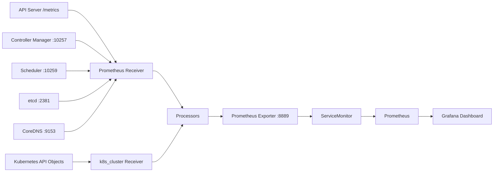

# OpenTelemetry × Grafana 实战：观测 Kubernetes 控制面与集群状态

Kubernetes 的 API Server、Scheduler、Controller Manager、etcd 和 CoreDNS 都能暴露 Prometheus 指标。已经有 Prometheus 和 Grafana 时，仍可以在两者之前加入 OpenTelemetry Collector：它把分散的采集目标、集群对象状态、资源属性、过滤规则和标签治理集中到一条可版本化的遥测管道中。

本文使用一套已有 Prometheus Operator 与 Grafana 的 Kubernetes 1.30 集群完成实测。最终链路如下：




这里需要先分清两条链路：Prometheus 指标描述一段时间内的整体趋势，Trace 则记录一次请求内部由多个 Span 组成的调用过程。抓到 `/metrics` 并不等于有了 Span；应用或 Kubernetes 组件必须实际发送 OTLP Trace，才能在 Tempo 中还原请求瀑布。

完整清单与可导入的 Dashboard 位于 [`examples/opentelemetry-kubernetes-components`](https://github.com/runzhliu/aik8s/tree/main/examples/opentelemetry-kubernetes-components)。

## 1. 这套链路解决什么问题

这里的 OpenTelemetry Collector 承担四项工作：

| 工作 | 做法 | 收益 |
| --- | --- | --- |
| 统一采集 | Prometheus receiver 抓控制面与 DNS；`k8s_cluster` receiver 读取对象状态 | 一份配置描述全部输入 |
| 统一标识 | 写入 `cluster.name`、`telemetry.pipeline` 等资源属性 | 多集群查询与归因更稳定 |
| 统一治理 | 采集前白名单、管道中标签聚合、内存限制与批处理 | 控制指标量和 Collector 抖动 |
| 统一出口 | Prometheus exporter 暴露 `/metrics`，ServiceMonitor 交给现有 Prometheus | 保留 PromQL、告警和 Grafana 生态 |

Prometheus 继续负责抓取后的存储、查询与告警，Grafana 负责展示。Collector 让采集和处理策略成为一套可迁移的管道，后续也能增加 OTLP、Remote Write 或其他 exporter。

## 2. 实测覆盖了哪些组件

| 数据源 | 接入方式 | 主要指标 | 典型问题 |
| --- | --- | --- | --- |
| API Server | HTTPS `/metrics` + ServiceAccount Token | 请求量、P95、inflight、APF 排队与拒绝 | API 是否变慢、是否被流控 |
| Controller Manager | HTTPS `10257` + Token | leader、workqueue、REST Client | 控制器是否积压 |
| Scheduler | HTTPS `10259` + Token | pending queue、attempt、P95 | Pod 为什么等待、调度是否变慢 |
| etcd | HTTP metrics listener | leader、proposal、WAL fsync、DB size | 共识与磁盘是否异常 |
| CoreDNS | Service `9153` | QPS、rcode、请求耗时、cache | 服务发现是否报错或变慢 |
| Kubernetes 对象 | `k8s_cluster` receiver | Node Condition、Pod Phase、Deployment 副本 | 集群状态是否偏离期望 |
| Collector 自身 | Collector `8888` | accepted/refused/failed points、RSS | 观测管道自己是否健康 |

本轮六个 scrape target 均成功，Collector Pod 无重启。下面是 Grafana 浅色主题的实测页面，截图已经移除地址、集群名和用户信息：


截图时的状态快照如下。它用于证明链路和查询实际可用，不代表其他集群的容量基线。

| 项目 | 实测快照 |
| --- | ---: |
| OTel 采集目标 | 6 / 6 在线 |
| Ready Node | 11 |
| API Server 请求速率 | 约 57 req/s |
| etcd leader | 1 |
| Scheduler unschedulable queue | 2 |
| Deployment desired / available | 105 / 104 |
| Pod Pending / Running | 11 / 249 |
| `otel_k8s_*` 活跃序列 | 7,338 |
| Collector `/metrics` 文本大小 | 约 2.15 MB |
| Collector CPU / 内存 | 约 25m / 298 MiB |

把集群对象和 Collector 自监控放在同一页，可以及时发现“看板还有数据，但采集管道已经丢点”这类静默故障：


## 3. 先确认指标入口

组件指标能否从 Pod 网络访问，由 Kubernetes 发行版和控制面启动参数决定。部署 Collector 前应逐个确认监听地址、协议、认证和证书。

### 3.1 API Server

API Server 的 `/metrics` 经过认证和鉴权。Collector 使用挂载到 Pod 的 ServiceAccount Token 与 CA：

```yaml
- job_name: otel-kube-apiserver
  scheme: https
  bearer_token_file: /var/run/secrets/kubernetes.io/serviceaccount/token
  tls_config:
    ca_file: /var/run/secrets/kubernetes.io/serviceaccount/ca.crt
    server_name: kubernetes
  static_configs:
    - targets: ["kubernetes.default.svc.cluster.local:443"]
```

ClusterRole 还需要非资源 URL 权限：

```yaml
- nonResourceURLs: ["/metrics"]
  verbs: ["get"]
```

只给 `pods`、`nodes` 的 `get/list/watch` 权限，无法读取这个非资源路径。

### 3.2 Controller Manager 与 Scheduler

现代 kubeadm 集群常通过 `10257` 和 `10259` 的 HTTPS 端点提供指标，并要求 Bearer Token。实测环境从 Pod 网络可以访问节点上的这两个端口：

```yaml
- job_name: otel-kube-scheduler
  scheme: https
  bearer_token_file: /var/run/secrets/kubernetes.io/serviceaccount/token
  tls_config:
    insecure_skip_verify: true
  static_configs:
    - targets: ["${env:CONTROL_PLANE_IP}:10259"]
```

示例为便于跨发行版演示而跳过服务器证书校验。生产环境应挂载正确 CA，校验服务端证书，并限制 NetworkPolicy 与节点防火墙的来源范围。

### 3.3 etcd

etcd metrics 监听器可能使用独立的 `2381` HTTP 端口，也可能没有向 Pod 网络开放。端口一旦暴露，应只允许监控组件访问。业务 Namespace 不应直接连到控制面节点的 etcd 端口。

### 3.4 CoreDNS

CoreDNS 通常在 `:9153` 暴露指标。先核对实际 Service 名称与端口：

```bash
kubectl -n kube-system get service kube-dns -o yaml
kubectl -n kube-system get configmap coredns -o yaml
```

## 4. 用两个 receiver 覆盖组件和对象

Prometheus receiver 负责抓已有 `/metrics` 端点。`k8s_cluster` receiver 通过 informer 读取 Kubernetes API，生成 Node Condition、Pod Phase、Deployment desired/available 等集群状态指标。

`k8s_cluster` receiver 应以单实例运行。多个相同副本会对同一批集群对象重复产出指标。高可用场景可以使用 leader election 或主动/备用方式保持一个有效采集者。

关键配置如下：

```yaml
receivers:
  k8s_cluster:
    auth_type: serviceAccount
    collection_interval: 30s
    node_conditions_to_report:
      - Ready
      - MemoryPressure
      - DiskPressure
      - PIDPressure

  prometheus/control-plane:
    config:
      global:
        scrape_interval: 30s
        scrape_timeout: 15s
      scrape_configs:
        # API Server、Controller Manager、Scheduler、etcd、CoreDNS
```

Node、Pod 和 Container 的 CPU、内存、网络与文件系统用量属于 kubelet 资源统计。生产中通常在每个节点部署 `kubeletstats` receiver DaemonSet，再把结果送到 Gateway 或 Prometheus。

## 5. 指标白名单只能解决一半问题

第一版配置已经通过 `metric_relabel_configs` 只保留看板需要的指标，但 Collector `/metrics` 仍达到 **30,760,596 bytes**。主要来源是 API Server 直方图的 `verb`、`resource`、`subresource`、`scope`、`component` 等标签组合。

只过滤指标名，没有限制同一个指标能组合出多少时间序列。第二版在 Collector 中使用 `metrics_transform` 聚合保留维度：

```yaml
processors:
  metrics_transform/reduce-cardinality:
    transforms:
      - include: apiserver_request_duration_seconds
        action: update
        operations:
          - action: aggregate_labels
            label_set: [verb]
            aggregation_type: sum

      - include: apiserver_request_total
        action: update
        operations:
          - action: aggregate_labels
            label_set: [verb, code]
            aggregation_type: sum
```

优化后的 `/metrics` 为 **2,146,284 bytes**，体积下降约 **93%**，并保留当前看板需要的 `verb`、`code`、`priority_level`、`reason`、`result` 与 `rcode` 等维度。


这项优化有明确代价：被聚合掉的 `resource`、`subresource` 等标签无法再用于细粒度排障。生产策略应从保留的 Dashboard、Recording Rule、Alert Rule 和排障查询反推，先列需求，再删标签。

至少同时监控以下四类指标：

```promql
count({__name__=~"otel_k8s_.*"})

rate(otel_k8s_otelcol_receiver_accepted_metric_points_total[5m])

rate(otel_k8s_otelcol_receiver_refused_metric_points_total[5m])

rate(otel_k8s_otelcol_exporter_send_failed_metric_points_total[5m])
```

## 6. Collector 的内存保护怎样设置

本轮 Collector 最初设置：

```yaml
memory_limiter:
  limit_mib: 384
  spike_limit_mib: 96
```

它的软阈值相当于 288 MiB。控制面直方图批量进入时，日志频繁出现强制 GC。第一次调整到 `limit_mib: 512`、`spike_limit_mib: 128` 后，软阈值为 384 MiB，批量转换前的瞬时内存仍会到 390–411 MiB，GC 频率虽下降但没有消失。第二次校准后使用：

```yaml
memory_limiter:
  check_interval: 1s
  limit_mib: 640
  spike_limit_mib: 128

resources:
  requests:
    cpu: 100m
    memory: 384Mi
  limits:
    cpu: 500m
    memory: 1Gi
```

这里的数字是当前集群的起点。实际配置应结合 scrape interval、直方图桶数、活跃序列、batch 大小、Exporter 阻塞时间和峰值 RSS 做容量测试，并让 memory limiter 的硬限制低于容器内存 limit，留出 Go Runtime 和非托管内存余量。

第二次滚动更新后的首个三分钟观察窗口内，Pod 保持 0 次重启，日志没有再出现 memory limiter 强制 GC。这个窗口足以验证调整方向，正式容量基线仍应观察一个完整业务周期，并使用 P95/P99 RSS 与丢点指标决定资源余量。

## 7. 接入现有 Prometheus

Prometheus exporter 给指标增加统一前缀，并只投射必要的资源标签：

```yaml
exporters:
  prometheus:
    endpoint: 0.0.0.0:8889
    namespace: otel_k8s
    enable_open_metrics: true
    without_scope_info: true
    resource_constant_labels:
      included:
        - cluster.name
        - telemetry.pipeline
        - k8s.*
```

ServiceMonitor 能否生效取决于 Prometheus CR 的 `serviceMonitorSelector`。先查看 selector，再让 ServiceMonitor 的 label 匹配它：

```bash
kubectl -n monitoring get prometheus -o yaml \
  | sed -n '/serviceMonitorSelector:/,/podMonitorSelector:/p'
```

```yaml
apiVersion: monitoring.coreos.com/v1
kind: ServiceMonitor
metadata:
  labels:
    release: kube-prometheus-stack
spec:
  selector:
    matchLabels:
      app.kubernetes.io/name: otel-k8s-components
  endpoints:
    - port: prometheus
      interval: 30s
      scrapeTimeout: 15s
      honorLabels: true
```

ServiceMonitor 对象创建成功不等于 Prometheus 已经选择并抓取它。验收时还要查看 Prometheus Targets，并查询：

```promql
max by (job) (
  otel_k8s_up{
    telemetry_pipeline="otel-k8s-components",
    job=~"otel-kube-.*|otel-etcd|otel-coredns|otel-collector-self"
  }
)
```

## 8. Grafana 看板怎么读

公开 Dashboard 包含 16 个 Panel。查看顺序可以按“采集链路—控制面入口—调度与控制循环—存储和 DNS—Collector 自身”展开。

### 第一排：采集链路是否成立

- **OTel 采集任务在线**：六类 target 的 `up` 汇总；少于预期值先排查协议、端口、Token 和证书。
- **Ready 节点**：来自 `k8s_cluster` receiver；它反映 Node Condition，不等同于所有工作负载健康。
- **API Server QPS**：五分钟窗口的总请求速率，用于识别流量突增。
- **etcd Leader**：应稳定为 1；丢失 leader 要立即联查 etcd 与控制面日志。

### API Server 与 APF

```promql
sum by (verb) (
  rate(otel_k8s_apiserver_request_total{telemetry_pipeline="otel-k8s-components"}[5m])
)
```

P95 查询排除 `WATCH` 和 `CONNECT`。这两类长连接的持续时间语义与普通 REST 请求不同，混在同一张延迟图会拉高纵轴，掩盖 GET、LIST、CREATE 等请求的变化。

```promql
histogram_quantile(
  0.95,
  sum by (le, verb) (
    rate(otel_k8s_apiserver_request_duration_seconds_bucket{
      telemetry_pipeline="otel-k8s-components",
      verb!~"WATCH|CONNECT"
    }[5m])
  )
)
```

APF 面板观察 `current_inqueue_requests` 与 `rejected_requests_total`。队列持续上升说明某些 PriorityLevel 的执行席位不足，Reject 增长则要结合 FlowSchema、PriorityLevelConfiguration 和客户端重试检查。


图中 APF 当前排队为 0，只表示采样时刻没有请求等待席位。它不能证明 APF 从未限流，还要观察 `rejected_requests_total` 的增量、执行中的请求、各 PriorityLevel 的席位和客户端重试。

### Scheduler 与 Controller Manager

Scheduler 面板把 `pending_pods` 按 queue 展开，并显示 scheduling attempt P95。`unschedulable` 持续非零时，再进入 Pod Event、资源请求、亲和性、污点、PVC、Gang 或队列配额排查。

Controller Manager 的 workqueue depth 使用 Top 10 展示积压最多的控制器。队列深度、add rate 和处理延迟应一起分析；只有 depth 的瞬时值，无法区分短时抖动与长期处理能力不足。


### etcd、CoreDNS 与 Collector 自监控

- etcd 关注 leader、pending/failed proposal、WAL fsync 和 backend commit；
- CoreDNS 关注总 QPS、SERVFAIL 等错误 rcode、延迟与 cache hit；
- Collector 关注 accepted、refused、send_failed points 与 RSS，避免观测链路静默丢数据。


## 9. Span 怎么看：用 Tempo 还原一次请求

为了验证 Trace 链路，实验向 Collector 的 OTLP/HTTP 入口发送了 20 组发布请求，每组包含一个 Root Span 和多个子 Span，再由 Collector 通过 OTLP/gRPC 写入 Tempo。成功请求覆盖清单校验、调用 Kubernetes API、等待 Deployment Ready 和就绪检查；失败请求把错误状态落在 Kubernetes API 子 Span，同时保留 Root Span 的失败状态。

| 项目 | 实测配置 |
| --- | --- |
| OpenTelemetry Collector | 0.160.0，OTLP/HTTP 接收、OTLP/gRPC 导出 |
| Tempo | 3.0.3，单实例、10 GiB PVC |
| Grafana | 13.1.2，Tempo 数据源健康检查通过 |
| 演示数据 | 20 条 Trace，同时包含成功与失败调用 |

下图由 Tempo 返回的真实 Trace 数据生成，并移除了 trace ID、span ID 和环境标识；它保留实际父子关系、开始时间、耗时和错误状态。


### 9.1 Trace、Span 和瀑布图分别是什么

- **Trace** 是一次端到端请求，整条链路共享同一个 `trace_id`；
- **Span** 是其中一个步骤，每段都有自己的 `span_id`、开始时间、耗时、状态和属性；
- **父子关系** 通过 `parent_span_id` 连接，用来描述谁调用了谁；
- **瀑布图横向位置** 表示该步骤何时开始，横条长度表示耗时；有重叠时，说明步骤可能并行执行。

排查时先看 Root Span 总耗时，再沿关键路径找最长的子 Span。请求失败时，先点开红色或 `ERROR` Span，查看 status、events 和属性；随后把同一时间段的 API Server、Scheduler、应用日志与资源指标放在一起判断。Root Span 慢不等于每个子 Span 都慢，多个串行子 Span 的累计时间、未被埋点覆盖的空白区间也可能构成主要耗时。

### 9.2 在 Grafana Explore 中查 Span

Grafana 配置 Tempo 数据源后，进入 **Explore** 并选择 Tempo。下面三条 TraceQL 分别查询演示服务的全部请求、失败请求和慢请求：

```traceql
{ resource.service.name = "otel-k8s-span-demo" }
{ resource.service.name = "otel-k8s-span-demo" && status = error }
{ resource.service.name = "otel-k8s-span-demo" && duration > 300ms }
```

打开搜索结果中的一条 Trace 后，依次检查：

1. Root Span 的总耗时和最终状态；
2. 最慢或报错的子 Span；
3. Span 的 `kind`、operation、HTTP 状态码和 Kubernetes 资源属性；
4. 事件时间线中是否包含重试、超时或异常；
5. 相同时间窗口的 Metrics 与 Logs。

公开示例中的 `send-demo-traces.py` 只使用 Python 标准库，便于重复生成这组父子 Span。它用于说明怎么看 Trace，并不冒充 kube-apiserver 原生 Span。

### 9.3 API Server 为什么还没有 Span

本文前半部分抓取的是 kube-apiserver `/metrics`。要让 kube-apiserver 产生原生 Span，还要使用 `--tracing-config-file` 启用 tracing。Kubernetes 1.30 可使用下面的配置，从 1% 采样率起步：

```yaml
apiVersion: apiserver.config.k8s.io/v1alpha1
kind: TracingConfiguration
endpoint: 127.0.0.1:4317
samplingRatePerMillion: 10000
```

对于 kubeadm 管理的静态 Pod，可以在每个控制面节点创建 `/etc/kubernetes/tracing/tracing-config.yaml`，然后修改 `/etc/kubernetes/manifests/kube-apiserver.yaml`：

```yaml
spec:
  containers:
    - name: kube-apiserver
      command:
        - kube-apiserver
        - --tracing-config-file=/etc/kubernetes/tracing/tracing-config.yaml
      volumeMounts:
        - name: tracing-config
          mountPath: /etc/kubernetes/tracing
          readOnly: true
  volumes:
    - name: tracing-config
      hostPath:
        path: /etc/kubernetes/tracing
        type: DirectoryOrCreate
```

`127.0.0.1:4317` 要求同一控制面节点上有 host-network OTel Agent 接收 OTLP/gRPC，再由 Agent 转发到集群内的 Gateway 或 Tempo。这样不依赖静态 Pod 的集群 DNS，也避免把无 TLS 的 OTLP 接收端口暴露到更大网络。多控制面集群需要逐台配置 Agent 和 kube-apiserver。

静态 Pod manifest 改动会触发 kubelet 重建 kube-apiserver。正式修改前应先用对应版本的二进制验证配置 API，确认本地 Agent 已监听、后端可写入，并保留原 manifest。回滚时删除 `--tracing-config-file`、volumeMount 与 volume 即可。采样率不要直接设为 `1000000`；应根据 API QPS、Span 大小、Tempo 写入量和保留周期逐步提高。

Kubernetes 当前文档中的配置 API 已升级为 `apiserver.config.k8s.io/v1`，旧版本不能直接照抄新版本示例。本文的 v1alpha1 示例针对 Kubernetes 1.30；集群升级后应跟随目标版本重新校验。

## 10. 多控制面集群的部署方式

单控制面环境可以把一个 Collector 调度到 control-plane 节点，通过 `status.hostIP` 抓取本机控制面端点。多控制面环境要分开考虑两类数据：

| 数据 | 推荐实例数 | 原因 |
| --- | ---: | --- |
| `k8s_cluster` 集群对象状态 | 1 个有效实例 | 多实例会重复生成同一批对象指标 |
| API Server / Controller / Scheduler / etcd 组件指标 | 每个组件实例都要覆盖 | 单个入口无法代表其余控制面节点 |
| kubeletstats 节点资源指标 | 每节点 1 个 Agent | kubelet 指标属于节点本地数据 |

可选架构是“一个集群状态 Deployment + 一个控制面 DaemonSet + 一个全节点 DaemonSet”。每类 Collector 使用不同 `telemetry.pipeline`，Prometheus 中保留 `instance`、`node`、`cluster.name`，再通过 Recording Rule 形成集群级视图。

## 11. 建议增加的告警

| 告警 | 起点条件 | 说明 |
| --- | --- | --- |
| OTel target down | `max by(job)(otel_k8s_up) == 0` 持续 5m | 分 job 报警，避免汇总值掩盖单点失败 |
| Collector 拒收 | refused points 速率大于 0 | 常见于内存压力或下游阻塞 |
| Collector 发送失败 | send failed points 速率大于 0 | 联查 Prometheus scrape 与 exporter 日志 |
| API P95 变慢 | 非 WATCH/CONNECT P95 超过基线 | 分 verb 设置阈值 |
| APF 排队或拒绝 | inqueue 持续增长或 reject 增长 | 按 priority level 分组 |
| Scheduler backlog | unschedulable 持续高于基线 | 联查 Pending Pod 原因 |
| etcd leader 异常 | leader 不等于 1 | 控制面高优先级告警 |
| CoreDNS 错误 | SERVFAIL 等错误率超过基线 | 联查上游 DNS 与网络 |

阈值应使用各集群的历史分位数和错误预算校准，表中的条件只表示告警方向。

## 12. 生产落地检查表

- 为 API Server、Controller Manager、Scheduler 和 etcd 的 metrics 端口设置最小网络访问范围；
- 使用正确 CA 校验证书，避免长期保留 `insecure_skip_verify`；
- 固定 Collector 镜像版本，升级前检查 receiver、processor 和指标命名变化；
- `k8s_cluster` 只保留一个有效实例，多控制面采集目标完整覆盖所有节点；
- `metric_relabel_configs` 控制指标名，`metrics_transform` 控制标签维度；
- 记录活跃序列、每次 scrape 大小、scrape duration、Collector RSS 和丢点指标；
- Grafana Panel 使用明确的单位、窗口、分组和聚合方式；
- Dashboard 正常只是展示层通过，仍需检查 Prometheus Targets、Collector 日志和原始查询；
- 配置变更进入 Git 管理，并保留变更前后的序列数与资源消耗证据。

## 参考资料

- [OpenTelemetry Collector on Kubernetes](https://opentelemetry.io/docs/platforms/kubernetes/collector/)
- [OpenTelemetry Collector Prometheus Receiver](https://github.com/open-telemetry/opentelemetry-collector-contrib/tree/main/receiver/prometheusreceiver)
- [OpenTelemetry Collector Kubernetes Cluster Receiver](https://github.com/open-telemetry/opentelemetry-collector-contrib/tree/main/receiver/k8sclusterreceiver)
- [OpenTelemetry Collector Kubelet Stats Receiver](https://github.com/open-telemetry/opentelemetry-collector-contrib/tree/main/receiver/kubeletstatsreceiver)
- [OpenTelemetry Collector Metrics Transform Processor](https://github.com/open-telemetry/opentelemetry-collector-contrib/tree/main/processor/metricstransformprocessor)
- [Grafana Dashboards](https://grafana.com/docs/grafana/latest/dashboards/)
- [Kubernetes System Component Traces](https://kubernetes.io/docs/concepts/cluster-administration/system-traces/)
- [Grafana Tempo: TraceQL](https://grafana.com/docs/tempo/latest/traceql/)
- [Grafana Tempo deployment modes](https://grafana.com/docs/tempo/latest/set-up-for-tracing/setup-tempo/deploy/)
