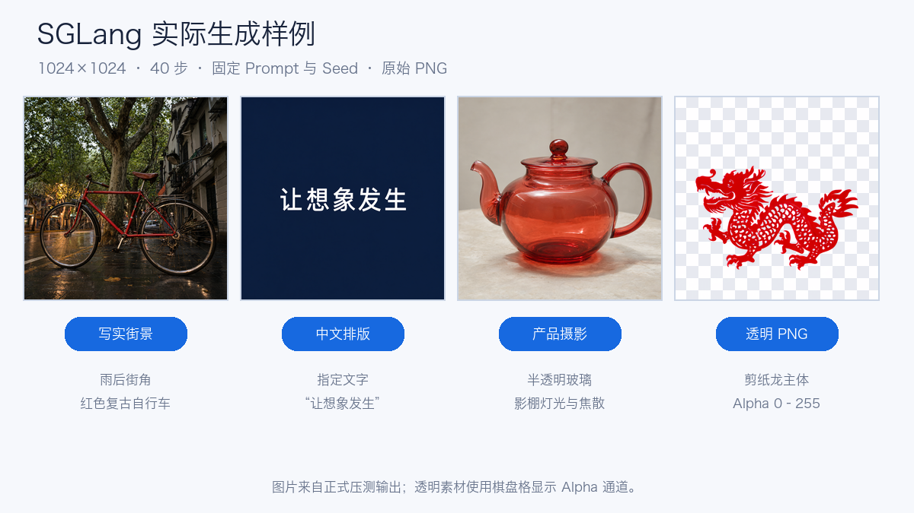
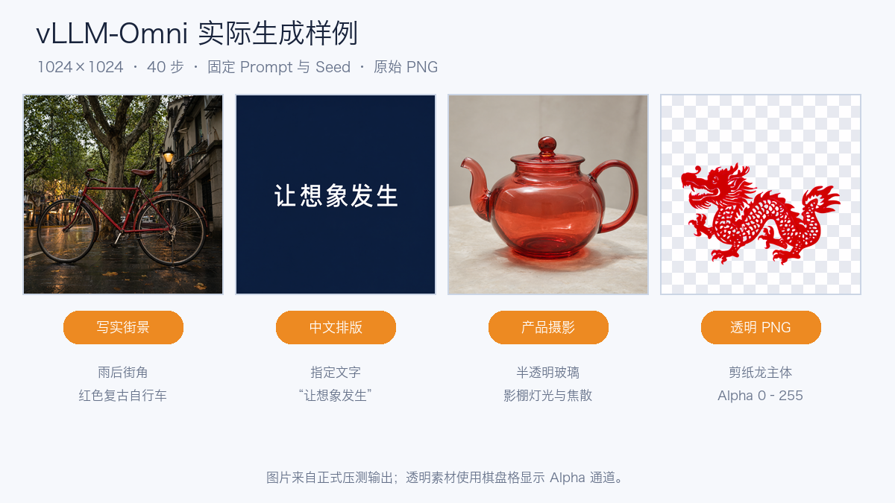
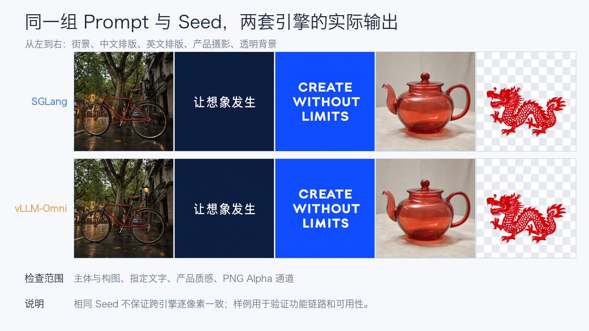
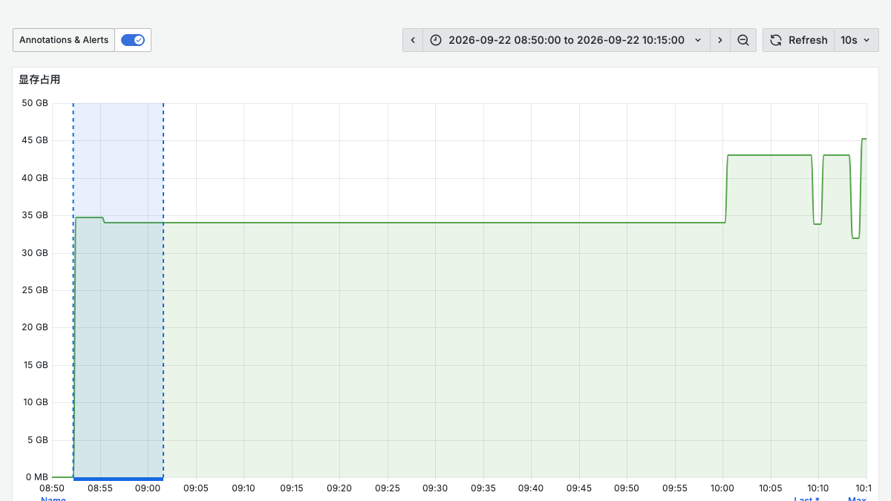
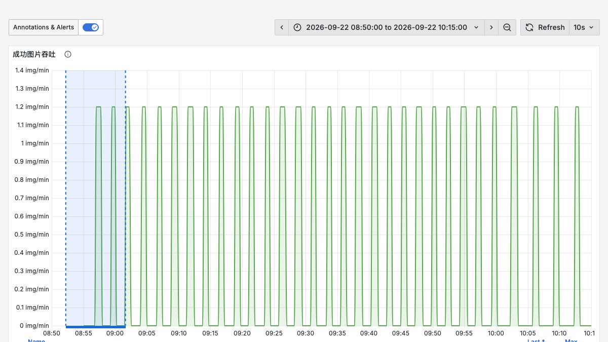
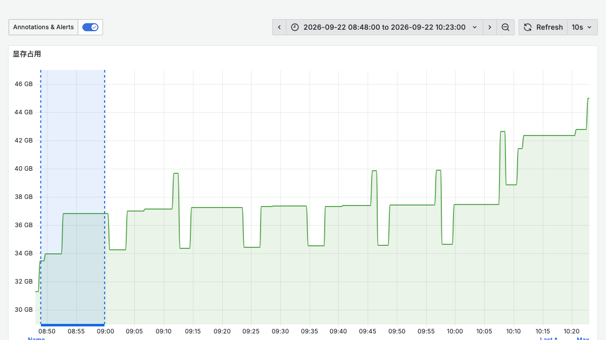
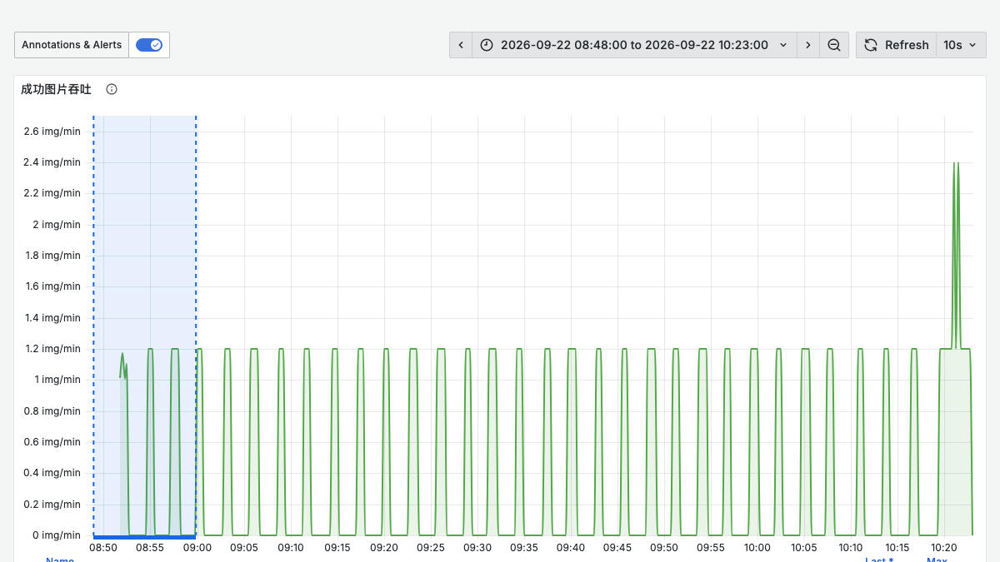
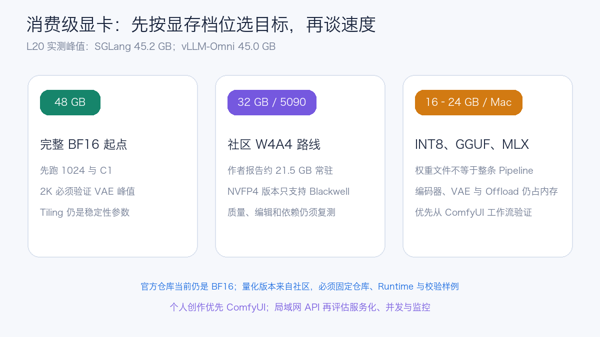
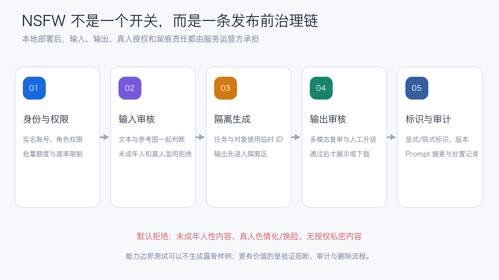

# Qwen-Image-2.1：单卡 L20 的 SGLang 与 vLLM-Omni 实测

Qwen-Image-2.1 是 Qwen 家族的统一图像生成与编辑模型。官方模型卡给出的视觉生成组件规模为 **7B 参数、32 层 Single-Stream DiT**，同时支持文本生成图片、图片编辑和原生 RGBA 透明图。它还支持最多 10 张参考图、通过圈选或蒙版完成局部编辑，并加强了文字排版、人物与商品身份保持、纹理和光照表现。

这类模型与文本大模型的容量判断很不一样。参数规模只有 7B，并不代表十几 GB 显存就能稳定提供在线服务：文本编码器、DiT、VAE、Attention 工作区、CUDA Graph 和输出分辨率都会占用显存。本文把完整 BF16 模型部署在单张 **NVIDIA L20 48 GB** 上，分别验证 SGLang Diffusion 与 vLLM-Omni，再用同一组 Prompt、Seed、分辨率和采样步数测量端到端表现。

实验分成两部分：先用 1024×1024 建立 SGLang 与 vLLM-Omni 的并发基线，再测试官方列出的七种 2K 原生画幅、图片编辑、1/4/10 张参考图和 2048×2048 编辑。高分辨率矩阵同时保留 Runtime 默认配置和 VAE Tiling 配置，用来区分“模型支持”与“当前服务参数能否稳定跑完”。模型能力与示例参数见 [Qwen-Image-2.1 官方模型卡](https://huggingface.co/Qwen/Qwen-Image-2.1)。

模型当前采用 Qwen Research License。本文讨论的是研究测试和工程验证；商业部署需要另外确认授权，不能把技术上能够运行直接等同于可以商用。

## 1. 实验配置与口径

每个服务进程占用一张同型号 GPU，读取同一份只读模型文件。1024 基线每档先执行 2 次预热，再正式生成 10 张图片；扩展矩阵每档执行 1 次预热和 3 个正式请求。失败请求保留在原分母，不用补跑覆盖成绩。每次请求的原始 JSON、HTTP 响应、PNG、延迟和 SHA-256 都保存到 Pod 外，再回传到本地逐文件核对。

| 项目 | 本次配置 |
| --- | --- |
| 模型 | Qwen/Qwen-Image-2.1，BF16 |
| GPU | 单张 NVIDIA L20，48 GB 显存 |
| 服务引擎 | SGLang Diffusion；vLLM-Omni Preview |
| 分辨率 | 1024×1024 基线；七种官方 2K 原生画幅；2048×2048 编辑 |
| 推理步数 | 40 |
| 并发 | 1024 基线：客户端 C1 / C2 / C4；扩展矩阵：C1 |
| 每档样本 | 1024 基线：2 次预热 + 10 个正式请求；扩展矩阵：1 次预热 + 3 个正式请求 |
| 输出 | Base64 PNG；普通 RGB 与 RGBA 都做解码校验 |
| Prompt | 街景、中文/英文排版、产品摄影、透明剪纸；多参考图产品目录编辑 |
| 统计 | 成功图片/分钟、P50/P95 端到端延迟、整轮墙钟时间 |

扩展矩阵没有使用只包含几个单词的合成 Prompt。下面列出三条代表性原文，方便复现和判断模型究竟需要保留什么：

| 用例 | Prompt |
| --- | --- |
| 七种原生画幅 | `A premium editorial photograph of a translucent crimson glass teapot on a black stone pedestal, dramatic studio lighting, fine caustics, crisp details, clean composition adapted to the requested aspect ratio` |
| 4 张参考图 | `Create a clean 2 by 2 product catalogue using <image1>, <image2>, <image3>, and <image4> in that order. Preserve every numeral and its original colour.` |
| 10 张参考图 | `Create a museum collection poster containing all ten reference cards from <image1> through <image10>, arranged in numerical order in two rows. Preserve each numeral and its unique colour; do not omit or duplicate a card.` |

参考图使用确定性脚本生成，并在最终 ConfigMap 中逐文件校验 SHA-256；因此 1、4、10 张测试读取的是实际部署包，不是测试机上另一份同名文件。

SGLang 使用单请求动态批处理上限；vLLM-Omni 使用 `--max-num-seqs 1`。因此 C2、C4 描述的是**多个客户端请求在单活动请求服务前排队**的表现，不是服务端融合批处理结果。这个约束是读懂后续数据的关键。

## 2. 部署方式

SGLang Diffusion 提供 `sglang generate`、`sglang serve` 和 OpenAI-compatible API。本次使用速度模式、FlashAttention 后端和 Metrics：

```bash
sglang serve \
  --model-path /models/Qwen-Image-2.1 \
  --model-id Qwen-Image-2.1 \
  --num-gpus 1 \
  --performance-mode speed \
  --attention-backend fa \
  --host 0.0.0.0 \
  --port 30000 \
  --enable-metrics
```

SGLang 运行时来自 2026-09-18 的 Nightly 构建，并叠加了 Qwen-Image-2.1 支持 Revision。服务端日志显示模型组件按文本编码器、Transformer、VAE、Processor、Scheduler 的顺序加载，整个 Pipeline 模块加载约 25 秒。

vLLM-Omni 的模型支持来自 Preview PR 7759。运行时为 vLLM `0.29.0b1`、vLLM-Omni `0.16.0.dev0+pr7759`、PyTorch `2.13.0+cu129`、Diffusers `0.40.0` 和 Transformers `5.14.1`：

```bash
vllm serve /models/Qwen-Image-2.1 \
  --omni \
  --host 0.0.0.0 \
  --port 30000 \
  --max-num-seqs 1
```

vLLM-Omni 日志记录的模型加载耗时为 28.91 秒，模型加载占用 30.22 GiB，加载后进程级 GPU 显存为 30.58 GiB。启动时还出现了 vLLM 与 vLLM-Omni 主次版本不一致的警告，因此本文把它称为 Preview 结果，不能外推为未来稳定版本的最终性能。

默认配置在部分 2K 画幅的 VAE 解码阶段出现显存不足后，补测服务只增加两项显存相关设置，没有降低分辨率、步数或参考图数量：

```bash
# SGLang
export PYTORCH_CUDA_ALLOC_CONF=expandable_segments:True
sglang serve ... --vae-tiling

# vLLM-Omni
export PYTORCH_CUDA_ALLOC_CONF=expandable_segments:True
vllm serve ... --max-num-seqs 1 --vae-use-tiling
```

VAE Tiling 会把解码过程切成较小区域，降低峰值显存，代价是额外的边界处理和少量时间开销。默认配置与 Tiling 配置分别启动独立服务，结果不会混在一次进程生命周期中。

第一次 vLLM-Omni 部署在 GPU 调度前失败：镜像验收脚本把 `git` 当成必要依赖，但最终运行镜像没有安装 Git。第二次改为读取已安装 Python Package 的版本号和模块路径，随后才允许 GPU Pod 入场。这个修复没有改变模型参数或性能口径，也没有消耗一次无效 GPU 加载。

## 3. 功能验证：文字和透明图是否真的可用

性能数字只有在图片链路正确时才有意义。本轮使用下面 5 类 Prompt，并固定初始 Seed 42～46；后续第二轮使用 47～51。

| 用例 | Prompt 摘要 | 验收重点 |
| --- | --- | --- |
| 写实街景 | 雨后的上海街角与红色复古自行车 | 主体、光照、反射和细节 |
| 中文海报 | 中央只显示“让想象发生” | 字形、错别字和版式 |
| 英文海报 | `CREATE WITHOUT LIMITS` | 字母完整性与居中排版 |
| 产品摄影 | 半透明红色玻璃茶壶 | 材质、焦散和背景控制 |
| 透明素材 | 红色剪纸龙、无背景 | PNG Alpha 通道与主体边缘 |

先看两套引擎的实际生成结果。画廊使用正式压测中的原始 PNG，透明素材在棋盘格背景上展示 Alpha 通道。







两套引擎都生成了可解码的 1024×1024 PNG。中文和英文指定文字在这组样例中完整可读；透明素材输出为 RGBA，Alpha 极值为 0～255，说明背景确实包含透明像素。相同 Seed 在两个引擎之间不保证逐像素一致，因此样例用于验证功能和视觉可用性，不作为数值一致性测试。

## 4. SGLang 与 vLLM-Omni 的实测数据

| 引擎 | 客户端并发 | 成功/总数 | 成功吞吐 | P50 E2E | P95 E2E | 整轮墙钟时间 |
| --- | ---: | ---: | ---: | ---: | ---: | ---: |
| SGLang | 1 | 10/10 | 2.326 img/min | 25.70 s | 26.20 s | 257.99 s |
| SGLang | 2 | 10/10 | 2.331 img/min | 51.48 s | 51.59 s | 257.39 s |
| SGLang | 4 | 10/10 | 2.329 img/min | 102.99 s | 103.13 s | 257.60 s |
| vLLM-Omni Preview | 1 | 10/10 | 2.016 img/min | 29.25 s | 30.86 s | 297.64 s |
| vLLM-Omni Preview | 2 | 10/10 | 2.054 img/min | 58.34 s | 58.55 s | 292.11 s |
| vLLM-Omni Preview | 4 | 10/10 | 2.055 img/min | 116.79 s | 116.92 s | 292.03 s |


在这组固定配置下，SGLang C1 吞吐比 vLLM-Omni Preview 高 **15.4%**，C2 和 C4 分别高 **13.5%** 和 **13.4%**。差距只适用于当前 Revision、1024×1024、40 步和单活动请求配置，不能写成两个项目的通用排名。

更值得关注的是并发曲线。SGLang 从 C1 到 C4 一直约为 2.33 img/min，vLLM-Omni 也只从 2.02 变化到 2.05 img/min；同时 P95 延迟大致随并发倍增。这说明 GPU 一直在串行完成单张图片，更多客户端请求只是在队列里等待。客户端压力工具确实发送了并发请求，但服务端没有把它们融合成同一个计算批次。

vLLM-Omni 官方文档提供两条后续优化路线：把 `--max-num-seqs` 调到大于 1 做请求级批处理，或者启用仍处于实验阶段的 `--step-execution`，让兼容请求共享 Denoise Step。官方也建议先用 `max_num_seqs=1` 验证正确性，再逐步放大容量。下一轮如果测试批处理，必须同时核对显存、失败率、图片质量和 P95，不能只看总吞吐。

脱敏后的 [逐档 CSV](../../assets/practices/qwen-image21-l20/benchmark-results.csv) 与 [汇总 JSON](../../assets/practices/qwen-image21-l20/benchmark-summary.json) 保留了正式样本数、墙钟时间、延迟分位数和源 Summary 的 SHA-256。

## 5. 七种原生 2K 画幅：VAE Tiling 决定能否稳定运行

官方模型卡列出了七种原生 2K 画幅。本轮保持 40 步、Guidance Scale 1、客户端并发 1，每档执行 1 次预热和 3 个正式请求。表中的时间都是正式请求 P50；`FAIL 0/3` 保留原始分母。

| 输出尺寸 | SGLang 默认 | SGLang Tiling | vLLM-Omni 默认 | vLLM-Omni Tiling |
| --- | ---: | ---: | ---: | ---: |
| 2048×2048 | PASS · 140.0 s | PASS · 140.3 s | FAIL · 0/3 | PASS · 162.4 s |
| 2400×1792 | FAIL · 0/3 | PASS · 146.0 s | FAIL · 0/3 | PASS · 169.1 s |
| 1792×2400 | FAIL · 0/3 | PASS · 145.9 s | FAIL · 0/3 | PASS · 169.1 s |
| 2528×1696 | PASS · 143.8 s | PASS · 144.1 s | FAIL · 0/3 | PASS · 167.0 s |
| 1696×2528 | PASS · 143.7 s | PASS · 144.1 s | FAIL · 0/3 | PASS · 166.9 s |
| 2752×1536 | PASS · 140.5 s | PASS · 140.7 s | FAIL · 0/3 | PASS · 163.3 s |
| 1536×2752 | PASS · 140.4 s | PASS · 140.7 s | FAIL · 0/3 | PASS · 163.3 s |

默认配置下，SGLang 完成了 5/7 个画幅，横向和纵向 4:3 都在 VAE 阶段显存不足；vLLM-Omni Preview 的七档均在解码阶段失败。开启 Tiling 后，两套引擎都完成 **7/7**。这说明模型卡里的“原生支持”描述的是能力范围，落到单卡服务仍需要 Runtime 的显存策略配合。

Tiling 组七个画幅的平均 P50 为：SGLang **143.1 秒**，vLLM-Omni Preview **165.9 秒**，后者高 15.9%。SGLang 在默认配置已经通过的五档里，启用 Tiling 只增加约 0.2～0.4 秒；这组数据里它更像稳定性参数，而不是明显的性能负担。

下面四张图来自正式请求的原始 PNG：前两张是 2048×2048 文生图，后两张是单参考图 2048 编辑。


## 6. 图片编辑与多参考图：模型能力不等于单卡服务边界

官方模型卡给出的能力上限是 10 张参考图，但模型能力、服务接口和单卡显存并不是一回事。本轮按 1、4、10 张逐级增加输入：1 张验证基本编辑链路和语义保持，4 张验证多图编码、排列与编号保留，10 张验证官方上限能否穿过当前 Runtime 的接口实现和单卡显存边界。2048 单图编辑则用来观察分辨率增加以后，VAE Tiling 能否把偶发成功变成稳定通过。

| 引擎与配置 | 1 图编辑 1024 | 4 图编辑 1024 | 10 图编辑 1024 | 1 图编辑 2048 |
| --- | ---: | ---: | ---: | ---: |
| SGLang 默认 | PASS 3/3 · 30.33 s | PASS 3/3 · 44.49 s | FAIL 0/3 · OOM | FAIL 2/3 · 196.42 s |
| SGLang Tiling | 未重复 | 未重复 | FAIL 0/3 · OOM | PASS 3/3 · 196.97 s |
| vLLM-Omni 默认 | FAIL 0/3 · OOM | FAIL 0/3 · OOM | FAIL 0/3 · 接口上限 | FAIL 0/3 · OOM |
| vLLM-Omni Tiling | PASS 3/3 · 34.39 s | FAIL 0/3 · OOM | FAIL 0/3 · 接口上限 | PASS 3/3 · 176.67 s |


SGLang 默认配置能够完成 1 图和 4 图的 1024 编辑；单图 2048 虽然有两次成功，但预热和一个正式请求失败，因此整档仍判定为失败。开启 Tiling 后，2048 编辑稳定为 3/3，P50 约 197.0 秒。10 图输入通过了上传、编码和输入校验，随后在去噪第 0 步尝试额外分配 322 MiB 时 OOM；当时 GPU 只剩约 93 MiB。

vLLM-Omni 开启 Tiling 后，单图 1024 和单图 2048 都稳定为 3/3；2048 编辑 P50 约 176.7 秒，比本轮 SGLang 低 10.3%。4 图编辑在尝试额外分配 482 MiB 时 OOM。10 图请求没有进入推理，当前 Preview 实现返回 HTTP 400，并明确限制最多 4 张输入图。官方模型能力上限是 10 张，当前服务接口仍没有把这个能力完整暴露出来。

图中的 1 图和 4 图样例通过了 HTTP、PNG 解码与尺寸检查。4 图样例保留了四种颜色和 1～4 的排列；单图样例中的数字被模型处理成偏图形化的竖条，说明协议成功不等于编辑语义完全正确，仍要人工或视觉评测模型复核。

扩展矩阵的 [完整 CSV](../../assets/practices/qwen-image21-l20/extended-matrix.csv) 和 [带源文件哈希的 JSON](../../assets/practices/qwen-image21-l20/extended-matrix.json) 包含默认配置、Tiling 配置、通过、失败和全部正式请求分母。

## 7. 运行时资源记录










## 8. 从 API 到批量图像工作台

为了让功能验收不局限于固定 Prompt，本轮保留了一套 Gradio 图像工作台。它支持单张生成，也支持一次提交 1～200 张，客户端并行度可设为 1～10；Seed 可以完全随机，也可以从指定值递增。页面显示进度、成功数、失败数、吞吐与预计剩余时间，并允许停止尚未提交的新任务。


工作台与模型服务分开部署，CPU Pod 负责表单、队列和结果索引，GPU Pod 只处理图像 API。每张图片都保存请求 JSON、每次尝试的原始响应、结果 JSON、PNG 和 SHA-256。目录先写到 Pod 外的持久位置，再异步回传到使用者机器，Pod 重建不会删除已经生成的图片。

使用端可以通过本地端口转发访问，不必给工作台开放公网入口：

```bash
kubectl -n image-serving port-forward svc/qwen-image-workbench 7861:7860
```

浏览器打开 `http://127.0.0.1:7861/` 即可。这里的“并行度”表示客户端同时在途请求数。按 SGLang 当前约 2.33 img/min 的实测吞吐估算，100 张 1024×1024、40 步图片约需 43 分钟，200 张约需 86 分钟；在服务端仍限制单活动请求时，把并行度从 1 调到 10 不会得到十倍速度。

## 9. API 复现

两个引擎都通过 OpenAI-compatible 图片生成接口提供服务。下面的请求可以同时验证中文排版与 Base64 PNG 返回：

```bash
curl -sS http://127.0.0.1:30000/v1/images/generations \
  -H 'Content-Type: application/json' \
  -d '{
    "model": "Qwen-Image-2.1",
    "prompt": "极简科技海报，深蓝背景，中央只显示清晰准确的中文『让想象发生』",
    "size": "1024x1024",
    "num_inference_steps": 40,
    "seed": 43,
    "response_format": "b64_json",
    "output_format": "png"
  }'
```

正式验收不能只检查 HTTP 200。客户端还应验证 JSON Schema、Base64 解码、PNG 魔数、图片尺寸、RGBA 通道、文件大小和 SHA-256；失败响应原样留存，方便区分网关错误、引擎错误和输出解析错误。

## 10. 硬件与生产部署建议

L20 48 GB 是这次完整 BF16 单卡部署的可用起点。1024 基线峰值分别为 32.8 GB 和 40.4 GB；扩展到原生 2K 与编辑矩阵后，SGLang 和 vLLM-Omni Preview 分别达到 45.2 GB 与 45.0 GB，卡面余量只剩约 3 GB。生产环境还要给驱动差异、CUDA Graph、批处理和偶发碎片留空间，因此不能用 1024 的峰值推算 2K 容量，也不能把单次峰值直接当作显存 Request 上限。

A30 通常只有 24 GB 显存，本轮按用户要求没有执行 A30 测试。根据两套 L20 实测峰值，完整 BF16 运行时无法直接落入 24 GB；若必须使用 A30，需要尝试组件 CPU Offload、量化或多卡切分，并接受 PCIe 传输和更长延迟。这个判断是容量推导，不是 A30 实测结论。

面向生产可以按以下顺序推进：

1. 先用单活动请求完成固定 Prompt、文字、透明 PNG 和失败响应验收，再改批处理参数。
2. 把在线工作台、任务队列和 GPU 引擎分开，限制单用户批量规模和全局在途请求，避免 200 张任务占住整个服务。
3. 逐级测试 1024、1536、2048 和官方推荐长宽比；每一级重新记录显存峰值、单图延迟与 OOM 边界。
4. vLLM-Omni 开启 `max_num_seqs>1` 或 Step Execution 时，用同尺寸、同 CFG、同 LoRA 状态的请求组成批次，并把图片质量验收放在吞吐门槛之前。
5. 生成结果保存到对象存储、PVC 或受控 HostPath，数据库只记录任务和对象索引；为原始响应、PNG 和元数据设置不同的保留周期。
6. 看板同时展示队列深度、成功/失败率、端到端延迟、图片吞吐、GPU 利用率、显存和功耗。仅有 GPU 100% 无法判断用户是否等得过久。
7. 固定模型 Revision、镜像 Digest、Runtime 版本和生成参数。升级 SGLang、vLLM-Omni、Diffusers、Torch 或驱动后，重新跑同一组功能门槛和代表性性能档。

## 11. 面向消费级显卡部署：显存容量只是第一道门槛

L20 实测需要区分三个问题：模型能否加载、能否生成一张图片、能否稳定承担连续任务。48 GB 显存可以直接运行完整 BF16 Pipeline；32 GB 消费卡更可能需要 VAE Tiling、组件卸载或量化；24 GB 及以下通常还要更激进的 CPU Offload。后两档不是本文的性能实测。

截至本文测试时，Qwen 官方仓库发布的是 BF16 权重；Hugging Face 的模型树已经出现多种社区量化。它们压缩的组件、支持的 GPU 和 Runtime 并不相同，不能只按下载文件大小选择：

| 路线 | 社区仓库与已公开数据 | 适合的设备 | 使用前要确认 |
| --- | --- | --- | --- |
| ComfyUI INT8 / W4A8 | [Comfy-Org/Qwen-Image-2.1](https://huggingface.co/Comfy-Org/Qwen-Image-2.1) 提供 INT8 ConvRot Transformer，以及 BF16、INT8 ConvRot、W4A8 文本编码器 | 16～32 GB NVIDIA 卡的优先验证路线 | Transformer、文本编码器与 VAE 要成套选择；仓库没有给出本文口径的端到端峰值 |
| GGUF Q3～Q8 | [Abiray/Qwen-Image-2.1-GGUF](https://huggingface.co/Abiray/Qwen-Image-2.1-GGUF) 的 Transformer 文件约 3.19～7.59 GB，通过 ComfyUI-GGUF 加载 | 显存紧张、接受组件 Offload 的个人工作站 | 仍需额外文本编码器和 VAE；仓库标注的“推荐显存”不能理解为整条 Pipeline 的峰值 |
| W4A4 NVFP4 | [ModelsLab/Qwen-Image-2.1-W4A4-nvfp4](https://huggingface.co/ModelsLab/Qwen-Image-2.1-W4A4-nvfp4) 报告 Transformer 文件 4.54 GB、常驻约 21.53 GB，RTX 5090 上 1024×1024、40 步约 7.65 秒 | RTX 50 系 Blackwell | 仅支持 SM120；文本编码器仍为 BF16，仓库数据需要用自己的 Prompt 和编辑矩阵复核 |
| MLX 4-bit | [ddalcu/Qwen-Image-2.1-MLX-Serve-4bit](https://huggingface.co/ddalcu/Qwen-Image-2.1-MLX-Serve-4bit) 是 10.7 GB 的 Text-to-Image Pack | 16 GB 以上 Apple Silicon 的早期试验 | 依赖尚未正式发布的 MLX Serve 分支；为节省容量移除了视觉塔，不能据此推断完整编辑能力 |

另有独立的 [W8A8 FP8 校准版本](https://huggingface.co/ProCreations/Image-2.1-Calibrated-FP8)，但它要求 Blackwell、CUDA 13 和自定义加载器，不是可以直接交给 ComfyUI、SGLang 或 vLLM-Omni 的通用 Checkpoint。社区仓库发布得很快，生产前至少要核对源模型 Revision、量化范围、许可证、Runtime Commit、1024/2048 输出、文字准确性和多参考图编辑。



RTX 5090 提供 32 GB GDDR7，但 32 GB 仍低于本文部分 BF16 配置的 L20 峰值。W4A4 的社区数据说明 5090 有机会把完整运行集压进显存，却不代表 BF16 服务参数可以原样照搬。消费级显卡部署还需要足够的系统内存和高速 NVMe，避免文本编码器、DiT、VAE 在 CPU 与 GPU 之间迁移时被内存容量和 PCIe 带宽卡住。可以按下面的顺序验证：

1. 从 1024×1024、单请求、40 步开始，记录进程显存峰值和单图延迟；
2. 打开 VAE Tiling、量化或组件级 CPU Offload 后重新测量，不能只确认模型进程没有 OOM；
3. 再验证 2048×2048 和长宽比画幅，观察 VAE 解码阶段的瞬时峰值；
4. 个人工作站优先使用单用户任务队列，避免浏览器连续提交造成内存和显存抖动；
5. 将图片、请求参数和 Seed 保存到本地磁盘，服务重启后仍能复现和追踪。

个人创作更适合用 Diffusers 或 ComfyUI 组合工作流；局域网 API、批量任务和统一监控则更适合增加 SGLang 或 vLLM-Omni 服务层。消费级显卡部署比较现实的目标是稳定完成 C1，而不是直接追求多用户并发。

## 12. NSFW 应被当成治理问题

NSFW（Not Safe For Work，不适合在工作环境展示的内容）不是单一分类。艺术裸体、成人暗示、明确性内容、真人色情化编辑和未成年人内容，在风险和处置上完全不同。Qwen-Image-2.1 的模型卡没有声明内置 Safety Checker；本地部署开放权重后，输入审核、输出审核、用户权限和留痕责任都落到服务运营方。



企业环境至少需要建立以下边界：

- 涉及未成年人或疑似未成年人的性内容直接拒绝；
- 真人色情化、换脸和私密内容默认拒绝，确有合法业务场景也必须取得明确授权并限制使用范围；
- 输入和输出分别执行多模态审核，不能只对 Prompt 做关键词过滤；
- 批量接口使用实名账号、角色权限、速率限制和审计日志，记录模型版本、Prompt 摘要、审核结果和输出对象索引；
- 生成内容保留显式标识，并按适用规则写入隐式标识或元数据；
- 为误判申诉、违规下架和安全事件处置设置责任人和时限。

本文没有生成露骨样例，也没有通过解除过滤来证明能力。对企业来说，更有价值的测试是验证审核链路能否在图片进入存储、展示或下载前阻断违规内容，并确认审计记录与删除流程真实可用。

## 参考资料

- [Qwen/Qwen-Image-2.1 模型卡](https://huggingface.co/Qwen/Qwen-Image-2.1)
- [SGLang Diffusion 官方文档](https://github.com/sgl-project/sglang/blob/main/docs/docs/sglang-diffusion/index.mdx)
- [vLLM-Omni Diffusion Execution Modes](https://docs.vllm.ai/projects/vllm-omni/en/latest/user_guide/diffusion/execution_modes/)
- [vLLM-Omni Serve CLI](https://docs.vllm.ai/projects/vllm-omni/en/latest/api/vllm_omni/entrypoints/cli/serve/)
- [Comfy-Org/Qwen-Image-2.1 社区量化](https://huggingface.co/Comfy-Org/Qwen-Image-2.1)
- [Abiray/Qwen-Image-2.1-GGUF](https://huggingface.co/Abiray/Qwen-Image-2.1-GGUF)
- [ModelsLab/Qwen-Image-2.1-W4A4-nvfp4](https://huggingface.co/ModelsLab/Qwen-Image-2.1-W4A4-nvfp4)
- [ddalcu/Qwen-Image-2.1-MLX-Serve-4bit](https://huggingface.co/ddalcu/Qwen-Image-2.1-MLX-Serve-4bit)
- [NVIDIA GeForce RTX 5090 官方规格](https://www.nvidia.com/en-us/geforce/graphics-cards/50-series/rtx-5090/)
- [《人工智能生成合成内容标识办法》](https://www.cac.gov.cn/2025-03/14/c_1743654684782215.htm)
- [《互联网信息服务深度合成管理规定》](https://www.cac.gov.cn/2022-12/11/c_1672221949354811.htm)
- [《生成式人工智能服务管理暂行办法》](https://www.cac.gov.cn/2023-07/13/c_1690898327029107.htm)
