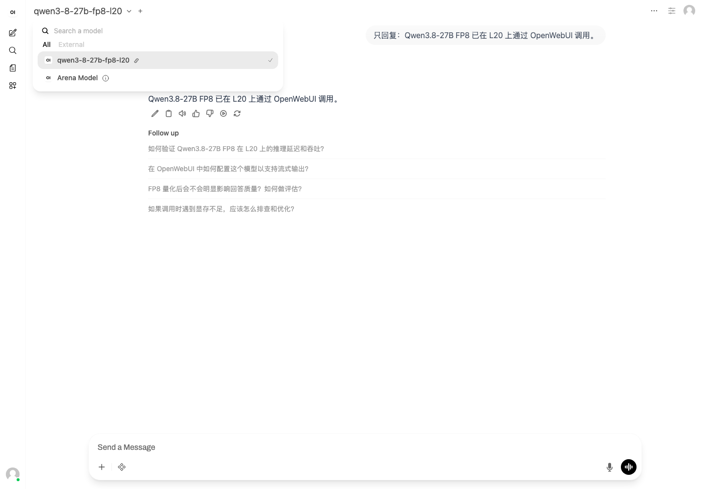
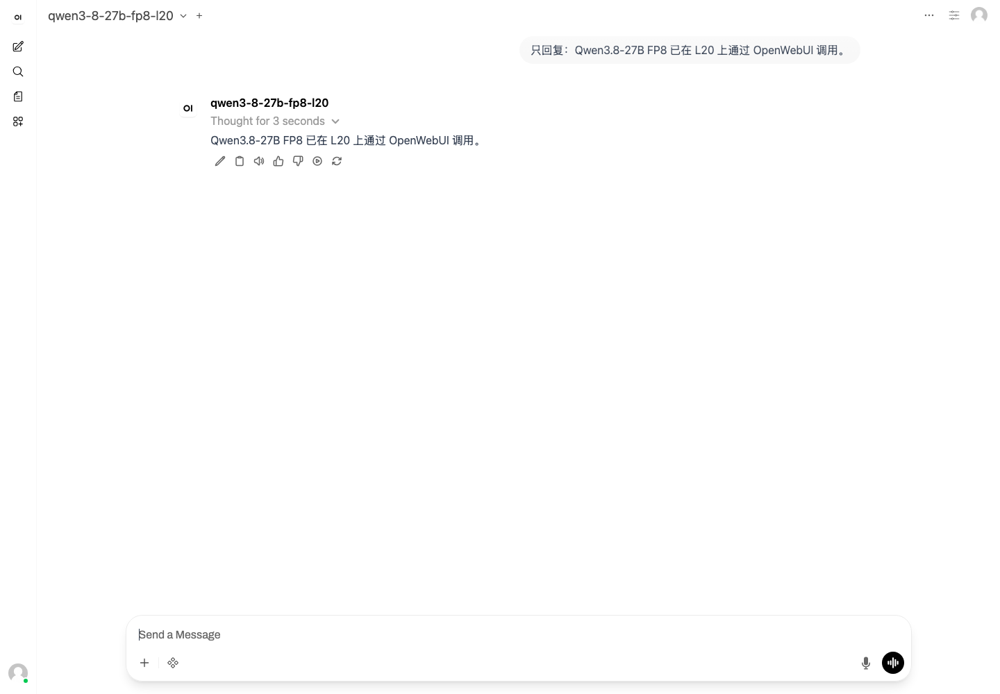

# Qwen3.8-27B Day 0：vLLM 与 SGLang 测试记录

> 本文创建于官方权重公开后的第二天，以 vLLM 和 SGLang 两条运行时路线共同验证 Qwen3.8-27B。两条路线都已经在测试集群的单张 NVIDIA L20 上完成 FP8 部署、正确性、AIBrix 接入和四组同口径短时性能基线；vLLM 还完成了 OpenWebUI 真实对话。MTP、Vision 与长上下文仍是下一阶段，本文会明确区分“已实测”和“待实测”。

我第一次真正开始大量做 vibe coding，是在 Claude Opus 4.5 发布之后。此前我也用模型写代码，但 Opus 4.5 处理复杂需求、跨文件修改和长时间自主执行的效果，第一次让我产生了非常强烈的“开发方式已经改变”的感觉。那种震惊不是来自一段漂亮的代码，而是来自模型能够持续理解意图、调用工具、发现问题并把任务收尾。

后来我又开始使用 Opus 4.6。看到 Qwen3.8-27B 的官方模型卡把这个 27B 开放权重模型和 Opus 4.6 放在同一张 Coding Benchmark 表里，而且有些项目更高时，我的第一反应确实是震惊：27B 的开放模型已经走到这里了吗？

但“部分榜单领先”不能简化成“所有编码能力全面超过”。这篇 Day 0 实验先记录它在固定 L20 环境下使用 vLLM 与 SGLang 时的配置差异、接口行为和性能数据，再逐步扩展到 Coding、Agent 与长上下文测试。

## 1. 先校准“coding 不输 Opus 4.6”的含义

Qwen 官方模型卡给出的 coding 对比中，Qwen3.8-27B 与 `Opus4.6 Max` 有胜有负：

| Benchmark | Qwen3.8-27B | Opus4.6 Max | 这张表能说明什么 |
| --- | ---: | ---: | --- |
| SWE-bench Pro | 61.7 | 53.4 | Qwen 官方评测中，Qwen3.8-27B 领先 8.3 分 |
| Terminal-Bench 2.1（Terminus） | 73.0 | 78.2 | Opus4.6 Max 仍领先 5.2 分 |
| NL2Repo-Bench | 42.3 | 47.6 | Opus4.6 Max 仍领先 5.3 分 |
| QwenSWEBench | 79.0 | 63.8 | Qwen3.8-27B 领先，但这是 Qwen 自建 Benchmark，必须等待独立复现 |
| DeepSWE 1.1 | 42.2 | 未报告 | 不能做横向结论 |

这组数字最合理的解读是：Qwen3.8-27B 已经进入值得和前沿闭源 coding 模型正面对照的区间，而不是已经在每一种代码任务上确定性战胜 Opus 4.6。还要注意三条边界：

1. 表格来自 Qwen 官方评测，不是本文实测，也不是独立第三方复现；
2. `Opus4.6 Max` 的 Harness、Effort、工具和上下文配置必须与 Qwen 侧一致，才能形成严格 A/B；
3. Anthropic 发布页强调的是 Opus 4.6 在长时 Agent、代码库操作、Review 和 Debug 上的整体提升，单个静态 Benchmark 不能覆盖真实 vibe coding 体验。

因此本文会把“编码能力”拆成四层：短代码正确性、Repo 级修改、工具调用与恢复、长时间 Agent 任务。吞吐高不代表代码好，榜单高也不代表服务稳定。

## 2. 发布次日已经确认的模型事实

官方仓库显示，Qwen3.8-27B 建立在 Qwen3.5 架构基础上，是带视觉编码器的 27B Dense 模型：

| 项目 | 已确认值 |
| --- | --- |
| Hugging Face 架构 | `Qwen3_5ForConditionalGeneration` |
| `model_type` | `qwen3_5` |
| 参数量 | 27B；官方仓库统计约 27.78B 参数 |
| 层数 | 64 |
| Attention | 48 层 Gated DeltaNet + 16 层 Gated Attention |
| 原生上下文 | 262,144 tokens |
| 扩展上下文 | 通过 YaRN 最多扩展到约 1,000,000 tokens |
| 模态 | 文本、图片、视频 |
| Thinking | 默认开启；支持 `xhigh`、`medium`、`low` reasoning effort |
| MTP | Checkpoint 带原生 Multi-Token Prediction 模块 |

官方同时提供 BF16 和细粒度 FP8 权重。2026 年 8 月 15 日读取到的制品信息如下：

| 制品 | Revision | Safetensors | 权重字节数 | 约合 GiB | 首轮用途 |
| --- | --- | ---: | ---: | ---: | --- |
| `Qwen/Qwen3.8-27B-FP8` | `017b9c7af6b5689d5dd426a76e0bc077eb5ca20a` | 66 | 30,866,866,928 | 28.75 | L20 首轮基线 |
| `Qwen/Qwen3.8-27B` | `1d4bf0f2ff6012fd82039f2fa52739d0dd7c60c0` | 18 | 55,563,006,776 | 51.75 | 精度与资源对照 |

FP8 模型卡声明使用 128×128 block 的 E4M3 细粒度量化，动态 Activation Scheme；视觉模块、Embedding、LM Head、LayerNorm 和部分其他模块仍保留非 FP8 精度。因此 28.75 GiB 不能直接等同于最终显存占用，还要加上未量化模块、KV Cache、CUDA Graph、Workspace 和框架运行时。

## 3. 首轮为什么选 vLLM 0.26.0 CUDA 12.9

vLLM 官方 Qwen3.8 Recipe 标注该架构支持 vLLM `0.17.0+`，并给出 FP8、BF16、MTP 和 1M YaRN 示例。首轮使用下面这个固定镜像：

```text
vllm/vllm-openai:v0.26.0-cu129
linux/amd64 manifest:
sha256:3c5c53248febaa72823a4b7e51aafa1cd2b65d860392e3930414da4d3864f541
```

选择它的原因是：

- `v0.26.0` 是当前可获得的稳定版本，不用未固定的 `nightly` 作为第一条变量；
- `cu129` 与现有 L20 CUDA 12.9 实验环境一致，避免同时升级 CUDA 13；
- 模型配置仍注册为已经支持的 `Qwen3_5ForConditionalGeneration`；
- 若稳定版在 Chat Template、Vision、MTP 或新配置字段上失败，再切到固定 Commit 的 `cu129-nightly-*`，并把失败证据写进报告。

镜像进入内部仓库后必须保留上游 tag、平台和 digest 映射。本文不记录真实 Registry 域名或凭据，示例统一写成：

```text
<STAGING_REGISTRY>/<PROJECT>/vllm-openai:v0.26.0-cu129
```

2026 年 8 月 15 日的实际镜像准备结果如下：

| 环节 | 结果 |
| --- | --- |
| 上游多架构索引 | `sha256:976b4ba10e247dbe5c5ce3e2ba952a359ef641ee25c3d091811c1bec420e5a23` |
| 本地固定平台 | `linux/amd64` |
| amd64 Manifest | `sha256:3c5c53248febaa72823a4b7e51aafa1cd2b65d860392e3930414da4d3864f541` |
| staging | 单平台 Manifest 推送成功，Digest 与上游 amd64 一致 |
| 生产同步 | 内部镜像服务任务返回成功；具体任务 ID 与 Registry 地址不写入公开文章 |

这次没有通过不稳定的跨网链路执行 Registry-to-Registry 长连接，而是先执行带平台约束的 `docker pull`，本地确认 Manifest，再 tag、push 到 staging，最后由内部镜像服务完成 staging 到生产的复制：

```bash
docker pull --platform linux/amd64 vllm/vllm-openai:v0.26.0-cu129
docker image ls --tree vllm/vllm-openai:v0.26.0-cu129
docker tag vllm/vllm-openai:v0.26.0-cu129 \
  <STAGING_REGISTRY>/<PROJECT>/vllm-openai:v0.26.0-cu129
docker push --platform linux/amd64 \
  <STAGING_REGISTRY>/<PROJECT>/vllm-openai:v0.26.0-cu129
```

它并不会减少首次下载的数据量，但本地 Layer Cache、可分段验证以及后续由内网服务端复制，能把家庭 VPN 的不稳定性从 staging → 生产链路中拿掉。

### 3.1 镜像静态预检

在申请 GPU 前，先确认版本、CUDA、模型注册和关键 CLI 参数：

```bash
python3 -c 'import torch, transformers, vllm; print(torch.__version__, torch.version.cuda, transformers.__version__, vllm.__version__)'

python3 -c 'from vllm.model_executor.models import ModelRegistry; print("Qwen3_5ForConditionalGeneration" in ModelRegistry.get_supported_archs())'

vllm serve --help=all | grep -E 'language-model-only|speculative-config|reasoning-parser|tool-call-parser|kv-cache-dtype'
```

若 `v0.26.0-cu129` 不能读取官方 Revision，优先记录完整 Traceback、Transformers 版本和未知字段，再决定是否换 nightly；不要在运行中的容器里临时 `pip install -U`，否则镜像 digest 将失去复现意义。

## 4. L20 首轮结果与后续测试

首轮固定 TP=1、32K、text-only、FP8 KV、MTP Off，记录单张 48 GB L20 上的显存分配、KV Cache 与初始化数据，作为后续 A/B 的基线。

| 项目 | L20 发布次日实测 |
| --- | --- |
| GPU | NVIDIA L20，`nvidia-smi` 可见 46,068 MiB |
| 权重加载 | 66 个 Safetensors Shard，CephFS 读取 20.18 s |
| 模型加载显存 | 27.64 GiB |
| Torch Compile | 62.16 s |
| Engine 初始化 | 156.47 s |
| KV Cache | 8.69 GiB，容量 219,666 tokens |
| 32K 理论最大并发 | vLLM Profile 给出 6.70× |
| CUDA Graph | 0.89 GiB |
| Peak Activation | 2.62 GiB |

首轮仍然发现了两个不能忽略的警告：L20（SM89）没有命中当前镜像针对若干 Shape 的 W8A8 Block FP8 调优配置，回退到默认 Kernel；FP8 KV 的 K/V/Probability Scale 没有来自 Checkpoint 的校准值，vLLM 回退为 1.0。这意味着当前结果是可运行基线，不是“已经调优完成”；后续必须做 `KV Auto vs FP8` 的质量与性能 A/B。

接下来仍坚持一次只增加一个变量：

| 阶段 | 权重 | GPU | 上下文 | 视觉 | MTP | 目标 |
| --- | --- | ---: | ---: | --- | --- | --- |
| P0 | 只挂配置 | 0 | 不启动服务 | 关闭 | 关闭 | 镜像、架构和参数静态预检 |
| P1 | 官方 FP8 | 1×L20 | 32K | 关闭 | 关闭 | **已完成**：文本、Thinking、Tool Call、AIBrix、OpenWebUI |
| P2 | 官方 FP8 | 1×L20 | 32K | 关闭 | 关闭 | KV Auto/FP8、长稳和真实请求集 |
| P3 | 官方 FP8 | 1×L20 | 32K | 开启 | 关闭 | 图片理解与 Vision 显存增量 |
| P4 | 官方 FP8 | 1×L20 | 32K | 关闭 | 1/2/3 tokens | MTP 接受率与 Decode 收益 |
| P5 | 官方 FP8 | 1×L20 | 64K/128K | 按需 | 按需 | 长上下文路径与资源成本 |
| P6 | 官方 BF16 | 2×L20 | 32K | 关闭 | 关闭 | FP8 正确性、显存和性能对照 |

后续仍以同一套 L20 环境为基线，逐项增加上下文、视觉和 MTP，避免把不同硬件与不同运行参数混进同一组结果。

NVFP4 社区量化可以作为消费级或 Blackwell 路线补充，但不应把它与本轮 L20 FP8 基线混为一谈。GGUF/llama.cpp 适合 Mac 或 CPU 做提示词与 Agent 接口冒烟，也不能替代数据中心 GPU 上的 vLLM/SGLang 吞吐测试。

## 5. 最小 vLLM 启动基线

模型应提前同步到只读 PVC、共享文件系统或节点缓存，不要让每次 Pod 重建都从 Hugging Face 冷下载。首轮文本基线建议：

```bash
vllm serve /models/Qwen3.8-27B-FP8 \
  --host 0.0.0.0 \
  --port 8000 \
  --served-model-name qwen3-8-27b-fp8-l20 \
  --tensor-parallel-size 1 \
  --max-model-len 32768 \
  --gpu-memory-utilization 0.90 \
  --max-num-seqs 8 \
  --max-num-batched-tokens 8192 \
  --kv-cache-dtype fp8 \
  --language-model-only \
  --reasoning-parser qwen3 \
  --enable-auto-tool-choice \
  --tool-call-parser qwen3_coder \
  --enable-prefix-caching \
  --enable-chunked-prefill
```

如果目标镜像没有 `--language-model-only`，应按 `vllm serve --help` 的实际参数切换为显式禁止图片/视频输入的方式，并把差异记录下来。不能在没有校验 CLI 的情况下直接把其他版本文档中的参数复制到生产。

MTP 必须作为独立 A/B 加入：

```bash
--speculative-config '{"method":"mtp","num_speculative_tokens":3}'
```

至少测试 1、2、3 个 Draft Token。只报告最终 tokens/s 没有意义，还要记录 Mean Acceptance Length、每位置接受率、TTFT、TPOT 和 GPU 功耗。接受率不足时，MTP 可能增加验证开销而不是加速。

## 6. Kubernetes 部署与共享模型存储

实际部署使用已有的只读共享模型存储，并把模型根目录挂为 `/models`，Checkpoint 位于 `/models/Qwen3.8-27B-FP8`。公开示例统一改为名为 `qwen38-models` 的 PVC，不包含内部存储地址、卷路径或 Secret 名称。

仓库中的 `examples/qwen38-27b-l20-vllm/deployment.yaml` 保留了公开可复现清单：上游镜像 Digest、通用 PVC、16 GiB `/dev/shm`、Compile Cache、Probe、AIBrix 标签以及完整 vLLM 参数。下面是同一份公开骨架：

```yaml
apiVersion: apps/v1
kind: Deployment
metadata:
  name: qwen38-27b-vllm
  namespace: <NAMESPACE>
spec:
  replicas: 1
  strategy:
    type: Recreate
  selector:
    matchLabels:
      app: qwen38-27b-vllm
  template:
    metadata:
      labels:
        app: qwen38-27b-vllm
    spec:
      terminationGracePeriodSeconds: 120
      nodeSelector:
        <GPU_NODE_LABEL_KEY>: <GPU_LABEL_VALUE>
      tolerations:
        - key: <GPU_TAINT_KEY>
          operator: Equal
          value: <GPU_TAINT_VALUE>
          effect: NoSchedule
      containers:
        - name: vllm
          image: <STAGING_REGISTRY>/<PROJECT>/vllm-openai:v0.26.0-cu129
          imagePullPolicy: IfNotPresent
          command: ["vllm", "serve"]
          args:
            - /models/Qwen3.8-27B-FP8
            - --host
            - "0.0.0.0"
            - --port
            - "8000"
            - --served-model-name
            - qwen3-8-27b-fp8-l20
            - --tensor-parallel-size
            - "1"
            - --max-model-len
            - "32768"
            - --gpu-memory-utilization
            - "0.90"
            - --max-num-seqs
            - "8"
            - --max-num-batched-tokens
            - "8192"
            - --kv-cache-dtype
            - fp8
            - --language-model-only
            - --reasoning-parser
            - qwen3
            - --enable-auto-tool-choice
            - --tool-call-parser
            - qwen3_coder
            - --enable-prefix-caching
            - --enable-chunked-prefill
          ports:
            - name: http
              containerPort: 8000
          resources:
            requests:
              cpu: "16"
              memory: 64Gi
              nvidia.com/gpu: "1"
            limits:
              cpu: "32"
              memory: 128Gi
              nvidia.com/gpu: "1"
          startupProbe:
            httpGet:
              path: /health
              port: http
            periodSeconds: 10
            failureThreshold: 180
          readinessProbe:
            httpGet:
              path: /health
              port: http
            periodSeconds: 5
            failureThreshold: 6
          volumeMounts:
            - name: model
              mountPath: /models/Qwen3.8-27B-FP8
              readOnly: true
            - name: shm
              mountPath: /dev/shm
      volumes:
        - name: model
          persistentVolumeClaim:
              claimName: <MODEL_VOLUME>
        - name: shm
          emptyDir:
            medium: Memory
            sizeLimit: 16Gi
---
apiVersion: v1
kind: Service
metadata:
  name: qwen38-27b-vllm
  namespace: <NAMESPACE>
spec:
  selector:
    app: qwen38-27b-vllm
  ports:
    - name: http
      port: 8000
      targetPort: http
```

公开骨架使用 PVC，不披露底层存储实现。若现有环境仍使用 in-tree CephFS，需要注意它在 Kubernetes v1.28 已废弃、v1.31 起不可用，并规划迁移到 Ceph CSI。`failureThreshold: 180 × 10s` 给了最多 30 分钟启动窗口，真正的冷启动 SLO 则记录 `Pod created → first correct response`。

## 7. 正确性验收先于性能压测

### 7.1 服务与确定性文本

```bash
curl -sS http://127.0.0.1:8000/v1/models

curl -sS http://127.0.0.1:8000/v1/chat/completions \
  -H 'Content-Type: application/json' \
  -d '{
    "model": "qwen3-8-27b-fp8-l20",
    "messages": [{"role": "user", "content": "只回复 QWEN38_OK"}],
    "temperature": 0,
    "max_tokens": 32,
    "chat_template_kwargs": {
      "enable_thinking": false,
      "preserve_thinking": false
    }
  }'
```

Thinking 默认开启，不能只看 HTTP 200。需要分别验证：

- `enable_thinking=false` 时响应只包含最终答案；
- `enable_thinking=true` 时 reasoning 与 content 字段边界正确；
- `reasoning_effort=low/medium/xhigh` 能被 API 与 Chat Template 正确传递；
- 多轮请求保留或关闭 `preserve_thinking` 时没有把历史 `<think>` 错误拼进最终内容。

发布次日实际完成了四条 API 验收：关闭 Thinking 时严格返回 `QWEN38_OK`；开启 Thinking 并设为 Low 时正确判断 `9.9 > 9.11`，Reasoning 与 Content 分字段返回；天气函数生成结构化 `get_weather({"city":"北京"})`；回填工具结果后生成正确自然语言答案。AIBrix Gateway 再次返回 `AIBRIX_QWEN38_OK`，说明不是只有 Pod Loopback 能访问。

### 7.2 Tool Calling

至少覆盖：单工具、并行工具、工具报错后恢复、缺少必填参数、工具结果回填、多轮继续执行。验收重点不是“出现 XML”，而是 OpenAI-compatible 响应中生成结构正确的 `tool_calls`，参数可解析，工具返回后模型能继续完成任务。

### 7.3 OpenWebUI 注册与真实对话

模型通过 AIBrix 标签自动生成 Router，随后把 `qwen3-8-27b-fp8-l20` 加入 OpenWebUI 的 AIBrix API 配置。最终测试不是只看下拉框，而是在脱敏后的访问入口发起一次真实对话并获得模型响应。





### 7.4 视觉与视频

P1 文本基线通过后，移除 `--language-model-only`，分别测试：

1. 单张 1024×1024 图片描述；
2. 图表/文档问答；
3. 多图顺序与引用；
4. 短视频采样；
5. 视觉输入后的工具调用。

每项记录 Vision Encoder 增加的显存、TTFT 和预处理时间，不能把图片下载时间算进模型 Prefill。

## 8. 压测矩阵

### 8.1 固定输入输出与并发阶梯

第一轮沿用现有 GPU 报告的长度口径，便于横向观察，但不直接做模型排名：

| 场景 | 输入/输出 | 并发 | 主要观察 |
| --- | --- | --- | --- |
| Decode 基线 | 128 / 64 | 1、4、8、16 | TPOT、ITL、单卡输出 tok/s |
| 均衡请求 | 1024 / 1024 | 1、4、8 | Prefill/Decode 平衡、吞吐拐点 |
| Prefill 基线 | 4096 / 128 | 1、4、8 | TTFT、Chunked Prefill |
| 中长上下文 | 32768 / 256 | 1、2、4 | KV 占用、TTFT、稳定性 |
| 长上下文 | 64K/128K/262K | 1 | Needle、OOM 边界、Graph/JIT |

示例命令：

```bash
vllm bench serve \
  --backend openai \
  --base-url http://127.0.0.1:8000 \
  --endpoint /v1/completions \
  --model qwen3-8-27b-fp8-l20 \
  --tokenizer /models/Qwen3.8-27B-FP8 \
  --dataset-name random \
  --num-prompts 64 \
  --num-warmups 8 \
  --random-input-len 128 \
  --random-output-len 64 \
  --ignore-eos \
  --temperature 0 \
  --request-rate inf \
  --max-concurrency 8 \
  --percentile-metrics ttft,tpot,itl,e2el \
  --metric-percentiles 50,95,99 \
  --save-result
```

无限 request-rate 用于找饱和吞吐，不代表真实业务。正式容量实验还要做固定到达率阶梯，例如 0.5、1、2、4、8 req/s，每档持续 10–30 分钟，找出 p95/p99 延迟和错误率开始陡升的位置。

### 8.2 必做 A/B

| A/B | 固定变量 | 唯一变化 | 结论目标 |
| --- | --- | --- | --- |
| MTP | FP8、TP、长度、并发 | Off / 1 / 2 / 3 Draft Tokens | 接受率能否转化为 TPOT 收益 |
| KV 精度 | FP8 权重、TP、长度 | Auto / FP8 KV | 容量收益、质量和性能代价 |
| Prefix Cache | 相同请求集 | Off / On | 热前缀 TTFT 与显存变化 |
| TP | FP8、总请求集 | TP=1 / 2 / 4 | 延迟收益是否值得更多 GPU |
| 权重精度 | 同模型 Revision 家族 | FP8 / BF16 | 正确性、显存、吞吐差异 |
| 模态 | FP8、TP、文本参数 | Text-only / Vision | Vision 增量成本 |

TP A/B 必须同时报告总 tokens/s 和 tokens/s/GPU。用四张卡换来两倍吞吐，不等于资源效率提高。

### 8.3 Agent 与 coding 测试

性能压测之外，还要准备一组固定的真实工作负载：

- 只读仓库理解：定位跨模块调用链并给出带文件证据的解释；
- 小型修复：复现 Bug、修改代码、运行测试；
- 中型功能：跨前后端与数据库迁移，要求保留现有行为；
- Review：找出逻辑、安全、并发和兼容性问题；
- 长时 Agent：允许工具调用和失败恢复，限制总时间与 Token；
- Vibe coding：从自然语言需求生成可运行页面，并通过浏览器或截图验收。

为了与个人 Opus 4.5/4.6 体验形成有意义的对照，必须固定 Harness、系统提示、工具权限、仓库 Revision、时间上限、最大 Token 和验收测试。记录“是否完成、人工接管次数、测试通过率、耗时、输入输出 Token”，不能只凭主观观感选胜者。

## 9. 观测与结果记录模板

每轮至少保留下列原始证据：

```text
镜像 tag + manifest digest
模型 repo + revision + 文件校验
GPU 型号、显存、驱动、CUDA、拓扑
vLLM / PyTorch / Transformers / NCCL 版本
完整启动参数与环境变量
Pod created / weights loaded / compile done / API ready / first correct response 时间
请求长度、并发、request-rate、随机种子和结果 JSON
GPU 利用率、显存、功耗、PCIe/NVLink、CPU、内存、存储读取
错误日志、OOM、Xid、超时、重试和客户端失败
```

### 9.1 运行时启动

| Engine | 阶段 | 实测 | 缓存条件 | 备注 |
| --- | --- | ---: | --- | --- |
| vLLM | 权重读取 | 20.18 s | 共享 CephFS | 66 个 Shard |
| vLLM | Engine Init | 156.47 s | 空 Compile Cache | 包含加载、Compile、Profile/Warmup |
| vLLM | Compile/JIT | 62.16 s | 空 Compile Cache | Engine Init 的子阶段 |
| SGLang | 权重读取 | 14.46 s | 共享 CephFS | 66 个 Shard；模型本体占 28.47 GB |
| SGLang | Decode CUDA Graph | 30.89 s | Prefill Graph 关闭 | bs 1/2/4/6 |
| SGLang | API Ready | Pod 后约 122 s | 运行时启动 | 包含内置 warmup；健康检查转为 200 |

SGLang 的“成功 API Ready”来自第二个 Pod。第一个 Pod 在权重、GDN/Mamba 状态和 FP8 KV 都分配成功后，默认 prefill CUDA Graph 捕获 OOM，因此不能把第二次启动的 122 秒与“默认配置一次成功”混为一谈。

### 9.2 vLLM × SGLang 稳态性能

| Engine | 输入/输出 | 客户端并发 | 成功/总数 | req/s | 输入 tok/s | 输出 tok/s | p50/p95/p99 TTFT | p95 TPOT | p95 ITL | p95 E2EL | 观测显存 |
| --- | --- | ---: | ---: | ---: | ---: | ---: | --- | ---: | ---: | ---: | ---: |
| vLLM | 128/64 | 1 | 64/64 | 0.27 | 34.81 | 17.41 | 112.54 / 116.81 / 121.18 | 56.58 | 59.36 | 3,680.15 | 41,315 MiB |
| SGLang | 128/64 | 1 | 64/64 | 0.30 | 38.53 | 19.26 | 179.74 / 225.45 / 226.11 | 50.57 | 51.10 | 3,366.33 | 43,521 MiB |
| vLLM | 128/64 | 4 | 64/64 | 1.11 | 141.69 | 70.84 | 263.83 / 268.06 / 272.54 | 53.18 | 55.88 | 3,617.59 | 41,315 MiB |
| SGLang | 128/64 | 4 | 64/64 | 1.25 | 160.25 | 80.12 | 215.33 / 216.67 / 217.72 | 47.35 | 48.00 | 3,198.97 | 43,521 MiB |
| vLLM | 128/64 | 8 | 64/64 | 2.10 | 268.71 | 134.35 | 406.21 / 431.89 / 432.24 | 55.62 | 56.65 | 3,830.99 | 41,315 MiB |
| SGLang | 128/64 | 8 | 64/64 | 1.75 | 224.08 | 112.04 | 290.96 / 3,631.79 / 3,632.26 | 48.44 | 49.11 | 6,681.54 | 43,521 MiB |
| vLLM | 4096/128 | 4 | 32/32 | 0.33 | 1,369.14 | 42.79 | 4,181.61 / 4,688.75 / 4,689.32 | 76.57 | 57.37 | 12,109.06 | 41,315 MiB |
| SGLang | 4096/128 | 4 | 32/32 | 0.35 | 1,445.36 | 45.17 | 5,220.82 / 5,239.00 / 5,240.64 | 58.36 | 48.77 | 11,357.74 | 43,521 MiB |

两组都使用 vLLM 0.26.0 的同一个 `vllm bench serve` 客户端、相同 Tokenizer、seed、随机输入、固定输出长度与 `request-rate=inf`；SGLang 通过同 Namespace 的 ClusterIP 访问，vLLM 通过 Pod Loopback 访问，因此数字都不包含网关和公网 RTT。所有 448 个实测请求均成功。

在 128/64 的客户端并发 1 和 4 下，SGLang 输出吞吐分别比 vLLM 高约 10.7% 和 13.1%，TPOT 也更低；客户端并发 8 超过 SGLang 自动下调后的 6-slot 上限，输出吞吐反而低约 16.6%，p95 TTFT 从 431.89 ms 拉长到 3.63 s。4096/128 下 SGLang 输出吞吐高约 5.6%，但禁用 prefill CUDA Graph 后 p50 TTFT 高约 24.9%。vLLM 4096/128 的 p99 ITL 517.02 ms 尾部尖峰仍需长稳复核。

这不是“双方默认参数”的严格同构 A/B：vLLM 使用 `--language-model-only`；SGLang 加载完整多模态模型，默认 prefill CUDA Graph 又因 L20 OOM 被单独禁用。结果能说明当前两条可运行配置的实际表现，但不能直接推导 Engine 的普遍优劣。原始 JSON 分别保存在 `examples/qwen38-27b-l20-vllm/results/` 与 `examples/qwen38-27b-l20-sglang/results/`。

### 9.3 MTP

| Draft Tokens | Mean Acceptance Length | 每位置接受率 | 输出 tok/s | p95 TPOT | GPU 功耗 | 结论 |
| ---: | ---: | --- | ---: | ---: | ---: | --- |
| 0 | 不适用 | 不适用 | 待实测 | 待实测 | 待实测 | Baseline |
| 1 | 待实测 | 待实测 | 待实测 | 待实测 | 待实测 | 待实测 |
| 2 | 待实测 | 待实测 | 待实测 | 待实测 | 待实测 | 待实测 |
| 3 | 待实测 | 待实测 | 待实测 | 待实测 | 待实测 | 待实测 |

## 10. SGLang 的 0-day 交付与失败记录

为了避免把“模型表现”和“vLLM 引擎表现”混在一起，第二条路线固定官方稳定镜像 `lmsysorg/sglang:v0.5.16-cu129-runtime`。它的上游多架构索引为 `sha256:f9a7b74fb843cb2089320fa7f09b6bc7892e3ce5da3b284134c466ed8d897a93`，linux/amd64 Manifest 为 `sha256:29f0f645122be1799a594c15907d81da326dbbe6ccd6395710a07a4292125a5f`。

上游 amd64 镜像使用 OCI Manifest；staging Registry 可以正常读取，但旧版同步 Jobservice 将它误报为“源仓库不存在”。因此内部交付额外生成了不改 layers 和 config 的单架构 Docker schema v2 tag。内部 Digest 不公开；它与上游 Digest 不同是 Manifest 序列化格式变化，不是运行时内容发生变化。

SGLang 主线已经包含 `Qwen3_5ForConditionalGeneration` 的实现，而 Qwen3.8 Checkpoint 仍使用这一架构。但“代码里有 Architecture”不等于首轮就该打开所有优化，本轮会坚持以下边界：

- 初次启动完整 Qwen3.8 FP8 Checkpoint，不传 `--language-only`。SGLang 当前对 Qwen3.5 text-extract/language-only Checkpoint 有已知兼容性讨论，而官方 Qwen3.8 FP8 是带 Vision 配置的完整 Checkpoint；
- 首轮关闭 MTP/EAGLE。Hybrid GDN 模型的投机解码仍有显存利用率问题记录，先取得无投机基线；
- 固定 TP=1、32K、FP8 KV 与同一 CephFS 模型目录，服务名另设为 `qwen3-8-27b-fp8-l20-sglang`，避免覆盖正在被 OpenWebUI 使用的 vLLM 服务；
- 对照时继续使用同一个 `vllm bench serve` 客户端和相同随机输入、并发、输出长度，让测试 Harness 不变，只替换后端 URL；
- 稳定版若无法解析发布次日 Checkpoint，保留完整错误后再切换到固定日期、固定 Digest 的 nightly，不能使用浮动 `latest` 得出不可复现结论。

单卡 L20 的首轮启动验证了权重与 KV 分配，但默认 8192-token prefill CUDA Graph 在捕获到 3328-token shape 时 OOM；模型权重此前已成功加载。第二轮只设置 `--cuda-graph-backend-prefill disabled`，保留 decode CUDA Graph、32K、FP8 KV 与完整多模态。这个变更会影响 Prefill/TTFT 对照，必须单独披露，不能把修复后的数字称为“双方默认参数”的公平 A/B。

修复后服务完成了与 vLLM 相同的核心验收：关闭 Thinking 时只返回 `SGLANG_QWEN38_OK`；开启 Thinking 时 reasoning 与最终 `323` 分栏正确；`qwen3_coder` Parser 生成结构化 `get_weather({"city":"北京"})`，工具结果回填后继续回答；AIBrix 自动生成 `qwen3-8-27b-fp8-l20-sglang-router`，网关真实请求返回 `AIBRIX_SGLANG_QWEN38_OK`。

部署材料和四组原始结果位于 `examples/qwen38-27b-l20-sglang/`。压测结束后 Pod 为 `Ready=true`、`restartCount=0`。公开材料不包含节点、Pod UID、内部 Registry 或生产镜像 Digest；镜像交付路径仅保留“固定 amd64 平台 → staging → 内部同步”的可复现过程。

## 11. 停止条件与结论边界

遇到以下任一条件应停止加压并保存现场：

- 出现错误答案、重复输出、Reasoning/Content 串字段或 Tool Call 无法解析；
- GPU Xid、NVML 异常、CUDA Illegal Memory Access 或 NCCL 错误；
- Host Memory、Pinned Memory、`/dev/shm` 或 Ephemeral Storage 接近上限；
- OOM 后 Pod 自动重启，导致客户端重试掩盖真实失败；
- p99 延迟持续上升但吞吐不再增加；
- MTP 接受率下降且 TPOT 没有收益；
- 262K/1M 实验只能启动、不能正确完成 Needle 或真实长文任务。

这篇文章主要提供三类参考：

1. **配置口径**：镜像、权重、API 和 Kubernetes 运行参数；
2. **运行数据**：上下文、并发、显存、吞吐和延迟；
3. **评估边界**：在固定 Harness 下继续比较 coding/Agent 质量与 GPU 成本。

它不能仅凭官方 Benchmark 宣称 Qwen3.8-27B 已经全面替代 Opus 4.6，也不能仅凭一次短压测给出生产容量。本文先留下 vLLM 与 SGLang 在固定 L20 环境中的一组可复现数据，后续再用 Coding、Agent 和长上下文任务继续验证实际体验。

## 12. 参考资料

- [Qwen3.8-27B 官方模型卡](https://huggingface.co/Qwen/Qwen3.8-27B)
- [Qwen3.8-27B-FP8 官方模型卡](https://huggingface.co/Qwen/Qwen3.8-27B-FP8)
- [vLLM Qwen3.8-27B Recipe](https://recipes.vllm.ai/Qwen/Qwen3.8-27B)
- [vLLM Docker Hub](https://hub.docker.com/r/vllm/vllm-openai/tags)
- [Claude Opus 4.5 发布公告](https://www.anthropic.com/news/claude-opus-4-5)
- [Claude Opus 4.6 发布公告](https://www.anthropic.com/news/claude-opus-4-6)
- [vLLM Benchmark CLI](https://docs.vllm.ai/en/latest/benchmarking/cli/)
- [SGLang 官方镜像 Tags](https://hub.docker.com/r/lmsysorg/sglang/tags)
- [SGLang Qwen3.5 模型实现](https://github.com/sgl-project/sglang/blob/main/python/sglang/srt/models/qwen3_5.py)
- [SGLang Qwen3.5 language-only Checkpoint 兼容性讨论](https://github.com/sgl-project/sglang/issues/27212)
- [SGLang Hybrid GDN + MTP 显存利用率讨论](https://github.com/sgl-project/sglang/issues/29857)
