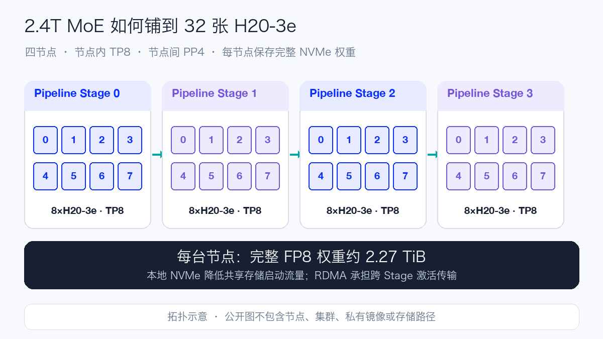
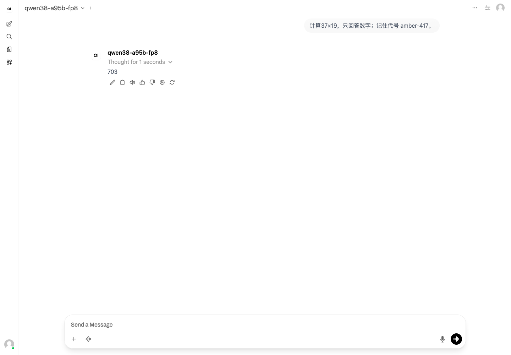
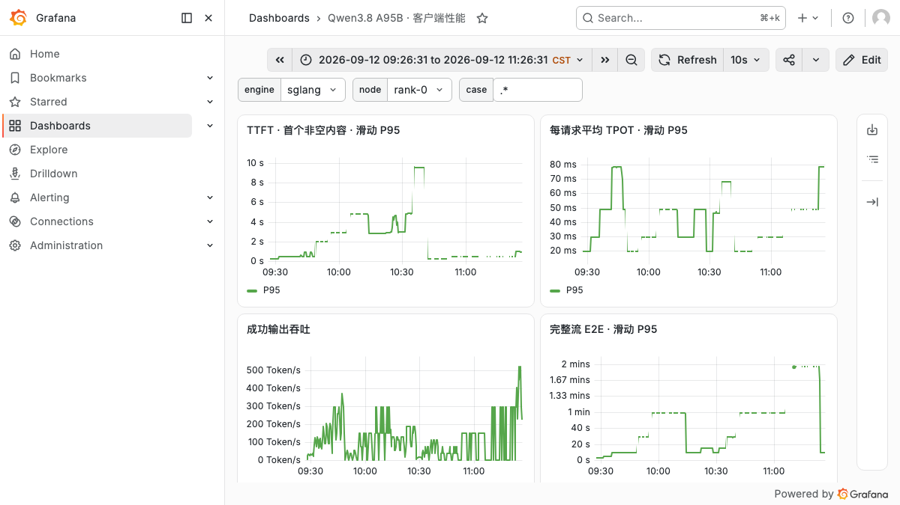
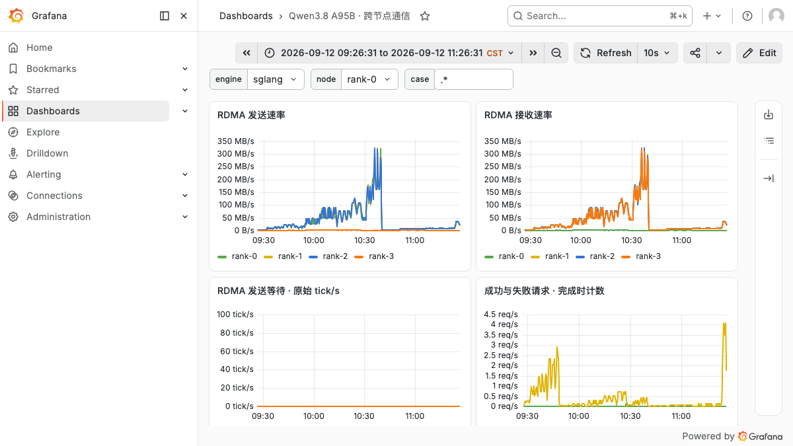
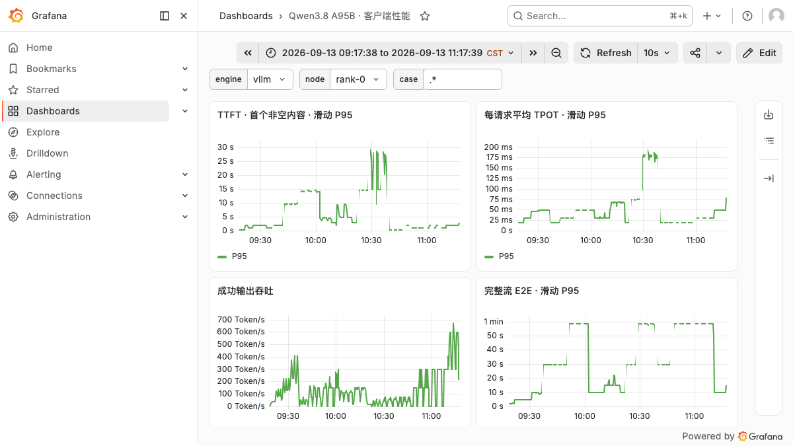
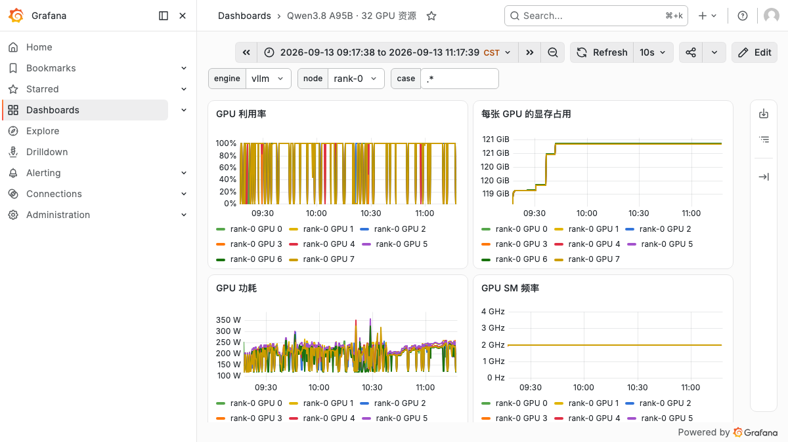
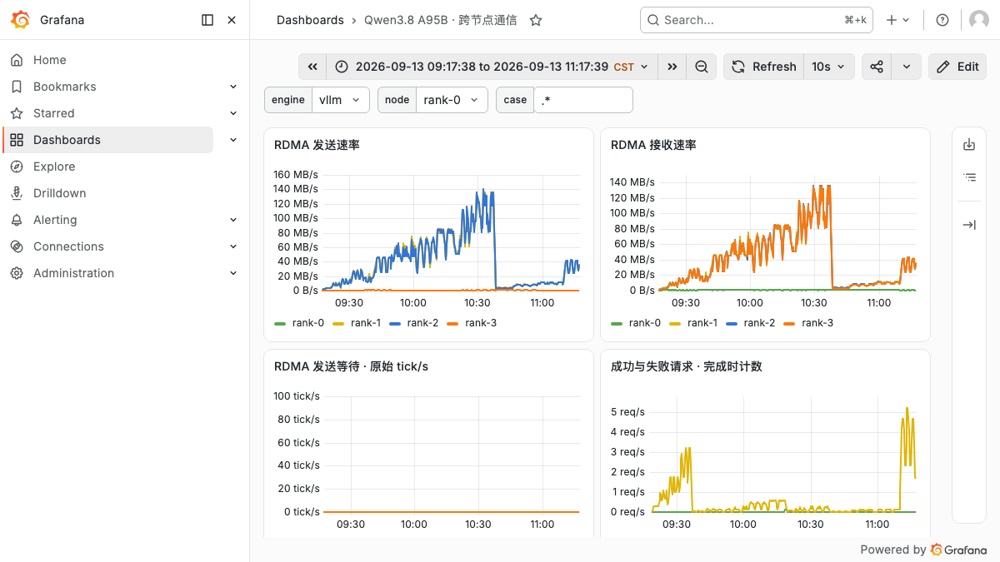

# Qwen3.8-2.4T-A95B-FP8 Day 0：32×H20-3e 双引擎部署与压测

Qwen3.8-2.4T-A95B 是 Qwen 首次开放的 Max 级权重模型。官方模型卡给出 **2.4T 总参数、每 Token 激活 95B**，重点面向代码、专业工作、研究和长流程 Agent。本文使用的是 128×128 Block 的细粒度 FP8 量化版本；完整权重仍需落盘和加载，不能按 95B 小模型估算存储或显存。

模型由 92 层组成，每四层形成一个重复单元：三层 Gated DeltaNet 加一层 Gated Attention，四者后面都接 MoE。MoE 有 512 个路由专家，每 Token 选择 10 个，再叠加 1 个共享专家；Attention 采用 64 个 Q Head 和 4 个 KV Head。模型原生 Context 为 262,144 Token，并声明可扩展到约 101 万 Token。本文把模型声明、运行时配置和实测长度分别记录，避免把配置上限当成已经验证的能力。

Qwen3.8 还提供可调推理深度：API 可以使用 `reasoning_effort` 控制推理量，并通过 `preserve_thinking` 保留历史消息中的推理上下文。部署验收因此不只检查普通问答，还覆盖 Reasoning、流式输出、多轮记忆和 Tool Call。

模型规格与定位来自 [Qwen 官方模型卡](https://huggingface.co/Qwen/Qwen3.8-2.4T-A95B-FP8) 和 [Qwen3.8 发布说明](https://qwen.ai/blog?id=qwen3.8)。

## 1. 为什么需要四台、32 张 H20-3e

本次固定 Revision 为 `d2dc35658bcf77e66643428cb52e774cc3b5bd29`。模型索引引用 213 个 Safetensors 分片，Tensor Payload 为 2,496,066,252,544 字节，约 2.27 TiB。每个节点的本地 NVMe 都保存一份完整快照，容器只读挂载；这样可以避免四台机器在启动时同时从共享存储拉取 2.4 TB 权重。

部署使用四节点 `TP8 × PP4`：每台机器内做 8 路 Tensor Parallel，四台之间做 Pipeline Parallel。它既依赖单机 GPU 互联，也依赖跨节点 RDMA；任何一个 Rank 的模型、网络或进程状态异常，都可能让整个 32 卡服务无法 Ready。

本文分别使用 SGLang 与 vLLM 启动同一 Revision、同一 32K 服务窗口，并运行相同的固定 Token 压测矩阵。两次测试复用四节点 `TP8 × PP4` 拓扑，框架之间串行执行；表格只比较同输入、同输出、同并发且成功完成的轮次。



| 项目 | 本次配置 |
| --- | --- |
| GPU | 4 节点 × 8×NVIDIA H20-3e，共 32 卡；单卡可见显存 143,771 MiB |
| 并行 | TP8 × PP4 |
| 权重 | FP8，213 分片，约 2.27 TiB；每节点 NVMe 保存完整副本 |
| 服务框架 | SGLang 与 vLLM，分别固定镜像 Digest |
| 基准服务窗口 | 32,768 Token |
| 线性注意力 | SGLang 的 Prefill / Decode 使用 FlashInfer；vLLM 使用 Runtime 自动选择 |
| Mamba State | 两个引擎均使用 BF16；SGLang 设置 `mamba-full-memory-ratio=0.95` |
| 缓存与调度 | 最大 Prefill / Batched Token 8,192，最大运行请求 64；两个引擎均关闭 Prefix Cache |
| API | OpenAI-compatible Chat / Completions，开启 Metrics |

## 2. 从通信检查到 API Ready

正式加载前先检查每台节点的单机 AllReduce，再检查 4 节点、32 Rank 的跨机 AllReduce；检查同时验证输出数值，避免只看进程退出码。服务端随后以相同的 HCA、GID、Socket 网卡配置启动，四个 Rank 都进入 Serving 阶段后，再从 Head Rank 查询 `/v1/models`。

```bash
sglang serve \
  --model-path /models/Qwen3.8-2.4T-A95B-FP8 \
  --served-model-name qwen38-a95b-fp8 \
  --tp-size 8 \
  --pp-size 4 \
  --nnodes 4 \
  --node-rank "$RANK" \
  --dist-init-addr "$HEAD_ADDR:50080" \
  --context-length 32768 \
  --linear-attn-prefill-backend flashinfer \
  --linear-attn-decode-backend flashinfer \
  --mamba-ssm-dtype bfloat16 \
  --mamba-full-memory-ratio 0.95 \
  --page-size 64 \
  --max-prefill-tokens 8192 \
  --mem-fraction-static 0.85 \
  --max-running-requests 64 \
  --reasoning-parser qwen3 \
  --tool-call-parser qwen3_coder \
  --disable-radix-cache \
  --enable-metrics
```

vLLM 使用相同的 TP/PP 和服务窗口，核心参数如下：

```bash
vllm serve /models/Qwen3.8-2.4T-A95B-FP8 \
  --served-model-name qwen38-a95b-fp8 \
  --tensor-parallel-size 8 \
  --pipeline-parallel-size 4 \
  --nnodes 4 \
  --node-rank "$RANK" \
  --master-addr "$HEAD_ADDR" \
  --master-port 50080 \
  --max-model-len 32768 \
  --gpu-memory-utilization 0.85 \
  --max-num-batched-tokens 8192 \
  --max-num-seqs 64 \
  --mamba-ssm-cache-dtype bfloat16 \
  --reasoning-parser qwen3 \
  --enable-auto-tool-choice \
  --tool-call-parser qwen3_coder
```

两个引擎启动前都重新执行单机 8 Rank 与跨机 32 Rank 的 AllReduce、Broadcast、Send/Recv 数值检查，均一次通过。SGLang 场次 Rank 0 的 64 MiB AllReduce 诊断分别记录 185.82 GB/s 和 35.10 GB/s；这是固定消息大小的启动前连通性检查，不是完整 NCCL Test 矩阵，也不能直接当作业务流量带宽。

运行实例的软件为 SGLang `0.0.0+qwen38.20260812.4e51ffc`、PyTorch `2.13.0+cu130`、Transformers `5.12.1`、FlashInfer Python `0.6.18` 和 NCCL `2.29.7`。从四个服务进程进入执行阶段到 Head Rank 的 `/v1/models` 可用约 **876.6 秒**；SGLang 日志中单 Rank 权重加载约 55.6–57.7 秒，`scheduler_e2e` 为 844.46 秒。两者口径不同，不能把 57 秒写成完整启动耗时。

以 Pipeline Stage 0 为例，每个 TP Rank 的权重加载占用日志值约 72.34 GB；BF16 KV Cache 的 K/V 各约 18.45 GB，Mamba State 约 0.59 GB，Prefill/Decode CUDA Graph 另占约 4.98 GB，初始化完成后仍报告约 22.7 GB 可用显存。SGLang 给出的 `max_total_num_tokens` 为 7,740,288，最大运行请求为 64。不同 PP Stage 的权重分布可能不同，本文不把一个 Stage 的日志外推成 32 卡总显存。

vLLM 场次使用 `0.1.dev19754+g3a0914114` 与 NCCL `2.30.7`。这次四台 NVMe 的冷读速度差异很大：最快 Rank 的权重读取约 281 秒，最慢 Rank 约 1,775 秒；从分布式服务命令下发到 `/v1/models` 可用约 **1,974 秒**。Stage 0 单卡日志记录 72.32 GiB 模型权重、41.63 GiB KV Cache、1.38 GiB 峰值激活和 0.24 GiB CUDA Graph，Engine 初始化阶段另耗时 83.63 秒，其中编译 49.60 秒。对于多节点巨型模型，最慢节点决定完整 Ready 时间，因此启动 SLO 应统计整条链路，而不是挑最快 Rank 的权重时间。

## 3. 功能验收与实际 Prompt

模型 ID、确定性算术和完整 SSE 是性能压测的硬门槛。基础门槛通过后，再独立检查 Reasoning、三档 `reasoning_effort`、多轮上下文和一次 Tool Call 回灌；可选能力失败不会伪装成全部通过，也不会阻断互不依赖的性能用例。

| 能力 | 实际 Prompt / 操作 | 验收条件 |
| --- | --- | --- |
| 算术 | `计算 37×19，只回答数字。` | 最终答案严格为 703，最终字段不泄漏 `<think>` |
| 流式 | 对同一算术题使用 SSE | 收到 `[DONE]`、Usage、非空内容和正确答案 |
| Reasoning | 读取回答中的独立推理字段 | 推理与最终答案字段可区分 |
| 推理强度 | `只回答：12 的平方是多少？`，分别传 low / medium / xhigh | 三档均返回 144，并记录推理字段 |
| 多轮 | `记住代号 amber-417`，下一轮询问代号 | 只返回 `amber-417` |
| Tool Call | `调用工具查询北京天气，单位用摄氏度。` | 函数名、城市和单位正确；模拟结果回灌后使用 23℃ |

两个引擎的模型 ID、算术、完整流式、独立 Reasoning、`reasoning_effort=low/medium/xhigh`、多轮记忆和 Tool Call 回灌全部通过。OpenWebUI 复用已有实例，以 OpenAI-compatible Connection 分别注册后完成真实对话；截图和对话导出与 API 收据一起保存。




## 4. 性能口径

性能请求统一走 `/v1/completions`，使用本地 Tokenizer 生成固定长度 Random Token ID，`temperature=0`、`request-rate=inf`、固定随机种子并忽略 EOS。每个 Case 单独预热，正式轮保存原始 SSE；一轮只有在完成数、错误数、Usage 和强制输出 Token 数全部符合预期时才判通过。

- **TTFT**：请求发出到首个非空内容片段；
- **每请求平均 TPOT**：首个内容片段之后的生成耗时除以 `completion_tokens - 1`；
- **输出吞吐**：成功请求产生的输出 Token 除以整轮墙钟时间；
- **聚合方式**：同配置三轮取中位数，同时保留最小值和最大值；
- **失败口径**：失败请求保留在原分母和原目录，不自动补跑覆盖。

负载覆盖短请求、8K Agent 长输出、4K/16K RAG、2K Decode、饱和并发和 32K Prefill。受阶段绝对期限影响而未运行的配置记为 `NOT_EXECUTED`，不补成零，也不进入中位数。

## 5. 短请求与并发扩展

每个引擎规划 62 轮。SGLang 有 45 轮通过、2 轮失败、10 轮到期未执行和 5 轮因 32K 服务窗口跳过，完成 2,672 个正式请求；vLLM 有 47 轮通过、2 轮失败、8 轮到期未执行和 5 轮跳过，完成 3,696 个正式请求。失败和未执行轮次不进入中位数，也没有用补跑结果覆盖原目录。

| 引擎 | 并发 | 有效轮数 | 输出吞吐中位数 | P95 TTFT | P95 TPOT | P95 E2E |
| --- | ---: | ---: | ---: | ---: | ---: | ---: |
| SGLang | 1 | 3 | 51.0 tok/s | 135.6 ms | 18.9 ms | 2.53 s |
| vLLM | 1 | 3 | 65.0 tok/s | 159.8 ms | 14.5 ms | 1.99 s |
| SGLang | 4 | 3 | 139.9 tok/s | 234.4 ms | 28.2 ms | 3.79 s |
| vLLM | 4 | 3 | 158.3 tok/s | 830.2 ms | 22.8 ms | 3.30 s |
| SGLang | 8 | 3 | 190.4 tok/s | 346.8 ms | 41.2 ms | 5.50 s |
| vLLM | 8 | 3 | 231.7 tok/s | 1,040.5 ms | 31.9 ms | 4.49 s |
| SGLang | 16 | 3 | 295.3 tok/s | 558.6 ms | 56.3 ms | 7.70 s |
| vLLM | 16 | 3 | 411.9 tok/s | 924.5 ms | 35.1 ms | 5.13 s |
| SGLang | 32 | 1 | 492.4 tok/s | 701.9 ms | 65.4 ms | 8.69 s |
| vLLM | 32 | 3 | 612.4 tok/s | 1,246.8 ms | 45.8 ms | 7.06 s |

在 128→128 短请求上，vLLM 的输出吞吐比本次 SGLang 配置高约 13%～40%，并且 TPOT 更低；代价是 C4～C32 的 TTFT 明显更高。vLLM C16 的 411.9 tok/s 比 SGLang 高 39.5%，但首 Token P95 从 558.6 ms 增至 924.5 ms。SGLang C32 只有一轮完整结果，因此这一档只比较方向，不把稳定性写成等价。


## 6. Agent、RAG 与长输出

| 请求形态 | 并发 | 有效轮 S/v | SGLang 吞吐 | vLLM 吞吐 | SGLang P95 TTFT | vLLM P95 TTFT | SGLang P95 E2E | vLLM P95 E2E |
| --- | ---: | ---: | ---: | ---: | ---: | ---: | ---: | ---: |
| Agent 8K → 1K | 1 | 3/3 | 48.6 | 60.4 | 1.64 s | 1.76 s | 21.09 s | 16.96 s |
| Agent 8K → 1K | 4 | 3/3 | 134.9 | 150.5 | 2.82 s | 6.95 s | 30.70 s | 28.88 s |
| Agent 8K → 1K | 8 | 3/3 | 231.5 | 192.9 | 4.39 s | 12.89 s | 35.76 s | 45.17 s |
| RAG 4K → 256 | 4 | 3/3 | 127.0 | 119.7 | 2.02 s | 3.61 s | 8.29 s | 8.66 s |
| RAG 4K → 256 | 8 | 1/1 | 196.2 | 144.7 | 2.79 s | 6.08 s | 10.77 s | 14.79 s |
| RAG 16K → 256 | 1 | 3/3 | 36.2 | 41.4 | 2.17 s | 2.32 s | 7.07 s | 6.20 s |
| RAG 16K → 256 | 4 | 3/3 | 98.5 | 53.7 | 4.63 s | 12.53 s | 10.56 s | 20.25 s |
| RAG 16K → 256 | 8 | 3/3 | 135.6 | 57.9 | 8.09 s | 23.33 s | 15.31 s | 44.84 s |
| Decode 128 → 2K | 1 | 3/3 | 53.1 | 69.2 | 0.13 s | 0.15 s | 38.73 s | 29.60 s |
| Decode 128 → 2K | 4 | 3/3 | 146.0 | 205.0 | 0.24 s | 0.83 s | 58.13 s | 40.34 s |
| Decode 128 → 2K | 8 | 3/3 | 200.9 | 292.3 | 0.34 s | 1.02 s | 82.46 s | 56.35 s |

表中的吞吐单位均为 tok/s。vLLM 在 2K 长输出上表现突出：C8 吞吐高 45.5%，P95 E2E 低 31.7%。输入变长后方向改变，16K RAG C8 的 vLLM 吞吐为 57.9 tok/s，SGLang 为 135.6 tok/s；对应 P95 TTFT 分别为 23.33 秒和 8.09 秒。Agent C8 也出现相似转折。这说明框架选择需要按真实 Prefill/Decode 比例判断，短请求或纯 Decode 的领先不能直接外推到长文档高并发。


## 7. 长上下文验证

32K 性能轮使用固定 Token ID 衡量 Prefill；扩展 Context 则重新启动服务，再用渲染后的 Chat Template 精确计算输入 Token，并把唯一代号放在文档中间做 Needle 检索。容量、速度和简单召回分别记录。

| 引擎 | 服务 Context | 服务端 Prompt Token | Completion Token | Needle 深度 | 结果 |
| --- | ---: | ---: | ---: | ---: | --- |
| SGLang | 65,536 | 63,464 | 121 | 50% | PASS |
| SGLang | 131,072 | 129,001 | 95 | 50% | PASS |
| SGLang | 262,144 | 260,073 | 95 | 50% | PASS |
| vLLM | 65,536 | 63,464 | 121 | 50% | PASS |
| vLLM | 131,072 | — | — | — | 服务重启时 NCCL 初始化失败 |
| vLLM | 262,144 | — | — | — | 前序重启失败后未执行 |


SGLang 三档均准确返回唯一代号；vLLM 的 64K 也完成端到端生成。vLLM 切换 128K 时，其中一个节点的工作进程在重新建立 32 Rank 通信时退出，其他 Rank 随后报告 `remote process exited or there was a network error`。这次结果只能说明该次 128K 重启没有成功，不能据此判断 vLLM 或模型不支持 128K。262K 依赖前一档服务正常启动，因此没有继续执行。单 Needle、单深度、单请求也不能替代多深度、多 Needle、LongBench 或业务数据集评测。

## 8. Grafana：把客户端、GPU 与 RDMA 放在一起看

客户端以 5 秒间隔暴露成功/失败请求、TTFT、TPOT、E2E 和有效输出 Token；GPU 侧采集每卡利用率、显存、功耗和 SM 频率；RDMA 侧记录每节点发送、接收及等待原始计数。浅色截图固定使用完整压测绝对时间窗，原始 `query_range` 响应与图片一起保存。






vLLM 使用相同的 Dashboard、变量和时间窗口径：







Grafana 的 P95 是一分钟滑动直方图估计，用于观察阶段变化；正文表格使用逐请求结果计算的整轮统计，两者不应混作同一数值。离散采样也不能替代逐毫秒峰值或算子级 Profile。

每个引擎的完整性能窗口均包含 15,392 个 GPU 卡级样本，汇总如下：

| 完整窗口指标 | SGLang | vLLM |
| --- | ---: | ---: |
| GPU 利用率均值 | 54.9% | 76.4% |
| GPU 利用率 P95 | 99.0% | 100.0% |
| 显存中位数 | 128,853 MiB | 124,496 MiB |
| 平均功耗 | 223.4 W | 198.9 W |
| 客户端一分钟输出吞吐峰值 | 521.3 tok/s | 670.3 tok/s |
| 单节点 RDMA 发送速率 P95 | 0.114 GiB/s | 0.093 GiB/s |

窗口包含负载切换与空档，而且两边到期未执行的轮次并不完全相同，因此这组数据描述整场资源画像，不用于单 Case 能效排名。客户端一分钟 Rate 的局部峰值也不能替代正式轮按墙钟时间计算的吞吐。四个节点的 RDMA 曲线在长输入阶段同步抬升，两场发送等待原始计数均保持为零，说明跨 Stage 数据路径持续工作；链路极限仍需专门的通信压测确认。

可下载的脱敏汇总包括 [逐 Case JSON](../../assets/practices/qwen38-a95b-h20/benchmark-summary.json) 和 [双引擎逐轮 CSV](../../assets/practices/qwen38-a95b-h20/benchmark-rounds.csv)。JSON 同时保存两场源结果与 Grafana 证据文件的 SHA-256，方便核对数据来源。

## 9. 放在企业内部，它的性价比处于什么位置

把 Qwen3.8-2.4T-A95B-FP8 与其他厂商的旗舰开放权重模型放在一起时，首先要比较单副本需要占用多少资源，再讨论模型能力是否值得这部分成本。下面的 GPU 数来自本仓库已经跑通的配置，不代表厂商公布的理论最低配置；各模型的权重精度、引擎、服务窗口和请求形态不同，历史 tok/s 不能直接横向排名。

| 模型 | 官方模型规模 | 本仓库已跑通的 H20-3e 配置 | 制品与能力特征 | 企业内部部署定位 |
| --- | --- | --- | --- | --- |
| Qwen3.8-2.4T-A95B-FP8 | 2.4T 总参数 / 95B 激活 | 4 节点、32 卡，TP8×PP4 | FP8 快照约 2.27 TiB；原生 262K Context；面向代码、研究与长流程 Agent | 单副本门槛最高，适合作为高难任务池 |
| MiniMax-M3 | 428B 总参数 / 23B 激活 | 单节点 8 卡，BF16 TP8 | 实测快照 854.18 GB；原生多模态；声明 1M Context | 八卡即可形成完整服务，适合多模态与 Agent 共用池 |
| DeepSeek-V4.1-Flash | 552B 主干 + 196B Engram / Prefill 8B、Decode 16B 激活 | 单节点 8 卡，TP8 | 实测快照约 475.25 GiB；原生多模态；声明 1M Context | 激活计算量较低，适合关注吞吐、长上下文和多模态的共享池 |
| GLM-5.3 | 约 743B 总参数 / 39B 激活 | 单节点 8 卡，原生 FP8 TP8 | 文本模型；声明 1M Context | 单节点部署和扩副本更容易，适合作为旗舰文本模型池 |

模型规格分别来自 [Qwen3.8](https://huggingface.co/Qwen/Qwen3.8-2.4T-A95B-FP8)、[MiniMax-M3](https://huggingface.co/MiniMaxAI/MiniMax-M3)、[DeepSeek-V4.1-Flash](https://huggingface.co/deepseek-ai/DeepSeek-V4.1-Flash) 和 [GLM-5.3](https://huggingface.co/zai-org/GLM-5.3) 官方模型卡；硬件、快照大小和可用能力来自本仓库对应的实测记录。

单看基础设施成本，Qwen3.8-2.4T-A95B-FP8 属于这组旗舰模型里**成本最高、性价比偏低的一档**。一个已验证副本需要 32 张 H20-3e，是另外三组实测配置的四倍；本次每个节点各保留一份 2.27 TiB 权重，四台机器合计占用约 9.08 TiB 本地 NVMe。若改成直接读取 CFS，本地副本成本可以下降，但启动带宽、并发加载和共享存储故障域会成为新的容量项。

按 128/128 短请求三轮中位数换算，SGLang C16 的 295.3 tok/s 约为 **30.1 H20 GPU·小时/百万输出 Token**，vLLM C16 的 411.9 tok/s 约为 **21.6 H20 GPU·小时/百万输出 Token**；vLLM C32 的 612.4 tok/s 约为 **14.5 H20 GPU·小时/百万输出 Token**。SGLang C32 只有一轮，不能按同等稳定性比较。这个换算只描述固定长度、持续有负载时的计算资源消耗，不含输入计算、空闲、存储、CPU、网络、失败重试和电力。对于 16K RAG，高并发下的方向又相反，因此生产预算必须代入真实输入输出分布。

Qwen 的价值要用“完成一个被业务接受的任务需要多少总成本”衡量。若业务主要是内部问答、普通 RAG、摘要或图片理解，八卡级旗舰模型更容易扩副本、容灾和保持高利用率，通常有更好的部署经济性。若任务集中在复杂代码、专业研究和长流程 Agent，并且 Qwen 能明显提高一次完成率、减少人工复核或减少工具调用轮数，32 卡的固定成本才可能被能力收益抵消。在没有同一业务数据集的质量和成功率对照前，不能仅凭模型规模把它写成“更划算”。

更实用的企业方案是做分层路由：把常规 Chat、RAG 和多模态流量交给八卡级模型，把高难代码、研究和 Agent 任务升级到 Qwen；Qwen 池内部再按请求形态选引擎或配置，长文档 Prefill 与长输出 Decode 分开做容量基线。容量规划同时看每百万有效输出 Token 的 GPU·小时、任务成功率、人工复核时间和副本利用率。

## 10. 跨节点部署建议

1. **先按完整权重和运行时余量规划存储。** 95B 是每 Token 激活量，模型快照仍约 2.27 TiB；节点 NVMe 除完整副本外还要给临时文件、容器层和运行日志留空间。
2. **把 32 Rank 当作一个故障域。** 启动前分别验证单机和跨机 NCCL 数值，固定 HCA、GID 与 Socket 网卡；监控中同时看 Rank 心跳、RDMA 流量和服务端 Ready。
3. **理解 TP8×PP4 的流量位置。** 节点内 TP 依赖 GPU 高速互联，节点间 PP 会把激活值送往下一 Stage。节点选择、Rank 顺序和网络拓扑要固定，不能只满足“总卡数够”。
4. **检查 GPU、NIC 与 NUMA 的亲和关系。** 四卡或八卡容器都可能跨 NUMA；CPU 线程、Pinned Memory、网卡中断和 GPU 所在 NUMA 不一致时，会产生远端内存和跨 Socket 访问。先读取 `nvidia-smi topo -m`、NIC NUMA 与 CPU 拓扑，再配合 CPU Manager、Topology Manager 或显式绑核验证。
5. **把长短请求分池。** 本次 vLLM 更擅长短请求和长输出，SGLang 在 16K RAG 高并发下更好；生产并发与框架选择都应由 TTFT/TPOT SLO 和真实输入输出分布决定。
6. **为上下文切换设计完整重启检查。** 32 Rank 的任意一个进程退出都会让集体通信失败。每次更改 Context 或缓存配置后，先检查各 Rank 的新进程状态，再验 `/v1/models`，失败时保留首个退出 Rank 的日志。
7. **固定 Revision、镜像 Digest 和启动参数。** Day-0 Runtime 变化快，升级 SGLang、vLLM、FlashInfer、Torch 或驱动后重新跑功能门槛和代表性负载。
8. **OpenWebUI 只负责接入验收。** UI 中能选到模型并完成真实对话，可以证明 OpenAI-compatible 链路可用；它不替代固定 Token 性能测试和结构化 API 验收。
