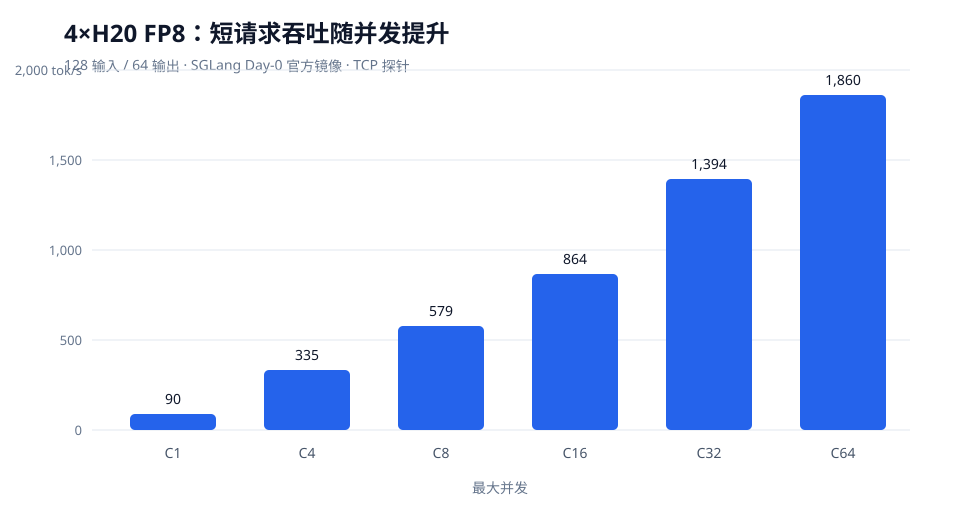
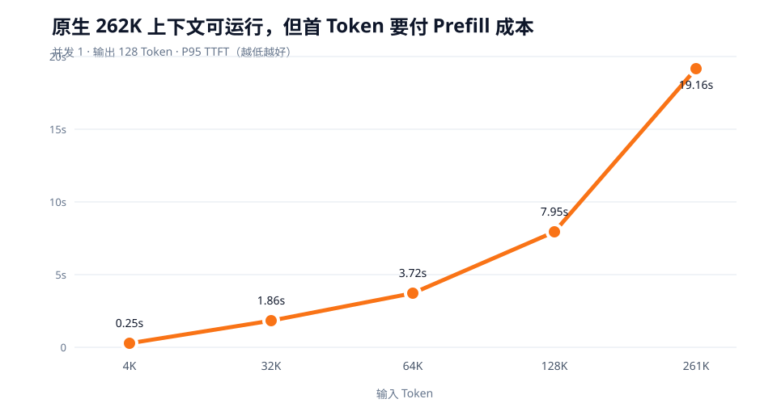
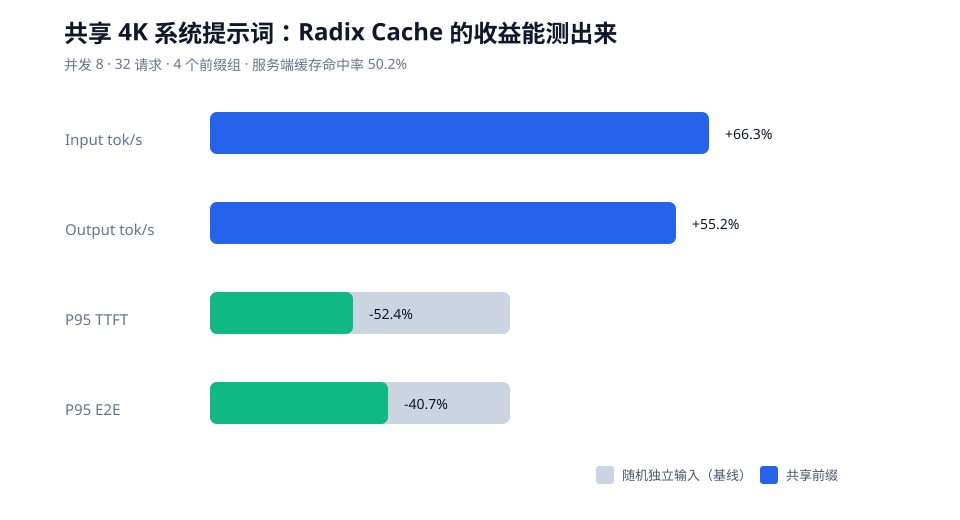
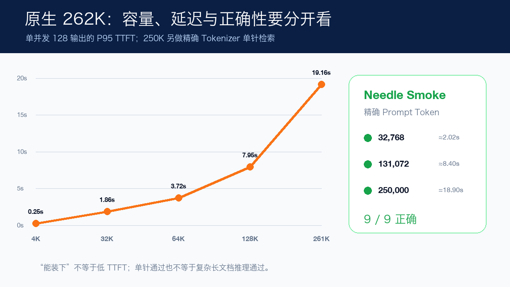
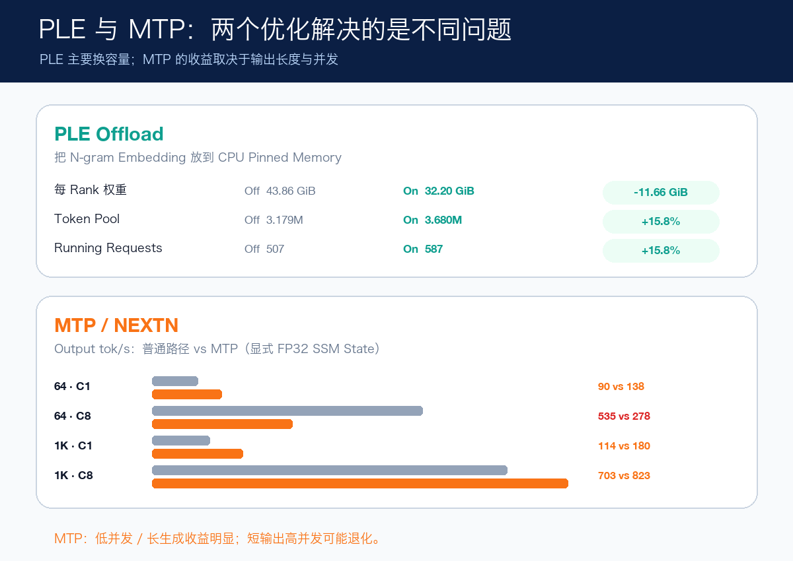
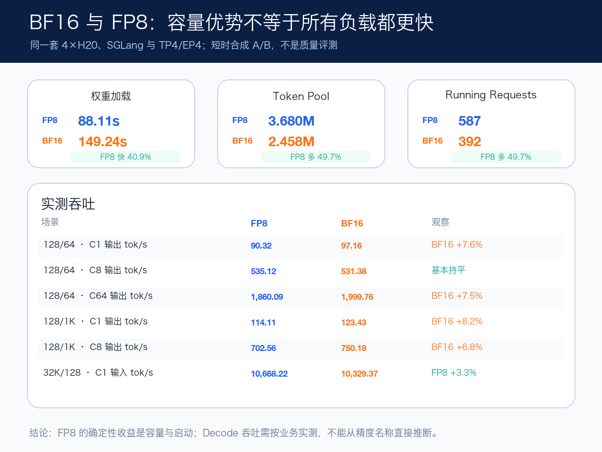

# Qwen3.8-Flash-Next Day 0 实战：4×H20 跑通原生 262K

2026 年 8 月 26 日，Qwen 发布 Qwen3.8-Flash-Next，并把它定位为 Qwen4 架构的实验性预览；SGLang 同日给出专用镜像和部署 Cookbook。一天之内，我在 Kubernetes 上完成了三条实测：官方 FP8 与 BF16 权重都在 **4×141 GB H20** 上以 TP4/EP4 跑通，原生 262,144 Token Context、Thinking、Tool Call 和图片输入均可用；官方镜像在 **8×48 GB L20** 上不能直接运行，只有替换 QSA Decode Kernel 的兼容补丁能够生成，而且性能不具备生产参考价值。

H20 FP8 短请求输出吞吐从并发 1 的 90.32 tok/s 扩展到并发 64 的 1,860.09 tok/s；接近 262K 的单请求可完成，P95 TTFT 为 19.16 秒；4K 共享系统提示词场景得到 50.2% 的缓存命中率。BF16 对照显示，FP8 的 Token Pool 多 49.7%、权重加载快 40.9%，但部分 Decode 工作负载反而是 BF16 快约 7%–8%。这里的结论来自本地实测，不使用官方 H200/B200 数字代替。

框架支持也必须带时间戳看：**截至 2026 年 8 月 27 日，SGLang 已经提供 Qwen3.8-Flash-Next 的 Day-0 专用镜像、模型实现和官方启动配方；vLLM 稳定版与主分支尚不能直接部署，模型注册、PLE 和 Qwen4 融合 Kernel 仍在 Open PR 中。** 这不是说 vLLM 永远不支持，而是本文发布当天两者的可用状态不同。

## 1. 模型名字和规模先说清楚

开放权重名称是 `Qwen/Qwen3.8-Flash-Next`，不是云端托管的 Qwen3.8-Flash，也不是 Qwen4 正式版。它的 Hugging Face 配置注册为：

```json
{
  "architectures": ["Qwen4ExpForConditionalGeneration"],
  "model_type": "qwen4_exp"
}
```

参数数字看起来容易矛盾，实际上统计范围不同：

| 组成 | 参数量 | 运行时含义 |
| --- | ---: | --- |
| MoE 语言模型主体 | 125B | 每 Token 激活约 6B |
| N-gram Embedding | 51B | 查表为主，可用 PLE Offload 放到主机内存 |
| 主 Serving Body | 约 176B | 主体与 N-gram Embedding 之和 |
| MTP | 约 4B | Checkpoint 内置的一层多 Token 预测模块 |

BF16 权重 Index 为 359,999,963,128 Bytes，约 335.28 GiB；本文使用官方 FP8 Checkpoint，131 个 Safetensors 分片合计 185,502,232,570 Bytes，约 172.76 GiB。它仍然是一个很大的模型，不能因为“每 Token 激活 6B”就按 6B 模型估算显存。

架构上最值得关注的是三点：

- 48 层语言模型按三层 Gated DeltaNet 加一层 Qwen Sparse Attention（QSA）的节奏重复；
- 四分支 Gated Residual 用数据相关的 Read/Write Gate 控制残差信息流；
- 51B Bigram/Trigram Embedding 增加局部 Token 组合信息，并允许通过 PLE Offload 降低 GPU 权重压力。

QSA 的目标是改变长上下文 Attention 的增长曲线，所以只测 128 Token 不能证明这种架构是否有意义。本文把 32K、64K、128K 和接近 262K 都纳入了验证。

参考：[Qwen 模型卡](https://huggingface.co/Qwen/Qwen3.8-Flash-Next)、[官方发布说明](https://qwen.ai/blog?id=qwen3.8-flash-next)、[SGLang Cookbook](https://docs.sglang.io/cookbook/autoregressive/Qwen/Qwen3.8-Flash-Next)。

## 2. 实验环境与边界

| 项目 | 实测配置 |
| --- | --- |
| Checkpoint | `Qwen/Qwen3.8-Flash-Next-FP8`，官方 FP8，131 分片 |
| GPU | 4×NVIDIA H20-3e，单卡 143,771 MiB 可见显存，SM90 |
| 并行 | TP4 / EP4，单机 |
| Context | 262,144 Token，未用 YaRN 扩展 |
| Runtime | SGLang `0.0.0.dev1+gd91c3682b` |
| PyTorch / CUDA / Transformers | `2.13.0+cu130` / `13.0` / `5.12.1` |
| GDN Backend | Prefill 与 Decode 均为 FlashInfer |
| Mamba State | 普通路径 BF16；MTP 兼容复测 FP32 |
| PLE | N-gram Embedding Offload 开启 |
| API | OpenAI-compatible `/v1` |

SGLang 发布时给出的 NVIDIA 验证矩阵主要是 H200、B200、B300 和 GB300，H20 不在签字矩阵内。因此本文只能表述为“在 H20 上实测成功”，不能外推为官方支持保证。L20 的兼容补丁更不能与官方 Kernel 性能混在一起比较。

## 3. 启动方式

公开示例保留核心参数，不包含任何内部集群、镜像仓库、存储和访问入口细节：

```bash
sglang serve \
  --model-path /models/Qwen3.8-Flash-Next-FP8 \
  --served-model-name qwen38-flash-next \
  --tp-size 4 \
  --ep-size 4 \
  --mem-fraction-static 0.85 \
  --chunked-prefill-size 8192 \
  --ple-offload-embedding \
  --linear-attn-prefill-backend flashinfer \
  --linear-attn-decode-backend flashinfer \
  --mamba-ssm-dtype bfloat16 \
  --reasoning-parser auto \
  --tool-call-parser auto \
  --enable-metrics
```

没有显式传 `--context-length`，运行时读取模型原生的 262,144。第一次尝试建议用 `restartPolicy: Never` 的单 Pod 做 Canary：如果 GPU Device Manager 在准入阶段报错，Deployment/ReplicaSet 会不停创建替代 Pod，几分钟内就可能积累几百个失败对象。单 Pod 健康以后再切换为 Deployment。

### 模型预检不能只数分片

一次真实失败来自版本目录：权重同步工具把完整 Checkpoint 放在父目录下的版本子目录，递归统计仍能看到 131 个分片和约 173 GiB，但 `--model-path` 指向父目录时读不到同层 `config.json`，最终报 `Should have a model_type key in config.json`。

零 GPU 预检必须针对传给 `--model-path` 的**精确目录**同时验证：

1. `config.json` 中的 `model_type` 与 `architectures`；
2. `model.safetensors.index.json` 与 131 个分片的引用完整性；
3. Tokenizer、Chat Template 和 Generation Config；
4. Day-0 镜像里确实注册了 `Qwen4ExpForConditionalGeneration`；
5. CLI 中存在 PLE、QSA/GDN Backend、TP/EP 和 Parser 参数。

## 4. 启动与资源结果

| 指标 | 4×H20 FP8 实测 |
| --- | ---: |
| 首节点拉取 13.95 GB 镜像 | 130.42 s |
| 权重加载 | 88.11 s |
| Decode CUDA Graph 捕获 | 105.15 s |
| Engine Ready | 234.88 s |
| `max_total_num_tokens` | 3,680,256 |
| 稳定后每卡已用显存 | 127,280–128,070 MiB |
| 稳定后每卡余量 | 约 15.25 GiB |

这里还有一个容易误判的冷启动现象：短请求 C4 第一轮的 P95 TTFT 是 2.69 秒，原参数立即复测降到 385 ms。日志显示服务 Ready 后仍有一次性 Kernel 编译落入首轮请求。因此“Ready 后第一轮”和“稳定态”应分别记录，不能挑一个更好看的数字覆盖冷态成本。

## 5. API 不只是 `/health` 返回 200

| 用例 | 结果 | 观察 |
| --- | --- | --- |
| `/v1/models` | 通过 | Served Model 名称固定 |
| Chat Completion | 通过 | OpenAI-compatible 响应正常 |
| Thinking | 通过 | `reasoning_content` 与最终 `content` 可区分 |
| Tool Call | 通过 | 返回结构化函数名和参数 |
| 图片 Data URL | 通过 | 能描述测试图片中的客观内容 |
| OpenWebUI | 通过 | 按 OpenAI-compatible Base URL 注册后可直接选择 |

图片测试还暴露了一个语义坑：开启 Thinking 且只给 128 个输出 Token 时，准确描述全部写进 `reasoning_content`，最终 `content` 为空。这不是 Vision 失败，而是推理过程吃完了输出预算。面向 UI 的图片请求应关闭 Thinking，或把推理预算和最终答案预算分开。

## 6. 压测口径

短基准和长上下文基准统一使用：

- SGLang 原生 Token-ID Endpoint，避免 Chat Template 改变输入长度；
- `random-ids` 与本地 Tokenizer，输入/输出长度固定；
- `request-rate=inf`，由 `max-concurrency` 控制并发；
- `temperature=0`，每轮 Flush Cache；
- 成功请求数必须等于发起数；
- Kubernetes 探针使用 TCP Socket，不产生模型请求。

最后一点来自实测排障。这个 Day-0 镜像的 `GET /health` 不是纯状态读取，而会触发一次 64-token 生成。若每 10 秒用它做 Readiness/Liveness Probe，压测期间就会混入看不见的请求，服务端最大并发、TTFT 和吞吐全部失真。HTTP 200 并不代表接口无副作用。

## 7. 短请求吞吐

工作负载为每请求 128 输入、64 输出 Token：

| 并发 | 请求数 | Output tok/s | Median TTFT | P95 TTFT | P95 TPOT | P95 E2E |
| ---: | ---: | ---: | ---: | ---: | ---: | ---: |
| 1 | 16 | 90.32 | 196.07 ms | 200.30 ms | 8.14 ms | 710.69 ms |
| 4 | 32 | 334.95 | 181.84 ms | 385.01 ms | 8.86 ms | 942.41 ms |
| 8 | 64 | 578.77 | 188.40 ms | 371.43 ms | 10.69 ms | 1,020.89 ms |
| 16 | 64 | 864.16 | 393.46 ms | 410.07 ms | 12.71 ms | 1,183.96 ms |
| 32 | 128 | 1,393.73 | 440.42 ms | 452.25 ms | 16.61 ms | 1,484.50 ms |
| 64 | 256 | 1,860.09 | 646.43 ms | 1,323.93 ms | 28.77 ms | 2,896.71 ms |



吞吐从 C1 到 C64 持续增长，但 C64 的尾延迟已经明显恶化。容量规划不应以 1,860 tok/s 当作所有业务的默认并发；交互式 Chat 更可能在 C16–C32 之间按 TTFT SLO 找平衡。

## 8. 长上下文与长输出

### 8.1 单并发 Prefill 曲线

| 输入 / 输出 | 请求数 | Input tok/s | P95 TTFT | P95 TPOT | P95 E2E |
| ---: | ---: | ---: | ---: | ---: | ---: |
| 4K / 128 | 4 | 2,722.55 | 253.72 ms | 9.83 ms | 1.50 s |
| 32K / 128 | 4 | 10,668.22 | 1.86 s | 9.88 ms | 3.07 s |
| 64K / 128 | 4 | 13,159.32 | 3.72 s | 9.92 ms | 4.98 s |
| 128K / 128 | 2 | 14,227.63 | 7.95 s | 9.95 ms | 9.21 s |
| 261,120 / 128 | 1 | 12,748.52 | 19.16 s | 10.27 ms | 20.47 s |



原生 262K 确实能跑通，但“能放进去”不等于“适合在线交互”。接近 262K 时首 Token 等待约 19 秒，Decode 仍维持约 10 ms/Token，主要代价落在 Prefill。长上下文容量、TTFT SLO 和调用频率必须分开评估。

高并发长上下文还会出现批处理空隙：64K、C4 的 P95 TTFT 为 14.35 秒，P95 TPOT 被拉到 90.40 ms；这不等于单请求 Decode Kernel 突然慢九倍，而是 TPOT 统计包含了请求在连续批处理中的等待。比较 Kernel 时看 C1，评估在线体验时再看多并发 E2E。

### 8.2 1K 长输出

| 并发 | 输入 / 输出 | 请求数 | Output tok/s | P95 TTFT | P95 TPOT | P95 E2E |
| ---: | ---: | ---: | ---: | ---: | ---: | ---: |
| 1 | 128 / 1,024 | 4 | 114.11 | 205.14 ms | 8.57 ms | 8.97 s |
| 8 | 128 / 1,024 | 16 | 702.56 | 385.49 ms | 11.19 ms | 11.82 s |

长输出比 64 Token 更能稳定观察 Decode 吞吐，也避免用极短样本放大启动抖动。

## 9. 共享前缀：缓存收益能不能量出来

我构造了 4 个系统提示词组，每组 8 个请求；每个请求包含约 4K 共享系统提示词、128 Token 独立问题和 64 Token 输出，并与 4,224 Token 随机独立输入比较：

| 场景 | 总输入 Token | 时长 | Input tok/s | Output tok/s | P95 TTFT | P95 E2E |
| --- | ---: | ---: | ---: | ---: | ---: | ---: |
| 随机独立输入 | 135,168 | 11.10 s | 12,174.35 | 184.46 | 2.28 s | 3.06 s |
| 4 组共享前缀 | 144,808 | 7.15 s | 20,243.86 | 286.31 | 1.09 s | 1.82 s |



服务端报告 72,640 个 Device Cached Token，缓存命中率 50.2%。共享前缀组的输入 Token 反而略多，因此它不是逐 Token 完全相同的微基准；但总时长下降 35.6%、P95 TTFT 下降 52.4%，方向非常清楚。统一 System Prompt、长文档问答和多轮 Agent 会比完全随机请求更能吃到 Radix Cache 收益。

## 10. 固定到达率：短跑不能伪装成容量曲线

为了接近在线流量，我用 Poisson Arrival 做了第一轮 128 输入、64 输出测试。每档只有 64 个请求，客户端并发上限为 64：

| Offered Rate | Achieved Rate | Output tok/s | 平均并发 | P95 TTFT | P99 TTFT |
| ---: | ---: | ---: | ---: | ---: | ---: |
| 2 req/s | 2.08 req/s | 133.41 | 2.66 | 494 ms | 591 ms |
| 4 req/s | 4.03 req/s | 258.13 | 8.89 | 782 ms | 957 ms |
| 8 req/s | 7.22 req/s | 462.10 | 35.79 | 970 ms | 1.17 s |
| 16 req/s | 11.95 req/s | 764.53 | 42.61 | 2.90 s | 3.34 s |
| 24 req/s | 15.24 req/s | 975.36 | 45.63 | 1.88 s | 2.31 s |
| 32 req/s | 17.87 req/s | 1,143.50 | 47.71 | 1.53 s | 1.95 s |

16、24、32 req/s 的尾延迟没有单调上升，不能解读为“流量越高反而越快”。原因是每档只有 64 个请求，测试包含明显的尾部 Drain 阶段；高档 Offered Rate 也没有真正维持住。它的价值是证明在线到达过程与 `request-rate=inf` 的一次性 Burst 不是同一个问题，并找到 8 req/s 之后客户端已经无法按设定速率稳定送达。正式 SLO 曲线仍应把每档延长到 10–30 分钟，并同步记录队列、错误率和 GPU 指标。

## 11. 长短混部：短请求 P95 TTFT 放大 9.9 倍

这一组更接近生产事故：后台运行 2 路 65,536 输入、128 输出的长请求，前台继续以 4 req/s 发送 64 个 128/64 短请求。

| 短请求场景 | P95 TTFT | P99 TTFT | P95 TPOT | P95 E2E |
| --- | ---: | ---: | ---: | ---: |
| 独立运行 | 782 ms | 957 ms | 52.79 ms | 3.77 s |
| 叠加 64K Prefill | 7.75 s | 7.87 s | 150.19 ms | 10.73 s |
| 变化 | **9.9×** | 8.2× | 2.8× | **2.85×** |


这说明单实例里长 Prefill 会对交互请求形成明显的 Head-of-Line Interference。即使模型能容纳 262K，也不意味着长文档请求应该和短 Chat 进入同一个无差别队列。生产上至少要按 Prompt 长度分池，进一步可以使用优先级调度、Prefill/Decode 分离或独立长上下文实例。

## 12. 250K 不只“跑完”，还要能找回信息

随机 Token 压测只能验证容量和速度。我增加了一个精确 Tokenizer 计数的 Needle-in-a-Haystack 冒烟：在 32,768、131,072 和 250,000 Token 的 Chat Prompt 中，分别把随机 Key 放在 10%、50% 和 90% 位置；每次请求前清空缓存。

| 输入长度 | Needle 位置 | 正确 / 总数 | 单次耗时范围 |
| ---: | --- | ---: | ---: |
| 32,768 | 10% / 50% / 90% | 3 / 3 | 2.02–2.03 s |
| 131,072 | 10% / 50% / 90% | 3 / 3 | 8.39–8.41 s |
| 250,000 | 10% / 50% / 90% | 3 / 3 | 18.90–18.91 s |



9/9 通过说明这条 FP8 路径在接近上下文上限时仍能完成简单单针检索。它不等于复杂长文档推理已经过关：真实评估还需要多针、干扰项、跨段归纳和 LongBench。公开脚本 [`needle.py`](https://github.com/runzhliu/aik8s/blob/main/examples/qwen38-flash-next-sglang/needle.py) 会同时校验本地构造长度与服务端 Prompt Token 数，避免把“字符数”误写成“Token 数”。

## 13. PLE 与 MTP：一个换容量，一个有条件换速度

### 13.1 PLE Offload 主要提升容量

只切换 PLE，其余保持 FP8、TP4/EP4 和 4×H20：

| 指标 | PLE On | PLE Off | 变化 |
| --- | ---: | ---: | ---: |
| 每 Rank 权重 | 32.20 GiB | 43.86 GiB | 节省 11.66 GiB |
| `max_total_num_tokens` | 3,680,256 | 3,178,560 | +15.8% |
| `max_running_requests` | 587 | 507 | +15.8% |
| C8 128/64 Output tok/s | 535.12 | 559.99 | 短跑波动范围 |
| C1 32K Input tok/s | 10,694.21 | 10,714.06 | 基本相同 |

PLE 把约 51B N-gram Embedding 放到 CPU Pinned Memory 后，每 Rank 少占 11.66 GiB 权重空间，内存求解器把空间重新分给 Mamba/KV Cache。稳定态短请求与 32K Prefill 差异接近运行波动，因此这套配置里的主收益是约 15.8% 的容量，而不是可证明的吞吐加速。

### 13.2 MTP 对长生成有效，但不是万能开关

SGLang 官方低延迟配方使用 NEXTN、3 个推测步骤和 4 个 Draft Token。第一次在 H20 原样启动时，GDN Target Verify 报：

```text
AssertionError: initial_state must be float32, got torch.bfloat16
```

显式设置 `--mamba-ssm-dtype float32` 后能够启动并完成生成。Draft Head 每 Rank 额外加载约 1.18 GiB，实际平均接受长度为 1.92–2.52。

| 输入 / 输出 | 并发 | 普通路径 Output tok/s | MTP Output tok/s | 变化 |
| ---: | ---: | ---: | ---: | ---: |
| 128 / 64 | 1 | 90.32 | 137.60 | +52.3% |
| 128 / 64 | 8 | 535.12 | 278.27 | -48.0% |
| 128 / 1,024 | 1 | 114.11 | 180.32 | +58.0% |
| 128 / 1,024 | 8 | 702.56 | 823.35 | +17.2% |



单并发和 1K 长生成得到明显收益，但 64 Token、C8 反而退化。这与官方把该组参数称为 Low Latency Recipe 是一致的：推测、验证和调度本身有固定成本，输出太短或并发形态不合适时无法摊薄。MTP 还把最大 Running Request 固定为 48，SSM State 精度也从 BF16 改为 FP32，因此生产采用前必须按真实输出长度和并发重做 A/B，不能把单并发的 +58% 外推到全部流量。

参考：[SGLang Qwen3.8-Flash-Next 官方配置源码](https://github.com/sgl-project/sglang/blob/1c8f2b38cbb318cadb6e0b5cd7cc8ce6a3fc8209/docs/src/snippets/configs/Qwen/qwen3.8-flash-next.jsx)、[SGLang Mamba Server Arguments](https://github.com/sgl-project/sglang/blob/main/docs/advanced_features/server_arguments.md)。

## 14. BF16 与 FP8：容量优势不等于吞吐全面领先

在同一套 4×H20、SGLang、TP4/EP4、PLE On、MTP Off 配置下，我把官方 BF16 Checkpoint 作为唯一主要变量重新启动并复测。两条路径使用相同的 0.85 Static Memory Fraction，因此稳定态显存占用接近，只说明引擎会把余量继续分给缓存，不能据此得出两种精度容量相同。

### 14.1 启动与容量

| 指标 | FP8 | BF16 | 观察 |
| --- | ---: | ---: | --- |
| 权重加载 | 88.11 s | 149.24 s | FP8 快 40.9% |
| Engine Ready | 234.88 s | 271.40 s | FP8 快 13.5% |
| 每 Rank 权重 | 32.20 GiB | 60.44 GiB | FP8 少 28.24 GiB |
| `max_total_num_tokens` | 3,680,256 | 2,458,432 | FP8 多 49.7% |
| `max_running_requests` | 587 | 392 | FP8 多 49.7% |

FP8 的确定性收益非常清楚：Checkpoint 约为 BF16 的一半，权重加载更快，并把更多显存留给 Mamba/KV State。即使两者稳定态都接近 0.85 的显存水位，FP8 能容纳的 Token Pool 仍多约 122 万。

### 14.2 典型工作负载 A/B

| 输入 / 输出 | 并发 | FP8 Output tok/s | BF16 Output tok/s | 观察 |
| ---: | ---: | ---: | ---: | --- |
| 128 / 64 | 1 | 90.32 | 97.16 | BF16 +7.6% |
| 128 / 64 | 8 | 535.12 | 531.38 | 基本持平 |
| 128 / 64 | 64 | 1,860.09 | 1,999.76 | BF16 +7.5% |
| 128 / 1,024 | 1 | 114.11 | 123.43 | BF16 +8.2% |
| 128 / 1,024 | 8 | 702.56 | 750.18 | BF16 +6.8% |

32K 输入、128 输出、C1 的 Input Throughput 则是 FP8 10,668.22 tok/s、BF16 10,329.37 tok/s，FP8 高约 3.3%；BF16 P95 TTFT 为 2.06 秒，FP8 为 1.86 秒。250K 单针在 10%、50%、90% 三个位置，两种精度均为 3/3 通过；BF16 单次约 19.77 秒，FP8 约 18.90 秒。



这些是短时合成 A/B，不是输出质量评测；C8 的 FP8 使用稳定态复测值 535.12 tok/s，避免把另一轮 578.77 tok/s 的运行波动包装成精度差异。当前能下的结论是：**FP8 明确换来更高容量和更快启动，但在这套 H20 Kernel 路径上并没有全面赢过 BF16 的 Decode 吞吐。** 是否采用 FP8，应同时看单实例容量、TTFT SLO、真实输入/输出分布和质量评测，而不是只看精度名称。

机器可读结果见 [`h20-bf16-summary-20260827.json`](https://github.com/runzhliu/aik8s/blob/main/examples/qwen38-flash-next-sglang/results/h20-bf16-summary-20260827.json)。

## 15. L20 为什么不能当作正式性能路径

官方 Day-0 镜像在 L20（SM89）上直接失败：FlashInfer GDN 要求 SM90+；改用 Triton GDN 后可以越过线性注意力，但 QSA 的 FA4/CuTe 路径继续报 `unable to compute crd2idx`。

为了判断是权重还是 Kernel 问题，我做了一个兼容性补丁：QSA Decode 逐请求回退到 PyTorch SDPA，并关闭 CUDA Graph。8×L20、TP8/EP8、32K 可以正确生成，但 C1 128/64 只有 7.47 tok/s，P95 TPOT 131.77 ms；这是正确性证明，不是 SGLang 的正式 L20 性能。公开结果必须同时写出补丁和禁用项，不能只留下“L20 已支持”。

## 16. SGLang 已支持，vLLM 还在适配

截至 2026 年 8 月 27 日，框架状态可以归纳为：**SGLang 已经能用官方 Day-0 镜像和配方直接部署；vLLM 稳定版和主分支尚不能直接部署，社区适配正在进行，FP8 也还不能按正式支持使用。**

- [vLLM PR #53896](https://github.com/vllm-project/vllm/pull/53896) 正在加入 `Qwen4ExpForConditionalGeneration`、模型注册、测试和 FP8 量化相关改动，状态仍为 Open/Blocked；
- [vLLM PR #53899](https://github.com/vllm-project/vllm/pull/53899) 单独实现 PLE Offload，状态 Open，且当日存在冲突；
- [vLLM PR #53909](https://github.com/vllm-project/vllm/pull/53909) 补 Qwen4 HyperConnection/QSA/PLE Triton Kernel，状态仍为 Open。

因此可以拉取 vLLM PR Commit 做实验，但那是维护自定义分支，不应注册成生产稳定模型。本文选择 SGLang，不是因为 vLLM 永远不能支持，而是 SGLang 在发布当天已经交付了可运行的模型实现、专用镜像、PLE、GDN/QSA Backend 和启动配方。这个判断只代表 2026 年 8 月 27 日的上游状态，后续应以 PR 合入和 Release Notes 为准。

## 17. 接入 OpenWebUI

SGLang 暴露的是 OpenAI-compatible API，OpenWebUI 不需要理解 QSA、PLE 或 TP/EP。在管理员的 OpenAI-compatible Connections 中填写：

```text
Base URL: https://your-model-endpoint.example.com/v1
API Key: 由访问层配置
Model ID: qwen38-flash-next
```

注册前应从 OpenWebUI 所在网络分别验证 `/v1/models` 和一次 Chat Completion。只验证浏览器能打开入口不够：模型服务可能 Ready，但跨网络路由、证书、超时或访问控制仍会使 UI 返回 502。

## 18. 可以复用的 Day-0 检查表

1. 固定模型 Revision、镜像 Digest 和硬件架构，不只记 Tag；
2. 用零 GPU Pod 验证精确模型目录和运行时模型注册；
3. 用单 Pod Canary 避免准入失败引发 ReplicaSet 风暴；
4. Ready 后分别记录冷态首轮和稳定态复测；
5. 检查健康探针是否调用真实推理；
6. API 至少覆盖 Thinking、Tool Call、Vision 和错误预算；
7. 性能至少覆盖短输入、多并发、长输出和原生 Context 边界；
8. 对有前缀缓存的引擎增加共享 System Prompt 场景；
9. 非官方 GPU、补丁 Kernel 和禁用优化必须写在数字旁边；
10. UI 接入从 UI 所在网络验证，不把服务内自测等同于用户可达。

公开 Kubernetes 清单、冒烟脚本、压测脚本与结构化结果位于 [`examples/qwen38-flash-next-sglang`](https://github.com/runzhliu/aik8s/tree/main/examples/qwen38-flash-next-sglang)。

延伸阅读：[Qwen3.8-27B Day 0：vLLM 与 SGLang 测试记录](qwen38-27b-day0.md)、[性能基准与回归](../benchmarking.md)
