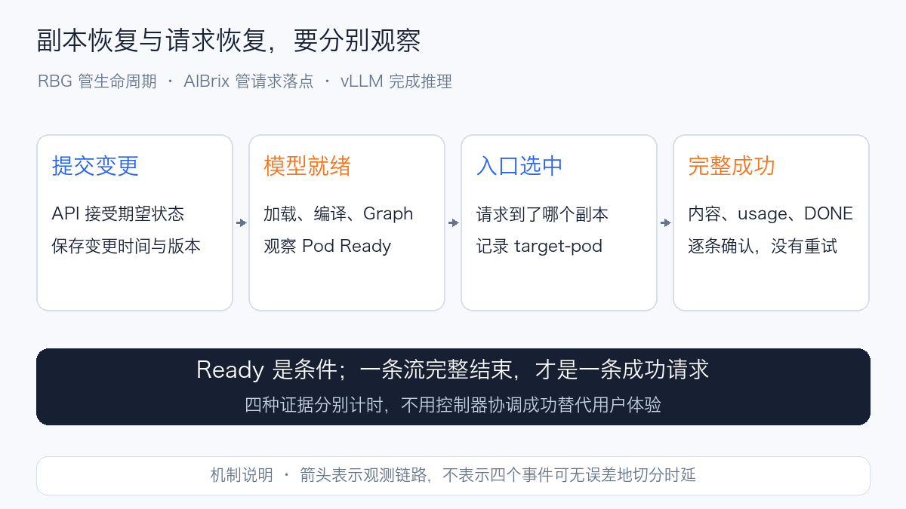
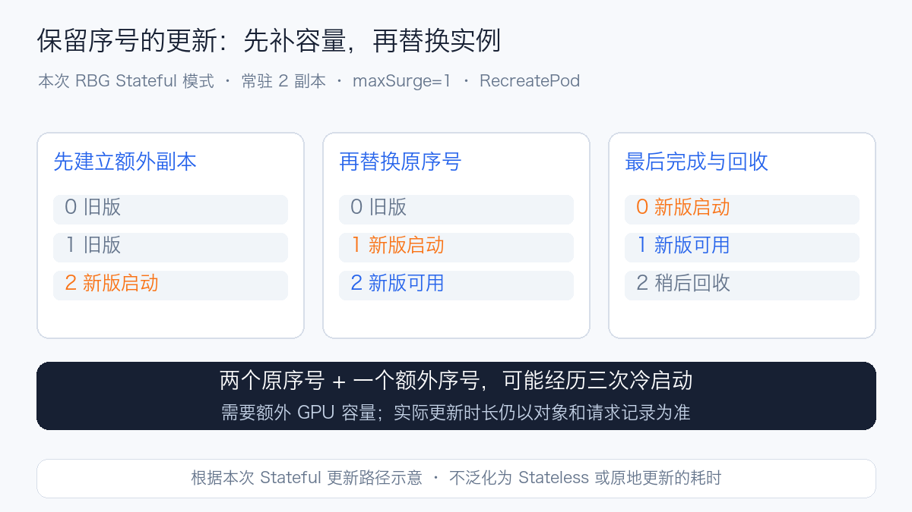
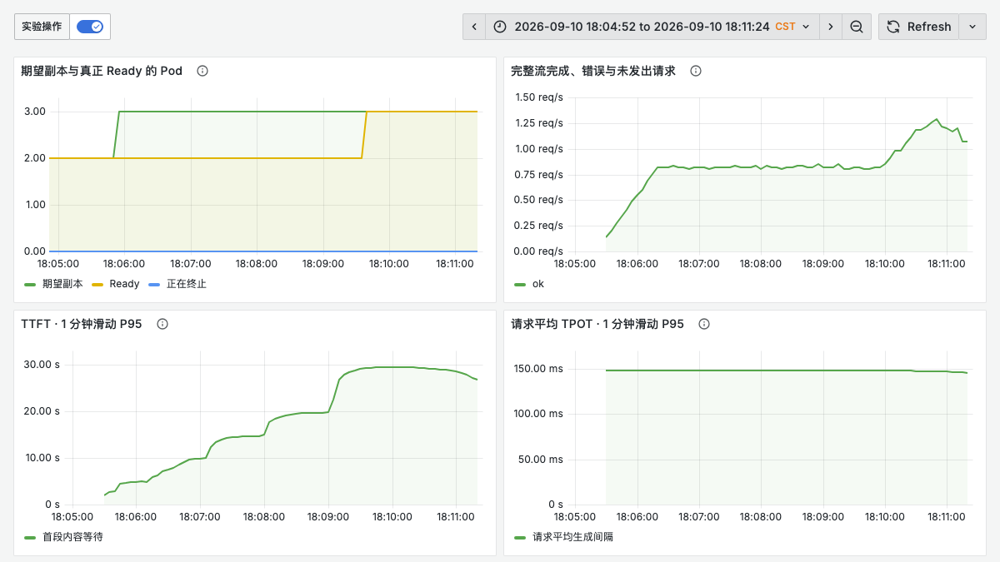
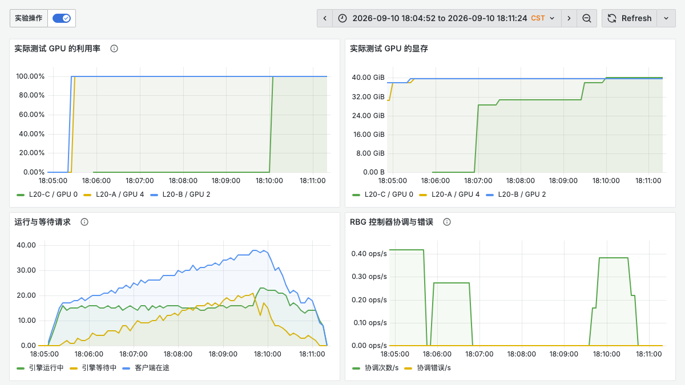
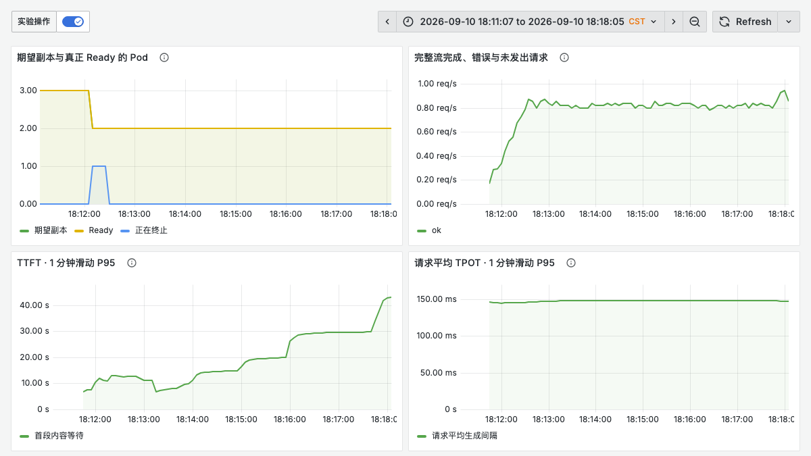
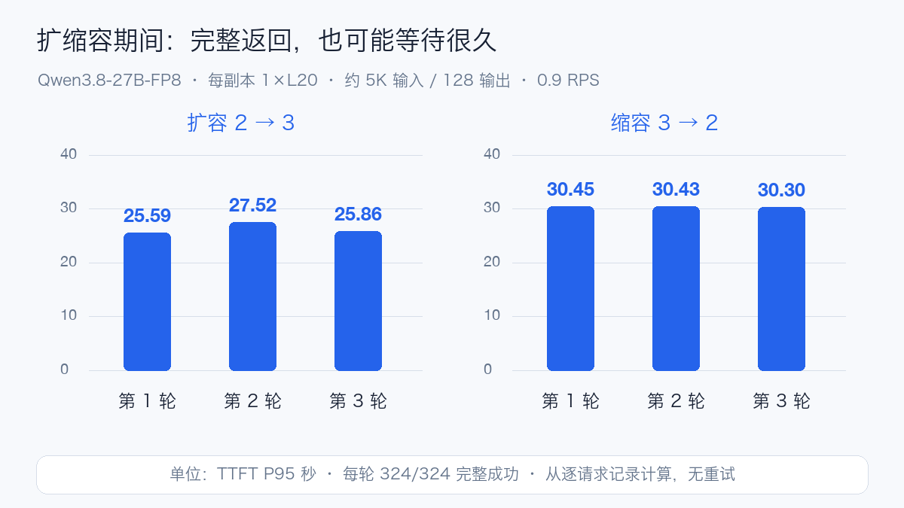
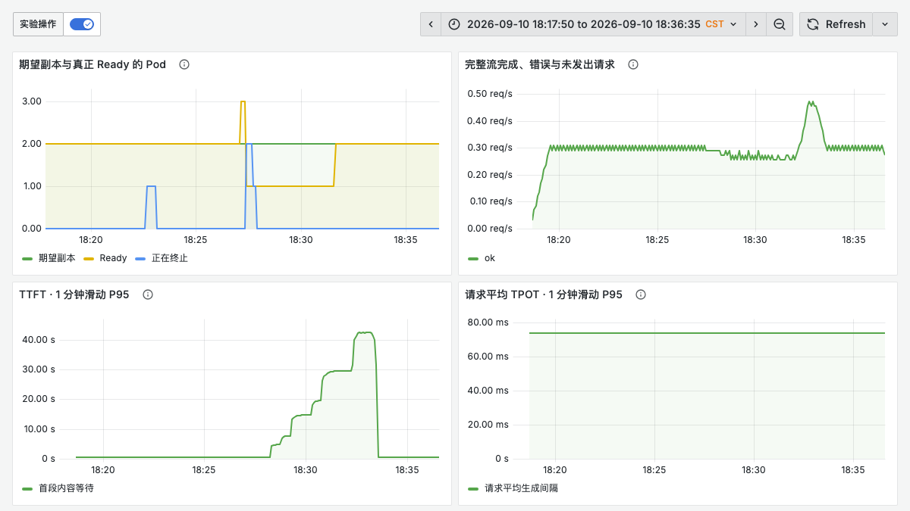
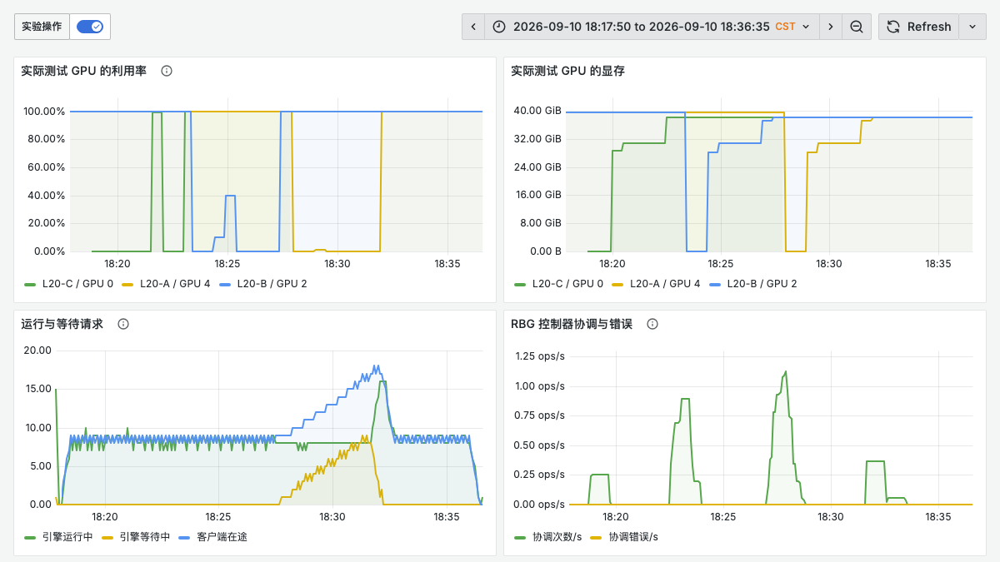
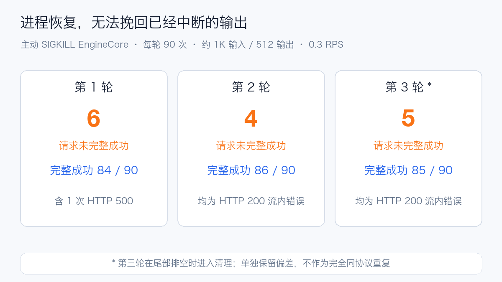

# RBG 带流量实战：副本恢复了，请求就恢复了吗

Qwen3.8-27B 是一个 270 亿参数的稠密视觉语言模型，沿用 Gated DeltaNet 与 Gated Attention 组合的混合架构。官方提供 FP8 权重，可以用较小的单卡副本观察真实模型加载、编译和流式生成。本次使用 **Qwen3.8-27B-FP8，每副本一张 L20**，只开放文本、32K 上下文，关闭 MTP；不评价图像理解、长上下文极限或模型回答质量。[官方模型说明](https://huggingface.co/Qwen/Qwen3.8-27B-FP8)

[上一篇 AIBrix 实验](aibrix-routing-cache-tradeoffs.md)研究的是：前缀局部性省下的计算，能否抵消请求集中后的排队。本篇沿用同一模型、vLLM 镜像和 AIBrix 入口，把路由固定为 `least-request`，观察另一个环节：**副本扩缩、更新或故障时，正在服务的请求会怎样变化。**

RBG（RoleBasedGroup）用角色描述一组工作负载及其关系，负责副本与生命周期编排。AIBrix 入口仍负责把请求送到可用模型副本。两者可以组合，但本次没有把 RBG 当作另一套路由算法，也没有测试 RBG Planner 的自动决策。[RBG 项目](https://github.com/sgl-project/rbg)、[RBG Planner](https://github.com/rolebasedgroup/rbg-planner)

可以把它想成一家餐厅：前台负责把新订单交给哪位厨师，店长负责增派人手、安排换班。店长宣布“增加一位厨师”并不意味着新厨师马上能出菜；换班期间，已经接下的订单也不能因为有人离岗就消失。这里的三个问题分别对应扩容决策、模型启动，以及在途请求的排空和中断。

## 1. 四个时刻，不能混为一个“恢复耗时”



| 时刻 | 本次证据 | 能证明什么 |
| --- | --- | --- |
| API 接受变更 | 控制操作开始、返回时刻及对象版本 | 期望状态已提交 |
| Pod Ready | Pod UID、条件、容器状态及 5 秒对象快照 | Kubernetes 就绪条件已满足 |
| 入口选择新副本 | 逐请求 `target-pod` 响应头 | 请求确实被送往这个副本 |
| 新副本完成完整流 | 第一段内容、最后内容、usage、`[DONE]` | 至少一条实际请求在该副本完整成功 |

这些观测来自不同路径，不应强行拼成必然有严格先后顺序的四段。对象轮询有约 5 秒粒度，响应头是在客户端收到响应时记录，流完成又晚于请求到达。文中应分别给出各事件的定义和观察精度；没有独立记录入口发现事件时，不用“第一次选中”反推精确的发现时间。

控制器 `reconcile` 成功只能说明一次协调完成。模型还可能在读权重、编译、初始化 CUDA Graph。反过来，两个副本一直 Ready，也不能证明每条已有流都未中断。

## 2. 实际运行的是什么

| 条件 | 本次配置 |
| --- | --- |
| RBG | v0.8.0 发布 chart；控制器镜像标签 `v0.8.0-16705159`，按 digest 固定 |
| 工作负载 | `RoleBasedGroup → RoleInstanceSet → RoleInstance → Pod`；原生 standalone pattern |
| 副本模式 | Stateful，保留序号；角色只有 `server` |
| 扩缩入口 | `RoleBasedGroupScalingAdapter` 的 `/scale`，手动阶跃变更 |
| 更新方式 | `RecreatePod`、`maxUnavailable=0`、`maxSurge=1`、`minReadySeconds=10` |
| 模型 | Qwen3.8-27B-FP8，66 个权重分片；记录配置、索引 SHA256 和分片大小 |
| GPU | 常态两个单 L20 副本，最多三个；固定三个候选节点，节点与其他业务共享 |
| 引擎 | 与前篇相同镜像 digest；容器内 `vLLM 0.26.0b2.dev1+g3b102b576.cu129`、Torch `2.11.0+cu129`，TP=1、FP8 权重和 FP8 KV |
| 容量 | `max-model-len=32768`、`max-num-seqs=8`、`max-num-batched-tokens=8192` |
| 缓存与启动 | Prefix Cache 关闭，Chunked Prefill 开启；编译缓存为 Pod 级 `emptyDir` |
| 入口 | 已有 AIBrix v0.7.0 Gateway；全程 `least-request` |
| 退出 | preStop 等待 10 秒，vLLM shutdown timeout 90 秒，Pod 宽限期 180 秒 |
| 调度 | 普通调度器，节点约束与必需的副本反亲和；没有验证 Gang 调度 |

控制器使用两个副本并分散到不同节点。本次安装关闭兼容旧 Deployment、StatefulSet、LWS 工作负载的控制分支，使用原生 RoleInstanceSet。发布 chart 的源代码提交与镜像标签中的标识分别记录，不将两者误写为同一个构建提交。

这里与前篇有一个有意的变化：**关闭 Prefix Cache**。前篇研究缓存路由，本篇减少缓存热度对副本生命周期的干扰。因此不能把前篇的 1.6 RPS 直接当作本篇的安全负载，也不能横向用两个实验的 TTFT 给 RBG 或 AIBrix 排名。

本次没有固定每个节点上的 GPU 设备编号，实际设备由调度与设备插件分配，通过 DCGM 的模型 Pod 标签反查。监控只筛选本次模型 Pod 对应的 GPU，不能把同节点其余业务的 GPU 利用率算进结果。

## 3. 为什么 Statefulness 会改变滚动更新的时间



核心角色配置如下，模型启动参数、存储和权限需结合自己的环境补齐：

```yaml
apiVersion: workloads.x-k8s.io/v1alpha2
kind: RoleBasedGroup
metadata:
  name: inference-study
spec:
  roles:
    - name: server
      replicas: 2
      minReadySeconds: 10
      rolloutStrategy:
        type: RollingUpdate
        rollingUpdate:
          type: RecreatePod
          maxUnavailable: 0
          maxSurge: 1
      standalonePattern:
        template:
          spec:
            terminationGracePeriodSeconds: 180
            containers:
              - name: model
                image: <经过验证的推理镜像及 digest>
                resources:
                  limits:
                    nvidia.com/gpu: "1"
```

这段是配置片段，不是可直接部署的完整清单。模板、探针、模型挂载以及更新策略必须一起验证。已有 ScalingAdapter 管理副本时，后续通过它修改 `/scale`，避免另一个配置同步过程反复覆盖角色副本数。

本次 Stateful 模式保留原来的 0、1 号序号。更新时先建立额外的 2 号新副本，等其可用后，再依次替换旧序号上的实例，最后回收额外副本。**两个常驻副本的更新，可能经历额外副本与两个原序号副本合计三次冷启动。** 这是本次模式、版本和策略下的实际行为，不泛化为所有 RBG 更新方式。[固定版本的 Stateful 协调实现](https://github.com/sgl-project/rbg/blob/a146aa912e55c78b70a2a7f44ff226b93f3a9b6d/pkg/reconciler/roleinstanceset/statefulmode/stateful_instance_set_control.go)

对完全无状态的独立推理副本，是否需要保留实例序号，应在配置前想清楚。可以进一步评估 Stateless 模式的更新开销；本次没有做两种模式的实测对比，不能提前给出性能结论。

## 4. 先标定负载，再做生命周期操作

最初沿用前篇 1.6 RPS，三个 96 请求阶段虽然完整成功，但每轮排空需要约 118 秒，TTFT P95 约 52 秒，说明队列持续积累。它们作为过载标定保留，不计入正式生命周期结果。

重新用 0.3、0.6、0.9 RPS 标定后，三轮无操作基线采用约 5K 输入、128 输出、0.6 RPS。三轮各 48 个请求，**144/144 完整成功**，TTFT P95 分别为 **1.718、1.720、1.714 秒**。这只是该请求形态下的稳定基线，不是对线上容量的长期承诺。

| 场景 | 到达与输出 | 操作与观察目的 |
| --- | --- | --- |
| 无操作基线 | 0.6 RPS，约 5K / 128 token | 确认客户端与两副本在所选负载下稳定 |
| 2→3 扩容 | 0.9 RPS，约 5K / 128 token | 保持压力，观察新增容量何时参与服务、旧队列如何变化 |
| 3→2 缩容 | 同上 | 观察在途请求排空，以及容量减少后的排队 |
| 滚动更新 | 0.3 RPS，约 1K / 512 token | 让较长流覆盖副本交替，观察更新全过程 |
| 正常删除 Pod | 同上 | 正常终止路径是否排空；控制器如何补副本 |
| EngineCore SIGKILL | 同上 | 推理进程骤停对已有流、新到达和恢复的影响 |

扩缩容的 0.9 RPS 高于稳定基线负载，用来观察容量变化，并不意味着两副本在该速率下无排队。各阶段之间不直接比较一个整轮 P95 就下因果结论；扩容前后相同到达率、实际落点、队列和时间窗口要一起看。

正常删除使用带宽限期的 Pod 删除。进程故障则定位本次模型 Pod 内唯一 EngineCore 进程并发出 SIGKILL。两者分别统计：前者会走终止流程，后者不会给被杀进程排空机会。没有对共享节点执行关机、排空或网络故障注入。

所有操作都在流量开始后约 45 秒发起。正式窗口需要覆盖动作、冷启动、恢复及恢复后至少 30 秒的**新请求到达**；只让早已发出的请求在恢复后排空，不算有足够的恢复后样本。较短先导窗口单独标注，不混入完整重复实验。

### Prompt 与完整流口径

实际请求使用 `/v1/completions`，Prompt 结构为：

```text
RBG experiment <阶段名的 SHA256>
The service tracks request latency, token throughput, cache utilization, and healthy replicas.
...上面一句重复 300 次，长输出场景重复 60 次...
Question <六位请求编号>: Explain the operational tradeoffs in detail.
```

设置 `temperature=0`、`ignore_eos=true`、`stream=true`、`stream_options.include_usage=true`，每条请求记录实际输入、输出 usage 和 Prompt SHA256。这里采用固定长度的合成完成负载，控制推理工作量；不把它包装成真实用户问答质量评测。

HTTP 200、出现内容、收到 `[DONE]`、usage 中输出恰好等于目标长度，四项都满足才算成功。不自动重试；HTTP 200 后截断的流仍记为失败。客户端最大在途为 64，来不及发出的计划到达记作 `not_sent`，保留在成功率分母。

TTFT 从客户端 POST 到首段内容；TPOT 为每条请求 `(最后内容时间－首段内容时间)/(输出 token 数－1)`。这是请求平均 TPOT 的分布，不是逐 token ITL。失败请求单列，不能只展示成功请求延迟而隐藏超时和断流。

## 5. 把 Grafana 用于解释过程

两张专用看板分别展示请求质量和资源原因，统一 5 秒抓取、固定阶段时间窗口，使用浅色横版截图。

| 层次 | 指标 | 阅读方式 |
| --- | --- | --- |
| 客户端 | `rbg_study_requests_total`、TTFT / TPOT / E2E 直方图 | 看完整流成功、错误、未发出和延迟；这些是本实验客户端指标 |
| Kubernetes | `rbg_study_model_pods`、`rbg_study_desired_replicas` | 来自只读对象观察器；分别显示期望、Ready 和 Terminating |
| 引擎 | `vllm:num_requests_running`、`vllm:num_requests_waiting` | 区分正在执行与在引擎排队；与客户端在途数含义不同 |
| GPU | DCGM GPU_UTIL、FB_USED | 只选本次模型 Pod 的设备；FB_USED 按 MiB 转换为字节 |
| RBG 控制器 | `controller_runtime_reconcile_total`、`controller_runtime_reconcile_errors_total` | 原生协调及错误，不能代替请求可用性 |

例如，客户端成功计数的一分钟速率与 TTFT 曲线可以写为：

```promql
sum by (result) (rate(rbg_study_requests_total{phase=~"$phase"}[1m]))

histogram_quantile(
  0.95,
  sum by (le) (rate(rbg_study_ttft_seconds_bucket{phase=~"$phase"}[1m]))
)
```

Grafana 的一分钟滑动 P95 是直方图估计，且在请求完成时更新。本次较长请求会使曲线相对请求开始有所滞后；整轮 P95 和故障窗口分析从逐请求记录精确计算。空序列显示无数据，不将没有抓取到指标解释为零。

控制器的 HTTPS metrics 还需要处理认证：Prometheus ServiceAccount 具备 `/metrics` 读取权限，控制器具备 TokenReview / SubjectAccessReview 委托权限。本次给专用抓取端点配置了实验用的自签证书例外；生产应配置可信 CA，避免把跳过验证扩散到其他端点。

扩容第一轮的客户端看板把期望副本、Ready Pod、完整请求和一分钟滑动延迟放在同一时间窗。期望副本先从 2 变 3；新副本尚未 Ready 时，TTFT 已随排队上升。Ready 达到 3 之后，滑动 P95 仍有滞后，不能把 Ready 的瞬间当作体验恢复时间。



同一时间窗的资源看板显示新增设备从空闲转为占用，显存随模型加载上升，GPU 利用率进入高负载。这里的 L20-A/B/C 是匿名设备代号；客户端在途和引擎等待同时存在，不能仅凭某张卡达到 100% 就判断入口已经充分利用新增副本。



缩容第一轮，期望和 Ready 从 3 回到 2，短暂出现 Terminating Pod；完整返回速率没有断崖式下降，但滑动 TTFT 继续抬升。此处需要结合逐请求落点和完成记录，不能单看成功速率宣称缩容没有性能影响。



## 6. 完整结果与可靠性边界

18 个阶段共发出 3,735 次请求，其中 3,720 次完整成功、15 次失败，没有未发出的请求。失败全部出现在主动终止 EngineCore 的三个阶段。基线、扩容、缩容、滚动更新和正常删除各阶段均完整返回全部计划请求；这不等于所有请求都满足延迟 SLO。

以下分位数按各轮成功请求独立计算，不合并三轮分位数；失败与未发出请求同时列出。

扩缩容三轮的整轮 TTFT P95 汇总如下。它与上面 Grafana 的一分钟滑动 P95 口径不同：前者从每条请求记录计算，后者用于观察变化发生的时间。



| 场景 / 轮次 | 到达 RPS | 完整成功 / 计划 | 失败 / 未发出 | TTFT P95 秒 | TPOT P95 毫秒 | E2E P95 秒 |
| --- | ---: | ---: | ---: | ---: | ---: | ---: |
| baseline / 1 | 0.6 | 48 / 48 | 0 / 0 | 1.718 | 90.559 | 13.204 |
| baseline / 2 | 0.6 | 48 / 48 | 0 / 0 | 1.720 | 90.673 | 13.220 |
| baseline / 3 | 0.6 | 48 / 48 | 0 / 0 | 1.714 | 90.686 | 13.219 |
| scale-up / 1 | 0.9 | 324 / 324 | 0 / 0 | 25.587 | 141.191 | 42.916 |
| scale-down / 1 | 0.9 | 324 / 324 | 0 / 0 | 30.451 | 141.205 | 46.525 |
| rollout / 1 | 0.3 | 324 / 324 | 0 / 0 | 25.108 | 58.326 | 54.911 |
| delete-graceful / 1 | 0.3 | 135 / 135 | 0 / 0 | 31.840 | 58.338 | 60.922 |
| kill-engine / 1 | 0.3 | 84 / 90 | 6 / 0 | 7.336 | 58.317 | 36.380 |
| scale-up / 2 | 0.9 | 324 / 324 | 0 / 0 | 27.520 | 141.272 | 45.320 |
| scale-down / 2 | 0.9 | 324 / 324 | 0 / 0 | 30.429 | 141.251 | 46.540 |
| rollout / 2 | 0.3 | 324 / 324 | 0 / 0 | 28.750 | 58.383 | 58.583 |
| delete-graceful / 2 | 0.3 | 135 / 135 | 0 / 0 | 32.220 | 58.379 | 61.946 |
| kill-engine / 2 | 0.3 | 86 / 90 | 4 / 0 | 7.520 | 58.366 | 36.986 |
| scale-up / 3 | 0.9 | 324 / 324 | 0 / 0 | 25.856 | 141.191 | 43.756 |
| scale-down / 3 | 0.9 | 324 / 324 | 0 / 0 | 30.298 | 141.310 | 47.037 |
| rollout / 3 | 0.3 | 324 / 324 | 0 / 0 | 25.160 | 58.348 | 54.979 |
| delete-graceful / 3 | 0.3 | 135 / 135 | 0 / 0 | 32.620 | 58.421 | 62.233 |
| kill-engine / 3 | 0.3 | 85 / 90 | 5 / 0 | 7.564 | 58.408 | 37.075 |

滚动更新第一轮中，期望副本保持 2，Ready 曾短暂下降，客户端滑动 TTFT 随排队升高；资源看板同时记录了旧设备释放、新设备加载和引擎等待。完整请求曲线与单轮 324/324 的结果一致，但不能据此把 Ready 波动解释成完全没有用户等待。





第一轮强制终止阶段的五条失败流已经收到内容和 `[DONE]`，但 SSE 内包含 EngineCore 的 `InternalServerError`，且没有最终 usage；三轮共 14 条 HTTP 200 失败流均符合这一模式。这说明只统计 HTTP 200，甚至只检查 `[DONE]`，都会漏报本次故障。另一条 HTTP 500 返回入口侧 HTTPRoute 未找到的错误，仍需结合入口控制器和路由对象证据定位，不能直接归因于 RBG。原始错误与部分输出均保留，未用重试覆盖。



第二、三轮滚动更新还抓到了对象身份不一致的现场：同名旧 Pod 的 owner UID 与新 RoleInstance 的 UID 不同，但新 RoleInstance 一度报告 Ready。两轮分别记录到 18 和 19 个这种状态的采样点；这些是重复采样，不代表 18 或 19 次独立故障。该证据与本地对状态计算路径的复现一致：按名称读取 Pod 时，需要同时校验 owner UID，并排除正在删除的 Pod。本地补丁的回归测试已通过，尚未在集群部署验证，不能称为生产修复完成。

正常删除的早期一轮在恢复后不足 30 秒便停止新请求到达，因此保留原始数据但排除正式汇总，延长到达窗口后独立补测。图中设备代号和看板范围均已脱敏；[汇总图使用的数据](../../assets/practices/rbg-serving-resilience/result-summary.json)仅包含逐轮统计，不包含原始请求、集群对象或节点信息。

解释最终数据时会保留以下边界：

- 这是 **RBG + 固定 AIBrix 入口 + vLLM** 的组合行为。没有同条件的 Deployment 对照，不声称 RBG 比 Deployment 更快或更可靠。
- 手动改变 ScalingAdapter 副本数验证执行路径，不等于验证 HPA、Planner 的指标决策、冷却期或自动扩缩容策略。
- 单卡独立副本适合暴露冷启动、排空和流中断，但不能代表 P/D 分离、跨节点张量并行、RDMA 或多角色协同更新。
- FP8 KV 的运行日志提示存在未校准的默认缩放，L20 的部分 FP8 kernel 使用默认配置。这些需要额外的准确率和性能评估，本文不据此宣称精度无损或硬件极限。
- 三轮重复、少量固定节点和合成到达不足以代表所有线上分布。共享节点、具体 GPU、主机与存储竞争都可能影响时间。
- `maxUnavailable=0` 是更新预算，不是已有流零中断的保证。进程硬故障、网关摘流传播和排空超时仍要由逐请求证据检验。

### 最后一轮的执行偏差

第三轮 EngineCore 故障期间，本地监督程序访问集群的 DNS 解析失败，自动验收和首次证据回传未完成。集群内客户端独立运行完 90 次请求：85 次完整成功、5 次流内错误。之后从节点持久保留的结果目录重新取回原始流与对象快照。独立的 5 秒 Pod 采样记录到容器重启后连续三次双副本就绪，其后仍有约 152 秒的新到达窗口，46 次恢复后到达请求全部完整返回。

清理发生在最后一次计划到达之后、尾部请求结束之前。因此这一轮还包含尾部流量排空，不能当作与前两轮完全同协议的重复。上表保留完整分母并明确记录该偏差，不用它单独证明故障恢复无损，也不把本地 DNS 故障解释成 RBG 控制器故障。最终确认模型 Pod 为零，原始证据归档已回传本地并计算 SHA256。

## 7. 从实验落到生产配置

先按真实启动时间设置 startupProbe 和更新窗口。权重读完通常只完成一部分工作，编译、显存规划和 CUDA Graph 也要覆盖；就绪探针还应能反映推理引擎是否真正可以接新请求。

再把退出路径当作接口契约。入口停止选择、探针变化、preStop、引擎 shutdown timeout 和 Pod 宽限期要配合检查。宽限期应覆盖摘流传播与允许完成的长请求，并留足余量；本次的 10 / 90 / 180 秒仅是实验参数，不是通用推荐值。带业务副作用的上层请求更不能靠无限自动重试掩盖故障。

容量预算要包含额外副本。如果正常占满所有 GPU，却要求 `maxUnavailable=0` 和 `maxSurge=1`，新副本可能没有位置启动。结合节点碎片、亲和性、队列配额和最长冷启动准备余量，再依据达标请求率而非仅 GPU 利用率决定扩容时机。

最后明确“状态”放在哪里。本次 Pod 级编译缓存随 Pod 重建消失，但容器进程重启可以复用同一 Pod 的 `emptyDir`；所以 Pod 删除与 EngineCore 故障的恢复路径本来就不同。生产可以评估持久化编译缓存和预热，但要隔离模型版本、引擎版本、CUDA 版本与硬件架构，不能直接拿不同缓存状态的启动时间做公平对比。
