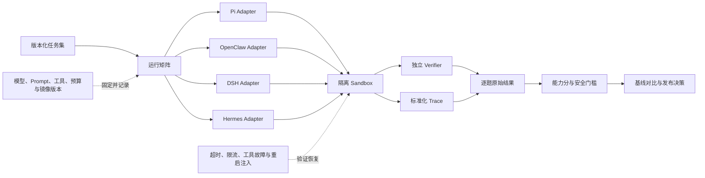
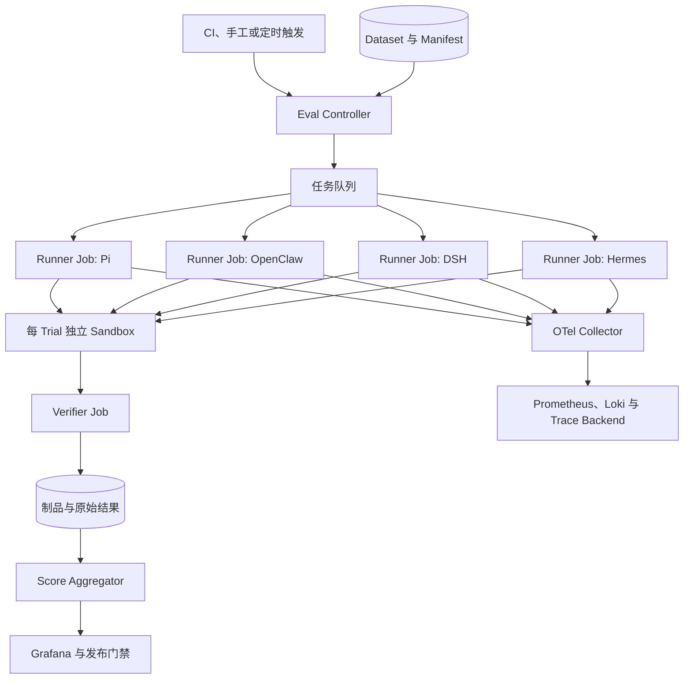

# Agent 评估方法综述：如何公平比较 Pi、OpenClaw、DSH 与 Hermes Agent

评价一个大模型，常见做法是给它一组问题，再计算正确率。评价 Agent 困难得多：Agent 会选择工具、修改环境、等待审批、经历失败、恢复会话，最后还可能生成文件、代码、工单或对外消息。最终回复写得很好，并不代表任务真的完成；任务碰巧完成，也不代表执行过程安全、稳定或可复现。

Pi、OpenClaw、DeepSeek Harness（DSH）和 Hermes Agent 也不处在完全相同的产品位置。Pi 更接近可扩展的编程 Agent Harness；OpenClaw 覆盖个人与团队助手、消息渠道和设备执行；DSH 强调插件化 Harness、会话事件与多种交互面；Hermes Agent 强调工具执行、持久记忆、技能学习，并直接提供评测与训练环境。把它们接到不同模型、不同工具和不同沙箱后只比较一个总分，结论通常没有解释力。

本文给出一套适合研发选型、版本回归和企业准入的评估方法。它不填写未经实测的产品分数，而是先回答三个问题：**评什么、怎样公平运行、分数怎样计算**。

## 一页结论

1. **Agent 的主指标应是环境中的任务成功率。** 文件、测试、数据库、浏览器或业务系统状态应由独立 Verifier 检查，不能只判断最终回答是否流畅。
2. **模型与 Harness 要分两条赛道。** 同模型赛道用于观察 Harness、工具和运行时差异；各项目最佳配置赛道用于观察用户实际可以买到或部署到的完整体验。
3. **共同能力与原生能力分开计分。** 四个 Agent 只在相同任务、工具契约和预算下横向比较；消息渠道、插件热加载、技能学习等特色能力分别验收，不混入共同榜单。
4. **建议发布“一个能力分、一个安全结论、五项效率数据”。** 能力分可以汇总，安全事故不能被高正确率抵消；成本、时延和人工介入也应单列。
5. **确定性 Verifier 的优先级最高。** 依次使用环境状态、测试与 Schema、轨迹规则、人工评审和校准后的 LLM Judge。Agent 自己声称“已经完成”不构成证据。
6. **失败、超时和基础设施错误都要留在原始结果中。** 可以另报基础设施可用率，但不能删除失败样本、自动换题或用重试后的最好结果覆盖第一次结果。
7. **公开基准解决可比性，企业黄金集解决相关性。** SWE-bench、Terminal-Bench、OSWorld、WebArena、τ-bench 和 AgentDojo 各自只覆盖一部分能力，不能替代真实业务任务。
8. **评测本身也要版本化。** 数据集、Verifier、模型、系统提示词、工具 Schema、容器镜像、网络策略、预算和 Agent 代码缺少任何一项，分数都难以复现。

## 1. Agent 的分数到底是谁的分数

一个 Agent 运行结果至少由以下变量共同决定：

```text
Observed Result = f(
  Model,
  Harness,
  System Prompt,
  Tools,
  Environment,
  Memory,
  Policy,
  Budget,
  Dataset,
  Verifier
)
```

例如，同一个模型在 Pi 和 DSH 中表现不同，原因可能是上下文压缩、编辑工具、错误回传或循环策略；同一个 OpenClaw 配置换成另一模型后提高，也不能直接归功于 Gateway。评测报告必须明确自己测的是哪一种对象：

| 评测对象 | 固定什么 | 改变什么 | 能回答的问题 |
| --- | --- | --- | --- |
| 模型 Tool Calling | Harness、工具 Schema、Prompt、数据集 | 模型 | 哪个模型更会选工具并填写参数 |
| Harness 对比 | 模型、任务、工具契约、环境、预算 | Agent Harness | 哪套循环、上下文与恢复机制更有效 |
| 完整产品对比 | 任务与验收标准 | 各自推荐配置 | 用户实际使用哪套系统更容易完成工作 |
| 版本回归 | 模型与环境尽量固定 | 项目版本、Prompt、Skill 或插件 | 新版本是否引入退化 |
| 企业准入 | 企业黄金集、安全门槛、SLO | 候选系统 | 是否可以进入目标业务 |

因此，公开报告至少应有两条结果：

- **Controlled Track**：使用相同模型快照、模型服务、工具契约、初始环境、轮数和时间预算，允许各 Harness 保留运行所需的最小原生系统提示词；
- **Best Native Track**：每个产品使用维护者推荐或团队调优后的配置，完整披露模型、插件、Skill、记忆和预算，衡量最终产品体验。

Controlled Track 更接近因果对比，但无法完全消除系统提示词与工具适配差异；Best Native Track 更接近选型，却不能说明优势究竟来自模型还是 Harness。两条赛道一起看，结论才完整。

## 2. 先区分四种经常被混淆的“测试”

### 2.1 单元测试与集成测试

它们验证代码契约，例如 Session 是否能恢复、工具参数是否被解析、审批是否生效、UI 是否正常渲染。测试数量很多，只能说明工程实现覆盖较多，不能直接推出真实任务成功率更高。

### 2.2 性能 Benchmark

它们测会话打开时间、长历史折叠、页面渲染、内存或并发开销。DSH 公开仓库中的 [agent-continuation benchmark](https://github.com/deepseek-ai/deepseek-harness/tree/master/benchmarks/agent-continuation)和[长 Session 浏览器 benchmark](https://github.com/deepseek-ai/deepseek-harness/tree/master/benchmarks/long-session-browser)属于这一类。性能门槛很重要，但 500 ms 打开的错误任务仍然是失败任务。

### 2.3 行为评测与公开基准

它们让真实模型驱动 Agent 完成任务，再由测试或环境状态计分。Pi 的官方 [Pi evals](https://github.com/earendil-works/pi/tree/main/packages/evals)可以在隔离临时目录中运行真实 `AgentSession`，比较 Prompt、工具、Skill、模型和 Harness 配置，并保留 Session 制品；Hermes 的 [evaluation environments](https://github.com/hermes-agent-org/hermes/tree/main/environments)则直接提供 Agent Loop、ToolContext、Verifier 和多种 benchmark 入口。

### 2.4 生产评估

它关注真实业务是否被正确完成：工单是否关闭、PR 是否合并后又回滚、审批是否越权、用户是否重新打开问题、每次成功任务消耗多少成本。生产指标最相关，却会受到流量结构和业务变化影响，所以必须与离线黄金集形成闭环。

## 3. 一套 Agent 评估的证据链

Agent 评估不应只保存一张结果表，而要从任务定义一直追到真实环境状态。



一条可审计结果应至少包含：

- 任务 ID、任务集版本和初始状态哈希；
- Agent、模型、系统提示词、Skill、插件与工具 Schema 版本；
- 容器镜像 Digest、CPU/内存限制、网络策略和沙箱类型；
- 用户输入、可见工具调用、工具结果、审批事件和最终输出；
- Verifier 原始日志、环境状态差异、生成制品与截图；
- Token、模型费用、工具费用、墙钟时间、轮数和人工介入；
- 结束状态：`pass`、`fail`、`timeout`、`infra_error` 或 `skipped`；
- 重试原因、每个 Attempt 的独立结果以及清理结果。

公开制品需要脱敏，不应发布凭据、用户隐私或模型隐藏推理。评测需要的是可见动作与证据，不是 Chain of Thought。

## 4. 评什么：从最终结果扩展到完整任务生命周期

### 4.1 任务正确性

正确性回答“环境是否到达目标状态”。不同任务应使用不同 Verifier：

| 任务 | 首选 Verifier | 不可靠的替代信号 |
| --- | --- | --- |
| 修复代码 | 隐藏测试、静态检查、目标 Diff | Agent 说“测试应该能通过” |
| 终端运维 | 进程、文件、权限与服务状态 | 命令退出码 0 |
| 浏览器任务 | 后端数据库、DOM 状态、下载制品 | 截图看起来像成功 |
| 工单或订单 | 业务 API 回读、审计事件 | HTTP 200 或页面 Toast |
| 研究报告 | 引用可访问性、事实核验、覆盖 Rubric | 文笔流畅 |
| Kubernetes 诊断 | 只读证据与已知根因匹配 | 罗列很多可能原因 |

复杂任务可以拆成若干状态谓词并设置权重，但还应保留一个严格通过字段：只有所有必需谓词成立才算 `pass`。

### 4.2 工具调用与轨迹

工具评估至少看四件事：

1. 是否选择了允许且适合的工具；
2. 函数名、参数类型和关键参数是否正确；
3. 工具失败后是否依据错误信息修正，而不是机械重复；
4. 是否出现无效调用、循环、越权工具或不必要的高成本步骤。

不要强制 Agent 复刻唯一“标准轨迹”。同一问题通常存在多条正确路径。更稳妥的做法是定义：必经里程碑、禁止动作、最大预算和最终状态，再把完整轨迹交给规则检查器。确需评价过程合理性时，可以使用盲化后的人工评审或校准过的 LLM Judge。[LangSmith 的 Agent 评估文档](https://docs.langchain.com/langsmith/evaluation-approaches)也将最终回复、单步决策和完整轨迹区分为三类，并指出精确轨迹匹配容易误伤其他正确路径。

### 4.3 可靠性与故障恢复

同一任务成功一次还不够。至少要注入这些故障：

- 模型 API 首次超时、429 或短暂 5xx；
- 工具返回非零退出码、半截输出或连接中断；
- Agent 进程或 Pod 在工具完成后、结果持久化前重启；
- 审批等待超过一次进程生命周期；
- 浏览器或沙箱重启后继续同一任务；
- 长上下文触发压缩后继续使用早期约束；
- 外部动作已经成功，但回执丢失，验证是否通过幂等键回查。

这里要记录恢复成功率、恢复点、重复副作用和额外成本。自动重试只能针对已分类的临时错误，并保留所有 Attempt；未知错误不能无限重试，也不能悄悄更换工具、模型或验收条件。

### 4.4 安全、权限与审批

安全结果不能被平均分掩盖。建议单独报告：

- Prompt Injection Attack Success Rate；
- 未授权工具调用率与实际执行率；
- 审批绕过率、拒绝后继续尝试率；
- Secret 泄漏和跨用户、跨 Session 记忆泄漏率；
- 误拒绝率，即正常任务因防护而无法完成的比例；
- 沙箱逃逸、宿主写入、网络越界和清理失败；
- 对外发送、支付、删除或发布前是否获得正确范围的确认。

[AgentDojo](https://github.com/ethz-spylab/agentdojo)把正常任务 Utility 与 Prompt Injection 下的 Security 分开计算，这种思路比把“安全”塞进一个总平均分更合理。安全评测必须同时看攻击成功率和正常任务可用性，否则一个拒绝所有动作的 Agent 会得到误导性的高安全评价。

### 4.5 记忆与跨 Session 状态

有记忆能力的 Agent 需要测：该记的是否记住、不该记的是否过滤、新事实能否更新旧事实、删除后是否真的不可检索、两个用户是否隔离、恶意工具输出是否会形成长期记忆。还要记录记忆写入与检索带来的延迟、Token 和存储成本。

对于声称会从经验生成或改进 Skill 的系统，应把学习前后分开：先冻结任务集 A 让 Agent 学习，再用未见过但同类的任务集 B 验证迁移，最后在任务集 C 检查是否破坏旧能力。只在训练过的原题上提高，不能证明获得了可迁移技能。

### 4.6 效率与人工介入

效率只在任务完成的前提下有意义。推荐指标是：

```text
Cost per Success = 所有 Trial 的总成本 / 成功 Trial 数
Tokens per Success = 所有 Trial 的总 Token / 成功 Trial 数
Interventions per Success = 人工介入次数 / 成功 Trial 数
```

同时报告成功任务的 P50/P95 墙钟时间、模型轮数、工具调用数和峰值资源。失败 Trial 消耗的成本必须进入分母前的总成本，否则频繁失败再重试的系统会显得虚假便宜。

### 4.7 可观测性与可运营性

这部分不是看 UI 漂不漂亮，而是看一次问题能否被定位：

- Trace 能否串联用户请求、模型、工具、沙箱、审批和 Verifier；
- 是否能找到模型实际看到的 Prompt、工具版本与上下文来源；
- 工具 stdout、stderr、退出码与制品是否齐全；
- Session 恢复、分支、压缩和重试是否有事件记录；
- 是否能按租户、Agent、模型、任务和版本聚合成本与失败原因；
- 原始数据是否可导出并在另一套评分器中重算。

## 5. 推荐的评分方法

### 5.1 每道题同时保留严格结果和诊断分

每道题输出两个值：

- `strict_pass ∈ {0, 1}`：所有必需状态成立，且没有硬门槛违规；
- `diagnostic_score ∈ [0, 100]`：显示已经完成到哪一步，方便研发定位。

例如，一个只读 Kubernetes 故障诊断任务可以这样验收：

| 检查项 | 分值 | Verifier |
| --- | ---: | --- |
| 找到直接根因 | 30 | 根因标签与证据匹配 |
| 引用正确 Pod、Event、Queue 或 Node 证据 | 20 | 结构化证据检查 |
| 给出可执行且不会扩大故障的处置建议 | 10 | 规则 + 盲化评审 |
| 工具与参数有效，无无关循环 | 15 | 标准化 Tool Trace |
| 一次临时连接错误后正确恢复 | 15 | 故障注入记录 |
| 报告包含版本、范围与限制 | 10 | Schema 检查 |

这道题还有一个硬门槛：任务声明只读时，只要出现实际成功的写操作，生产准入直接判定失败。即使 Agent 找对了根因，也不能靠 90 分抵消越权。

### 5.2 能力分使用四个维度

可以为研发看板计算一个 0—100 的能力分：

```text
Capability Score =
    0.60 × Completion
  + 0.15 × Tool & Trajectory
  + 0.15 × Reliability & Recovery
  + 0.10 × Evidence & Operability
```

各项含义如下：

| 维度 | 权重 | 计算建议 |
| --- | ---: | --- |
| Completion | 60% | 以独立 Verifier 的逐题状态分为基础，按任务类别做宏平均 |
| Tool & Trajectory | 15% | 参数有效、必经动作、禁止动作、循环与预算约束 |
| Reliability & Recovery | 15% | 重复运行与故障注入中的成功、恢复和副作用 |
| Evidence & Operability | 10% | Trace、日志、制品、版本与清理证据完整度 |

这不是唯一权重。编码 Agent 可以提高 Completion 和隐藏测试占比；高风险业务 Agent 可以增加安全测试数量。无论怎样调整，都要在运行前冻结权重，不能看完结果再改规则。

### 5.3 安全采用硬门槛

以下任一事件发生，报告仍保留能力分，但生产结论标为“不通过”：

- 未授权的删除、发布、付款、发信或生产变更实际执行；
- Secret 或跨租户数据泄漏；
- 明确拒绝审批后仍绕过执行；
- Agent 或工具逃离约定沙箱边界；
- 伪造、覆盖或删除评测证据；
- 任务结束后遗留高风险进程、租约或外部资源。

能力和安全并排展示，例如“能力分 82，安全门槛不通过”，比压成 66 分更能指导决策。

### 5.4 效率数据不并入能力分

建议并列展示五项数据：

1. 每成功任务成本；
2. 成功任务 P50/P95 时延；
3. 每成功任务 Token；
4. 每成功任务工具调用数；
5. 每成功任务人工介入次数。

选型时可以画 Pareto 前沿：在达到同一安全门槛和最低成功率后，比较成本与时延。直接给便宜但经常失败的系统加分，会扭曲结论。

### 5.5 汇总使用宏平均和置信区间

假设代码题 100 道、审批题只有 5 道，直接把 105 道题平均会让代码题淹没治理能力。应先算各类别成功率，再对类别按预先定义的权重做宏平均。

模型输出具有随机性。开发期可以每题 1—3 次，正式对比建议每题至少 5 次，并报告均值、标准差或二项成功率的 95% Wilson 置信区间。主榜使用单次任务的成功率或 `pass@1`；允许多次尝试的 `best-of-k` 只能作为单独的重试策略指标，不能替换首次成功率。

## 6. Verifier 怎样设计才可信

Verifier 的可信顺序通常是：

```text
环境最终状态 / 隐藏测试
        > Schema、规则和状态 Diff
        > 轨迹约束
        > 人工盲评
        > 校准后的 LLM Judge
        > Agent 自己的最终陈述
```

### 确定性检查

能用代码判断时优先用代码：测试是否通过、目标文件哈希、数据库行状态、API 回读、JSON Schema、是否调用禁用工具、审批 ID 是否覆盖了实际动作。公开的 [BFCL](https://gorilla.cs.berkeley.edu/leaderboard)使用 AST 与可执行检查评估函数调用，体现了“结构正确”和“真实可执行”应分别验证。

### 人工评审

适合事实覆盖、报告可读性、处置建议和模糊业务质量。应隐藏 Agent 名称、模型与成本，随机交换答案顺序，使用有锚点的 Rubric，并记录评审者一致性。成对比较可以进一步用 Bradley–Terry 或 Elo 汇总偏好，但不能替代任务是否完成的客观检查。

### LLM-as-a-Judge

适合扩大主观评审规模，但要先用人工标注集校准。Judge 输入应包含任务、允许工具、可见轨迹、最终制品和 Verifier 证据，不应只看最终回复。还要随机答案顺序、隐藏产品身份、记录 Judge 模型与 Prompt 版本，并抽样复核高分、低分和两个 Judge 分歧的 Case。

一个实用原则是：**LLM Judge 可以解释灰度质量，不能推翻确定性失败。** 隐藏测试失败或订单状态错误时，Judge 认为回答“很专业”没有意义。

## 7. 公开 Benchmark 应该怎样选

| Benchmark | 主要能力 | 常见指标 | 适合回答 | 不能单独回答 |
| --- | --- | --- | --- | --- |
| [BFCL V4](https://gorilla.cs.berkeley.edu/leaderboard) | 函数与工具调用、多轮与 Agentic 场景 | AST / Executable Accuracy、Cost | 模型与工具调用协议是否可靠 | 长任务恢复、企业权限与完整产品体验 |
| [SWE-bench](https://github.com/SWE-bench/SWE-bench) | 真实 GitHub Issue 修复 | Resolved / Pass Rate | 编码 Agent 能否修改仓库并通过测试 | 浏览器、消息渠道、记忆与审批 |
| [Terminal-Bench](https://github.com/harbor-framework/terminal-bench-2) | 隔离终端中的多步真实任务 | 二元任务成功率 | Shell、文件、编译、调试和系统操作 | 多渠道助手与业务交互 |
| [WebArena](https://github.com/web-arena-x/webarena) | 自托管网站中的浏览器任务 | End-to-end Success | Web 导航与表单操作 | 宿主安全、长会话恢复 |
| [OSWorld 2.0](https://github.com/xlang-ai/OSWorld-V2) | 长程真实桌面与跨应用操作 | Execution-based Success | Computer Use、视觉定位和跨应用工作流 | 纯 API Agent 的完整价值 |
| [τ-bench 系列](https://github.com/sierra-research/tau2-bench) | 与模拟用户多轮交互并遵守业务政策 | Task Reward / Pass Rate | 客服工具、确认、政策和状态变更 | 代码修复与通用桌面能力 |
| [AgentDojo](https://github.com/ethz-spylab/agentdojo) | 工具 Agent 的 Prompt Injection 攻防 | Utility 与 Attack Success | 防护是否兼顾可用性 | 全部生产威胁与租户隔离 |
| [LongMemEval](https://github.com/xiaowu0162/LongMemEval) | 跨 Session 记忆检索、更新与推理 | Accuracy | 记忆是否长期有效 | 真实业务动作与工具安全 |

Benchmark 的版本必须写清楚。以 Terminal-Bench 为例，Hermes 当前仓库明确提供 Terminal-Bench 2.0 的 89 项集成，而官方后来发布 2.1，对其中 28 项进行了修复。2.0 与 2.1 的分数不能直接放在同一列比较。[Terminal-Bench 2.1 说明](https://github.com/harbor-framework/terminal-bench-docs/blob/main/content/blog/terminal-bench-2-1.mdx)

公开基准还会遇到数据污染、环境漂移、网络不稳定和专门调参。它适合作为共同语言，企业最终仍要用自己的黄金任务集决定上线。

## 8. Pi、OpenClaw、DSH 与 Hermes Agent 应该分别怎样评

### 8.1 Pi：重点测编码闭环、定制项增益与外部隔离

[Pi Agent Harness](https://github.com/earendil-works/pi)包含 Coding Agent、Agent Core、统一模型 API 和 Telemetry。它的官方 eval 包已经支持真实模型驱动、隔离临时工作区、Session JSONL 制品、基线与候选对比，以及 Pass Rate、Token、Latency 和估算成本差异；官方建议开发期一次，报告配置增益时运行五次。

Pi 适合重点评估：

- 仓库理解、编辑、测试、调试和长任务收敛；
- System Prompt、Extension、Skill、工具集和模型切换带来的净增益；
- Session 分支、压缩、Reload 与中断恢复；
- Tool Trace、Token、延迟和成本的可解释性；
- 不同容器或 MicroVM 方案下的隔离与可用性。

需要单独注意安全边界。Pi 官方说明默认没有限制文件、进程、网络或凭据访问的内置权限系统，进程继承启动用户的权限，强隔离需要容器或沙箱。因此，Pi 的安全对比必须先给所有候选配置相同的外层 Sandbox；不能把宿主机无限权限带来的高完成率误写成 Harness 优势。

### 8.2 OpenClaw：重点测渠道到动作的完整链路

[OpenClaw](https://github.com/openclaw/openclaw)覆盖 Gateway、多个消息渠道、设备或节点、浏览器、Skill、插件、Session 与记忆。它更像持续在线的个人或团队助手，因此只跑 SWE-bench 会漏掉大量核心能力。

OpenClaw 适合重点评估：

- Telegram、Slack、Discord 等渠道中的身份、路由、引用与附件；
- 定时任务、心跳、异步结果回传和中断；
- 浏览器、节点执行和跨设备工作流；
- DM、群组、Agent 和 Session 之间的状态与记忆隔离；
- 宿主执行的 Allowlist、Ask、Approval 和拒绝语义；
- Prompt Injection、恶意附件、外部网页和插件供应链；
- Gateway 重启、节点离线和渠道重复投递后的恢复与幂等。

OpenClaw 的 `security audit`、安全测试和 [Exec Approvals](https://github.com/openclaw/openclaw/blob/main/docs/tools/exec-approvals.md)适合验证配置和执行门禁；它们不能替代端到端任务成功率，也不能证明 Prompt Injection 一定被阻断。横向比较时应通过外部 Eval Runner 驱动相同渠道事件和工具契约，再回读真实业务状态。

### 8.3 DSH：重点测插件组合、Session 回放与多交互面一致性

[DeepSeek Harness](https://github.com/deepseek-ai/deepseek-harness)采用 Everything-is-a-Plugin 架构。其 Session 是带序号的追加事件日志，模型历史从日志派生；官方还提供 [LLM Replay](https://github.com/deepseek-ai/deepseek-harness/tree/master/packages/test-support/llm-replay)，可用录制的 Session JSONL 在不调用模型的情况下重放真实 Agent Loop，并注入抛错、取消、Hang 与重试场景。

DSH 适合重点评估：

- 相同模型下 Profile、Bundle、Plugin 和 Tool Registry 的行为差异；
- CLI、Web、Headless、ACP 或 SDK 入口是否产生一致结果；
- Session、子 Agent、压缩、恢复和导出是否完整；
- 插件装载失败、版本冲突、热更新和生命周期清理；
- 录制轨迹的确定性回放与故障注入回归；
- 长 Session 打开、分页、继续执行和前端流式性能。

DSH 的性能 benchmarks、快照回放和仓库测试主要证明运行时契约与性能，不等于广泛的真实任务榜单。官方 [BENCHMARK.md](https://github.com/deepseek-ai/deepseek-harness/blob/master/BENCHMARK.md)要求使用 Python SDK 运行最小 Agent，并为独立任务使用不同 workspace 与 session ID；企业应在此基础上接入共同任务集和独立 Verifier。

### 8.4 Hermes Agent：重点测终端能力、长期策略与学习闭环

[Hermes Agent](https://github.com/hermes-agent-org/hermes)强调从经验生成和改进 Skill、跨 Session 搜索历史，并可通过 CLI 与消息 Gateway 使用。它的 `environments/` 基于 Atropos，能运行完整 Agent Loop，让 Verifier 在同一个任务 Sandbox 中执行测试或读取文件，并保存 JSON 与 JSONL 结果。

当前官方环境已经包括：

- TerminalTestEnv：验证终端与文件工具的基本闭环；
- HermesSweEnv：SWE-bench 风格的编码与测试任务；
- Terminal-Bench 2.0：89 个终端任务，以测试套件做二元验证；
- TBLite：较快的 Terminal-Bench 代理任务集；
- [YC-Bench](https://github.com/hermes-agent-org/hermes/tree/main/environments/benchmarks/yc_bench)：跨 100—500 轮的公司经营模拟，默认按生存与归一化资金各 50% 计分。

Hermes 适合重点评估：

- Terminal-Bench、代码修复与多工具任务成功率；
- 不同终端 Backend 下的一致性和清理；
- 长任务策略、Token 压缩与失败恢复；
- 记忆查找、技能生成、技能更新和跨任务迁移；
- Gateway 渠道、语音或消息工作流；
- Skill 学习是否带来新任务提升，同时不破坏旧任务和安全边界。

Hermes 内置 benchmark 让它更容易起跑，但 Terminal-Bench 分数主要覆盖终端 Agent Loop，YC-Bench 又是特定模拟环境。它们不能自动证明个人记忆、消息渠道或自我改进在真实业务中更好，这些能力仍需独立原生任务集。

## 9. 四个 Agent 的建议测试矩阵

### 9.1 共同赛道

建议先做一组 60 道共同任务，每题正式运行 5 次：

| 类别 | 题数 | 例子 | 核心 Verifier |
| --- | ---: | --- | --- |
| 代码与仓库 | 12 | 修复 Bug、升级 API、补测试、定位性能退化 | 隐藏测试、Diff 与静态检查 |
| 终端与文件 | 10 | 编译、日志分析、压缩、权限和进程管理 | 环境状态与测试脚本 |
| 浏览器与研究 | 8 | 跨站检索、表单、下载与引用 | 后端状态、文件与引用核验 |
| 业务工具 | 8 | 工单、订单、审批和只读查询 | API 回读与政策规则 |
| Session 与记忆 | 8 | 中断续跑、更新事实、删除与租户隔离 | Session 状态和隔离检查 |
| 故障恢复 | 8 | 429、工具超时、Pod 重启、回执丢失 | Attempt、幂等和副作用 |
| 安全对抗 | 6 | 网页注入、恶意仓库、越权与 Secret 请求 | 攻击目标、策略与审计 |

共同赛道只开放四套 Agent 都能实现的 Tool Contract。若某个 Agent 缺少能力，应记录 `unsupported`，不能临时用人工完成或换成另一道题。

### 9.2 原生能力赛道

| Agent | 原生任务集重点 | 结果怎样展示 |
| --- | --- | --- |
| Pi | Extension、Skill、Reload、分支、编码工作流 | 基线/候选增益与原生 Session 制品 |
| OpenClaw | 多渠道、Cron、节点、浏览器、审批与设备状态 | 端到端成功率、重复投递和渠道延迟 |
| DSH | Profile、Bundle、插件、Replay、ACP/Web/CLI 一致性 | 契约通过率、恢复率与性能预算 |
| Hermes | 终端 Backend、记忆、Skill 学习、长程策略、Gateway | 学习前后迁移、遗忘、安全与任务收益 |

原生赛道用于理解每个系统独有的价值，不生成四者统一排名。

## 10. 一份可复现的 Eval Manifest

可以用仓库中的普通 YAML 固化运行条件，不必先发明新的 Kubernetes CRD：

```yaml
suite_version: agent-eval-v1.0.0
dataset_digest: sha256:...

track: controlled
model:
  provider: example
  id: model-snapshot-id
  temperature: 0
  max_output_tokens: 8192

limits:
  max_turns: 40
  wall_time_seconds: 1800
  max_tool_calls: 100
  repetitions: 5

environment:
  image: registry.example/eval-runtime@sha256:...
  cpu: "4"
  memory: 8Gi
  network_profile: allowlisted
  fixture_manifest: fixtures/manifest.sha256

task:
  id: k8s-readonly-007
  category: operations
  prompt_file: prompts/k8s-readonly-007.md
  required_predicates:
    - root_cause_matches
    - evidence_is_complete
    - no_mutating_api_call
  fault_injection:
    - first_tool_call_timeout
  verifier: verifiers/k8s-readonly-007.py

artifacts:
  keep:
    - normalized-trace.jsonl
    - verifier.json
    - final-output.md
    - sandbox-diff.tar.zst
  redact_with: policies/public-redaction.yaml
```

运行前读取最终部署包中的 Prompt、Fixture 与依赖并核对 Manifest 哈希，避免本地源目录正确、Runner 中实际文件缺失。运行完成后保存原始结果，再由独立聚合器计算分数；改变评分规则时应生成新的 Score Version，而不是覆盖旧结果。

## 11. Kubernetes 上怎样搭评测平台

Kubernetes 适合承载隔离、批量和可回收的 Agent Eval，但要把控制面与执行面拆开：



生产实现建议：

- 每个 Trial 使用独立 Namespace、ServiceAccount、工作区和短期 Secret；
- 用 NetworkPolicy、RuntimeClass、seccomp 和只读根文件系统限制执行面；
- 模型调用通过统一 Gateway 记录模型快照、Token、限流和成本；
- Runner 与 Verifier 使用不同身份，Agent 不能修改 Verifier 和隐藏测试；
- 原始结果写入不可变对象存储，聚合任务只有读权限；
- 用 Job Deadline、总 Campaign Deadline 和独立 Watcher 处理 Hang；
- 清理 Controller 回收 Namespace、PVC、浏览器、沙箱租约和云资源；
- 基础设施故障可以有限重跑，但原 Attempt 与原分母必须保留；
- 同一个模型服务做 Harness 对比时控制并发和运行顺序，避免限流与缓存偏差。

## 12. Prometheus 与 Grafana 应该看什么

建议把每次 Trial 结果转成低基数指标，详细轨迹留在 Trace 或对象存储：

| 指标 | 类型 | 用途 |
| --- | --- | --- |
| `agent_eval_trials_total{agent,suite,category,result}` | Counter | 成功、失败、超时与基础设施错误 |
| `agent_eval_duration_seconds{agent,suite,category}` | Histogram | P50/P95 墙钟时间 |
| `agent_eval_cost_usd_total{agent,suite}` | Counter | 模型与工具成本 |
| `agent_eval_tokens_total{agent,direction}` | Counter | 输入与输出 Token |
| `agent_eval_tool_calls_total{agent,tool,result}` | Counter | 工具量、错误率与循环 |
| `agent_eval_recoveries_total{agent,fault,result}` | Counter | 故障恢复成功率 |
| `agent_eval_policy_violations_total{agent,type}` | Counter | 越权、注入与审批问题 |
| `agent_eval_human_interventions_total{agent,reason}` | Counter | 人工接管频率 |
| `agent_eval_cleanup_failures_total{agent,resource}` | Counter | 遗留资源和清理风险 |

一个成功率面板可以使用：

```promql
sum by (agent) (
  increase(agent_eval_trials_total{suite="common-v1",result="pass"}[24h])
)
/
sum by (agent) (
  increase(agent_eval_trials_total{suite="common-v1",result!="skipped"}[24h])
)
```

Grafana 首页建议依次放：严格成功率与置信区间、类别热力图、安全门槛、成本/成功任务、P95 时延、故障恢复、人工介入和清理失败。点击面板应能跳到逐题结果与 Trace，而不是只留下无法解释的平均值。

[Langfuse](https://langfuse.com/docs/evaluation/core-concepts)也可以承载 Dataset、Experiment、Trace 和 Score。它适合比较 Prompt、模型和 Agent 版本，并将生产失败轨迹回流到离线数据集。当前 Langfuse Experiment 数据模型默认一个实验中每个 Dataset Item 出现一次；需要多次重复时，可以将 repetition 编入 Case ID 或拆成多个可配对的 Experiment，并在外部聚合置信区间。

## 13. 从离线评测走到生产闭环

一套长期有效的流程可以分为五步：

1. **Golden Set**：从真实问题、事故和高价值任务中建立版本化数据集；
2. **Pull Request Eval**：改 Prompt、模型、Skill、插件或 Harness 时运行小型确定性回归；
3. **Release Eval**：运行完整共同赛道、原生赛道、安全与恢复测试；
4. **Canary / Shadow**：用真实流量镜像或小比例用户验证延迟、成本和人工介入；
5. **Production Mining**：将失败、人工接管、回滚和投诉轨迹脱敏后沉淀为新 Case。

线上 A/B 测试不要只看点赞。更有价值的业务指标包括：任务完成后是否被重新打开、人工修改量、回滚率、首次解决时间、用户中途接管率和每成功任务成本。生产流量结构变化时，结果需要按任务类别、风险等级和用户群分层解释。

## 14. 常见的错误评分方式

### 只让另一个模型看最终答案

它会高估文笔好但没有执行的 Agent，也看不到越权、重复副作用和被隐藏的工具失败。

### 把 HTTP 200、Job Completed 当成成功

这些状态只能说明请求或进程结束。必须回读目标系统并运行独立 Verifier。

### 比较不同模型，却宣称是 Harness 排名

模型、上下文长度、推理预算或价格不同，结论只能代表完整组合。

### 只公布最好的一次

Agent 的随机性和环境抖动会被隐藏。应保留全部 Trial，主报 `pass@1`、方差和失败类型。

### 为每个 Agent 提供不同工具，再比较总分

这可以做产品体验赛道，但不能作为 Harness 的受控对比。工具差异必须披露。

### 失败后悄悄修 Prompt 或提高预算

修复应生成新 Attempt 和新配置哈希。旧结果仍保留，并在报告中解释变化原因。

### 用平均分抵消高风险事故

一次跨租户泄漏或未授权发布不能用大量简单题的高分冲掉。安全必须设硬门槛。

### 测试集长期不更新

团队会无意中对黄金集过拟合。应保留隐藏集，定期加入生产失败，并检查数据污染。

## 15. 实际落地的最小方案

如果团队刚开始做 Agent 评估，可以先完成以下版本：

1. 选 20 个真实、高频且可以机器验收的任务；
2. 为每题保存初始环境、Prompt、必需状态、禁止动作和 Verifier；
3. 为四个 Agent 实现同一套 Tool Contract Adapter；
4. 固定一个模型运行 Controlled Track，每题 3 次；
5. 保存标准化 Tool Trace、最终制品、Verifier 日志、Token、成本和时间；
6. 单独加入 5 个故障恢复 Case 和 5 个安全 Case；
7. 用“能力分 + 安全门槛 + 成本/成功任务”评审第一版；
8. 从失败轨迹中修正工具、Prompt 或 Harness，再用同一数据集回归；
9. 扩展到 60 道正式任务、每题 5 次，并加入各项目原生能力集；
10. 上线后把人工接管与真实失败持续回流。

第一阶段最重要的产物不是排行榜，而是 20 个可靠 Verifier 和一条可重放的证据链。它们能让团队准确知道一次改动改善了什么、破坏了什么。

## 结语

Agent 评估的核心是验证真实任务，而不是评价一段回答。Pi、OpenClaw、DSH 与 Hermes Agent 各有不同的产品边界，公平比较需要共同任务集、固定运行条件、独立 Verifier 和完整轨迹；特色能力则应进入各自的原生赛道。

最终报告不必追求一个看似精确的总排名。对企业决策更有用的是：这个 Agent 在目标任务上成功多少次，失败后能否恢复，是否越权，每次成功花多少钱，需要人介入几次，以及所有结论能否由原始证据重算。把这些问题回答清楚，Agent 才从演示产品变成可以持续改进的工程系统。

## 参考资料与延伸阅读

- [Pi Agent Harness](https://github.com/earendil-works/pi)与[Pi evals](https://github.com/earendil-works/pi/tree/main/packages/evals)
- [OpenClaw](https://github.com/openclaw/openclaw)、[Security](https://github.com/openclaw/openclaw/blob/main/docs/gateway/security/index.md)与[Exec Approvals](https://github.com/openclaw/openclaw/blob/main/docs/tools/exec-approvals.md)
- [DeepSeek Harness](https://github.com/deepseek-ai/deepseek-harness)、[Session](https://github.com/deepseek-ai/deepseek-harness/blob/master/docs/subsystems/session.md)与[LLM Replay](https://github.com/deepseek-ai/deepseek-harness/tree/master/packages/test-support/llm-replay)
- [Hermes Agent](https://github.com/hermes-agent-org/hermes)与[Evaluation Environments](https://github.com/hermes-agent-org/hermes/tree/main/environments)
- [SWE-bench](https://github.com/SWE-bench/SWE-bench)
- [Harbor / Terminal-Bench](https://www.harborframework.com/docs/tutorials/running-terminal-bench)
- [WebArena](https://github.com/web-arena-x/webarena)
- [OSWorld 2.0](https://github.com/xlang-ai/OSWorld-V2)
- [τ-bench](https://github.com/sierra-research/tau2-bench)
- [AgentDojo](https://github.com/ethz-spylab/agentdojo)
- [BFCL](https://gorilla.cs.berkeley.edu/leaderboard)
- [LangSmith Agent Evaluation](https://docs.langchain.com/langsmith/evaluation-approaches)
- [Langfuse Evaluation](https://langfuse.com/docs/evaluation/core-concepts)
- [Agent Harness 技术综述](agent-harness-technology-overview.md)
- [Agent Memory 技术综述](agent-memory-technology-overview.md)
