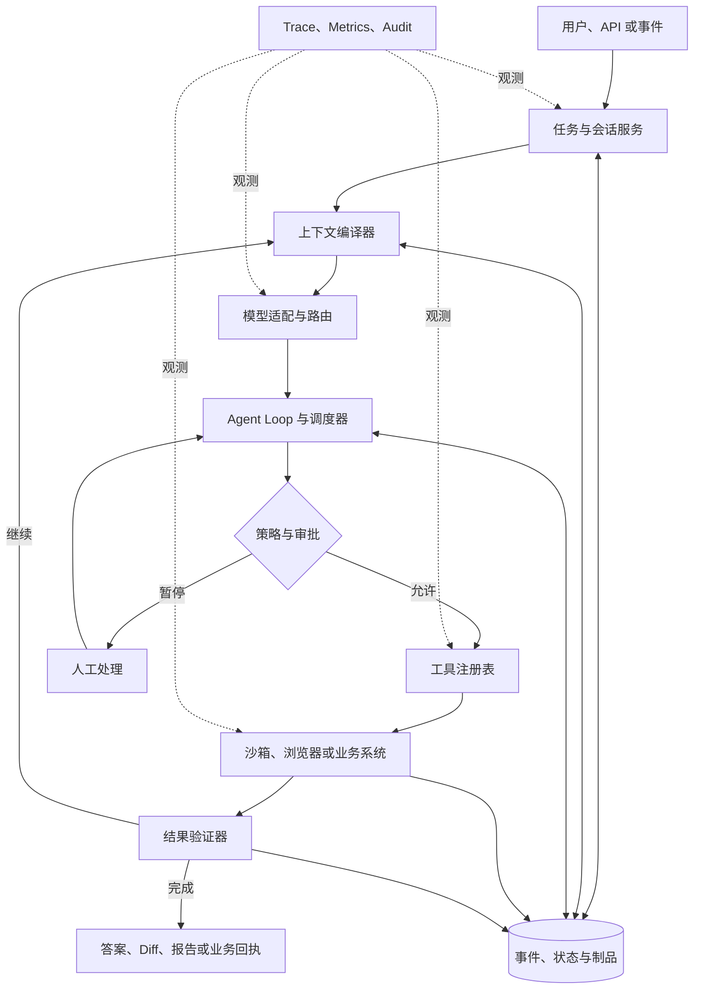
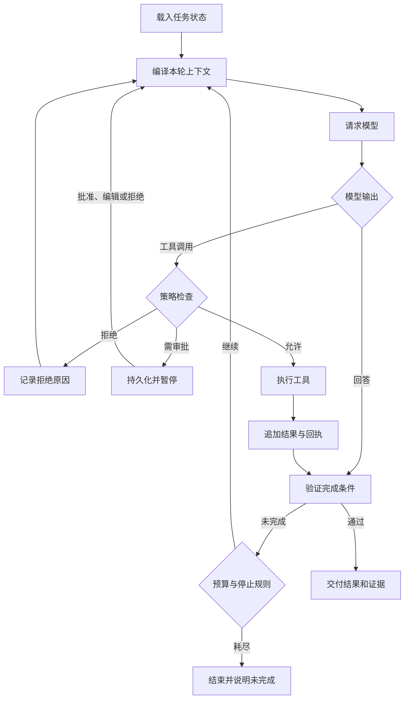
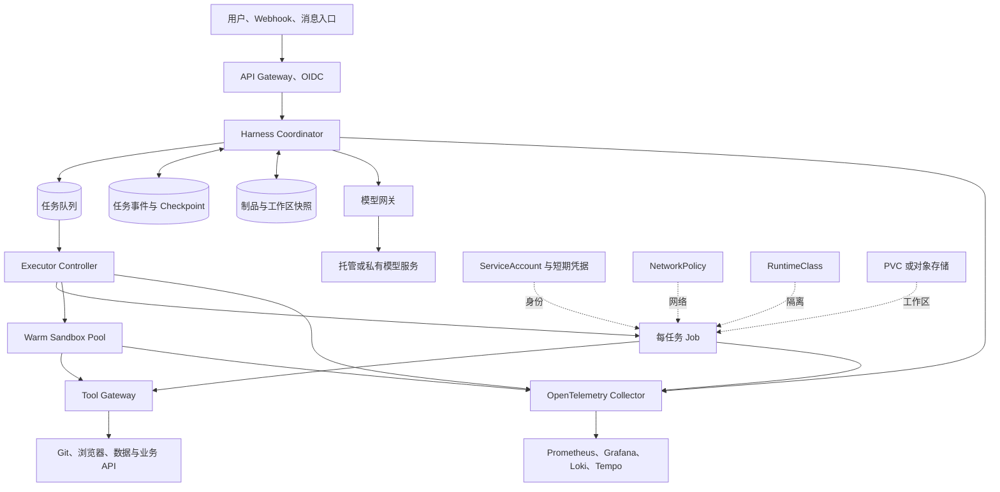

# Agent Harness 技术综述：模型之外，智能体如何持续完成真实任务

同一个模型接入不同的编程助手、研究 Agent 或企业平台，完成率、速度和安全性可能相差很大。差异不只来自提示词，还来自模型周围那套负责组织上下文、调用工具、保存状态、执行代码、控制权限和验证结果的系统。这套系统通常被称为 **Agent Harness**。

“Harness”原意是挽具或成套装备。在 Agent 领域，它强调的是：把模型的推理能力接到真实环境上，同时约束模型能够做什么、怎样留下证据、失败后从哪里继续。本文所说的 Harness 均指 **Agent Harness**，与同名的软件交付产品 Harness.io 无关。

## 一页结论

1. **Harness 不是模型包装器，而是 Agent 的运行与治理层。** 模型提出下一步动作，Harness 负责准备上下文、执行动作、保存状态、施加权限、判断是否继续，并交付可以核验的结果。
2. **工具数量不是核心指标，工具接口质量才是。** 参数语义、返回结构、错误信息、幂等性和反馈速度，都会直接影响模型的决策质量。SWE-agent 将这一层称为 Agent-Computer Interface（ACI）。
3. **状态必须独立于进程。** 长任务会遇到模型限流、工具超时、Pod 重启、人工审批和上下文压缩；仅靠内存中的消息列表无法可靠恢复。
4. **“模型建议执行”与“系统允许执行”必须分开。** Harness 应在工具调用边界检查身份、参数、资源、网络、预算和审批策略，再把获准动作交给沙箱或业务系统。
5. **验证器决定任务是否真的完成。** 测试通过、文件存在、接口返回 2xx 或模型说“已完成”，都可能只是中间信号。生产 Harness 需要针对任务定义机器可核验的完成条件。
6. **确定性工作流和自主 Agent 应组合使用。** 让代码负责交易、审批和不可逆操作，让模型负责理解、规划、信息提取和异常处理，通常比完全开放的循环更稳定。
7. **MCP、沙箱、模型网关都不是完整 Harness。** MCP 解决连接协议，沙箱解决执行隔离，模型网关解决模型访问；Harness 把这些能力编排为一条可恢复、可审计的任务链。
8. **Kubernetes 适合承载 Harness，但不能自动赋予它可靠性。** 生产落地仍需拆分控制面与执行面，使用持久事件、任务队列、最小权限身份、网络策略、独立工作区和完整 Trace。

## 1. 用一个生活场景理解 Harness

可以把模型想象成一位经验丰富的工程师。只给他一个聊天框，相当于让他隔着电话回答问题；给他一台电脑、代码仓库、终端和浏览器，他才可能真正修改和验证系统。

但企业不会只把电脑和管理员密码交给工程师，还会提供工单、门禁、审批、开发环境、版本管理、监控和审计：

| 现实组织中的设施 | Agent 系统中的对应能力 |
| --- | --- |
| 工单和验收条件 | 任务、约束与完成标准 |
| 工作台和资料夹 | 上下文、工作区与记忆 |
| 工具柜 | Tool Registry、MCP Server、企业连接器 |
| 门禁和审批单 | 身份、策略、Guardrail、Human-in-the-loop |
| 实验室 | 容器、浏览器、VM 或远端 Sandbox |
| 工作日志和监控 | Event Log、Trace、Metrics、Audit Log |
| 代码评审和质检 | 测试、规则校验、独立 Verifier |

模型负责判断，Harness 提供完成任务所需的工作制度和基础设施。一个便于工程讨论的表达是：

```text
Agent System = Model + Harness + Tools + Environment + Policy
```

其中 Model 决定“下一步建议做什么”，Harness 决定“如何让这一步在真实系统中安全、连续、可验证地发生”。DeepSeek Harness 的官方介绍也用“Agent = Model + Harness”强调这一关系。[DeepSeek Harness](https://www.deepseek.com/harness/en/)

## 2. Harness 与相邻概念有什么区别

不同项目对 Agent Runtime、Framework、Orchestrator 和 Harness 的命名并不统一，判断时应看职责，而不是只看产品名称。

| 概念 | 主要解决的问题 | 单独使用时缺少什么 |
| --- | --- | --- |
| 模型 API | 生成文本、推理和 Tool Call | 任务状态、实际执行、权限、恢复与验收 |
| Agent SDK / Framework | 用代码定义 Agent、工具、交接和循环 | 未必提供隔离执行、多租户治理和生产运维 |
| 工作流引擎 | 固定步骤、分支、重试和补偿 | 开放任务中的动态规划与工具选择 |
| Agent Runtime | 驱动轮次、状态与工具执行 | 有些 Runtime 只提供底层执行原语，没有完整工作台和策略 |
| MCP | 统一 Agent 与工具、资源和提示词的连接协议 | 任务循环、状态、沙箱、审批、验证与 UI |
| Sandbox | 隔离代码、Shell、浏览器和文件系统 | 模型循环、上下文、业务授权和任务编排 |
| 模型网关 | 模型路由、限流、配额、密钥和审计 | 工具执行、工作区、任务状态和完成判定 |
| Harness | 把上下文、模型、工具、状态、执行、策略和验证组成任务闭环 | 仍需选择模型、工具、存储和基础设施实现 |

[MCP 架构](https://modelcontextprotocol.io/specification/2025-06-18/architecture)中的 Host 负责权限、连接生命周期、上下文聚合和编排，Server 暴露工具、资源和提示词。它是 Harness 很重要的工具接入边界，但协议本身不会决定 Agent 怎样循环、何时暂停或如何恢复。

## 3. 一套完整 Harness 的逻辑架构



这张图中最重要的边界是：**模型只提出动作，策略层决定能否执行，执行环境产生事实，验证器判断事实是否满足目标。** 把四者混为一体，最容易出现越权、假完成和无法恢复的问题。

### 3.1 上下文编译器

上下文不是把全部聊天记录直接塞给模型。Harness 需要根据当前任务和 Token 预算，组合：

- 系统指令、组织规则和用户约束；
- 当前计划、待办项和完成标准；
- 工具定义、参数 Schema 与权限范围；
- 检索结果、仓库文件、页面和业务数据；
- 历史摘要、最近工具结果和失败原因；
- 时间、身份、环境、预算和风险等级。

成熟实现还要记录每次请求中模型实际看到了什么。否则即使保存了原始对话，也无法解释模型为何在某一步做出特定决定。

上下文压缩也不能只追求更短。身份边界、用户明确约束、未完成事项、来源和外部操作回执属于必须保留的信息；工具输出中的重复日志和已经沉淀为状态的内容才适合裁剪。

### 3.2 模型适配与路由

模型层除了兼容不同 API，还要处理流式输出、Tool Call、结构化结果、重试、限流、缓存和降级。生产系统应把以下版本一起写入 Trace：

```text
model + inference configuration + system prompt + tool schema + harness version
```

只记录模型名称无法复现实验。同一个模型换了工具描述、上下文顺序或停止条件，任务表现就可能变化。

### 3.3 工具与 ACI

工具是模型作用于外部世界的接口。一个对人类很方便的通用 Shell，对模型不一定是最佳接口；一个窄而清晰的 `create_change_request()` 往往比一组模糊的 HTTP 或数据库工具更可靠。

好的工具接口通常具备：

- 清楚的动词、参数类型、单位和默认值；
- 结构化、稳定且长度受控的返回值；
- 能区分“参数错误、权限拒绝、暂时失败、业务冲突”的错误码；
- 查询状态、重试、取消和幂等能力；
- 明确声明只读、可逆、需审批或不可逆；
- 返回可用于验证的资源 ID、版本号和回执。

[SWE-agent 论文](https://arxiv.org/abs/2405.15793)把为 Agent 设计的计算机接口称为 ACI，并通过软件工程任务说明：接口设计本身会显著影响 Agent 表现。因此，评估 Harness 时不能只统计“接了多少工具”，还要测试模型是否能稳定理解和使用这些工具。

### 3.4 Agent Loop 与停止条件

最小 Agent Loop 看似简单：



真正困难的是停止语义。Harness 至少要同时考虑：

- 任务完成条件是否通过验证；
- 最大轮次、Token、费用和墙钟时间；
- 连续重复动作或无进展循环；
- 用户取消、策略拒绝或人工接管；
- 下游不可用是否值得重试；
- 是否已产生部分成功和外部副作用。

Anthropic 将预定义代码路径称为 Workflow，将由模型动态决定过程和工具使用的系统称为 Agent，并建议从满足需求的简单方案开始。[Building Effective Agents](https://www.anthropic.com/engineering/building-effective-agents)

### 3.5 状态、事件日志与 Checkpoint

长任务的状态不能只存在于一个进程的内存里。建议把信息分成三类：

| 类型 | 内容 | 推荐保存方式 |
| --- | --- | --- |
| 事实事件 | 用户消息、模型请求、Tool Call、执行结果、审批和状态变化 | 只追加事件流，保留顺序和因果关系 |
| 派生状态 | 当前步骤、计划、预算、工具状态和等待原因 | 从事件计算并建立 Checkpoint |
| 大型制品 | 仓库快照、日志、截图、报告、Diff 和数据文件 | 对象存储或持久卷，事件中只保存引用与哈希 |

DeepSeek Harness 使用只追加 Session Log，让 resume、fork、search 和 replay 基于同一事件流；[LangGraph Persistence](https://docs.langchain.com/oss/python/langgraph/persistence)则在执行步骤保存 Checkpoint，以支持 Human-in-the-loop、故障恢复和 time travel。两者实现不同，但都体现了同一原则：**任务事实必须比运行任务的进程活得更久。**

### 3.6 执行环境与 Sandbox

Agent 可能执行 Shell、Python、浏览器自动化、文件编辑、编译或第三方 CLI。隔离级别应按风险选择：

| 执行环境 | 启动与资源成本 | 隔离强度 | 典型场景 |
| --- | ---: | ---: | --- |
| 宿主机进程 | 低 | 低 | 可信单用户、本地开发 |
| 容器 | 低 | 中 | 常规代码和数据任务 |
| gVisor / Kata | 中 | 中到高 | 多用户、未知依赖和较高风险代码 |
| MicroVM / VM | 高 | 高 | 强租户隔离、浏览器和不可信代码 |
| 远端业务 API | 取决于服务 | 由接口和授权决定 | 企业记录、发布、支付和生产变更 |

[OpenHands Runtime](https://docs.openhands.dev/openhands/usage/architecture/runtime)将任意代码放进 Docker Sandbox，以获得隔离、一致性、资源控制和可复现环境。需要注意，容器或 VM 只解决执行边界；业务系统是否允许某个用户执行某项操作，仍要由身份和授权层判断。

更完整的 Sandbox 对比和 Kubernetes 实验见：[Agent Sandbox 选型与分析](agent-sandbox-selection.md)与[Firecracker Kubernetes 实验](firecracker-kubernetes-lab/index.md)。

### 3.7 策略、审批与身份

策略应在动作边界生效，而不是只写进 System Prompt。对于每次 Tool Call，Harness 可以按以下顺序判断：

1. 当前用户和任务身份能否使用这个工具；
2. 参数是否符合 Schema、数据范围和资源限制；
3. 操作是只读、可逆、需审批还是禁止；
4. 凭据能否按本次任务换取短期最小权限令牌；
5. 网络目的地和数据出站是否允许；
6. 是否超出费用、调用次数和运行时间预算；
7. 是否需要人工批准、编辑参数或拒绝。

审批必须是耐久状态：进程重启后仍能看到待审批动作，批准后也不能重复执行。[OpenAI Agents SDK Human-in-the-loop](https://openai.github.io/openai-agents-python/human_in_the_loop/)支持序列化运行状态，在批准、编辑或拒绝后恢复；[LangChain Human-in-the-loop](https://docs.langchain.com/oss/python/langchain/human-in-the-loop)也把工具策略与 Checkpointer 结合起来。

### 3.8 验证器

模型输出“已完成”只是一个声明。验证器应尽量使用独立于生成过程的证据：

| 任务 | 较弱的完成信号 | 更可靠的验证 |
| --- | --- | --- |
| 修复代码 | 模型说问题已修复 | 指定测试通过、Diff 满足范围、静态检查无新增问题 |
| 生成报告 | 文件已经写出 | 必填章节、引用、数据一致性和渲染结果通过检查 |
| 修改配置 | API 返回成功 | 读取目标资源，核对版本、实际字段和控制器状态 |
| 发布内容 | HTTP 2xx | 获得发布 ID，并从目标系统读取最终状态 |
| 数据分析 | 得到一段结论 | 输入快照、计算过程、单位和关键数字可复算 |

验证失败时，应把结构化差异反馈给 Agent，而不是只返回“失败”。这样模型才能知道是缺少文件、数值不一致，还是外部状态尚未收敛。

### 3.9 可观测性与评测

Harness 的 Trace 应能回答：任务为何这样执行、时间和费用花在哪里、哪个动作改变了外部系统、失败后能否恢复。

```text
Run
├── Turn / Step
│   ├── Context build
│   ├── Model generation
│   ├── Policy / Approval
│   ├── Tool execution
│   │   └── Sandbox or business API
│   └── Verification
└── Final artifact and outcome
```

[OpenAI Agents SDK Tracing](https://openai.github.io/openai-agents-python/tracing/)用 Trace 和 Span 表达 Agent、Generation、Function、Guardrail 与 Handoff；[OpenTelemetry GenAI 语义约定](https://opentelemetry.io/docs/specs/semconv/registry/attributes/gen-ai/)也已覆盖 Agent、Workflow、Conversation、Tool Call 和 Token Usage 等概念。工具参数和结果可能含有凭据、个人信息或源代码，采集时必须分级、脱敏和限制保留周期。

生产指标至少应覆盖：

| 维度 | 推荐指标 |
| --- | --- |
| 质量 | 任务完成率、验证通过率、首次通过率、人工返工率 |
| 性能 | 端到端延迟、模型延迟、工具延迟、排队和审批等待时间 |
| 成本 | 每个已验收任务的 Token、模型费用、Sandbox 时长和人工时间 |
| 可靠性 | 重试率、恢复成功率、重复副作用、无进展循环和超时率 |
| 安全 | 策略拒绝、越权尝试、敏感数据出站、审批绕过和异常插件调用 |
| 运维 | 活跃任务、积压、执行池利用率、版本分布和依赖故障 |

只看每次模型调用的准确率，会漏掉 Harness 带来的大部分差异。更有用的成本公式是：

```text
有效任务成本 =（模型 + 工具 + 执行环境 + 重试 + 人工复核）/ 已验收任务数
```

## 4. 为什么同一个模型在不同 Harness 中表现不同

模型是 Agent 能力的上限之一，Harness 决定这份能力能否稳定转化为任务结果。

| 变量 | 对结果的影响 |
| --- | --- |
| 上下文选择 | 相关文件是否完整、规则是否冲突、历史摘要是否丢失关键约束 |
| 工具接口 | 模型能否理解参数、错误是否可恢复、返回值是否过长或含糊 |
| 执行反馈 | 测试、页面、命令和业务系统是否及时返回真实环境状态 |
| 循环策略 | 何时重新规划、怎样防止重复、什么时候停止或求助 |
| 状态恢复 | 限流、断网、Pod 重启和审批等待后能否从准确位置继续 |
| 验证方法 | 是接受模型自报完成，还是使用独立、可复现的检查 |
| 权限设计 | 是因权限过大产生风险，还是因工具被过度限制无法完成任务 |
| 延迟与预算 | 工具往返太慢或预算太小，会迫使模型选择次优捷径 |

因此，模型评测和 Harness 评测应分开：

- 固定 Harness，比不同模型的任务完成率；
- 固定模型和推理参数，比不同上下文、工具和循环策略；
- 回放固定工具结果，定位模型决策差异；
- 注入超时、限流、Pod 重启和审批延迟，检查恢复语义；
- 对相同黄金任务做版本回归，避免提示词或工具升级造成隐性退化。

## 5. Workflow、受约束 Agent 与开放 Agent

生产系统不必在“全是流程”和“完全自治”之间二选一。

| 形态 | 谁决定路径 | 优点 | 适用范围 |
| --- | --- | --- | --- |
| 确定性 Workflow | 代码 | 可预测、易审计、易补偿 | 对账、审批、发布流水线、固定业务流程 |
| 受约束 Agent | 模型在允许的状态和工具内选择 | 兼顾灵活性和治理 | 客服处理、工单分类、代码修改、研究任务 |
| 开放 Agent | 模型动态规划并使用通用工具 | 能处理边界不清的复杂任务 | 探索、个人助手、低风险且可复核的工作 |

常见的生产组合是：入口由 Workflow 完成身份、参数和任务分类；中间把模糊问题交给 Agent 调查或生成候选方案；高风险动作再回到确定性 API、审批和事务系统。这样既保留模型处理例外的能力，也能让关键副作用有清楚的控制点。

## 6. 主流实现的侧重点

以下项目不在同一抽象层，表格用于观察它们怎样覆盖 Harness 能力，而不是做简单排名。

| 项目 | 主要定位 | 突出的 Harness 能力 | 需要补齐或注意 |
| --- | --- | --- | --- |
| [DeepSeek Harness](https://github.com/deepseek-ai/deepseek-harness) | 插件化 Agent Harness | Cordis 插件内核、模型/工具/会话/沙箱 seam、只追加会话日志、多种运行模式 | 仍是 Developer Preview；企业认证、多租户和远端执行需自行集成 |
| [Deep Agents](https://docs.langchain.com/oss/python/deepagents/overview) + [LangGraph](https://docs.langchain.com/oss/python/langgraph/overview) | 应用 Harness + 耐久执行 Runtime | 规划、子 Agent、文件系统、Checkpoint、恢复、HITL 与图编排 | 开发者仍需设计状态、工具、存储和部署边界 |
| [OpenAI Agents SDK](https://openai.github.io/openai-agents-python/) | 轻量 Agent SDK | Agent、Tool、Handoff、Guardrail、Session、Tracing、HITL 与 Sandbox Agent | 强隔离、企业工具授权和平台控制面仍需按场景建设 |
| [OpenHands](https://github.com/OpenHands/OpenHands) | 软件开发 Agent 平台 | Agent Server、Conversation、Workspace、Event、终端和代码 Sandbox | 面向软件工程场景；生产部署需要进一步治理模型、网络和租户 |
| [SWE-agent](https://github.com/SWE-agent/SWE-agent) | 软件工程研究 Harness | 强调 ACI、任务环境和可重复评测 | 重点是研究与基准，不是通用企业 Agent 平台 |

DeepSeek Harness 的插件架构、Agent Loop 和会话持久化可继续阅读[仓库深度解析](deepseek-harness-repository-analysis.md)；Docker、Compose、Helm 与 StatefulSet 实践见[容器化部署](deepseek-harness-runtime-containerization.md)。

## 7. 可靠性：重试不等于恢复

Harness 的一次任务可能持续几分钟到数小时。可靠性设计的重点不是无条件重试，而是知道动作是否发生、能否安全重放以及应该从哪里继续。

| 故障位置 | 推荐处理 | 关键前提 |
| --- | --- | --- |
| 模型请求超时且无响应 | 按请求 ID 重试 | Provider 支持幂等或确认未生成可消费结果 |
| 只读工具失败 | 指数退避并重试 | 工具没有副作用，错误可分类 |
| 写工具连接中断 | 先按幂等键查询状态，再决定重试 | 工具有操作 ID、状态查询和回执 |
| Sandbox / Pod 消失 | 从最近 Checkpoint 新建执行环境 | 工作区、事件和制品独立持久化 |
| 等待人工审批 | 释放计算资源，耐久暂停 | 审批对象、参数和状态已保存 |
| 上下文压缩 | 保存摘要的来源和未完成约束 | 能回到原始事件与制品 |
| 下游部分成功 | 执行补偿或进入人工处理 | 预先定义补偿动作和所有权 |

对外部副作用，系统很难凭空实现“恰好一次”。更现实的组合是：

```text
幂等键 + 操作状态查询 + 不可变回执 + 对账 + 补偿流程
```

例如 Agent 提交发布请求后连接中断，Harness 不应直接再次发布，而应先用 `operation_id` 查询目标系统；只有确认未执行时才重试。

## 8. 安全：把不可信内容与可执行指令分开

Agent 同时读取网页、文档、Issue、邮件和工具结果，这些内容可能包含 Prompt Injection。Harness 应把它们视为数据，并由可信策略决定哪些内容能够影响动作。

生产基线包括：

- 每个任务使用独立身份和短期凭据，不共享长期管理员密钥；
- 工具采用 allowlist，写操作使用窄接口和结构化参数；
- 浏览内容、仓库内容和工具结果不自动升级为系统指令；
- Sandbox 限制 CPU、内存、磁盘、进程、系统调用、挂载和网络出口；
- 对下载、插件和 Skill 建立来源、签名、固定版本和扫描机制；
- 高风险动作在执行前审批，审批页面展示真实参数和影响范围；
- Trace 与日志默认不采集密钥，并对源码、个人信息和业务数据分级；
- 对间接提示注入、权限升级、记忆污染、计划操纵和重复副作用做红队测试。

提示词中的“不要泄露密钥”不能代替执行时的密钥隔离；模型遵守规则也不能代替后端授权。

## 9. Kubernetes 上的生产架构

Kubernetes 能为 Harness 提供资源调度、故障重建、身份、网络和隔离原语。推荐把长生命周期控制面与短生命周期执行面拆开：



### 9.1 Kubernetes 原语怎样映射到 Harness

| Harness 需求 | Kubernetes 原语 | 生产注意事项 |
| --- | --- | --- |
| 无状态 API 与 Coordinator | Deployment、Service、HPA | 会话和任务状态不能只存在 Pod 内存 |
| 有界的一次性执行 | Job | 设置超时、重试上限、TTL 和幂等恢复；[Job](https://kubernetes.io/docs/concepts/workloads/controllers/job/)只保证 Pod 重建，不理解业务副作用 |
| 低延迟执行 | 预热 Sandbox Pool | 池中环境必须在分配前清理，避免跨租户残留 |
| 持久任务事实 | PostgreSQL / Event Store | 事件、Checkpoint 与制品引用要有统一 Run ID |
| 大型工作区和制品 | PVC、CSI、对象存储 | 区分临时工作盘与长期制品；记录版本和哈希 |
| 任务身份 | ServiceAccount、OIDC、Workload Identity | 每类工具使用最小权限，不挂载默认高权限 Token |
| 网络出口控制 | NetworkPolicy、Egress Gateway、DNS Policy | [NetworkPolicy](https://kubernetes.io/docs/concepts/services-networking/network-policies/)依赖 CNI 实现，并且主要工作在 L3/L4 |
| 强隔离 | RuntimeClass、gVisor、Kata、MicroVM | 按任务风险分层，验证宿主机内核、设备和存储边界 |
| 资源公平与成本控制 | ResourceQuota、LimitRange、PriorityClass、Kueue | 给模型推理和 Sandbox 分开核算资源；防止单个长任务占满队列 |
| 可观测性 | OTel Collector、Prometheus、Loki、Tempo | 统一 Run、Turn、Tool、Pod 和业务操作 ID |

### 9.2 三种部署形态

**共享控制面 + 每任务 Job** 适合执行时间明确、隔离要求较高的代码和数据任务。任务进入队列后创建 Job，结束后把 Diff、报告和日志写到对象存储，再通过 TTL 清理计算资源。

**共享控制面 + 预热 Sandbox 池** 适合交互式编程或浏览器 Agent。它降低冷启动延迟，但需要可靠的租户切换清理、容量预测和池水位控制。

**每用户 StatefulSet + PVC** 适合个人工作台或开发者预览，例如将单用户 DeepSeek Harness Web Runtime 放入 Kubernetes。它便于保存本地状态，但不应被误当作共享多租户控制面。相关部署边界见[DeepSeek Harness + Chromium Kubernetes 实战](../practices/deepseek-harness-kubernetes.md)。

### 9.3 审批时不要持续占用执行资源

人工可能数小时后才处理请求。Harness 应在审批前完成以下动作：

1. 把待执行工具、参数、上下文摘要和风险写入状态库；
2. 将工作区增量和制品保存到持久存储；
3. 释放 Job、GPU、浏览器或远端 Sandbox；
4. 审批后以同一 Run ID 恢复，重新核对权限和外部状态；
5. 使用幂等键执行获准动作。

这比让一个 Pod 长时间挂起更省资源，也更能抵抗节点维护和集群升级。

## 10. 一个代码变更 Agent 的完整案例

假设用户要求“修复服务的分页错误，运行测试并提交可评审的变更”。一条可审计的任务链可以这样设计：

1. API Gateway 验证用户身份，将仓库、分支、Issue 和验收命令写入任务；
2. Coordinator 创建 Run，并保存模型、提示词、工具 Schema 和 Harness 版本；
3. Executor 为任务分配独立工作区和短期只读 Git 凭据；
4. Agent 读取代码、搜索调用关系并形成计划；
5. 每次 Shell、文件修改和依赖下载都经过策略层，网络只允许批准的域名；
6. Agent 修改代码，在 Sandbox 中运行指定测试；
7. Verifier 独立检查测试结果、Diff 范围、敏感文件和新增依赖；
8. Harness 生成 Diff、测试摘要和完整 Trace，等待用户确认；
9. 用户批准后，系统换取短期写凭据并创建分支或 PR；
10. 使用 PR ID 回读目标系统，确认最终状态后结束 Run。

如果第 6 步 Pod 被回收，新 Pod 从 Checkpoint 和工作区快照继续；如果第 9 步网络中断，系统先按幂等键或分支名查询 PR 是否已经创建。恢复过程不依赖模型“记得刚才做了什么”。

## 11. 如何选择是否需要 Harness

| 需求 | 推荐方案 |
| --- | --- |
| 单轮问答、摘要或分类 | 直接使用模型 API，加结构化输出和基础审计 |
| 路径固定的业务流程 | 工作流引擎为主，在少数节点调用模型 |
| 需要搜索、代码、浏览器或多轮修正 | 使用具备状态、工具、验证和 Sandbox 的 Harness |
| 高风险企业操作 | 受约束 Agent + Tool Gateway + 耐久审批 + 确定性事务 |
| 研究复杂开放问题 | 允许更灵活的循环，但限制预算、来源和最终发布动作 |
| 多 Agent 协作 | 仅在角色、上下文或并行任务能清楚拆分时采用 |

选型时可以依次检查：

1. 能否重建每次模型请求实际看到的上下文；
2. 工具是否有清楚 Schema、错误分类、幂等和回执；
3. 进程或 Pod 消失后能否从确定位置恢复；
4. 人工审批是否可以持久暂停并安全续跑；
5. 完成条件是否由独立证据验证；
6. 用户身份是否传递到工具层，并落实最小权限；
7. Sandbox 是否限制文件、网络、资源和租户边界；
8. Trace 能否串联模型、工具、执行环境和业务操作；
9. 是否有覆盖成功、失败、恢复和安全的真实任务集；
10. 模型、提示词、工具和 Harness 升级能否做同一批回归。

如果这些问题大部分没有答案，系统可能已经能演示，但还不能无人值守地处理真实业务。

## 12. 技术趋势

### Harness 与模型协同设计

模型会针对特定工具格式、编辑协议和长任务反馈进行优化，Harness 也会根据模型的实际行为调整上下文、工具和恢复策略。两者将越来越像共同迭代的系统，而不是可以任意互换的两个黑盒。

### 事件流与可回放执行成为基础能力

长任务、审批、分支探索和故障恢复都要求保存事件和 Checkpoint。未来“回放某次失败任务”“从第 N 步 fork”“比较两个 Harness 在相同环境中的决定”会成为标准评测方法。

### 控制面与执行面分离

会话、策略和调度留在稳定控制面；Shell、浏览器和代码运行进入按任务创建的远端 Sandbox。这种分离方便使用不同隔离级别、弹性伸缩和异构计算资源，也减少 Harness 主服务直接持有宿主机权限的风险。

### 协议标准化，但系统差异仍在 Harness

MCP 等协议会降低工具接入成本，OpenTelemetry 语义约定会改善跨框架观测。协议统一之后，上下文编译、工具接口、循环、验证、权限和评测仍会决定最终任务完成率。

### Harness 本身开始被优化和评测

2026 年的 [Harness-of-Harness](https://arxiv.org/abs/2609.01481)研究尝试让上层系统迭代改进 Agent Harness，并在多个编程基准与 Harness—模型组合上报告了明显增益。它是一项较新的研究结果，还不能代表所有任务和生产环境，但说明 Harness 已经从“模型外面的胶水代码”变成可独立设计、评测和优化的对象。

## 结语

Agent 的价值最终体现在任务是否完成，而不是模型生成了多少看似合理的步骤。Harness 把模型的建议连接到真实工具和环境，再用状态、策略、隔离、验证与观测把开放式推理变成可以运行的工程系统。

建设 Harness 时，最值得优先投入的并不是增加更多工具，而是让已有工具清楚可用、让外部动作可追踪、让失败任务可恢复、让完成结果可验证。模型能力会持续变化，这些基础机制决定了系统能否安全吸收新的模型能力，并在真实业务中长期运行。

## 参考资料与延伸阅读

- [DeepSeek Harness 官方介绍](https://www.deepseek.com/harness/en/)与[开源仓库](https://github.com/deepseek-ai/deepseek-harness)
- [Anthropic：Building Effective Agents](https://www.anthropic.com/engineering/building-effective-agents)
- [OpenAI Agents SDK](https://openai.github.io/openai-agents-python/)
- [LangGraph Overview](https://docs.langchain.com/oss/python/langgraph/overview)与[Persistence](https://docs.langchain.com/oss/python/langgraph/persistence)
- [Model Context Protocol Architecture](https://modelcontextprotocol.io/specification/2025-06-18/architecture)
- [OpenHands](https://github.com/OpenHands/OpenHands)与[Runtime Architecture](https://docs.openhands.dev/openhands/usage/architecture/runtime)
- [SWE-agent：Agent-Computer Interfaces Enable Automated Software Engineering](https://arxiv.org/abs/2405.15793)
- [OpenTelemetry GenAI Semantic Conventions](https://opentelemetry.io/docs/specs/semconv/registry/attributes/gen-ai/)
- [2026 年 AI Agent 现状、实现原理与趋势](agent-landscape-2026.md)
- [CubeSandbox Agent Adapter v0.5：多 Runner、强审计与可观测性实战](cubesandbox-agent-adapter-v05.md)
