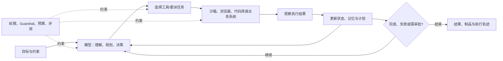

# 2026 年 AI Agent 现状、实现原理与趋势

> 调研日期：2026-08-10
> 说明：本文中的“流行”综合考虑产品影响力、开发者采用、生态活跃度和开源社区关注度，不代表严格的市场份额排名。商业产品通常不公开完整技术细节，因此其实现原理以官方公开资料和可观察行为为依据。

## 一页结论

1. **Agent 不是更会聊天的模型，而是能围绕目标持续行动的系统。** 一个实用 Agent 通常由模型、指令、工具、状态/记忆、执行环境、权限与评测组成。
2. **编程 Agent 是当前成熟度最高、竞争最激烈的方向。** Codex、Claude Code、Cursor、Gemini CLI、Devin 和 OpenHands 已从“代码补全”进入“理解仓库—修改文件—运行命令—测试—提交/交付”的完整闭环。
3. **通用 Agent 的关键不只是模型智力，而是有没有一台可控的“电脑”。** Manus、Comet、Browser Use 等依赖浏览器或云端沙箱完成网页操作、数据处理、文档生成和应用搭建。
4. **企业 Agent 正从聊天机器人转向受治理的业务执行层。** Copilot Studio、Agentforce、Gemini Enterprise Agent Platform 的竞争重点是连接器、企业数据、身份权限、审计、流程编排和行业模板。
5. **生产系统正在回归“确定性工作流 + 局部自主决策”。** 完全开放式 Agent 成本高、延迟大、难复现；可靠方案通常让模型负责理解、路由和异常处理，让代码负责交易、审批和不可逆动作。
6. **多 Agent 会增长，但不会成为所有问题的默认答案。** 只有任务能明确拆成独立角色、可并行验证或需要隔离上下文时，多 Agent 才通常优于一个强模型配合好工具。
7. **MCP 与 A2A 正在形成两层互操作标准。** MCP 连接 Agent 与工具/数据，A2A 连接 Agent 与 Agent；真正的壁垒将逐渐转向数据、权限、技能、评测集与业务闭环。
8. **安全与评测是 Agent 落地的主要瓶颈。** Prompt Injection、越权调用、敏感信息泄露、记忆污染和长链路错误累积，决定了沙箱、最小权限、人工确认、轨迹追踪和回归评测必须成为基础设施。

## 1. 什么才算 Agent

传统聊天模型通常执行一次“输入 → 输出”；Agent 则会根据目标反复观察环境、选择工具、执行动作、读取结果并修正计划，直到达到完成条件或触发停止规则。



可以把当前主流实现概括成七层：

| 层 | 作用 | 常见实现 |
|---|---|---|
| 模型 | 理解目标、推理、决策 | 推理模型、多模态模型、大小模型路由 |
| 指令 | 定义角色、边界、完成标准 | System Prompt、仓库规则、Skills、策略模板 |
| 工具 | 读取信息或改变外部世界 | Function Calling、Shell、浏览器、数据库、企业连接器、MCP |
| 编排 | 决定步骤、分支、重试和委派 | ReAct、Plan-and-Execute、状态图、Manager–Worker |
| 状态 | 保持任务连续性 | 对话历史、工作区文件、Checkpoint、短期/长期记忆、RAG |
| 运行环境 | 安全执行真实动作 | 本机、容器、云 VM、无头浏览器、IDE、移动/桌面应用 |
| 治理 | 控制风险并衡量结果 | 沙箱、最小权限、审批、预算、Tracing、Evals、审计日志 |

Anthropic 将“工作流”和“Agent”做了一个很实用的区分：前者由代码预先定义路径，后者由模型动态决定过程和工具使用；它同时建议从最简单、可组合的方案开始，因为 Agent 往往以更高延迟和成本换取灵活性。[来源](https://www.anthropic.com/engineering/building-effective-agents)

## 2. 当前有代表性的热门 Agent

### 2.1 编程 Agent：目前最成熟的赛道

| 产品 | 定位与优势 | 基本实现原理 | 更适合 |
|---|---|---|---|
| **OpenAI Codex** | 覆盖终端、IDE、桌面、云端和 GitHub 的编程 Agent；强调理解代码库、实现功能、修复问题、测试与评审 | 编程优化模型在受控工作区内循环调用文件搜索、编辑、Shell、测试和浏览器等工具；用 Skills/MCP 注入领域流程，用沙箱、审批和 Diff Review 控制副作用 | 端到端工程任务、跨文件修改、测试修复、并行后台任务 |
| **Claude Code** | 终端原生，长上下文代码理解、重构和复杂问题分析能力突出；插件、Hooks、MCP 和子 Agent 生态活跃 | 模型在“搜索/读取 → 编辑 → 执行命令 → 观察错误 → 修正”循环中工作；项目指令、权限模式、插件和工具描述共同构成 Agent Harness | 大型代码库理解、复杂重构、研究型工程任务、终端工作流 |
| **Cursor Agent** | Agent 深度嵌入编辑器，交互、Diff 审核、Checkpoint 与多会话体验成熟，并提供后台 Agent | 代码库索引/语义检索提供上下文，模型调用搜索、编辑、终端和 MCP 工具；编辑器负责局部应用变更、回滚、人工接管和并行会话 | 高频日常开发、边写边审、团队采用、前端迭代 |
| **Gemini CLI** | Google 的开源终端 Agent，免费入口和大上下文带来较强传播；支持脚本化、扩展和 MCP | 开源 CLI 负责会话、上下文文件、Checkpoint 和工具循环；模型使用文件系统、Shell、Web、MCP，并可通过 headless/JSON 输出进入 CI 自动化 | Google/GCP 生态、开源可扩展 CLI、自动化脚本 |
| **Devin** | 更接近“云端 AI 软件工程师”，强调领取任务、在后台工作并产出 PR | 官方公开架构分为云端无状态 **Brain** 与隔离 **Devbox**；每个会话拥有 Shell、编辑器和浏览器，Agent 在独立机器中执行、测试并允许人类实时接管 | 可验收的小型积压任务、迁移、测试补齐、批量并行委派 |
| **OpenHands** | 热门开源软件开发 Agent/平台，可自托管、可替换模型，适合研究和二次开发 | Agent 通过 action–observation 事件循环操作容器沙箱中的 Bash、文件和浏览器；SDK 将 Agent、工具、工作区、生命周期与安全分析解耦 | 自托管、Agent 研究、私有模型、需要修改底层 Harness 的团队 |

官方资料： [Codex](https://developers.openai.com/) · [Claude Code](https://github.com/anthropics/claude-code) · [Cursor Agent](https://docs.cursor.com/chat/overview) · [Gemini CLI](https://github.com/google-gemini/gemini-cli) · [Devin](https://docs.devin.ai/get-started/devin-intro) / [架构](https://docs.devin.ai/enterprise/deployment/overview) · [OpenHands](https://github.com/OpenHands/OpenHands) / [沙箱](https://docs.openhands.dev/openhands/usage/sandboxes/overview)

这个赛道领先的原因很直接：软件工程天然提供机器可读上下文、可执行工具和自动验收信号。代码能编译、测试能通过、Diff 能审查、Git 能回滚，使 Agent 比在开放世界中更容易形成闭环。

### 2.2 通用执行与浏览器 Agent

| 产品/项目 | 核心形态 | 基本实现原理 | 当前边界 |
|---|---|---|---|
| **Manus** | 自带云端电脑的通用 Agent，可研究、分析数据、生成文档、编写并部署应用 | Agent 获得联网沙箱、持久文件系统、软件安装与代码执行能力；长任务通过计划、工具调用、文件制品和持久云 VM 延续 | 开放任务覆盖广，但结果验收、账号权限和高风险动作仍需人类把关 |
| **Perplexity Comet** | AI 原生浏览器与侧栏/后台助手，利用当前标签页、历史、邮箱和日历上下文 | 浏览器直接提供页面文本、元数据、会话和受登录保护的 UI；Agent 结合搜索、标签页上下文与浏览器动作完成任务 | Prompt Injection、错误点击和敏感账号操作是主要风险 |
| **Browser Use** | 热门开源浏览器 Agent 框架，为任意模型提供真实浏览器操作空间 | Chromium/CDP 驱动浏览器，把 DOM/可访问性树、截图和可执行元素压缩成模型可理解的观察，再由模型选择点击、输入、导航或代码工具并循环恢复 | 通用性高于传统 RPA，但稳定性通常低于直接 API；网站变化、验证码和反自动化会影响成功率 |
| **计算机使用模型** | 模型直接看屏幕并操作浏览器、桌面或移动界面 | 多模态模型读取截图/UI 状态，输出鼠标、键盘或结构化计算机动作；外部 Harness 负责执行、截图反馈与敏感动作确认 | 是“没有 API 时的最后一公里”，不应优先替代稳定、可审计的 API |

资料： [Manus 介绍](https://manus.im/docs/introduction/welcome) / [Cloud Computer](https://help.manus.im/en/articles/15392111-what-is-the-cloud-computer) · [Comet](https://www.perplexity.ai/grow/comet) · [Browser Use](https://github.com/browser-use/browser-use) · [Gemini Computer Use](https://blog.google/innovation-and-ai/models-and-research/gemini-models/introducing-computer-use-gemini-3-5-flash/)

### 2.3 企业工作流 Agent 平台

| 平台 | 竞争优势 | 实现重点 |
|---|---|---|
| **Microsoft Copilot Studio** | Microsoft 365、Power Platform 和大量企业连接器；低代码构建与组织治理 | 用知识源、Topics/指令、连接器、Agent Flow、MCP 和 Computer Use 组合 Agent；生成式编排负责选工具，确定性流程负责关键业务动作；支持子 Agent 与触发器 |
| **Salesforce Agentforce** | Salesforce CRM 数据、对象模型和业务动作天然闭环 | Atlas Reasoning Engine 根据意图选择有明确范围和规则的 Topic，再调用允许的 Action；信任层、权限和 Guardrail 限制数据与动作边界 |
| **Gemini Enterprise Agent Platform** | Google Cloud/Workspace 数据与统一 Agent 注册、运行和治理 | ADK/Agent Studio 负责开发，Agent Runtime 负责长任务与状态，Registry/Identity/Gateway 负责发现、身份、网络出口和策略控制，并用 A2A/MCP 连接异构 Agent 与工具 |
| **ServiceNow AI Agents** | ITSM、客服、HR 等流程和数据已在同一平台内 | Agent Studio 定义角色与目标，Orchestrator 协调多个专用 Agent，直接调用 ServiceNow 工作流和记录系统完成操作 |

资料： [Copilot Studio](https://learn.microsoft.com/en-us/microsoft-copilot-studio/) / [集成策略](https://learn.microsoft.com/en-us/microsoft-copilot-studio/guidance/integrations) · [Agentforce Atlas](https://engineering.salesforce.com/inside-the-brain-of-agentforce-revealing-the-atlas-reasoning-engine/) · [Gemini Enterprise Agent Platform](https://cloud.google.com/blog/products/ai-machine-learning/introducing-gemini-enterprise-agent-platform) · [ServiceNow AI Agent Orchestrator](https://www.servicenow.com/uk/company/media/press-room/ai-agents-studio.html)

企业平台的护城河通常不是“模型更聪明”，而是：它已经知道员工是谁、能看哪些数据、能调用哪些动作、怎样审批，以及操作之后如何审计和回滚。

## 3. 热门 Agent 开发框架

产品是最终使用体验，框架则是构建自有 Agent 的底座，两者不应放在同一个排行榜中。

| 框架 | 核心抽象 | 优势 | 主要取舍 |
|---|---|---|---|
| **LangGraph** | 状态图、节点、边、Checkpoint | 控制流显式，耐久执行、暂停恢复、Human-in-the-loop 和可观测性成熟 | 更底层，开发者需要认真设计状态和图 |
| **CrewAI** | Agent、Role、Task、Crew、Flow | 角色化多 Agent 上手快，适合研究—写作—审核等协作流程 | 角色过多容易增加 Token、延迟和错误传播 |
| **OpenAI Agents SDK** | Agent、Tool、Handoff、Guardrail、Session、Trace | 抽象轻，工具调用、多 Agent 交接、实时语音、Tracing 和 Sandbox Agent 集成紧密 | 深度绑定托管能力时要评估平台依赖；开放模型兼容性需按实际功能验证 |
| **Google ADK** | Agent、Tool、Runner、Session、Memory、Callback、Event | 代码优先、模型和部署相对解耦，覆盖开发、评测与部署，适合 Google Cloud | 生态仍在快速演进，版本变化需要持续跟踪 |
| **Microsoft Agent Framework** | Agent、Session、Middleware、Graph Workflow | 继承 AutoGen 的多 Agent 思路与 Semantic Kernel 的企业能力，支持 Python/.NET、Checkpoint、OpenTelemetry 与 Foundry 部署 | 新一代整合框架，旧 AutoGen/Semantic Kernel 项目需要迁移决策 |
| **Browser Use** | Browser、Observation、Action、Recovery Loop | 把网页变成模型可操作环境，适合没有 API 的 Web 自动化 | UI 自动化天然脆弱，安全与成功率需要额外工程 |

资料： [LangGraph](https://docs.langchain.com/oss/python/langgraph/overview) · [CrewAI](https://docs.crewai.com/index) · [OpenAI Agents SDK](https://github.com/openai/openai-agents-python) · [Google ADK](https://github.com/google/adk-python) · [Microsoft Agent Framework](https://github.com/microsoft/agent-framework) · [Browser Use](https://github.com/browser-use/browser-use)

### 开源关注度快照

GitHub Star 只能表示开发者关注度，不能等价为活跃用户、企业采用或产品质量，但能帮助观察生态热度。截至本次调研，代表项目大致为：

| 项目 | 约 Star 数 | 类型 |
|---|---:|---|
| Claude Code | 139k | 编程 Agent/插件生态入口 |
| Gemini CLI | 105k | 开源终端 Agent |
| Browser Use | 96k | 浏览器 Agent 框架 |
| OpenAI Codex | 86k | 开源终端编程 Agent |
| OpenHands | 75k | 开源软件开发 Agent 平台 |
| CrewAI | 54k | 多 Agent 框架 |
| LangGraph | 37k | 状态化编排框架 |
| OpenAI Agents SDK（Python） | 27k | Agent SDK |
| Microsoft Agent Framework | 11k | 企业 Agent/工作流框架 |

Star 数据来源于相应 GitHub 仓库页面，数值会持续变化，不宜用于精确排名。

## 4. 主流实现模式

### 4.1 Tool-calling 循环：Agent 的最小内核

最常见的内核并不复杂：

```text
state = 初始化(目标、约束、上下文、预算)
while 未完成 and 未超出预算:
    observation = 获取当前环境与上一步结果
    decision = 模型选择：回答 / 调工具 / 修改计划 / 请求审批 / 委派
    result = 在权限边界内执行 decision
    state = 记录结果、错误、制品与剩余任务
return 最终结果 + 可验证制品 + 执行轨迹
```

真正困难的部分不在循环本身，而在上下文如何选择、工具描述是否准确、错误如何恢复、完成条件是否可验证、权限如何限制以及失败是否可追踪。

### 4.2 ReAct 与 Plan-and-Execute

- **ReAct**：每轮根据最新观察做一次推理和动作，灵活且容易恢复，适合环境变化快的任务；缺点是调用次数多，可能绕路。
- **Plan-and-Execute**：先拆分任务，再逐步执行并定期重规划，适合长任务；缺点是初始计划可能建立在错误假设上。
- 实际产品通常混合两者：先生成粗粒度计划，每一步内部再用 ReAct，失败后局部重规划。

### 4.3 状态图与确定性流程

将任务拆成节点，把分支、重试、审批和异常路径写成显式图，能换来可恢复、可测试和可审计。LangGraph、CrewAI Flows、Microsoft Agent Framework 和企业低代码平台都在向这种模式靠拢。

### 4.4 Manager–Worker 多 Agent

一个 Manager 负责拆分、分派和汇总，多个 Worker 使用不同工具或上下文并行执行。它适用于：

- 多个子任务相互独立，可并行缩短墙钟时间；
- 专业角色需要不同工具、权限或上下文；
- 需要独立生成与交叉审核；
- 单一上下文过大，需要隔离信息。

不适合的情况是：任务强串行、共享状态频繁变化、子任务无法独立验收，或一次强模型调用已经足够。此时多 Agent 往往只是增加协调成本。

### 4.5 Context Engineering、RAG、Memory 与 Skills

Agent 的能力越来越取决于“每一步拿到什么上下文”，而不只是 System Prompt：

- **RAG** 提供当前任务所需的外部事实；
- **短期状态** 保存计划、工具结果和未完成事项；
- **长期记忆** 保存稳定偏好与跨会话知识，但必须防止污染和过期；
- **Skills** 把领域知识、步骤、脚本和资源封装成按需加载的能力；
- **上下文压缩** 将长轨迹总结为可继续执行的任务状态，降低成本和注意力稀释。

### 4.6 沙箱、权限与人工审批

执行 Agent 的风险来自它可以改变外部状态。成熟 Harness 通常采用：

- 每任务独立容器/VM，限制文件、网络和系统调用；
- 工具白名单、域名白名单和最小权限凭据；
- 读取与写入分权，发送、购买、删除、发布等动作强制确认；
- 限制轮次、Token、时间、并发和费用；
- 保存命令、工具参数、页面观察、Diff 和审批轨迹；
- 对网页、邮件、文档和工具返回值中的间接 Prompt Injection 做隔离与检测。

## 5. 2026 年后的主要趋势

### 趋势一：从“模型产品”转向“Agent Harness 与 Runtime”

模型能力仍重要，但产品差异越来越来自代码搜索、浏览器、沙箱、Checkpoint、Skills、权限、评测、人工接管和交付界面。相同模型放进不同 Harness，实际任务完成率可能差别很大。

### 趋势二：编程 Agent 从副驾驶走向“可委派的工程队列”

交互式 IDE Agent 会继续存在，但增长更快的形态是后台任务、GitHub/CI 触发、批量迁移、自动修复和并行 Worker。工程师的工作重心会从逐行生成代码转向定义任务、准备环境、编写验收标准和审查结果。

### 趋势三：协议层标准化

[MCP](https://modelcontextprotocol.io/docs/learn/architecture) 采用 Host–Client–Server 架构，让服务器以 Tools、Resources 和 Prompts 暴露能力；[A2A](https://a2a-protocol.org/latest/) 则负责 Agent 发现、任务委派、状态更新和 Artifact 交换。短期内会出现大量适配器，长期则会推动工具、身份、授权和审计接口标准化。

### 趋势四：长任务、持久运行与异步交付

Agent 正从一次会话升级为可暂停、恢复、定时、后台运行的任务实体。云端 VM、持久文件系统、Checkpoint、任务 Inbox 和移动端接管会成为标配。但任务越长，错误累积越严重，因此必须同时发展中间验收、预算控制和自动回滚。

### 趋势五：多 Agent 从演示走向“有限、可验证的并行化”

多 Agent 的价值主要是并行、上下文隔离、权限隔离与独立审核，不是模拟一群角色开会。OpenAI 的模型指引也把多 Agent 定位为适合可清晰拆分的复杂任务，并强调并发、停止条件和输出证据。[来源](https://developers.openai.com/api/docs/guides/latest-model)

### 趋势六：Agentic 与 Deterministic 融合

生产系统会把 LLM 放在模糊判断最有价值的位置：理解意图、分类、提取、规划、选择工具、处理例外；把金额计算、权限判断、审批、数据库事务和不可逆操作留给确定性代码。未来“工作流是不是 Agent”不再重要，重要的是自主性被放在什么边界内。

### 趋势七：评测从最终答案扩展到整条轨迹

只判断最后一句是否正确不够，还要评估选错工具、重复调用、越权尝试、无效绕路、成本、延迟和恢复能力。Tracing、真实任务集、可复现沙箱、LLM-as-Judge 加确定性断言，以及失败轨迹转回归用例，会成为 Agent 工程的标准闭环。OpenAI Agents SDK 已把模型调用、工具、Handoff 和 Guardrail 纳入 Trace；Anthropic 也强调现代 Agent Evals 需要明确任务、稳定环境和完整测试。[OpenAI](https://openai.github.io/openai-agents-python/tracing/) · [Anthropic](https://www.anthropic.com/engineering/demystifying-evals-for-ai-agents)

### 趋势八：安全重心转向 Zero Trust Agent

Agent 会读取不可信网页、邮件、代码和文档，又持有真实工具权限，间接 Prompt Injection 因此成为结构性风险。趋势是把安全边界移出 Prompt：采用独立策略引擎、能力令牌、按动作授权、数据来源标记、输入/输出隔离、敏感动作确认、网络出口控制和持续红队测试。[Anthropic 的防护说明](https://platform.claude.com/docs/en/test-and-evaluate/strengthen-guardrails/mitigate-jailbreaks)也明确区分了来自第三方内容的间接 Prompt Injection。

### 趋势九：成本优化从“少用 Token”升级为模型与工具路由

未来 Agent 会根据步骤选择不同模型：强模型做规划和疑难判断，小模型做分类与格式化，代码运行时做过滤、聚合和校验；同时使用缓存、并行工具调用、上下文压缩和阶段性摘要。结果质量相同的前提下，减少模型回合数会比单纯压缩 Prompt 更关键。

### 趋势十：垂直 Agent 与企业数据闭环胜过通用 Demo

客服、销售、研发、IT 运维、财务对账、法务审阅等垂直场景具备稳定数据源、固定工具和明确 KPI，更容易建立评测与 ROI。通用 Agent 会作为入口存在，但真正可规模化的价值大概率来自受约束的行业 Agent 和组织内部 Skills。

## 6. 仍未解决的核心问题

1. **可靠性随链路长度下降**：每一步 98% 正确，连续 30 步全部正确的理论概率也只有约 55%。Agent 需要检查点、局部验证和恢复，而不是盲目增加步骤。
2. **“完成”难以定义**：代码有测试，研究、设计、商务沟通往往没有自动判据，Agent 容易产出看似完整但不可用的结果。
3. **开放环境不可控**：网页变化、登录过期、验证码、网络波动、工具返回格式变化都会打断长任务。
4. **权限与身份链复杂**：用户委派给 Agent、Agent 再委派子 Agent 时，谁能做什么、代表谁做、谁承担责任仍需统一治理。
5. **Prompt Injection 尚无银弹**：只靠系统提示无法成为安全边界；浏览器和邮件 Agent 尤其需要最小权限与人工确认。
6. **评测容易与真实业务脱节**：通用 Benchmark 能比较模型，但企业最终需要自己的黄金任务、真实环境和失败成本权重。
7. **成本和延迟不可忽略**：开放式规划、多 Agent 讨论和长上下文会快速放大推理费用与响应时间。

[METR 的任务完成时间跨度研究](https://evals.alignment.org/time-horizons/)显示前沿 Agent 能处理的任务长度持续增长，但其页面也提示超过 16 小时的测量目前不够可靠。这说明能力曲线在上升，但“能稳定接管长期工作”仍不能直接由短基准外推。

## 7. 选型建议

### 个人开发者或小团队

- 日常编码优先比较 **Codex、Claude Code、Cursor、Gemini CLI**，用自己的真实仓库任务评测，不要只看公开榜单。
- 需要免费/开源入口和可修改 CLI，可先看 **Gemini CLI、OpenHands**；需要深度自托管和研究 Harness，可重点看 **OpenHands**。
- 浏览器自动化先找 API；确实没有 API，再使用 **Browser Use/Computer Use**，并限定域名与写操作。

### 构建自有 Agent 产品

- 流程强约束、需暂停恢复和审计：优先 **LangGraph** 或 **Microsoft Agent Framework**。
- 快速做角色化多 Agent 原型：可选 **CrewAI**，但先验证单 Agent 是否已足够。
- 需要轻量工具调用、Handoff、Guardrail、Tracing 或实时语音：可选 **OpenAI Agents SDK**。
- 主要运行在 Google Cloud/Gemini 生态：可选 **Google ADK**。
- 无论选哪一个框架，都应把领域工具、状态模型、权限策略和评测集保持为可迁移资产。

### 企业落地

建议按以下顺序推进：

1. 选择输入、输出和成功标准明确的高频流程；
2. 先做只读 Agent，再开放低风险写操作；
3. API/连接器优先，GUI Computer Use 作为补充；
4. 用最小权限身份运行，每个高风险动作单独授权；
5. 建立真实任务评测集、全链路 Trace、成本与失败告警；
6. 达到稳定阈值后再增加持久记忆、后台运行和多 Agent；
7. 对删除、付款、发布、外发消息、生产变更保留人工审批。

## 8. 最终判断

Agent 的发展方向已经比较清晰：**模型负责理解和决策，工具负责行动，沙箱承载执行，状态维持连续性，协议连接生态，评测和权限保证可用性。**

未来 12–24 个月，最值得关注的不是又出现多少“全能 Agent”，而是以下三件事：

- 编程 Agent 能否从单次任务稳定扩展到长周期工程协作；
- MCP/A2A、身份与权限能否形成真正可互操作的 Agent 基础设施；
- 企业能否把 Agent 的成功率、风险和成本变成可观测、可回归、可审计的工程指标。

短期最现实的产品形态仍会是“人类设目标和边界，Agent 执行大部分过程，人类在关键节点验收”。完全自治会在可验证、可回滚的封闭场景中先落地，而不是一步到位替代开放环境中的所有知识工作。

## 参考资料

- [OpenAI Developers：Codex 与 Agent 能力](https://developers.openai.com/)
- [OpenAI Agents SDK](https://github.com/openai/openai-agents-python)
- [OpenAI Model Guidance：工具调用与 Multi-agent](https://developers.openai.com/api/docs/guides/latest-model)
- [Anthropic：Building Effective Agents](https://www.anthropic.com/engineering/building-effective-agents)
- [Anthropic：Claude Code](https://github.com/anthropics/claude-code)
- [Cursor Agent 文档](https://docs.cursor.com/chat/overview)
- [Google Gemini CLI](https://github.com/google-gemini/gemini-cli)
- [Cognition Devin 文档](https://docs.devin.ai/get-started/devin-intro)
- [OpenHands](https://github.com/OpenHands/OpenHands)
- [Manus 文档](https://manus.im/docs/introduction/welcome)
- [Perplexity Comet](https://www.perplexity.ai/grow/comet)
- [LangGraph 文档](https://docs.langchain.com/oss/python/langgraph/overview)
- [CrewAI 文档](https://docs.crewai.com/index)
- [Google ADK](https://github.com/google/adk-python)
- [Microsoft Agent Framework](https://github.com/microsoft/agent-framework)
- [Model Context Protocol 架构](https://modelcontextprotocol.io/docs/learn/architecture)
- [Agent2Agent Protocol](https://a2a-protocol.org/latest/)
- [METR：Task-Completion Time Horizons](https://evals.alignment.org/time-horizons/)
