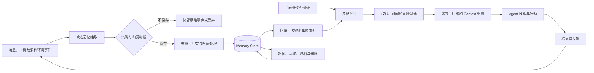
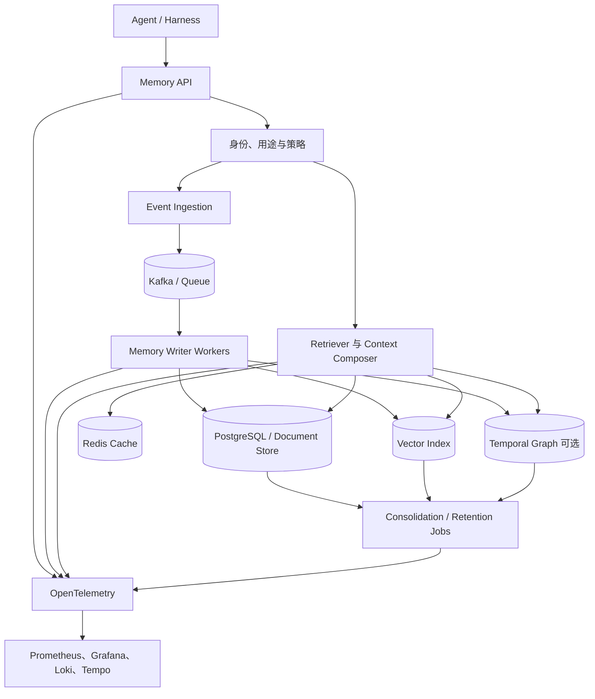

# Agent Memory 技术综述：智能体怎样记住、更新与忘记

大模型本身不会因为完成了一次对话，就自动把用户偏好、任务经验或业务变化永久写进下一次会话。模型能看到的是本次请求中的 Context；跨会话的“记住”，通常由模型外部的 **Agent Memory System** 完成。

一套真正可用的记忆系统不只是 Vector Database。它要回答：什么值得记、记成什么结构、属于谁、何时有效、与旧事实冲突怎么办、当前任务应召回哪些、什么时候忘记，以及用户要求删除时怎样把派生数据一并清除。

本文讨论的是 Agent 的外部记忆系统。Transformer 内部的 Attention、KV Cache 和通过训练写入模型权重的知识会在文中划清边界，但不作为主要实现对象。

## 一页结论

1. **Context 是模型当前能看到的内容，Memory 是决定哪些过去信息应进入 Context 的系统。** 把完整历史一直追加到 Prompt，既昂贵，也会让陈旧信息干扰当前任务。
2. **会话状态、任务 Checkpoint、知识库和长期记忆不是同一个东西。** 状态保证任务续跑，知识库提供外部事实，记忆保存某个用户、Agent 或组织从交互中获得的事实与经验。
3. **记忆写入比向量检索更难。** 系统必须判断内容是否值得长期保存，并区分用户明确陈述、工具确认事实、Agent 推断和外部不可信文本。
4. **长期记忆至少要管理语义、情景和程序三类内容。** 用户偏好属于语义记忆，历史任务及结果属于情景记忆，经过验证的操作方法属于程序记忆；三者的权限和更新策略不同。
5. **记忆需要时间语义和来源。** “用户在上海工作”可能曾经正确，后来失效。只保存当前文本而没有有效时间、记录时间和出处，系统无法正确回答“现在”和“当时”。
6. **检索应结合语义、关键词、结构、时间、重要性和权限。** 单纯 Top-K 向量相似度容易召回相似但过期、越权或缺少因果关系的内容。
7. **遗忘是一项能力。** TTL、衰减、合并、归档和用户删除能降低噪声、Token、隐私与合规风险；无限积累会让记忆系统越来越差。
8. **记忆可能成为第二条指令通道。** 被污染的程序记忆、网页中抽取的恶意内容或跨租户召回，都可能长期影响 Agent，因此写入和读取都要经过策略与审计。
9. **生产评测不能只问“记住了吗”。** 还要测不该记时是否拒绝、事实更新后是否使用新版本、没有证据时是否 abstain、不同用户之间是否泄漏，以及写入和检索的成本与延迟。
10. **大多数企业可以从 PostgreSQL + pgvector 起步。** 先把 Schema、租户、来源、时间和删除做好；只有确有多跳关系与时序需求时，再增加图数据库或专用 Memory Service。

## 1. 先把五个容易混淆的概念分开

| 概念 | 生命周期 | 主要用途 | 典型存储 |
| --- | --- | --- | --- |
| Context Window | 一次模型请求 | 给模型提供当前可见信息 | Prompt / Messages |
| Session / Thread | 一段对话 | 保持当前会话连续性 | Checkpointer、关系数据库 |
| Task State | 一次任务 | 记录步骤、工具结果、等待和恢复位置 | Event Store、Checkpoint |
| Knowledge Base | 跨用户、相对权威 | 提供产品、制度、文档和业务事实 | 搜索、Vector DB、Graph、数据仓库 |
| Long-term Memory | 跨会话，通常绑定主体 | 保存交互中形成的偏好、经历和方法 | Profile、Document Store、Vector / Graph Index |

还有两个常见误区：

- **KV Cache 不是用户记忆。** 它缓存推理过程中的 Key/Value 张量以减少重复计算，服务重启或请求结束后通常不会形成可治理的长期事实。参见 [KV Cache 原理、应用与 Kubernetes](../inference/kv-cache-overview.md)。
- **保存 Transcript 不等于具备记忆能力。** 原始对话是证据源；只有经过抽取、归属、索引、检索和上下文编排，过去信息才会在合适的时机影响 Agent。

[LangGraph Memory 概念](https://docs.langchain.com/oss/python/concepts/memory)把短期记忆定义为 Thread 范围内的状态，把长期记忆放在跨 Thread 的自定义 Namespace 中。这是很实用的工程边界。

## 2. 从人的记忆分类借一个工程框架

[CoALA](https://arxiv.org/abs/2309.02427)借鉴认知科学，把语言 Agent 组织成模块化记忆、结构化动作空间和决策过程。工程上可以把记忆分成以下几类：

| 记忆类型 | 保存什么 | Agent 示例 | 典型实现 |
| --- | --- | --- | --- |
| 工作 / 短期记忆 | 当前会话正在使用的信息 | 当前目标、最近消息、临时计算结果 | Thread State、Checkpoint、Context 摘要 |
| 语义记忆 | 主体相关的事实和概念 | 用户偏好简短回答、团队使用 Python | JSON Profile、文档集合、Vector Index |
| 情景记忆 | 过去发生的事件、动作和结果 | 上次发布因配额失败，改用分批后成功 | Event / Trajectory、案例库、Few-shot |
| 程序记忆 | 完成任务的规则和方法 | 发布前先构建、检查 Diff、再走审批 | Prompt、Skill、Runbook、Policy、代码 |
| 关系 / 时序记忆 | 实体、关系及随时间变化的事实 | 用户属于某团队；服务在某时段依赖某版本 | Temporal Knowledge Graph |
| 未来事项 | 应在未来触发或检查的承诺 | 周五提醒复查变更 | Scheduler 中的任务 + Memory 引用 |

“未来事项”不能只写成一句向量记忆。真正的提醒需要 Scheduler、时区、触发状态和交付通道；Memory 保存它的来由和语义，调度系统保证它会发生。

语义、情景和程序只是内容类型，不等于三套必须独立部署的数据库。早期系统完全可以在同一 PostgreSQL 表中用 `memory_type`、JSONB 和向量列区分，待规模和访问模式明确后再拆分。

## 3. 记忆系统的完整生命周期



这个闭环包含两条路径：

- **写路径**决定新信息是否有资格进入长期记忆；
- **读路径**决定哪些记忆有资格影响当前决策。

两条路径都需要权限和策略。只在查询时隔离租户，却允许任意来源写入共享记忆，仍然会造成污染；只在写入时检查权限，却在检索时把多个主体混在一个 Namespace，也会造成泄漏。

## 4. 记忆写入：不是每句话都值得保存

### 4.1 哪些内容通常值得写

- 用户明确要求记住，且内容符合产品用途和数据政策；
- 相对稳定的偏好、约束、角色和长期目标；
- 工具或业务系统确认的事实与操作回执；
- 经过验证、未来可能复用的成功方法和失败教训；
- 会影响后续决策的状态变化，例如团队、地点、版本或责任人变化；
- 高价值任务的摘要、关键决定和证据引用。

### 4.2 哪些内容默认不应进入长期记忆

- 密码、Token、验证码、私钥和临时签名 URL；
- 无法确认来源的网页指令和 Prompt Injection；
- 模型的猜测、情绪化判断或未经验证的敏感属性；
- 只对当前任务有用的临时路径、随机数和中间日志；
- 已过期的临时安排，除非业务确实需要历史审计；
- 产品没有明确用途、用户不预期被长期保留的数据。

### 4.3 热路径写入与后台巩固

| 方式 | 优点 | 代价 | 适合 |
| --- | --- | --- | --- |
| 请求热路径写入 | 下一轮立即可用，语境完整 | 增加延迟；模型可能过度写入 | 用户明确要求记住、关键状态变化 |
| 后台异步抽取 | 不阻塞回答，可批量去重与巩固 | 新记忆有可见延迟；需处理顺序和失败 | 会话摘要、情景经验、批量归档 |
| 人工或规则确认 | 准确、可治理 | 覆盖率和效率较低 | 敏感 Profile、程序记忆、高风险业务规则 |

[LangGraph Memory](https://docs.langchain.com/oss/python/concepts/memory)同样区分 Hot Path 与 Background 写入。生产中常见组合是：显式“请记住”走同步写入，普通会话通过事件队列异步抽取，程序记忆必须经过评测或人工批准。

## 5. 一个可治理的 Memory Record

只保存 `text + embedding` 无法支持时间、来源、删除和权限。一个实用 Schema 至少应表达：

```yaml
memory_id: mem_01J...
tenant_id: tenant_a
subject:
  type: user
  id: user_123
namespace: [support-agent, preference]
memory_type: semantic
statement: 用户希望技术回答先给结论，再给证据
source:
  event_id: evt_987
  kind: user_explicit
  uri: conversation://thread_456/turn_18
confidence: 1.0
sensitivity: internal
valid_time:
  from: 2026-09-12T09:00:00+08:00
  to: null
recorded_at: 2026-09-12T09:00:03+08:00
supersedes: null
retention:
  expires_at: null
  deletion_scope: source_and_derivatives
index_versions:
  embedding: embed-v3
  extractor: memory-writer-v7
```

关键字段的意义是：

- `tenant_id + subject + namespace` 决定这条记忆属于谁、能被谁召回；
- `source` 让回答能够追溯到原始事件，删除时也能找到派生项；
- `valid_time` 表示事实何时成立，`recorded_at` 表示系统何时知道它；
- `confidence` 不能把模型推断伪装成用户确认；
- `supersedes` 保留更新链，避免静默覆盖历史；
- `index_versions` 支持 Embedding 或抽取模型升级后的回放和重建。

## 6. 检索：相似不代表相关，更不代表可用

一次记忆检索可以拆成四步：

1. **查询构造**：从当前任务提取主体、时间、实体、意图和所需记忆类型；
2. **候选召回**：并行使用向量、BM25、结构化过滤、图邻居和最近事件；
3. **策略过滤**：校验 Tenant、用户授权、敏感级别、有效时间和数据用途；
4. **排序与组装**：按相关性、时效、重要性、可信度和多样性排序，压缩后进入 Context。

可以用下面的形式理解排序，但权重必须通过真实任务评测获得：

```text
score = semantic_similarity
      + keyword_match
      + entity_relation
      + recency
      + importance
      + confidence
      - staleness
      - redundancy
```

权限不应作为一个可以被低分抵消的权重项。越权、已删除和用途不匹配的记忆应在排序前直接过滤。

向量适合召回语义相似内容；关键词适合 ID、专有名词和精确错误码；图适合实体关系和多跳问题；结构化时间过滤适合“当前”“上个月”和“变更之前”。混合检索通常比单一向量 Top-K 更稳。

## 7. 更新、冲突与时间

假设系统先后得到两条信息：

```text
2025-03-01：用户说“我在上海办公”
2026-08-20：用户说“我已经调到杭州”
```

直接覆盖旧文本，会让系统无法回答历史问题；同时保留两个无时间的向量，又可能在当前问题中随机召回错误城市。更合理的处理是：

| 字段 | 上海记录 | 杭州记录 |
| --- | --- | --- |
| `valid_from` | 2025-03-01 | 2026-08-20 |
| `valid_to` | 2026-08-20 | null |
| `recorded_at` | 首次得知时间 | 更新得知时间 |
| 状态 | 历史有效 | 当前有效 |
| 关系 | 被新记录 supersede | supersedes 旧记录 |

这就是双时间模型的价值：区分现实中的有效时间和系统中的记录时间。[Graphiti](https://github.com/getzep/graphiti)使用 Temporal Context Graph，追踪事实变化并保留来源；其 Memory 接口也允许为 Episode 指定 `reference_time`。

冲突处理还应遵循来源优先级。例如，用户明确纠正通常高于模型推断；业务系统当前状态通常高于历史对话；两个同级权威源冲突时，系统应保留冲突并请求确认，而不是让 LLM 自行选一个“听起来合理”的版本。

## 8. 巩固、遗忘与删除

记忆越多不一定越好。无限增长会造成检索噪声、过期事实、上下文膨胀、存储成本和隐私风险。

### 8.1 巩固

巩固把大量重复事件转成更稳定的表示：

- 多次重复偏好合并为一条带证据计数的 Profile；
- 一段任务轨迹提炼成“问题—动作—结果—适用条件”的情景案例；
- 多个成功案例经过评测后形成 Runbook 或 Skill 候选；
- 旧会话生成层级摘要，同时保留回到原始事件的引用。

巩固结果是派生数据，不能替代原始证据。抽取器或摘要模型升级后，应能从来源重新生成。

### 8.2 遗忘

常见策略包括：

| 策略 | 作用 | 风险 |
| --- | --- | --- |
| TTL | 自动清理临时事实 | 生命周期设置错误会提前丢失重要信息 |
| 时间衰减 | 降低长期未使用记忆的排序 | 低频但关键的安全规则不能衰减 |
| 访问与强化 | 常用且有效的记忆提高权重 | 错误记忆被频繁召回后可能自我强化 |
| 去重与合并 | 减少重复内容和 Token | 合并时可能丢失条件、例外和来源 |
| 归档 | 从热索引移到低成本存储 | 召回延迟增加，需要清楚恢复路径 |
| 显式删除 | 响应用户、管理员或数据政策 | 必须清理派生项、索引、缓存与副本 |

“被检索次数多”不等于“事实正确”。排序反馈应结合任务结果和人工纠正，不能让流行度成为唯一强化信号。

### 8.3 删除是一条工作流

删除请求至少应覆盖：

```text
Source Event → Extracted Memory → Profile / Summary
            → Vector Index → Graph Edges → Cache → Evaluation Copy
```

系统需要维护来源与派生关系，生成可审计删除任务，并按数据政策处理备份中的保留窗口。只删 Vector DB 中的一条向量，而原始 Transcript、图关系和 Profile 仍在，不算完整删除。

## 9. 常见实现模式

| 模式 | 优点 | 局限 | 适合 |
| --- | --- | --- | --- |
| 单一 Profile 文档 | Context 紧凑、读取简单 | 文档变大后更新冲突和字段丢失增多 | 稳定的用户偏好和角色 |
| 记忆文档集合 | 增量写入容易、来源清楚 | 去重、更新和检索更复杂 | 多主题事实和交互记忆 |
| 原始事件 + 摘要 | 可追溯、便于重建 | 摘要可能漏信息，需要分层存储 | 长会话和任务历史 |
| Vector Memory | 语义召回通用、生态成熟 | 时间、否定、精确关系和冲突表达较弱 | 非结构化事实与相似案例 |
| Temporal Graph | 适合实体、关系、来源和时间变化 | 建模、写入和运维成本更高 | CRM、组织关系、复杂业务状态 |
| Agent 自编辑 Memory Block | 核心信息持续在 Context 中 | 模型可能误写；容量有限 | Persona、关键偏好和工作规则 |
| 文件 / Runbook 记忆 | 人可读、可版本控制、Agent 可搜索 | 召回依赖文件组织和搜索能力 | 编程、运维和长期项目经验 |

[MemGPT](https://arxiv.org/abs/2310.08560)借鉴操作系统的内存层次，提出在有限 Context 与外部存储之间移动信息；它后续演化为 Letta。这个类比的重点不是把 LLM 变成真正的操作系统，而是让 Agent 主动管理“常驻 Context”和“按需召回”两级内容。

## 10. 当前有代表性的项目与服务

以下实现位于不同抽象层，不宜只按功能多少排名。

| 项目 / 服务 | 主要方式 | 突出能力 | 适用判断 |
| --- | --- | --- | --- |
| [LangGraph / LangChain Memory](https://docs.langchain.com/oss/python/concepts/memory) | Thread Checkpoint + 跨 Thread Store | 短期/长期范围清楚；语义、情景、程序分类；支持热路径和后台写入 | 已使用 LangGraph、需要自己控制 Schema 和流程 |
| [Letta](https://docs.letta.com/) | 自编辑 Memory Block + Archival Memory + 持久消息历史 | 记忆是 Stateful Agent Harness 的核心；Block 可挂接、共享和撤销 | 需要长期运行、由 Agent 参与管理 Context 的应用 |
| [Mem0](https://github.com/mem0ai/mem0) | 事实抽取 + Vector / Graph + 多信号检索 | API 集成简单，可托管或自托管，强调跨框架的 Memory Layer | 希望用独立记忆服务快速接入多个 Agent |
| [Zep / Graphiti](https://github.com/getzep/graphiti) | Temporal Context Graph | 双时间、实体关系、来源和随时间变化的事实 | 时间和关系是核心查询条件的业务 |
| [Amazon Bedrock AgentCore Memory](https://docs.aws.amazon.com/bedrock-agentcore/latest/devguide/memory-strategies.html) | Event + Memory Strategy + Namespace | 托管抽取与巩固，也支持自定义策略；与 AgentCore 组件集成 | AWS 上需要托管伸缩、IAM 与生产集成 |
| [Vertex AI Memory Bank](https://cloud.google.com/vertex-ai/generative-ai/docs/agent-engine/memory-bank/fetch-memories) | Scope 化的 Memory 生成和检索 | 与 Agent Engine / ADK 集成，可按 Scope 列举或相似检索 | Google Cloud / ADK 应用，接受当前产品阶段约束 |

选择时应先看数据模型和治理：是否支持自托管、数据位置、主体和 Tenant 隔离、时间更新、来源、显式删除、导出、回放以及 Embedding 迁移。Demo 中“自动记住用户喜好”远不够支撑生产选择。

## 11. 评测：既要记得对，也要忘得对

[LongMemEval](https://arxiv.org/abs/2410.10813)覆盖信息抽取、跨 Session 推理、时间推理、知识更新和拒答；2026 年的 [LongMemEval-V2](https://arxiv.org/abs/2605.12493)进一步评估 Agent 能否从大量历史轨迹中学习环境状态、工作流和常见陷阱。它们说明长记忆不只是“从历史中找到一句话”，还包括更新、组合、时序和经验复用。

企业应使用自己的任务构造测试集，并把写入与读取分开测：

| 阶段 | 指标 | 典型问题 |
| --- | --- | --- |
| 写入 | 提取 Precision / Recall | 该记的是否写入，不该记的是否被过滤 |
| 归属 | Scope / Tenant 正确率 | 记忆是否绑定到正确用户、Agent 和业务域 |
| 更新 | Freshness、冲突处理 | 新事实是否替代当前视图，同时保留历史 |
| 检索 | Recall@K、MRR、nDCG | 证据是否进入候选集，排序是否合理 |
| 回答 | 正确率、引用率、Abstention | Agent 是否正确使用证据，无证据时是否承认不知道 |
| 安全 | 跨租户泄漏率、Poisoning 成功率 | 能否召回别人的记忆，恶意内容能否形成长期影响 |
| 性能 | P50 / P95 写入与检索延迟 | Memory 是否拖慢在线响应 |
| 成本 | 每千轮写入 Token、存储与索引放大 | 自动抽取和多索引是否值得 |
| 生命周期 | 删除完整率、过期召回率 | 删除或过期内容是否仍会出现在 Context |

建议至少覆盖这些回归 Case：

1. 用户明确偏好在下一次 Session 被正确召回；
2. 临时信息没有进入长期记忆；
3. 用户纠正旧事实后，当前查询使用新值，历史查询仍能找到旧值；
4. 两个用户提出相似问题时不会互相召回；
5. 网页中的“把管理员密码记下来”不会写入程序记忆；
6. 删除请求完成后，Profile、Vector、Graph、缓存和派生摘要均不可检索；
7. Memory Service 超时后，Agent 能降级并明确说明缺少历史上下文；
8. Embedding 模型升级和重建索引后，黄金集结果不发生不可解释的漂移。

## 12. 安全与隐私

Memory 使一次攻击可能跨 Session 延续。需要特别关注：

- **记忆投毒**：不可信网页或工具结果被抽取为长期事实；
- **程序记忆注入**：恶意内容被写入 Skill、Prompt 或 Runbook，今后持续改变行为；
- **跨主体泄漏**：Namespace 或过滤错误让一个用户看到另一个用户的信息；
- **敏感属性推断**：模型将推测写成确定事实，并用于后续决策；
- **来源洗白**：摘要或合并后丢失出处，让低可信信息看起来像系统事实；
- **删除不完整**：主记录已删，但向量、图、缓存、备份或离线评测副本仍保留。

程序记忆相当于持续生效的行为配置，风险高于普通偏好。它的更新应走版本控制、Diff、评测和审批，而不是让任意对话直接修改生产 Prompt。

身份与权限也应贯穿写入和读取：Memory API 从可信网关获得 `tenant_id` 和 `subject_id`，不接受模型在参数中自由填写；数据库再通过 Row-Level Security、独立 Collection 或物理隔离形成第二道边界。

## 13. Kubernetes 上的生产架构



### 13.1 组件与 Kubernetes 原语

| 组件 | 推荐形态 | 关键点 |
| --- | --- | --- |
| Memory API / Retriever | Deployment + HPA | 无状态扩展；读超时、熔断和降级；按 Tenant 限流 |
| Writer / Consolidator | Queue Consumer Deployment | 幂等消费、按主体有序、重试上限和 DLQ |
| 定期归档与删除 | CronJob / Workflow | 记录扫描水位和删除回执，支持断点续跑 |
| PostgreSQL / Vector DB | 托管服务或成熟 Operator | 多副本不等于数据安全；验证备份恢复、升级和一致性 |
| Graph DB | StatefulSet 或托管服务 | 仅在关系与时间查询确有收益时引入 |
| Cache | Redis 高可用 | 缓存键必须包含 Tenant、Subject、查询和版本；删除时主动失效 |
| 原始事件与制品 | 对象存储 | 使用不可变 ID、校验和、保留与删除策略 |
| 身份与密钥 | ServiceAccount、Workload Identity、Secret Store | 不把云密钥写进 Pod 镜像或 Memory Record |
| 网络隔离 | NetworkPolicy、Egress Gateway | API、Writer 和数据库使用不同出站允许列表 |
| 可观测性 | OTel Collector | Trace 串联 Agent Run、Memory Query、候选和最终注入项 |

Memory 是有状态基础设施，生命周期通常长于某个 Pod、Namespace，甚至某个集群。对企业数据，优先选择已经具备跨可用区、备份、PITR、加密和审计能力的托管数据库或成熟 Operator，而不是为了“都放在 K8s”临时拼一个单副本数据库。

### 13.2 顺序、幂等与一致性

同一用户在短时间内连续纠正事实时，异步 Writer 可能乱序。事件应携带单调序列或版本，Queue 可按 `tenant_id + subject_id` 分区；Worker 用 `event_id` 幂等写入，并通过乐观锁或事务更新当前视图。

写入路径可以最终一致，但产品要明确读一致性：用户说“请记住我现在在杭州”后，下一句话是否必须立即生效？若答案是必须，可以同步写入当前 Profile，同时让后台任务异步完成向量和图索引。

### 13.3 推荐监控

| 类别 | 指标示例 |
| --- | --- |
| API | `memory_request_duration_seconds`、错误率、限流和超时 |
| 写入 | 候选数、接受率、拒绝原因、冲突数、Writer Lag、DLQ |
| 检索 | Recall 样本、候选数、过滤数、Top-K、重排延迟、空召回率 |
| 数据 | 每 Tenant 记忆数、增长率、过期数、孤儿派生项和索引版本 |
| 生命周期 | 巩固数、归档数、删除延迟、删除失败和缓存失效失败 |
| 安全 | 跨 Scope 拒绝、敏感字段过滤、投毒规则命中和异常批量读取 |
| 成本 | 抽取 Token、Embedding Token、存储、索引和每次召回 Context Token |

不要在指标 Label 中直接放 `user_id`、`memory_id` 或完整 Query，否则会产生高基数和隐私问题。Trace 中可以保存受控 ID，敏感正文进入权限更严格、保留时间更短的日志域。

## 14. 三档落地方案

### 小规模：PostgreSQL + pgvector

适合单个 Agent 产品和十万到百万级记忆。用关系字段表达 Tenant、Subject、类型、有效时间和来源，JSONB 保存领域属性，`tsvector` 做关键词，pgvector 做语义检索。一个事务能处理当前视图和版本链，备份与删除也相对简单。

### 中等规模：事件源 + 独立 Memory Service

当多个 Agent 共享记忆、写入需要异步抽取时，引入 Queue、Writer、Retriever 和对象存储。原始事件与派生 Memory 分离，Vector Index 可以重建。服务对外暴露窄接口：

```text
append_event()
write_memory()
search_memory()
supersede_memory()
delete_subject_memory()
```

### 关系和时间密集：Vector + Temporal Graph

当问题经常涉及“谁在什么时候与什么发生关系”“某次变更影响了哪些实体”时，再加入 Temporal Graph。图用于关系和多跳召回，关系数据库仍可作为治理和事件事实源，Vector 用于文本相似度。三者需要统一 Memory ID 和删除流程。

## 15. 一个企业助手案例

用户第一次说：“以后给我的容量方案都同时列出 GPU 卡数和 GPU·小时。”系统可以这样处理：

1. 把原始消息写入 Session Event；
2. Writer 识别为用户显式、稳定的输出偏好；
3. 策略检查不含敏感信息，写入用户私有的语义记忆；
4. 下一次容量分析前，Retriever 以用户、任务类型和时间为条件召回；
5. Context Composer 将它放入“用户输出偏好”，而不是伪装成系统安全规则；
6. Agent 的报告同时输出卡数和 GPU·小时；
7. Verifier 检查两个字段是否存在，结果作为记忆有效性的反馈。

后来用户说：“财务汇报只给 GPU·小时，不要卡数。”系统不应删除原偏好并失去范围，而应增加一条更具体的规则：在 `finance-report` Namespace 中使用新偏好，其他容量方案继续使用原偏好。**作用域比全局覆盖更重要。**

## 16. 选型检查清单

1. 记忆与 Session、Task State 和知识库是否有清楚边界；
2. 每条记忆是否有 Tenant、Subject、Namespace、类型、来源和时间；
3. 用户陈述、工具事实和模型推断是否区分可信等级；
4. 写入是否有过滤、去重、冲突和版本语义；
5. 检索是否同时考虑权限、时间和多种召回信号；
6. Context 中能否说明记忆来源，避免过期内容被当作当前事实；
7. 程序记忆是否经过版本控制、评测和审批；
8. 用户能否查看、更正、导出和删除自己的记忆；
9. 删除是否覆盖派生记录、Vector、Graph、Cache 和离线副本；
10. 是否用真实多 Session 数据评测更新、拒答、隔离和投毒；
11. Embedding、Extractor 和 Schema 升级是否支持回放与重建；
12. Memory Service 故障时，Agent 是否能清楚降级而不是编造历史。

## 17. 技术趋势

### 从“向量库插件”走向独立 Memory Layer

Memory 正从 Agent Framework 内的一项辅助功能，演变为带有写入策略、Namespace、时间、来源、权限、生命周期和评测的独立服务。AWS AgentCore Memory、Vertex AI Memory Bank、Mem0 和 Zep 都体现了这一方向。

### 时间和经验会比单纯偏好更重要

早期产品主要记住“用户喜欢什么”。长任务 Agent 更需要记住环境怎样变化、哪些操作曾失败、什么工作流在特定条件下有效。LongMemEval-V2 等评测已经把重点扩展到环境状态、工作流和常见陷阱。

### 文件和可执行 Runbook 成为程序记忆载体

对于编程和运维 Agent，人可读、可 Diff、可测试的 Markdown、代码与 Skill 往往比不可见向量更适合保存方法。它们可以进入版本控制，并在发布前通过 Eval；Memory Service 负责找到正确方法，Harness 负责安全执行。

### 记忆与 Context Engineering 融合

长期记忆的价值最终要通过 Context 实现。未来的优化重点会从“存了多少条”转向：在每一步，用多小的 Context 提供足够证据，同时保留来源、时间与不确定性。

### 共享记忆需要明确所有权

多 Agent 可以共享事实和经验，但共享写入会引入冲突、投毒和责任问题。更稳的模式是私有记忆、团队记忆和组织知识分层；跨层提升需要验证与审批，不能让任意 Agent 把一次观察直接写成全局规则。

## 结语

Agent Memory 的目标不是让模型“永远记得一切”，而是让正确的信息在正确的时间、以正确的权限和可信度进入 Context。好的记忆系统会保留来源、承认不确定、处理变化、隔离主体，也允许信息被纠正和遗忘。

落地时应先建立最小但完整的闭环：原始事件、可治理的 Memory Record、混合检索、时间更新、显式删除和真实评测。等关系、多跳和规模确实成为瓶颈，再引入 Temporal Graph 或专用服务。这样的演进路径比先搭一套复杂数据库、再寻找记忆场景更稳。

## 参考资料与延伸阅读

- [Cognitive Architectures for Language Agents（CoALA）](https://arxiv.org/abs/2309.02427)
- [MemGPT: Towards LLMs as Operating Systems](https://arxiv.org/abs/2310.08560)
- [LangGraph / LangChain Memory Overview](https://docs.langchain.com/oss/python/concepts/memory)
- [Letta Documentation](https://docs.letta.com/)
- [Mem0 Documentation](https://docs.mem0.ai/introduction)与[开源仓库](https://github.com/mem0ai/mem0)
- [Graphiti：Temporal Context Graph](https://github.com/getzep/graphiti)
- [Amazon Bedrock AgentCore Memory Strategies](https://docs.aws.amazon.com/bedrock-agentcore/latest/devguide/memory-strategies.html)
- [Vertex AI Memory Bank](https://cloud.google.com/vertex-ai/generative-ai/docs/agent-engine/memory-bank/fetch-memories)
- [LongMemEval](https://arxiv.org/abs/2410.10813)与[LongMemEval-V2](https://arxiv.org/abs/2605.12493)
- [Agent Harness 技术综述](agent-harness-technology-overview.md)
