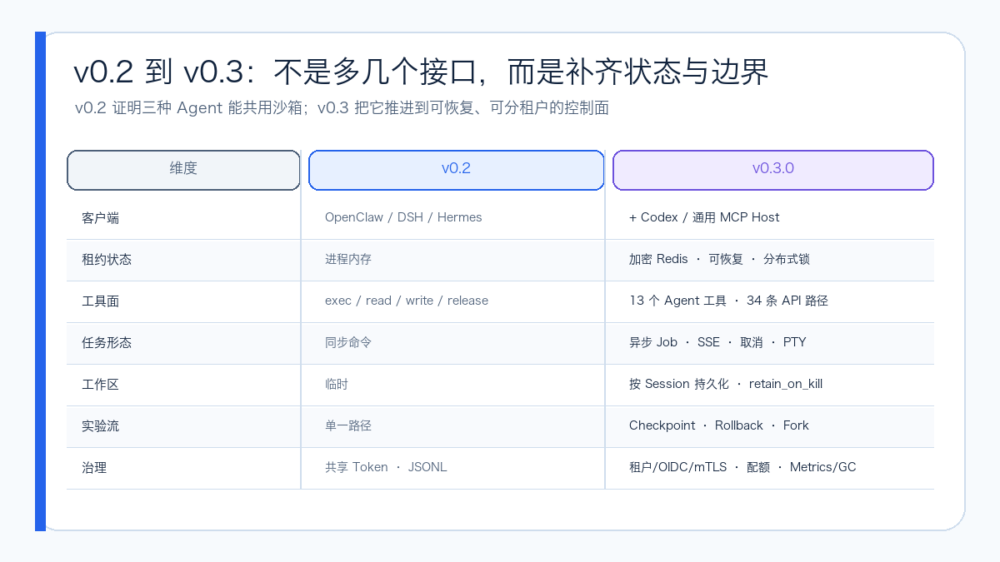
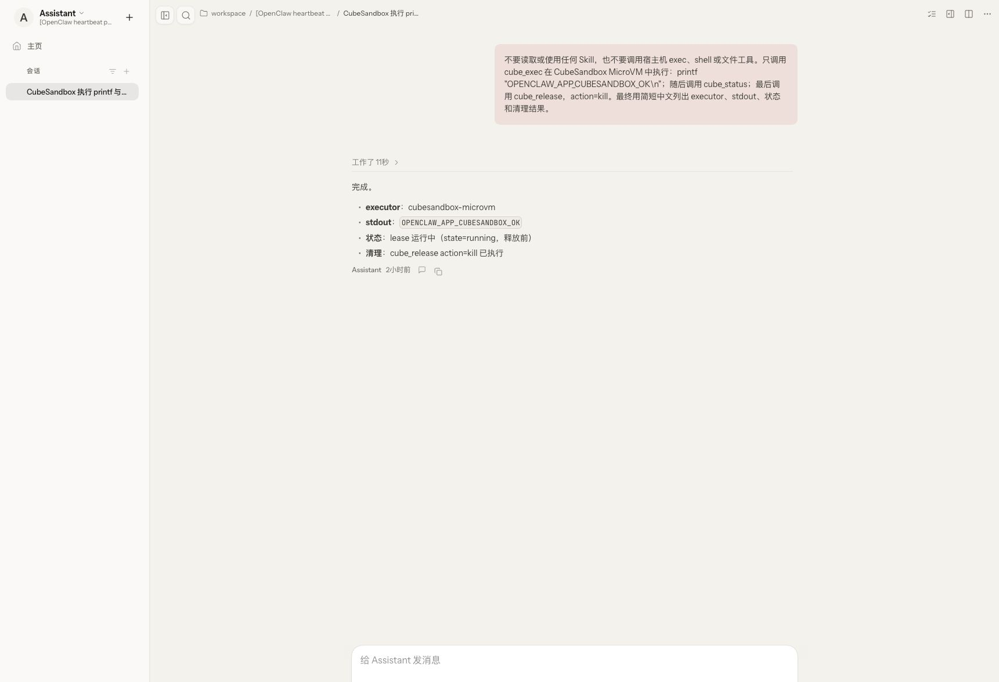

# CubeSandbox Agent Adapter v0.3 实测：从多 Agent 桥接器到可恢复执行控制面

2026 年 9 月 2 日，`cubesandbox-agent-adapter` 主分支完成了面向 `v0.3.0` 的代码更新；9 月 4 日，项目创建 `v0.3.0` 标签并发布 GHCR 多架构镜像。和 `v0.2.0` 相比，这次变化不只是多支持了一种 Agent 或增加几条接口，而是开始补齐一个执行控制面必须面对的状态恢复、长任务、持久工作区、租户隔离、可观测性和高可用问题。

版本状态已经核实：[`v0.3.0` 标签](https://github.com/aik8s/cubesandbox-agent-adapter/releases/tag/v0.3.0) 指向提交 `e7ca13c`，核心功能提交是 [`a692074`](https://github.com/aik8s/cubesandbox-agent-adapter/commit/a69207438f11480871e872be152c2a3eacec8244)。镜像 `ghcr.io/aik8s/cubesandbox-agent-adapter:v0.3.0` 同时包含 `linux/amd64` 和 `linux/arm64`，OCI Index Digest 为 `sha256:60c4b0bd433f4cc5a35b37d6fe851cf36684de646d15ad79f0ca51c4eb75b534`。GitHub Release 列表暂未单独发布 v0.3.0 的说明页，但版本标签与镜像已经可用。

## 结论先行

- OpenClaw、DeepSeek Harness（DSH）、Hermes Agent 和 Codex 四个真实客户端都已完成 `Agent → Adapter → CubeSandbox MicroVM` 功能验收，并在结束后主动回收沙箱。
- OpenClaw、DSH 和 Hermes 的插件扩展到 13 个统一工具；Codex 和其他 MCP Host 可以使用本地 `stdio` MCP Facade。Adapter 的 OpenAPI 当前包含 34 条路径，覆盖同步命令、文件、制品、异步 Job、PTY、Checkpoint 和管理接口。
- 租约不再只能保存在单进程内存中。v0.3 新增加密 Redis 状态、可续期分布式锁和 GC，为重启恢复与多副本奠定基础；内存后端仍保留，但被明确限制为单副本。
- `persistent-code` 可以把 `/workspace` 绑定到按 Session 管理的 Volume，并在 Kill 后保留；`checkpoint-code` 可以执行 Checkpoint、Rollback 和 Fork，适合依赖升级、代码修复和 Agent 方案 A/B。
- 当前仍不是“开箱即用的生产托管服务”。正式使用前要补齐 TLS/OIDC 或 mTLS、集中审计、故障演练，并接受 CubeSandbox v0.7 对“挂载卷 + 快照”组合的限制。


## 1. 办公网与生产网隔离下的可信执行边界

很多用户已经习惯在自己的笔记本或办公网开发机上使用 Code Agent。这里有完整的编辑器、代码仓库、个人配置和会话历史，交互体验也最好；但真正需要处理的制品库、Kubernetes API、内部服务、日志和数据，经常只存在于隔离的生产网络。

如果直接把生产 VPN、SSH Key、跳板机账号或长期 Token 交给本地 Agent，模型生成的一条命令就可能获得过宽的网络与主机权限。反过来，把完整 Agent Runtime 搬进生产网，又会把模型配置、会话历史、插件和更多第三方依赖一起带入高信任区域。还有一种常见做法是把生产日志、配置或数据复制到办公网分析，这会制造新的数据副本和泄露面。

`cubesandbox-agent-adapter` 可以在两张网络之间提供一种更窄的**可信执行边界**：Agent 仍运行在用户熟悉的本地环境，只把结构化执行动作提交给经过企业批准的 HTTPS、Zero Trust 或 API Gateway 入口；Adapter 在生产网内完成身份校验、Profile 授权、配额和租约管理，再让 CubeSandbox MicroVM 靠近生产资源执行。原始资源与生产凭据留在生产侧，客户端只收到受限输出、状态和审计引用。


这里的“可信”不是说模型生成的代码天然正确，而是执行过程具备可以验证的控制点：

1. **身份可信**：每次请求都能映射到 Tenant、Runtime 与 Role，而不是匿名远程 Shell。
2. **授权可控**：Profile 决定模板、网络、路径、生命周期、租约与 Job 配额，模型不能自行扩大边界。
3. **执行隔离**：命令在按租约创建的 MicroVM 中运行，不进入本地 Agent Runtime，也不直接落到生产宿主机。
4. **凭据收敛**：Cube 连接信息与 Traffic Token 只在 Adapter；其他生产凭据应通过平台侧工作负载身份、CubeEgress 或短期注入机制提供，不能写进 Prompt。
5. **过程可审计**：Request ID、会话摘要、动作、短 Sandbox 引用、耗时与结果进入脱敏审计，任务完成后有明确的 Release、TTL 和 GC。

这种模式适合经过授权的生产排障、内部制品构建与扫描、敏感文档检查、只读数据分析和一次性运维验证。针对不同场景仍应建立独立 Profile、最小权限凭据和输出策略，不能用一个万能 `production-admin` Profile 覆盖所有任务。

Adapter 也不会绕过办公网与生产网隔离。如果两侧完全没有获批链路，还需要企业网关、受控 VPN、零信任访问或拉取式任务队列提供连接；Adapter 的作用是把获批链路后的“任意远程访问”收敛成受控执行接口，而不是开一条新的隐蔽隧道。

## 2. v0.2 解决接入，v0.3 开始解决状态

`v0.2.0` 已经证明了一件重要的事：OpenClaw、DSH 和 Hermes 不必分别持有 CubeSandbox 的管理地址、完整 Sandbox ID 与 Traffic Token。它们可以只拿到不透明的 `lease_ref`，把命令和文件操作交给同一层 Adapter，再由 Adapter 统一执行策略和脱敏审计。

它的限制也很明显：共享 Bearer Token、单一 `offline-code` Profile、进程内存租约和四个核心工具更适合作为集成样例。一旦 Adapter 重启、横向扩容，或需要一个任务跨越多次 HTTP 请求继续运行，状态和边界就会成为主要问题。



| 维度 | v0.2.0 | v0.3.0 |
| --- | --- | --- |
| 客户端 | OpenClaw、DSH、Hermes | 增加 Codex 和通用 MCP Host |
| Agent 工具 | exec、read、write、release | 13 个统一工具 |
| HTTP 契约 | 基础租约与文件操作 | 34 条 OpenAPI 路径 |
| 状态 | 单进程内存 | 内存或加密 Redis，带可续期分布式锁 |
| 工作区 | 临时文件系统 | 按 Session 持久化的 Volume |
| 长任务 | 同步命令 | Durable Job、增量输出、SSE、取消 |
| 交互任务 | 无 | PTY 创建、输入、Resize、状态和事件流 |
| 实验恢复 | 无 | Checkpoint、Rollback、Fork |
| 身份 | 共享 Bearer Token | 租户 Token、OIDC、TLS/mTLS |
| 运维 | JSONL 审计 | Metrics、Readiness、GC、可插拔审计 Sink |

## 3. 四种客户端如何共用控制面

v0.3 没有要求 Agent Runtime 改成同一种形态。每个客户端继续使用最适合自己的扩展接口：

```text
OpenClaw Tool Plugin ──────────┐
DSH Cordis Plugin ─────────────┤
Hermes Native Tool Plugin ─────┼─ authenticated HTTP ─→ Adapter ─→ Cube SDK ─→ MicroVM
Codex / MCP Host ─→ MCP stdio ─┘                              │
                                                            └─ redacted audit
```

OpenClaw、DSH 和 Hermes 的统一工具面包含：

```text
cube_exec          cube_status       cube_read
cube_write         cube_list         cube_job_start
cube_job_status    cube_job_output   cube_job_cancel
cube_checkpoint    cube_rollback     cube_fork
cube_release
```

PTY 与二进制制品上传/下载已经进入 Adapter API，但当前没有塞进这 13 个插件工具。这样做可以避免一次性扩大模型工具面；需要它们的 Runtime 可以通过受控客户端或 MCP Facade 继续封装。

Adapter 仍坚持两个边界：

1. 模型不能选择底层模板、CIDR、公开流量开关和生命周期策略；这些都属于运维人员维护的 Profile。
2. 无可用 Backend、身份不匹配或策略校验失败时直接拒绝，不回退到宿主 Shell。

### OpenClaw

OpenClaw 从真实 Control UI 调用 `cube_exec`、`cube_status` 和 `cube_release`，输出标识执行器为 `cubesandbox-microvm`，随后销毁租约。



### DeepSeek Harness

DSH 使用 Cordis Plugin 完成相同路径。安装器还会生成 Profile Patch，用于禁用常见宿主 Bash、PowerShell 和文件工具，降低同一会话混用两套执行面的风险。


### Hermes Agent

Hermes 通过独立 Native Tool Plugin 接入。截图所用隔离安装只显示了四个核心 Cube 工具，所以状态探测由第二次 `cube_exec` 完成；它证明的是实际执行和回收路径，不能拿来声称截图已经遍历当前源码里的全部 13 个工具。


### Codex 与 MCP Host

Codex 使用本地 `stdio` MCP Facade，再由 Facade 访问经过认证的 Adapter HTTP API。它默认不会开放另一个匿名网络监听器；非 Loopback 的明文 HTTP 地址也会被拒绝，避免 Bearer Token 被意外发送到远端明文链路。


## 4. 三种值得实际使用的新玩法


### 3.1 一个 Session 可以带着工作区回来

`persistent-code` Profile 使用按 Session 分配的 Volume，并设置 `retain_on_kill: true`。Agent 可以在第一轮任务里拉取代码、创建虚拟环境和生成中间文件，释放 MicroVM 后保留 Volume；同一个 Runtime Session 再次 Acquire 时，继续使用原来的 `/workspace`。

这适合长周期代码 Review、数据清洗和多轮修复，但它不是无限制的 Home 目录：路径仍限制在 `/workspace` 和 `/tmp`，并继续受租户租约数、命令时间、文件和输出大小限制。

### 3.2 长任务不再绑死一条 HTTP 请求

Durable Job 把“启动任务”和“等待完成”拆开。客户端可以：

1. 启动作业并获得 `job_ref`；
2. 断线后重新查询状态；
3. 按 Offset 读取增量输出，或订阅 SSE；
4. 超时或改变计划时传播取消；
5. 最后释放租约。

PTY 则补上交互式安装器、REPL 和需要终端尺寸的程序。PTY 支持输入、Resize、状态、Kill 和 SSE 事件流，但生产端仍应限制谁能创建交互会话，并为长时间空闲设置回收策略。

### 3.3 从“失败重来”变成 Checkpoint、Rollback 和 Fork

`checkpoint-code` 可以在关键步骤保存状态：方案 A 失败时回滚；需要比较两种依赖升级或修复策略时，从同一个 Checkpoint Fork 出方案 B。这样更适合 Agent 的试错式工作流，也减少重复下载和环境重建。

当前必须注意：CubeSandbox v0.7 会拒绝带 Volume 或 Host Mount 的 Snapshot。项目因此把“持久 Volume”和“Checkpoint”拆成两个 Profile，并默认禁止这一组合。不要为了演示同时打开两者，除非上游问题解决且已经在目标环境重新验收。

## 5. Profile、租户和状态如何分层

下面是仓库里的默认 Profile 结构的简化版：

```yaml
defaults:
  max_active_leases_per_tenant: 8
  max_jobs_per_lease: 8
  max_command_seconds: 120

profiles:
  offline-code:
    allow_internet_access: false
    network:
      allow_public_traffic: false

  persistent-code:
    allow_internet_access: false
    workspace:
      mode: per-session-volume
      retain_on_kill: true
    checkpoints_enabled: false

  checkpoint-code:
    allow_internet_access: false
    checkpoints_enabled: true
```

认证也不再只有一个共享 Token：

- 每租户 Bearer Principal 可以绑定允许的 Runtime 和 Profile；
- OIDC JWT 通过 JWKS、Issuer 和 Audience 校验，并从 Claim 提取 Tenant 与 Role；
- TLS 可以保护服务端链路，mTLS 可以把已验证的客户端证书主体作为身份；
- Bearer Token 与 Session HMAC Key 相互独立，日常轮换 Token 不会改变会话的伪匿名关联键。

Redis 保存的是 Adapter 对租约、Job 和锁的所有权状态，不替代 CubeSandbox 自己的调度与生命周期状态。Redis 记录使用 Fernet Key 加密；多副本对同一租约的修改通过可续期分布式锁串行化。Helm Chart 会在 `replicaCount > 1` 且未启用 Redis 时直接失败，防止做出“两个副本就是 HA”的假象。

## 6. 测试范围与结果

本文对 v0.3.0 对应代码执行了静态检查、单元测试、插件测试和 Chart 渲染，并额外启动 Redis 8 完成原本需要外部状态后端的用例。

| 检查 | 结果 | 说明 |
| --- | --- | --- |
| Ruff | 通过 | Adapter 与 Hermes Python 源码 |
| Python Adapter | 22 通过，1 跳过 | 首轮未配置 Redis URL |
| Redis State | 1 通过 | 使用临时 `redis:8-alpine` 单独复测 |
| Hermes Plugin | 2/2 通过 | Tool 注册与调用契约 |
| OpenClaw Plugin | 通过 | Node 语法、Loader 与 Plugin 用例 |
| DSH Plugin | 通过 | Node 语法与插件用例 |
| Installer | 通过 | Shell 安装路径测试 |
| Helm | 通过 | 1 个 Chart，Lint 0 失败，Template 成功 |
| Mypy | 通过 | 12 个源码文件无类型错误 |
| 四客户端应用验收 | 通过 | OpenClaw、DSH、Hermes、Codex 均执行并 Kill |

四张截图是功能验收证据，不是性能压测结果。验收的关键不是最终回答里出现一句“已在沙箱执行”，而是同一个短 `sandbox_ref` 能同时在 Agent 工具结果、CubeSandbox Live List 和 Adapter Audit 中关联，结束后活动租约回到 0。

## 7. 如何部署 v0.3.0

可以直接拉取公开的多架构镜像：

```bash
docker pull ghcr.io/aik8s/cubesandbox-agent-adapter:v0.3.0
```

需要不可变发布源时，固定已经核实的 OCI Index Digest：

```text
ghcr.io/aik8s/cubesandbox-agent-adapter@sha256:60c4b0bd433f4cc5a35b37d6fe851cf36684de646d15ad79f0ca51c4eb75b534
```

克隆 `v0.3.0` 后，可以使用安装器部署 Adapter：

```bash
git clone --branch v0.3.0 --depth 1 \
  https://github.com/aik8s/cubesandbox-agent-adapter.git
cd cubesandbox-agent-adapter

./scripts/install.sh adapter \
  --context <kube-context> \
  --image ghcr.io/aik8s/cubesandbox-agent-adapter:v0.3.0 \
  --cube-api-url http://cube-api.cube-system.svc:3000 \
  --cube-proxy-host cube-proxy.cube-system.svc \
  --cube-proxy-port 80 \
  --template agent-code
```

这只是镜像与 Chart 入口。生产配置至少还要明确：

- CubeAPI、CubeProxy 与 Adapter 之间的 NetworkPolicy；
- per-tenant Token、OIDC 或 mTLS 的选择；
- Redis TLS、认证、备份和 Encryption Key 的交付方式；
- 审计 Sink、Prometheus 抓取和告警；
- Runtime 侧如何禁用宿主 Shell/FS 工具；
- `cube_release`、TTL、GC 与 Volume 保留策略。

生产部署不要长期跟随 `main`，也不要只依赖可变 Tag；应在镜像准入或 GitOps 清单中记录上面的不可变 Digest。

## 8. 从 v0.2 迁移的主要风险

| 风险 | 可能影响 | 建议 Gate |
| --- | --- | --- |
| Registry Tag 可被覆盖 | 相同 `v0.3.0` 名称可能不再指向同一制品 | 在准入或 GitOps 清单中固定 OCI Digest |
| 内存状态切 Redis | 租约所有权或加密键配置错误 | 先单副本迁移，验证重启恢复，再扩容 |
| HMAC Key 被误轮换 | 同一 Session 被视为新会话 | 与 Bearer Token 分开保管和轮换 |
| Profile 默认拒绝 | 旧请求因路径、网络或能力 Gate 失败 | 逐 Profile 回放真实请求，禁止宽泛兜底 |
| NetworkPolicy 默认启用 | Runtime、OIDC JWKS、Redis 或审计出口不通 | 逐条验证 Ingress/Egress，再上线 |
| 插件安装缓存 | DSH 等仍运行旧插件副本 | 重装插件并重新启动 Runtime，核对工具清单 |
| 宿主工具仍可用 | 模型绕过 CubeSandbox | DSH 用 Patch；OpenClaw/Hermes 配置独立 Toolset/Profile |
| Volume 与 Snapshot 冲突 | Checkpoint 请求失败 | 保持两个 Profile 分离，跟踪上游修复 |
| Job/PTY 扩大资源占用 | 长任务泄漏、租户互相影响 | 配额、TTL、Cancel、GC 和告警一起上线 |
| 审计内容过多或过少 | 泄密或无法追责 | 保留 Digest/Request ID，不记录命令正文与输出 |

此外，v0.3 仍没有通用 Human Approval Callback 和全局 Rate Limiter。Adapter 的租户配额也不能替代集群准入、计算节点容量控制和 CubeSandbox 调度正确性。

## 9. 适合什么场景

如果只使用一种 Agent，而且它已经提供满足需求的原生 Sandbox Backend，直接使用原生接口通常更简单。

当环境中同时存在多种 Agent，并且希望它们共用以下能力时，Adapter 的价值会更明显：

- 一套模板、网络和生命周期策略；
- 不把底层管理凭据交给每个 Runtime；
- 按 Tenant、Runtime 和 Profile 授权；
- 让短命令、长 Job、PTY、持久工作区和可回滚实验使用同一租约语义；
- 从 Agent、Adapter 到 MicroVM 建立同一条脱敏证据链。

v0.2 回答的是“多种 Agent 能不能共用 CubeSandbox”，v0.3 开始回答“Adapter 重启怎么办、任务跑很久怎么办、工作区如何回来、实验如何分叉、租户如何隔离”。版本标签与多架构镜像已经发布，它也已经从桥接器迈向执行控制面；生产上线仍应由镜像 Digest、身份、网络、审计和恢复演练共同把关。

## 参考资料

- [cubesandbox-agent-adapter 项目](https://github.com/aik8s/cubesandbox-agent-adapter)
- [v0.3.0 标签](https://github.com/aik8s/cubesandbox-agent-adapter/releases/tag/v0.3.0)
- [v0.3.0 GHCR 镜像](https://github.com/aik8s/cubesandbox-agent-adapter/pkgs/container/cubesandbox-agent-adapter)
- [v0.3.0 核心提交](https://github.com/aik8s/cubesandbox-agent-adapter/commit/a69207438f11480871e872be152c2a3eacec8244)
- [OpenAPI 契约](https://github.com/aik8s/cubesandbox-agent-adapter/blob/main/docs/openapi.yaml)
- [CubeSandbox v0.7.0](https://github.com/TencentCloud/CubeSandbox/releases/tag/v0.7.0)
