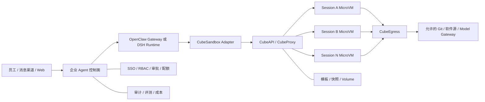
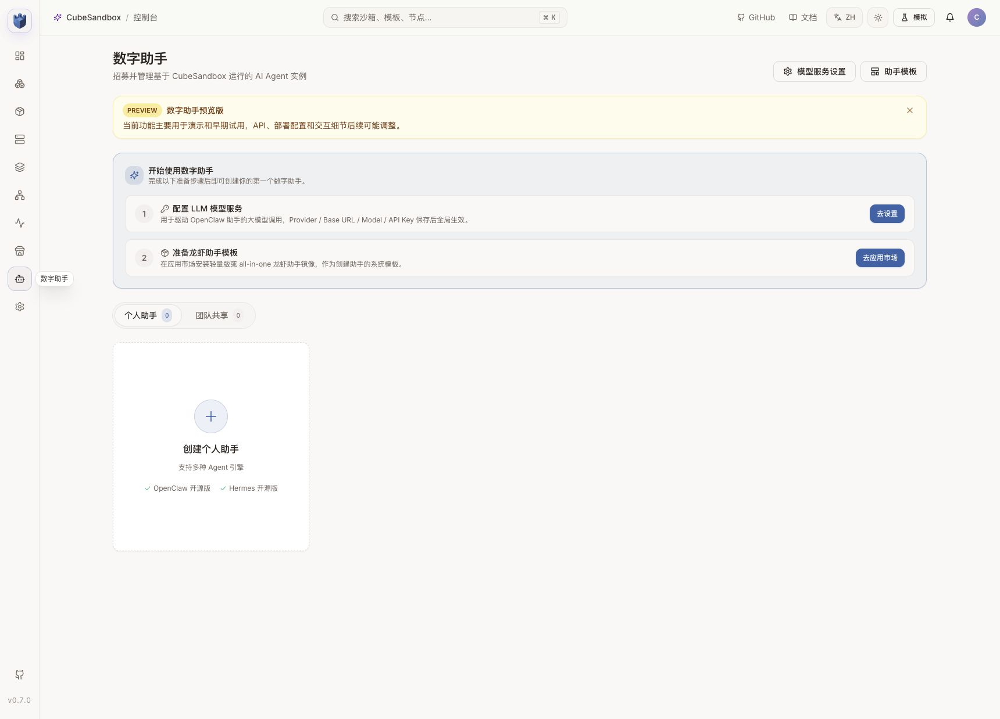
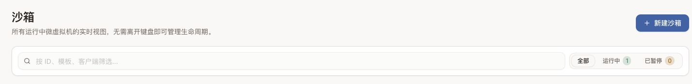
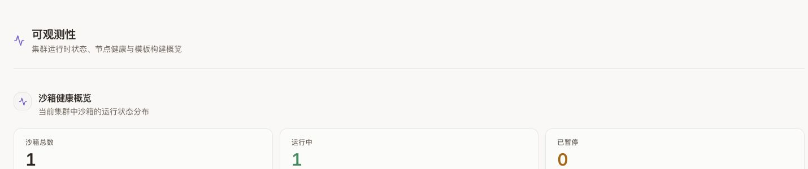

# 用 CubeSandbox 增强 OpenClaw 与 DSH：企业安全执行面实战

OpenClaw 和 DeepSeek Harness（DSH）都不只是聊天页面。它们能读写文件、运行 Shell、调用浏览器、安装依赖并长时间保存会话。能力越接近真实开发机，企业越不能只问“能不能跑”，还要回答四个问题：执行是否安全、环境是否可复现、空闲资源能否回收、用户下一轮回来时是否足够顺滑。

一个更合适的组合不是把三者塞进同一个大容器，而是拆成两层：

- **OpenClaw Gateway / DSH Runtime** 负责消息、模型、会话、权限、审批和工具编排；
- **CubeSandbox** 负责按会话创建 MicroVM，提供 Shell、文件、PTY、代码、网络和生命周期 API。

这篇文章先说明这种拆分为什么能让企业 Agent 更安全、更快、更顺滑，再用一个已经部署在 Kubernetes 上的 CubeSandbox `v0.7.0` 集群跑通完整链路。部署前置条件与安装过程分别见：[CubeSandbox Kubernetes 部署评估](cubesandbox-kubernetes.md)和[部署实战](cubesandbox-kubernetes-practice.md)。

本次实测得到以下结果：

| 验证项 | 结果 |
| --- | --- |
| MicroVM 创建 | 成功；本次样本 134 ms |
| Shell / 文件 / Python | 成功 |
| 完全禁止公网出站 | 生效 |
| 沙箱公开入口不带访问令牌 | HTTP 403 |
| 携带访问令牌 | HTTP 204 |
| Pause | 成功；本次样本约 2.18 s |
| Resume | 成功；本次样本约 2.72 s |
| 暂停后的文件和 Python 内存 | 都保留 |
| 清理 | 沙箱销毁，集群沙箱数恢复为 0 |

这些时间只是一台节点、一个模板、一次请求的功能样本，不是性能基准。生产决策要继续测并发下的 P50、P95、P99、失败率和长尾。

本文严格区分已经完成和仍是路线图的部分：

| 范围 | 状态 |
| --- | --- |
| Cube SDK 创建、Shell、文件、Python、断网、traffic token、Pause / Resume、Snapshot、Rollback、Clone、Kill | 已实测 |
| CubeSandbox WebUI 数字助手、运行中沙箱和可观测性页面 | 已用 Chrome 登录态验证 |
| 官方 OpenClaw Skill 在真实 OpenClaw 会话中触发 | 未实测，给出可复现步骤 |
| 创建 Digital Assistant / OpenClaw 实例并调用模型 | 未实测，官方功能为 Preview |
| DSH `shell/fs/pty` Provider | 未实现，给出正确接入边界和验收顺序 |
| 浏览器 Agent、并发压测和跨节点恢复 | 未实测，列为下一阶段 |

## 1. 先确定边界：Agent 是控制面，Sandbox 是执行面

推荐架构如下：



这条边界很重要：

- OpenClaw / DSH 保留会话事实、用户身份、模型调用和审批记录；
- CubeSandbox 只拿到当前任务必需的工作区、资源、网络和短期身份；
- Sandbox 被攻破时，攻击者仍要跨过独立 MicroVM、出站策略和工具授权，才能影响其他会话或控制面；
- Sandbox 销毁不应删除 OpenClaw 状态目录或 `DSH_HOME`，两者属于不同生命周期。

如果把 Gateway、插件、模型密钥、浏览器 Profile 和不可信代码都放进同一个长期运行容器，MicroVM 的隔离价值会被大幅削弱。

## 2. 它具体让 OpenClaw / DSH 好在哪里

### 2.1 更安全：从“限制目录”升级为“隔离执行世界”

DSH 自带的 `dsh-sandbox` 面向同一操作系统中的进程限制。官方说明它通过 bwrap、Landlock、Seatbelt 等机制控制文件副作用；容器、MicroVM 和远端执行并不是这个 seam 的 backend，而是要替换整组 Shell 与文件能力。

OpenClaw 启用 Sandbox 后，Gateway 仍留在宿主环境，工具执行可以进入 Docker、SSH 或 OpenShell backend。官方同样强调，这不是完美安全边界；插件和 Gateway 进程仍属于可信控制面。

CubeSandbox 增加的是另一层执行边界：

- 每个沙箱使用独立 MicroVM 内核；
- 每个会话拥有独立 rootfs、进程、网络和生命周期；
- 出站可以完全关闭，或按 CIDR、域名、协议、Host、Path、SNI 控制；
- 公开入口可以要求 per-sandbox traffic token；
- L7 代理可以只向允许的目标注入凭据，真实 Token 不必进入沙箱环境变量。

但 MicroVM 不能替代工具授权。模型是否可以调用 `kubectl`、删除仓库、提交代码或访问生产 API，仍要由 OpenClaw / DSH 和企业 Tool Gateway 决定。

### 2.2 更快：模板和快照消除重复准备

企业 Agent 最影响体验的往往不是模型首 Token，而是执行环境准备：拉镜像、安装 Node/Python、恢复工作区、启动浏览器、重新建立工具连接。

CubeSandbox 可以把这些动作前移：

- 把 Git、Python、Node、浏览器和企业 CA 固定进模板；
- 用模板 alias 管理环境版本，避免每个 Agent 自己安装；
- 空闲时 Pause，释放 CPU 和内存；
- 下一轮 Resume，恢复文件系统和 MicroVM 内存；
- 用 Snapshot、Rollback 和 Clone 支持并行尝试与快速回退。

本次 READY 模板的单次创建样本为 134 ms。Pause 与 Resume 是秒级，是否比重新创建更快取决于模板大小、快照后端、节点缓存和并发，因此要用真实工作区测试，不能直接套用这一个数字。

### 2.3 更顺滑：会话与沙箱生命周期一一映射

用户希望的是“过一会继续做”，而不是理解 Pod、容器和 VM。适配层应把底层状态隐藏起来：

```text
第一轮消息
  → 按 session_key 创建沙箱
  → 上传或挂载工作区
  → 执行工具
  → 空闲 5 分钟后自动 Pause

下一轮消息
  → 根据 session_key 找回 sandbox_id
  → 自动 Resume
  → 文件、变量和进程上下文继续存在

会话关闭 / TTL 到期 / 管理员回收
  → Kill
  → 清理快照、网络、临时卷和映射记录
```

控制面至少持久化这些字段：

| 字段 | 用途 |
| --- | --- |
| `tenant_id` / `user_id` / `session_key` | 确定租户与会话归属 |
| `sandbox_id` | 连接或回收 MicroVM |
| `traffic_access_token` | 访问受保护的数据面；加密保存 |
| `template_alias` / Digest | 保证环境可复现 |
| `network_profile` | 记录实际出站策略 |
| `state` / `last_seen_at` | Pause、Resume、Kill 与回收 |
| `request_id` / `trace_id` | 串联 Agent、API、代理和审计日志 |

所有生命周期操作都要幂等。创建成功但数据库写入失败、恢复超时、客户端断线和重复回调都不能留下无人认领的沙箱。

### 2.4 更适合企业平台：控制面和执行面可以分别扩展

OpenClaw / DSH Runtime 的压力来自模型流、会话、渠道和插件；CubeSandbox 的压力来自 VM 创建、CPU、内存、快照和网络。拆分后可以分别扩展、限流和升级：

- Runtime Pool 按业务、部门或信任域拆分；
- Sandbox Node Pool 按普通代码、浏览器、数据分析或 GPU 模板拆分；
- 企业控制面统一下发模板、网络、配额和 TTL；
- 一个 Runtime 不再需要本地 Docker Socket，也不需要把宿主目录直接交给 Agent。

## 3. OpenClaw 与 DSH 应该怎样接

### 3.1 OpenClaw：三条路径

| 路径 | 实现 | 优点 | 局限 | 建议 |
| --- | --- | --- | --- | --- |
| 官方 CubeSandbox Skill | Agent 按 Skill 指引调用 Cube SDK | 上手最快，已有官方示例 | 不是 OpenClaw 原生 backend；普通 `exec` 仍可能走其他执行面 | PoC |
| 企业 Adapter / Plugin Tool | 注册受审计的 `cube_exec`、`cube_read`、`cube_write`、`cube_pty` | 参数和策略可控，容易加租户、审计和配额 | 需要维护少量适配代码 | 推荐起点 |
| 整个 OpenClaw 运行在 CubeSandbox | 用 Digital Assistant / AgentHub 从 OpenClaw 模板创建助手 | 助手可快照、回滚、克隆 | 当前是 Preview；Runtime、状态和执行边界容易重新混在一起 | Demo、个人助手和早期验证 |

CubeSandbox 官方仓库已经提供 `examples/openclaw-integration` Skill，适合验证“Agent 能否主动把代码放进 MicroVM”。企业版本更适合把 SDK 调用封装成固定 Plugin Tool：模型只提供命令、文件和策略档位，不能自由拼接 CubeAPI 管理请求。

OpenClaw 当前公开文档列出的内置 Sandbox backend 主要是 Docker、SSH 和 OpenShell，不能把 CubeSandbox 当作已经原生支持的第四种 backend。若没有经过验证的 backend 接口，先注册独立 Cube 工具并对不可信会话禁用宿主 `exec`，比深度修改 Gateway 更容易跟随上游升级。

### 3.2 DSH：替换 Shell / FS Provider，不是替换本地文件沙箱

DSH 的可组合设计很适合接远端执行面，但接入位置要正确：

| DSH 能力 | CubeSandbox 映射 |
| --- | --- |
| `ctx.shell` | `sandbox.commands.run()` |
| `ctx.fs` | `sandbox.files.read/write/list/...` |
| `ctx.terminals` | `sandbox.pty` |
| 代码解释器 | `sandbox.run_code()` |
| Session 初始化 | `Sandbox.create()` 或连接现有实例 |
| 空闲回收 | `lifecycle.on_timeout=pause/kill` |
| 任务取消 | 终止 command / PTY，必要时 Kill Sandbox |

DSH 的审批、`read-only` / `workspace-write` / `danger-full-access` 语义仍留在控制面。Provider 根据已批准策略决定要调用哪一个沙箱能力；CubeSandbox 再执行资源、网络和 MicroVM 隔离。

不要只把 CubeSandbox 实现成 `ctx.sandbox`。DSH 官方明确把这个接口定义为 same-world confinement；远端 MicroVM 应替换环境一致的一组 Shell、文件和终端 Provider，否则同一轮工具可能一半在本机、一半在 VM，工作目录和权限语义会失真。

## 4. WebUI 中已经能看到 OpenClaw 方向

CubeSandbox `v0.7.0` WebUI 的“数字助手”页面已经把 OpenClaw 助手、模型服务、助手模板和团队共享放进同一入口。页面也清楚标注了 Preview，适合演示和早期验证，不应把它误写成已稳定的企业多租户控制面。



如果选择这条路径，仍要在外围补齐 SSO、租户、审批、模型与工具目录、预算、审计和发布流程。更稳妥的生产形态通常是：企业控制面管理多个受控 OpenClaw / DSH Runtime，Runtime 再调用 CubeSandbox 执行面。

## 5. 实战：验证一个 Agent 会话需要的完整链路

### 5.1 前置条件

实验使用：

- Kubernetes `v1.30.x`；
- CubeSandbox `v0.7.0`；
- 一个 READY 的 `sandbox-code` 模板 alias；
- 本机可以访问 CubeAPI 和 CubeProxy；
- Python SDK 固定为 `cubesandbox==0.7.0`。

生产环境应使用受信任 DNS、TLS 和 API Key。下面的 `127.0.0.1` 只代表通过 `kubectl port-forward` 建立的本地实验入口：

```bash
kubectl -n cube-system port-forward service/cube-api 13000:3000
kubectl -n cube-system port-forward service/cube-proxy 13080:80
```

准备 SDK：

```bash
python3 -m venv .venv
.venv/bin/pip install cubesandbox==0.7.0 requests

export CUBE_API_URL=http://127.0.0.1:13000
export CUBE_PROXY_NODE_IP=127.0.0.1
export CUBE_PROXY_PORT_HTTP=13080
export CUBE_PROXY_SCHEME=http
export CUBE_TEMPLATE_ID=<ready-template-alias>
```

仓库中的完整脚本是 [`scripts/cubesandbox_openclaw_dsh_smoke.py`](https://github.com/runzhliu/aik8s/blob/main/scripts/cubesandbox_openclaw_dsh_smoke.py)。它不启动 OpenClaw 或 DSH，而是直接验证两者的 Adapter 必须依赖的执行面契约。

### 5.2 创建一个受控会话沙箱

核心创建参数如下：

```python
sandbox = Sandbox.create(
    template=os.environ["CUBE_TEMPLATE_ID"],
    timeout=300,
    lifecycle={"on_timeout": "pause", "auto_resume": True},
    allow_internet_access=False,
    network={"allow_public_traffic": False},
    metadata={
        "runtime": "openclaw-or-dsh",
        "scope": "session",
        "purpose": "integration-smoke",
    },
)
```

这些字段对应一个合理的企业默认值：

- 会话空闲后暂停，而不是一直占用计算资源；
- 不允许任意访问公网；
- 外部访问沙箱服务必须携带 traffic token；
- metadata 只放追踪和策略标签，不放用户隐私或密钥。

Chrome 中可以看到实时运行数变成 1。截图只保留计数区域，沙箱 ID、模板 ID和节点地址均已裁掉：



### 5.3 执行 Shell、文件和 Python

```python
sandbox.files.write(
    "/tmp/agent-session.json",
    '{"session":"demo","turn":1}',
)

shell = sandbox.commands.run("printf 'shell=ready user=%s' \"$(id -u)\"")
before = sandbox.run_code("counter = 41\ncounter")
```

测试模板中的 command 默认以 Guest UID 0 运行。MicroVM 内的 root 不等于宿主机 root，但企业模板仍应优先使用非 root 用户、最小软件集和只读基础层，避免在 Guest 内无意义地扩大权限。

### 5.4 验证出站和入站边界

脚本尝试从沙箱连接公网地址，结果失败，因此 `allow_internet_access=False` 生效。

随后直接访问沙箱数据面健康端点：

| 请求 | 返回 |
| --- | ---: |
| 不带 `e2b-traffic-access-token` | 403 |
| 携带创建时返回的 token | 204 |

这证明“知道沙箱域名或 ID”不足以访问受保护服务。生产中还要同时限制 CubeProxy 网络入口，并加 TLS、API 鉴权、速率限制和审计。

### 5.5 暂停、恢复并验证状态

```python
sandbox.pause(wait=True)
assert sandbox.get_info().state == "paused"

sandbox.resume()
assert sandbox.get_info().state == "running"

session = sandbox.files.read("/tmp/agent-session.json")
after = sandbox.run_code("counter += 1\ncounter")
```

本次结果：

- 文件内容在 Resume 后仍是 `session=demo, turn=1`；
- Python 内存变量从 41 继续递增到 42；
- Pause 约 2.18 s；
- Resume 约 2.72 s。

可观测性页面同时显示一个运行中沙箱。截图结束后该临时沙箱已经销毁：



### 5.6 实测输出

脚本输出经过脱敏后如下：

```json
{
  "cleanup": "destroyed",
  "code_after_resume": "42",
  "code_before_pause": "41",
  "create_ms": 134,
  "internet_blocked": true,
  "pause_ms": 2176,
  "paused_state": "paused",
  "public_with_token_status": 204,
  "public_without_token_status": 403,
  "resume_ms": 2721,
  "resumed_state": "running",
  "sandbox_ref": "<ephemeral>",
  "workspace_after_resume": {
    "session": "demo",
    "turn": 1
  },
  "workspace_before_pause": {
    "session": "demo",
    "turn": 1
  }
}
```

`finally` 中始终调用 `kill()`。完成截图后又调用 `Sandbox.list()`，集群沙箱数为 0。

## 6. 两个真实故障：决定体验是否“丝滑”的细节

### 6.1 fresh install 的 CubeProxy admin token 可能不一致

第一次执行 Pause → Resume 时，恢复失败：

```text
CubeProxy ... status=403 ... admin token mismatch
```

`v0.7.0` Chart 的 helper 注释已经解释原因：当 `lifecycleManager.adminToken` 为空时，全新安装的单次渲染可能让 release Secret 和 CubeMaster 配置各自生成一次随机值；下一次 Helm upgrade 才会通过 `lookup` 复用已存在的 Secret。

实验环境使用原值升级，并让通过 `subPath` 挂载配置的 CubeMaster 重启：

```bash
helm upgrade cube ./deploy/kubernetes/chart \
  -n cube-system \
  --reuse-values \
  --wait

kubectl -n cube-system rollout restart deployment/cube-master
kubectl -n cube-system rollout status deployment/cube-master
```

生产安装更稳妥的做法是在发布系统中生成至少 16 字符的随机值，安全注入 `lifecycleManager.adminToken`，确保同一次渲染只有一个来源；不要把真实 Token 提交到 Git。

修复后可以只比较摘要，不输出 Token 本身：

```bash
# 分别计算 CubeMaster 配置与 CubeProxy 环境变量的 SHA-256。
# 两端摘要必须一致，命令输出不应包含原始 token。
```

还要注意：Secret 内容更新不代表使用 `subPath` 的进程已经读取新文件。没有触发 Pod Template checksum 时，应显式滚动 CubeMaster。

### 6.2 `connect()` 后不能丢失 traffic token

开启 `network.allow_public_traffic=false` 后，`v0.7.0` Python SDK 只在 `create()` 响应中返回 traffic token。`Sandbox.connect()` 返回的新对象不包含它；如果 Adapter 只保存 `sandbox_id`，恢复后的文件与命令调用会被 CubeProxy 以 403 拒绝。

因此企业 Adapter 必须：

1. 创建时同时保存 `sandbox_id` 与 `traffic_access_token`；
2. Token 在数据库中加密，日志和 Trace 中只保留摘要；
3. 每个数据面请求都携带 Token；
4. Kill 后立即删除映射与 Token；
5. SDK 升级后重新验证 Connect / Resume 行为。

本次脚本使用保留原始 SDK 对象的 `resume()` 完成测试，所以原 traffic token 仍在内存中。跨进程恢复时不能依赖这一点。

## 7. 企业 Adapter 的最小设计

不要一开始就实现完整 IDE、浏览器和所有 E2B API。第一版只需覆盖 OpenClaw / DSH 最常用的五个操作：

```text
acquire(session_key, template, policy) -> sandbox_ref
exec(sandbox_ref, command, cwd, timeout) -> stdout/stderr/exit_code
read/write(sandbox_ref, path, data)
pty(sandbox_ref, cols, rows) -> stream
release(sandbox_ref, action=pause|kill)
```

### 7.1 策略档位

不要让模型自由提交任意 CIDR 和 host mount。由平台维护有限的策略档位：

| Profile | 网络 | 工作区 | 适合场景 |
| --- | --- | --- | --- |
| `offline-code` | 完全断网 | 临时卷 | 数据处理、未知脚本 |
| `repo-build` | 只允许内部 Git、软件镜像和制品库 | Session Volume | 编译与测试 |
| `web-research` | 仅 HTTP/HTTPS，经 L7 审计 | 临时卷 | 浏览与资料提取 |
| `model-tool` | 只允许 Model / Tool Gateway，代理注入凭据 | 临时卷 | Agent 子任务 |
| `approved-release` | 仅批准的发布端点 | 受控 Volume | 需要人工审批的发布任务 |

模型可以请求某个 Profile，最终选择由策略引擎和人工审批决定。

### 7.2 状态与工作区

推荐把状态分开：

```text
OpenClaw 状态 / DSH_HOME
  → PVC 或受管数据库
  → 保存会话、Profile、配置和审批

Agent Workspace
  → CubeSandbox Snapshot / Volume
  → 保存当前任务的代码和生成物

临时文件、进程和浏览器缓存
  → MicroVM 本地 CoW 层
  → Pause 时保留，Kill 时销毁
```

不要把完整宿主 home、SSH 目录、云凭据目录或 Docker Socket挂进 MicroVM。确实需要共享数据时，使用只读 Volume、对象存储或受控上传接口。

### 7.3 凭据

优先顺序应是：

1. Tool Gateway 根据用户和动作签发短期身份；
2. CubeEgress 只向匹配的 HTTPS Host / SNI 注入 Header；
3. 只读文件或内存注入短期 Token；
4. 最后才考虑环境变量。

模型 API Key、Git Token 和云凭据不应写进模板、快照、命令行、metadata 或普通日志。

## 8. 用 CubeSandbox 具体怎么玩 OpenClaw 与 DSH

下面不是功能清单，而是从十分钟 PoC 到企业 Adapter 的实际玩法。每一项都给出操作、提示词和验收点。

### 8.1 OpenClaw 玩法一：安装官方 Skill，先让 Agent 学会“去沙箱执行”

CubeSandbox 官方仓库已经提供 OpenClaw Skill。先把它安装到目标 OpenClaw workspace：

```bash
git clone https://github.com/TencentCloud/CubeSandbox.git

mkdir -p <openclaw-workspace>/skills
cp -R CubeSandbox/examples/openclaw-integration/skills/cube-sandbox \
  <openclaw-workspace>/skills/
```

再把 CubeAPI、CubeProxy、Template 和 API Key 作为 OpenClaw 进程环境配置，不要写进 `SKILL.md` 或 Agent Prompt。官方示例使用 E2B 兼容环境变量；新项目也可以直接使用 `cubesandbox` SDK。

给 OpenClaw 一个明确任务：

```text
请使用 cube-sandbox Skill 完成以下任务，不要在 Gateway 宿主机执行：
1. 创建一个完全断网、120 秒超时的沙箱；
2. 写入 /tmp/input.py，计算 1 到 100 的平方和；
3. 执行脚本并读取输出；
4. 证明沙箱不能访问公网；
5. 无论成功失败都销毁沙箱，只返回脱敏后的执行结果。
```

验收时不要只看最终数字，还要检查：

- CubeSandbox WebUI 的运行中数量从 0 → 1 → 0；
- Agent 没有在 OpenClaw Gateway 本地创建 `/tmp/input.py`；
- `allow_internet_access=false` 确实阻止连接；
- 异常路径仍执行 Kill。

这条路径适合十分钟 PoC。它通常仍需要 OpenClaw 在本地用 `exec` 启动 Python SDK，因此不能把“安装了 Skill”当成宿主执行已经关闭。企业版应继续封装 Plugin Tool。

### 8.2 OpenClaw 玩法二：一会话一沙箱，隔天回来还能继续

实现一个内部 Plugin，固定暴露以下工具：

```text
cube_acquire(template, network_profile)
cube_exec(command, cwd, timeout)
cube_read(path)
cube_write(path, content)
cube_release(action=pause|kill)
```

Plugin 从当前 OpenClaw `sessionKey` 查 lease，模型不直接传 `sandbox_id` 或 traffic token。建议流程：

1. 第一次收到代码任务时创建 Sandbox；
2. 把 `sessionKey → sandbox_id + encrypted token` 写入租约表；
3. 每次工具调用刷新 TTL；
4. 空闲五分钟自动 Pause；
5. 下一条消息自动 Resume；
6. 用户关闭会话、管理员回收或最长生命周期到期时 Kill。

可以用两轮对话验证“丝滑感”：

```text
# 第一轮
在隔离工作区创建一个小型 Python 项目，写两个测试，其中一个先保持失败。
运行测试后暂停环境，记住当前失败原因。

# 等待 Pause 后发送第二轮
继续刚才的会话，修复失败测试并重新执行。不要重新创建项目。
```

通过条件：第二轮不重新上传项目，能够读取第一轮文件；WebUI 出现 `paused → running`；OpenClaw 重启后仍能通过租约表找回同一会话。

对不可信群聊，可以禁用宿主 `exec/read/write`，只保留经过审计的 Cube 工具；主会话是否允许更高权限，应由独立 Tool Policy 决定，不要只靠提示词。

### 8.3 OpenClaw 玩法三：Digital Assistant 做快照、克隆与回滚

CubeSandbox WebUI 的数字助手路线会把整个 OpenClaw Runtime 做成助手模板：

1. 在“模型服务设置”配置 Provider、Base URL、Model 和受管 API Key；
2. 从模板市场准备轻量版或 all-in-one OpenClaw 助手模板；
3. 创建个人助手；
4. 安装 Skill、配置渠道或修改 Agent 指令；
5. 在稳定点创建 Snapshot；
6. 修改失败时 Rollback；
7. 从稳定快照 Clone 一个新助手，再比较两套配置。

适合玩的实验包括：

- 一个基础助手克隆出“研发”“运维”“数据分析”三个角色；
- Skill 升级前做快照，验证失败后秒级回退；
- Clone 两个实例分别使用不同模型或 Prompt，做 A/B 评测；
- 把个人实例转成团队共享前检查密钥、记忆和浏览器 Profile 是否被错误继承。

本次只在真实 WebUI 中验证了页面与准备步骤，没有配置模型 Key、没有创建 OpenClaw 实例。官方明确把 Digital Assistant 标为 Preview，这部分属于下一阶段实验，不列入本文“已通过”结果。

### 8.4 DSH 玩法一：先用 Skill + 包装工具，不改 Runtime 核心

DSH 同样可以先走轻集成：给它一个 Skill，要求遇到不可信 Shell、仓库或附件时调用固定的 `cube-run` 包装工具。包装工具内部使用 Cube SDK，DSH 只看到稳定参数：

```text
cube-run acquire --profile repo-build --session <opaque-session-key>
cube-run exec -- command...
cube-run put/get ...
cube-run pause
cube-run destroy
```

一个适合实际玩的提示词：

```text
不要在当前 DSH 宿主环境执行仓库脚本。
请在 repo-build 策略的 CubeSandbox 中完成：
1. 上传仓库；
2. 先查看 package scripts，不执行安装钩子；
3. 运行静态检查和单元测试；
4. 只允许访问企业 Git 与软件镜像；
5. 返回修改 diff、测试结果和 Sandbox 审计引用；
6. 暂停环境，等待我确认是否继续。
```

这一步改动小，适合先验证网络、文件语义和长命令输出。它的缺点是 DSH 内置的 Shell、文件工具与 `cube-run` 是两套表面，模型可能选错。要做到无感，下一步应写 Provider。

### 8.5 DSH 玩法二：把 `shell/fs/pty` 换成 Cube Provider

Provider 版让模型继续使用 DSH 原来的 Bash、编辑器和 Terminal，不需要学一组 `cube_*` 工具：

```text
DSH tool-bash / editor / terminal
             │
             ▼
Cube shell + fs + pty Provider
             │
             ▼
CubeSandbox SDK → per-session MicroVM
```

建议按这个顺序实现：

1. 一次性 `shell.exec`；
2. `fs.read/write/list/stat`；
3. cwd、环境变量、超时、取消和完整 stdout/stderr；
4. PTY、resize、stdin 和后台任务；
5. Pause、Resume、重连和 Runtime 重启恢复；
6. 把 DSH approval 结果映射到平台维护的 network / workspace Profile。

测试重点不是“命令返回 0”，而是环境一致性：Bash 写出的文件必须立即能被 editor 读到；PTY 与一次性 Bash 要处于同一 Sandbox；`workspace-write` 不能意外写到 DSH 宿主机。

### 8.6 两边都很好玩：两个 Agent 并行改同一问题

Snapshot 与 Clone 很适合 OpenClaw 子 Agent或 DSH 多方案并行：

```text
基线工作区
  → Snapshot
  ├── Clone A：最小修复
  └── Clone B：重构方案

两个 Clone 各自运行测试
  → 比较 diff、测试、耗时和风险
  → 只把胜出方案合并回受控仓库
```

仓库提供了完整脚本 [`scripts/cubesandbox_agent_parallel_clone_demo.py`](https://github.com/runzhliu/aik8s/blob/main/scripts/cubesandbox_agent_parallel_clone_demo.py)。本次在同一基线上完成：

1. 写入 `baseline`；
2. 创建 Snapshot；
3. 故意写入 `unsafe-change` 后 Rollback；
4. 并发 Clone 两个沙箱；
5. Clone A 写入 `minimal-fix`，Clone B 写入 `refactor`；
6. 验证两个 Clone 互不影响，基线仍为 `baseline`；
7. 销毁三个沙箱。

实测样本：

```json
{
  "base_after_clones": "baseline",
  "base_after_rollback": "baseline",
  "cleanup": "destroyed",
  "clone_results": ["minimal-fix", "refactor"],
  "clone_two_ms": 839,
  "isolated": true,
  "rollback_ms": 167,
  "snapshot_ms": 140,
  "snapshot_ref": "<ephemeral>"
}
```

这只是两路功能样本，但已经证明了一个很有价值的 Agent 模式：不要让多个方案在同一工作区互相覆盖，用 Clone 形成真正独立的执行分支。

### 8.7 浏览器 Agent 与红队玩法

可以构建带 Chromium 和 Playwright/CDP 的模板，让每个浏览器任务进入独立 MicroVM。适合测试：

- 打开含 Prompt Injection 的网页后，能否访问内网元数据地址；
- CDP 与 noVNC 不带 traffic token 是否返回 403；
- 下载文件是否只能落到 Session Workspace；
- 浏览器 Profile、Cookie 和剪贴板是否跨租户泄漏；
- 页面关闭后 Chromium、`/dev/shm` 和转发端口能否回收；
- 浏览器等待用户确认时 Pause，下一轮 Resume 后页面是否保留。

OpenClaw 的远端 SSH/OpenShell backend 当前不提供完整的 sandbox browser 能力，因此不能从“Shell 能远端执行”推导出“浏览器也能无缝迁移”。

### 8.8 性能与可靠性玩法

最后再把功能实验升级为平台压测：

- 1、10、50、100 并发 Create / Pause / Resume / Kill；
- 不同模板体积的 P50、P95、P99；
- 同一 Snapshot 并发 Clone 多个 Agent；
- OpenClaw / DSH Runtime 重启后重连原 Sandbox；
- Snapshot 后端延迟和故障；
- CubeProxy 缓存、节点隔离与网络抖动；
- 孤儿 Sandbox、Volume、Snapshot 和 lease 自动回收；
- 升级前后 traffic token、网络策略和快照兼容性。

## 9. 生产上线检查表

- [ ] OpenClaw / DSH 与 Sandbox 位于不同信任边界；
- [ ] 每个租户或会话有独立 Sandbox lease；
- [ ] CubeAPI、CubeProxy、WebUI 和运维端点均有认证与 TLS；
- [ ] 默认拒绝出站，只允许企业 Git、镜像、软件源和 Tool / Model Gateway；
- [ ] traffic token 与 `sandbox_id` 一起加密保存；
- [ ] 不向 Sandbox 注入长期模型或云凭据；
- [ ] 禁止宿主目录、Docker Socket 和高权限设备的任意挂载；
- [ ] 模板固定版本或 Digest，经过扫描、SBOM、签名和回归；
- [ ] 资源、并发、TTL、快照和 Volume 都有租户配额；
- [ ] Pause / Resume、Connect、Kill 与异常清理都是幂等操作；
- [ ] Agent、Sandbox、网络代理和外部工具日志可以用 Trace ID 关联；
- [ ] 红队测试覆盖 Prompt Injection、数据外传、内网探测和跨会话访问；
- [ ] 集群升级、Token 轮换、模板升级和快照不兼容都有回滚预案。

## 10. 结论

CubeSandbox 对 OpenClaw / DSH 的最大价值，不是“又多一种部署方式”，而是让 Agent Runtime 不再直接等于执行环境。

最推荐的企业路线是：

1. OpenClaw / DSH 留在受管 Runtime Pool；
2. 用薄 Adapter 把 Shell、文件、PTY 和代码路由到 CubeSandbox；
3. 按会话管理 MicroVM，空闲 Pause，过期 Kill；
4. 用默认拒绝网络、traffic token 和代理注入保护数据与凭据；
5. 最后再评估整个 OpenClaw 助手进入 CubeSandbox 的 Preview 路径。

这样既保留 OpenClaw 的渠道与 Agent 生态、DSH 的可组合 Runtime，也把最危险的执行动作放进可观察、可回收、可快照的独立 MicroVM。

## 参考资料

- [CubeSandbox GitHub](https://github.com/TencentCloud/CubeSandbox)
- [CubeSandbox OpenClaw Integration Example](https://github.com/TencentCloud/CubeSandbox/tree/master/examples/openclaw-integration)
- [CubeSandbox Digital Assistant](https://github.com/TencentCloud/CubeSandbox/blob/master/docs/guide/digital-assistant.md)
- [CubeSandbox Python SDK](https://github.com/TencentCloud/CubeSandbox/blob/master/sdk/python/README.md)
- [CubeSandbox Lifecycle](https://docs.cubesandbox.com/zh/guide/lifecycle)
- [CubeSandbox Network Policy](https://docs.cubesandbox.com/zh/guide/network-policy)
- [OpenClaw Sandboxing](https://docs.openclaw.ai/gateway/sandboxing)
- [OpenClaw Security](https://docs.openclaw.ai/gateway/security/)
- [DeepSeek Harness Sandbox Contract](https://github.com/deepseek-ai/deepseek-harness/tree/master/packages/sandbox/sandbox)
- [DeepSeek Harness Shell Subsystem](https://github.com/deepseek-ai/deepseek-harness/blob/master/docs/subsystems/shell.md)
