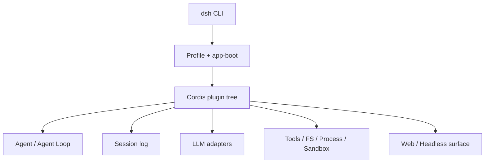
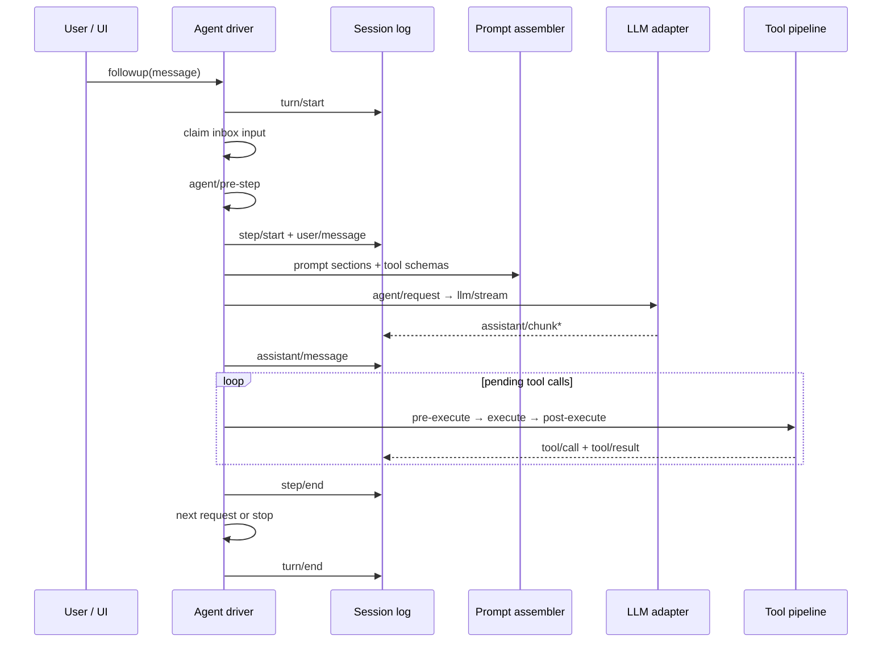

# DeepSeek Harness GitHub 仓库深度解析：插件架构、Agent Loop 与持久化

DeepSeek Harness（命令行名称为 `dsh`）不是 DeepSeek 模型权重，也不是类似 vLLM 的推理服务。它是一套开源 **Agent Runtime / Harness**：负责把模型、系统提示词、会话、工具、权限、工作区、子 Agent、Web UI 和 Headless 入口装配成一个可以运行的整体。

本文只回答“这个 GitHub 仓库是怎么设计和运行的”。Docker、Docker Compose、Helm、StatefulSet、只读根文件系统与 EROFS 修复等工程内容，已经拆分到配套文章：[DeepSeek Harness Docker、Compose 与 Helm 部署实战](deepseek-harness-runtime-containerization.md)。

本文基于 2026-08-13 复核的上游 `master` 源码基线 `47f943859bef60e4160492346772ded9b24f765a`。DeepSeek Harness 仍处于开发者预览阶段，接口和配置未来可能发生破坏性变化。

## 1. 先给结论

- DeepSeek Harness 最核心的抽象不是聊天页面，而是由 Cordis 驱动的一棵插件树；模型、工具、会话和 Agent Loop 都可以被配置替换；
- Profile、Bundle 与多层 patch 把“发行版默认能力”“用户配置”和“临时覆盖”分开，扩展通常不需要 fork 上游；
- Agent Loop 明确区分 turn、step、实时控制事件和持久会话事件，运行状态与可回放事实不会混在同一个事件域里；
- 会话日志不是 UI 聊天记录，而是模型上下文的事实来源；“模型可见即已记录”是恢复、fork、压缩和审计成立的前提；
- 文件系统、进程、Shell、PTY、Sandbox、LLM 和 Subagent 都以能力 seam 组织，适合替换为远端执行环境或企业实现；
- Web UI 只是 Runtime 的一种 Surface。它当前不是带认证、多租户和横向扩展能力的企业 Agent 平台；
- 这个仓库最值得放在“RAG、Agent 与边缘”专题下，进一步归类为 **Agent Runtime、工具执行与会话状态**，而不是“模型推理”。

## 2. 它在 AI 基础设施栈中的位置

理解 Harness 的第一步，是先把它与上下游组件分开：

| 层次 | 典型职责 | 与 DeepSeek Harness 的关系 |
| --- | --- | --- |
| 模型权重 | 参数与基础能力 | Harness 不提供模型权重 |
| 推理引擎 | 批处理、KV Cache、模型并行 | vLLM、SGLang 等可成为下游模型服务 |
| AI Gateway | 路由、限流、配额、审计 | 可放在 Harness 与模型 API 之间 |
| Agent Runtime | 轮次、工具、权限、会话和执行 | Harness 的核心位置 |
| Agent Sandbox | 不可信代码的隔离执行环境 | Harness 提供 seam，但 Runtime 本身不等于强隔离沙箱 |
| Surface | Web、CLI、IDE 或 SDK 交互 | Web 与 Headless 是同一 Runtime 的不同入口 |

可以把一次请求简化为：

```text
User / Web / SDK
        │
        ▼
DeepSeek Harness
  Agent Loop ─ Session log
      │       ├─ Tools / Permissions
      │       ├─ Filesystem / Shell / PTY
      │       └─ Subagent / Sandbox
      ▼
LLM adapter → AI Gateway / Model API
```

它解决的是“如何让模型持续、安全且可恢复地做事”，而不是“如何更快地产生下一个 token”。

## 3. Monorepo 阅读地图

仓库采用 TypeScript monorepo。第一次阅读时不必从所有 `packages/` 逐个展开，可以先抓住以下主干：

| 路径 | 作用 | 阅读价值 |
| --- | --- | --- |
| `apps/cli` | `dsh` 命令入口、内置配置和命令参考 | 理解用户如何启动 Runtime |
| `apps/web` | 浏览器应用 | 理解 Web Surface，而不是核心循环 |
| `packages/boot/app-boot` | Profile 解析、Bundle 叠加和启动 | 理解插件树如何被组装 |
| `packages/bundle/base` | 模型、工具、持久化、沙箱、设置等基础能力 | 理解默认发行版包含什么 |
| `packages/bundle/web-app` | Web Host 与浏览器应用组合 | 理解 `web` Profile |
| `packages/bundle/headless` | 一次性、无服务器运行入口 | 理解 Headless Surface |
| `packages/core/agent` | Agent 接口、活跃 Agent 注册表和事件 | 理解运行中 Agent 的控制面 |
| `packages/core/agent-loop` | 默认 Agent 驱动器 | 理解 turn/step 主循环 |
| `packages/core/session` | 只追加会话事件日志 | 理解持久事实和恢复语义 |
| `packages/core/system-prompt` | 提示词片段与工具 schema 组装 | 理解模型请求如何形成 |
| `packages/core/tools` | 工具注册和执行流水线 | 理解权限、拦截与执行 |
| `packages/llm` | 模型词汇表与适配器 | 理解模型提供方接入点 |
| `packages/fs`、`packages/subprocess`、`packages/shell`、`packages/terminal` | 工作区和进程执行后端 | 理解 Agent 如何作用于真实环境 |
| `packages/sandbox`、`native/landlock-run` | 启动进程前的约束与 Linux 原生 helper | 理解执行边界及其平台假设 |
| `packages/compaction` | 上下文压缩与工具结果裁剪 | 理解长会话如何控制上下文压力 |
| `packages/client` | Web 客户端模块与 UI 能力 | 理解前端也是可组合模块 |

推荐先读官方架构文档，再沿着 `app-boot → bundle/base → core/agent-loop → core/session → core/tools` 追源码。直接从 Web 组件入手，容易把一个 Agent Runtime 误读成聊天应用。

## 4. Cordis：为什么“一切皆插件”不是口号

DeepSeek Harness 底层使用 Cordis。插件向共享 `ctx` 贡献三类东西：

1. 服务，例如 `ctx.sessions`、`ctx.tools` 和 `ctx.llm`；
2. 类型化事件，例如 `agent/request` 和 `tools/pre-execute`；
3. 可逆副作用，例如注册一个工具或适配器，并在插件卸载时自动撤销。



这带来两个直接结果。

第一，不存在一个需要反复打补丁的“特权内核”。默认 Agent Loop、模型适配器、工具注册表乃至会话实现都位于插件树上。

第二，插件生命周期是架构的一部分。注册行为必须可以随插件卸载而撤销，配置热更新才不会留下重复监听器、失效服务或不可追踪的全局状态。这也是 Cordis 相比普通依赖注入容器更值得关注的地方。

## 5. Profile、Bundle 与 patch：运行时是如何装配出来的

一个运行中的 `dsh` 不是固定二进制内的一套硬编码模块，而是启动时叠加出来的配置树。

### 5.1 Profile

Profile 是保存在 Harness home 中的具名组装，记录要加载的 Bundle、Profile 自己安装的树外插件和用户 patch。官方发行物提供两种模板：

- `web`：基础 Runtime 加 Web 应用与 Host Server；
- `headless`：一次性运行器，不启动 Web Server。

### 5.2 Bundle

Bundle 是 Cordis 配置项和挂载代码的分发单元：

- `dsh-base` 提供模型适配、工具、持久化、沙箱与审批、设置、凭据和遥测；
- `dsh-web-app` 增加浏览器应用；
- `dsh-headless` 增加无服务器的一次性执行入口。

### 5.3 有序覆盖

配置按以下顺序应用：

1. Profile 列出的各个 Bundle；
2. Profile 自己的 `cordis.patch.yml`；
3. Harness home 级别的 patch；
4. 命令行传入的 `--patch` overlay。

后面的层可以根据稳定 `id` 替换前面条目的配置，也可以插入新条目。最终配置树可以直接检查：

```bash
dsh --profile web --dump-config
```

这套机制的工程意义是：企业可以把自己的模型适配器、工具策略、远端文件系统或 Web 配置做成独立 Bundle/patch，而不是长期维护一个难以跟随上游升级的 fork。

## 6. 能力 seam：接口、提供方和消费者必须一起看

上游把可替换能力称为 seam。一个完整 seam 包括：

- **Service Definition**：定义接口；
- **Service Provider**：实现能力；
- **Consumer**：消费能力，通常是暴露给模型的工具。

| seam | 定义的能力 | 可能的替换方向 |
| --- | --- | --- |
| Session | 事件追加、读取、fork 与广播 | 本地存储、远端持久化、企业审计 |
| LLM | 模型适配器注册与流式输出 | DeepSeek、OpenAI 兼容 API、内部 Gateway |
| Tools | 作用域化注册和执行策略 | 自定义工具、审批、审计、策略引擎 |
| Filesystem | 目录、文件与策略 | 本地 Workspace、远端 Sandbox 文件系统 |
| Subprocess/Shell/Terminal | 进程、Bash、PTY 与长期终端 | 本机执行、容器、远端执行环境 |
| Sandbox | 启动进程前包装 argv 和施加限制 | Landlock、gVisor/Kata 侧车或外部沙箱 |
| Subagent | 新建、继续、列举和中断子 Agent | 本地子 Agent、跨产品委派 |

文件系统与进程提供方必须处于同一个执行世界。只替换远端文件系统、却仍在本机启动 Bash，会得到互相看不到的两套环境。Harness 的 seam 设计允许把文件、进程、Shell、PTY 和 LSP 成组迁移到远端 Sandbox，而不用 fork Agent Loop。

## 7. 三个事件域：持久事实、实时控制和能力策略

仓库把事件分为三个域，选错域通常会造成恢复或扩展问题。

| 事件域 | 保存什么 | 适用场景 |
| --- | --- | --- |
| Session events | 追加到日志的持久事实 | 重新加载、回放、fork、transcript |
| `agent/*` events | 活跃 Agent 的 inbox、状态、请求和续跑 | 观察或拦截正在进行的工作 |
| capability events | `fs/*`、`tools/*`、`telemetry/*` 等策略点 | 不导入 Agent Loop 就扩展某项能力 |

`turn/start`、`step/start`、`user/message`、`assistant/*`、`tool/*` 和结束事件属于可回放事实；`agent/request`、`agent/pre-step` 和状态事件服务于实时协调。UI 或 SDK 如果需要可恢复的 transcript，应消费 `session/event`，而不是把 `agent/*` 当作历史记录。

部分关键事件采用 waterfall 语义：监听器必须调用 `next()` 才会把控制交给下一层。这让扩展可以检查、重写或拒绝模型请求和工具执行，同时保留明确的委托链。

## 8. Agent Loop：turn 与 step 如何推进

Harness 区分 turn 和 step：

- 一个 **step** 是一次模型请求，以及该响应触发的工具调用；
- 一个 **turn** 可以包含零个或多个 step，直到工具不再要求继续请求，且没有新的下一步输入。



几个容易忽略的细节：

1. 输入先进入统一 inbox，再由驱动器领取；steering 和注入上下文也会经过同一个 `agent/pre-step`；
2. `agent/pre-step` 可以改写或拒绝即将进入模型的消息；即使首次领取被拒绝，持久 turn 仍会闭合并记录这次尝试；
3. 模型流式 chunk 先进入会话事件，最终再形成 `assistant/message`；
4. 工具执行不是简单的串行 `for` 循环，它需要处理执行模式、barrier、并发池、结果顺序与取消；
5. 自然停止前还有 `agent/turn-stopping` 检查点，扩展可以决定是否仍有工作要做。

这种设计把“模型请求”“工具副作用”“实时控制”和“持久历史”拆开，代价是事件模型更复杂，但换来了可拦截、可恢复和可替换的运行时。

## 9. 会话事件溯源：为什么日志是 Runtime 的事实源

`core/session` 维护只追加的 `SessionEvent` 日志。Agent 不直接把一份可变 messages 数组当作唯一状态，而是通过 `deriveMessages()` 从事件流投影出下一次模型请求需要的历史。

上游架构中最重要的不变量是：**模型可见即已记录**。

任何进入模型上下文的信息，都必须能从会话日志重建。如果扩展增加了新的模型可见输入，就需要增加相应 Session Event，并定义如何从日志渲染回模型消息。否则会出现三类问题：

- 页面看见了内容，但重启后模型看不见；
- 当前轮次使用了某段隐式上下文，但 fork 或 transcript 无法解释；
- 压缩、遥测和恢复从不同状态源得到互相矛盾的结果。

基于同一事件流，系统可以派生：

- Web UI 和 SDK 的实时 transcript；
- 中断后的会话恢复；
- 在指定事件边界创建 fork；
- token 用量和遥测；
- 上下文压缩与工具结果裁剪；
- 保留原始 `assistant/chunk` 的流式回放。

这也解释了为什么 Harness home 中的会话数据不能被当作普通缓存。删除它并不只是清理页面历史，而是在删除 Agent 的可恢复事实。

## 10. 长上下文如何处理：压缩也是事件语义的一部分

长会话不可能无限把完整日志直接送给模型。`packages/compaction` 提供压缩与工具结果裁剪能力，并在请求前的 `agent/pre-step` 阶段处理上下文压力。

关键不是简单截断最旧消息，而是维护“原始事件”和“当前 surface replacement generation”之间的关系。只有裁剪或摘要真正推进了替换代际，系统才会开启新的重试轮次；否则原始请求错误仍然成立。

这说明 compaction 不是 UI 层的消息折叠，而是 Agent Loop、会话事件和模型上下文投影共同参与的运行时功能。

## 11. 工具执行与安全边界

模型选择一个工具后，调用会经过有序流水线：

```text
tool/call
  → tools/pre-execute
  → tools/execute
  → tools/post-execute
  → tool/result
```

这里可以挂接参数检查、审批、权限策略、审计和结果转换。执行后端再通过 Filesystem、Subprocess、Shell、Terminal 或 Sandbox seam 作用于真实环境。

但必须区分三个概念：

- 工具审批决定“这次调用是否允许”；
- Sandbox seam 决定“进程以什么约束和后端启动”；
- 容器、gVisor、Kata 或 VM 决定“进程突破应用层限制后还能触达什么”。

Harness 提供了构建安全策略的扩展点，却不意味着默认 Web 进程已经具备多租户强隔离。尤其是 Agent 可以访问挂载的工作区、启动 Shell 并使用配置的凭据时，Web 入口本质上接近一个远程代码执行控制面。

## 12. Web 与 Headless：Surface 不应反过来定义 Runtime

`web` 和 `headless` 不是两套 Agent 内核，而是两种 Profile 组合：

- Web Surface 让浏览器连接 Host Runtime，展示会话、工具、设置和工作区；
- Headless Surface 适合脚本、CI 或一次性任务，不需要启动服务器；
- 未来 IDE、SDK 或其他客户端也可以围绕同一 `ctx.agents` 和 `session/event` 构建。

因此评估仓库时，不应只问 Web UI 是否精致，还应检查：

1. Surface 是否使用持久事件渲染；
2. 客户端断开后 Agent 是否继续运行；
3. 连接、权限与凭据是否有明确边界；
4. Headless 场景是否能复用同一套 Runtime 能力。

当前 Web Server 没有内建 TLS、认证或 Origin 策略，适合可信本机单用户使用。如何安全地放进容器与 Kubernetes，请看[容器化部署篇](deepseek-harness-runtime-containerization.md)。

## 13. 最适合从哪些 seam 做二次开发

| 目标 | 推荐扩展点 |
| --- | --- |
| 增加模型提供方 | 在 `ctx.llm` 注册适配器 |
| 增加模型可调用能力 | 在 `ctx.tools` 注册工具和 schema |
| 给不同会话配置不同能力 | Agent preset 与隔离 realm |
| 对工具增加审批和审计 | `tools/pre-execute` / `tools/post-execute` |
| 使用远端工作区 | 同时替换 Filesystem 与进程执行提供方 |
| 限制启动的进程 | `ctx.sandbox` 后端 |
| 增加模型可见上下文 | `agent.inject()`，并保证最终可从日志重建 |
| 增加持久会话状态 | 扩展 `SessionEventMap` 并实现回放投影 |
| 增加 Web/IDE 客户端 | 驱动 `ctx.agents`，消费 `session/event` |
| 跨产品委派子任务 | 实现 Subagent provider |

对企业场景，优先级通常不是修改 Agent Loop，而是实现以下边界：企业模型 Gateway、凭据服务、远端 Sandbox、Tool Gateway、审计事件出口，以及带身份的客户端入口。Harness 已为这些能力留出 seam，是否生产可用则取决于具体提供方的成熟度。

## 14. 项目成熟度与社区边界

这个仓库已经具备清晰的架构文档、事件图、能力图、测试目录和双语文档，源码组织也明显面向长期扩展；但“架构完整”不等于“生产承诺已经完整”。

截至本文基线：

- 项目仍是开发者预览版，版本号处于 `0.1.0-rc` 阶段；
- 上游提醒未来可能有破坏性变化；
- Web Server 缺少生产级认证与传输安全；
- 本地持久化和单用户工作流不能直接推导出多副本、多租户语义；
- 上游贡献指南暂不接受外部 Pull Request，但鼓励生态项目、教程和反馈。

因此，一个合理的采用策略是：先把它作为单用户 Agent Runtime 和扩展研究基线，在隔离环境中验证模型、工具、持久化和恢复；再根据企业威胁模型补齐身份、审计、Sandbox 与数据治理，而不是直接把 Web 端口公开给团队使用。

## 15. 这篇分析应该放到什么专题

本站将它放在 **RAG、Agent 与边缘**，并建议用以下标签组织后续内容：

- `Agent Runtime`：Agent Loop、turn/step、inbox 与生命周期；
- `Tool Execution`：工具注册、权限、审批、Shell 与 Sandbox；
- `Agent Memory / State`：事件溯源、恢复、fork 与 compaction；
- `Agent Platform Engineering`：Profile、Bundle、seam 与企业扩展；
- `Cloud Native Agent`：Docker、Compose、Kubernetes 与隔离，另见部署篇。

如果只选一个专题名称，最准确的是：**AI Agent Runtime 架构与云原生工程**。

## 16. 推荐阅读顺序

1. `README.zh.md`：确认项目定位和运行方式；
2. `docs/architecture.zh.md`：先建立插件树、事件域和 seam 的整体模型；
3. `docs/cordis-primer.zh.md`：理解服务、事件、生命周期和可逆副作用；
4. `docs/agent-lifecycle.zh.md`：沿 turn/step 时序图跟进主循环；
5. `docs/tool-execution-pipeline.zh.md`：理解执行顺序、并发和策略点；
6. `docs/persistence-catalog.zh.md`：核对每类持久状态的位置和所有者；
7. 再进入 `packages/core`、`packages/bundle` 与具体能力 provider。

如果目标是直接部署，可跳到[DeepSeek Harness Docker、Compose 与 Helm 部署实战](deepseek-harness-runtime-containerization.md)。配套实现位于 [runzhliu/deepseek-harness-docker](https://github.com/runzhliu/deepseek-harness-docker)。

## 参考资料

- [DeepSeek Harness 官方仓库](https://github.com/deepseek-ai/deepseek-harness)
- [中文 README](https://github.com/deepseek-ai/deepseek-harness/blob/master/README.zh.md)
- [架构文档](https://github.com/deepseek-ai/deepseek-harness/blob/master/docs/architecture.zh.md)
- [Cordis 入门](https://github.com/deepseek-ai/deepseek-harness/blob/master/docs/cordis-primer.zh.md)
- [Agent 生命周期](https://github.com/deepseek-ai/deepseek-harness/blob/master/docs/agent-lifecycle.zh.md)
- [能力 seam](https://github.com/deepseek-ai/deepseek-harness/blob/master/docs/capability-seams.zh.md)
- [工具执行流水线](https://github.com/deepseek-ai/deepseek-harness/blob/master/docs/tool-execution-pipeline.zh.md)
- [持久化目录](https://github.com/deepseek-ai/deepseek-harness/blob/master/docs/persistence-catalog.zh.md)
- [上游贡献指南](https://github.com/deepseek-ai/deepseek-harness/blob/master/CONTRIBUTING.zh.md)
- [DeepSeek Harness 容器化部署篇](deepseek-harness-runtime-containerization.md)
