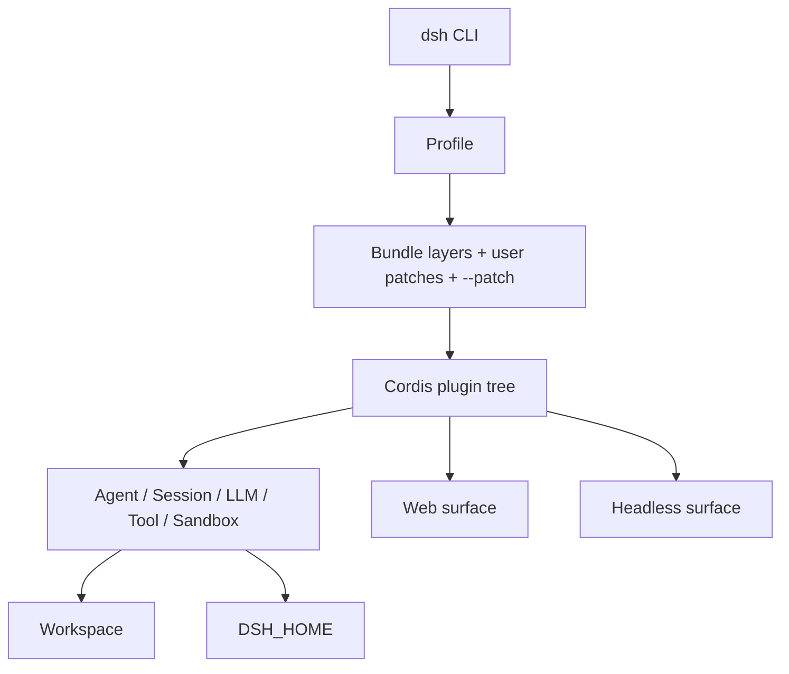
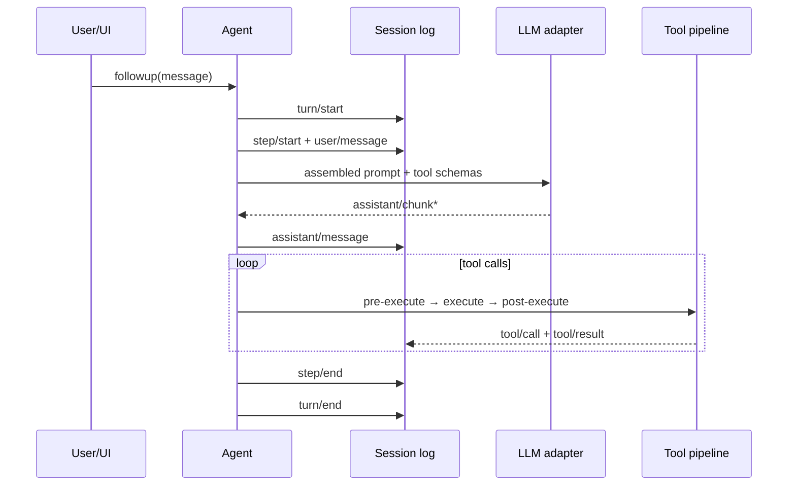
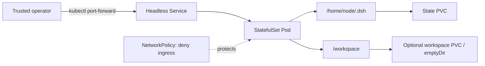

# DeepSeek Harness 架构、运行机制与云原生容器化

DeepSeek Harness（命令行名称为 `dsh`）不是 DeepSeek 模型的推理服务，而是一个由 TypeScript 编写、通过 Cordis 组合的开源 Agent Runtime。它把模型适配、系统提示词、会话、工具、权限、工作区、子 Agent、Web UI 和 Headless 入口装配成一个可替换的插件图。

这决定了它在本站最合适的位置不是“LLM 推理”，而是 **RAG、Agent 与边缘 → AI Agent Runtime 云原生化**。分析它时真正值得关注的也不是如何启动一条 `npx` 命令，而是以下四个问题：

1. 它如何把 Agent 的运行能力组合起来；
2. 模型请求、工具执行和会话持久化之间是什么关系；
3. 容器需要保存哪些状态、开放哪些权限；
4. 为什么“页面能打开”远远不等于“已经可以安全部署”。

本文基于 2026-08-13 的上游开发者预览版本和 `@deepseek-ai/dsh@0.1.0-rc.6` 编写。上游明确提示未来会有破坏性变更，生产采用前应重新核对版本、配置和安全假设。

配套的 Dockerfile、Docker Compose、Helm Chart 和中英文使用文档位于独立项目 [deepseek-harness-docker](https://github.com/runzhliu/deepseek-harness-docker)，双架构社区镜像发布在 [Docker Hub](https://hub.docker.com/r/runzhliu/deepseek-harness)。

## 1. 先给结论

- DeepSeek Harness 的核心价值是“一切皆插件”的 Agent Runtime，而不是模型推理或单一聊天 UI；
- Profile、Bundle 和 Cordis patch 形成有序配置层，适合在不 fork 上游代码的情况下增加容器专用配置；
- 会话是事件溯源日志，模型看见的上下文必须能够从持久事件重建，因此 `$DSH_HOME` 不是普通缓存；
- Web Surface 当前没有 TLS、认证或 Origin 策略，并且背后的工具可以执行代码，只适合可信的本机单用户环境；
- 容器化必须同时解决原生 Node 模块、Web 监听、HMR、可写主目录、PID 1、持久化和最小权限；
- Docker/Pod 约束的是宿主边界，Harness 的审批与沙箱约束的是 Agent 工具边界，两者互补、不能互相替代；
- Kubernetes 上应先使用单副本 StatefulSet 和端口转发，不应把无认证 Web UI 直接放到 Ingress、NodePort 或 LoadBalancer 后面。

## 2. 它是什么，不是什么

官方把 DeepSeek Harness 定义为开源 Agent Harness。最终用户通常通过 npm 发行物运行：

```bash
npx @deepseek-ai/dsh web
```

这个命令默认在 `127.0.0.1:3080` 启动 Web UI。但 Web UI 只是一个 Surface，Host 进程里还运行着 Agent Loop、模型适配、会话存储、工具注册、文件系统、Shell/PTY、审批策略等服务。

因此它与常见组件的边界如下：

| 类别 | 解决的问题 | DeepSeek Harness 的关系 |
| --- | --- | --- |
| 模型权重 | 参数与推理能力 | 不提供模型权重 |
| vLLM/SGLang | 高吞吐模型推理 | 可以作为下游模型 API，但不是同一层 |
| AI Gateway | 模型路由、配额和治理 | 可位于 Harness 与模型服务之间 |
| Agent 框架/Runtime | 轮次、工具、状态和执行 | Harness 的核心位置 |
| Agent Sandbox | 不可信代码的隔离执行环境 | Harness 有权限与执行 seam，但容器本身不是强隔离证明 |
| Web Chat | 人机交互界面 | Harness Web 是共享 Runtime 的一种 Surface |

截至本文复核日期，上游仓库没有 Dockerfile、Compose 或 Kubernetes 清单。上游贡献指南同时说明当前暂不接受外部 Pull Request，并鼓励社区创建生态项目和教程。因此把容器方案做成独立社区项目，比声明“官方镜像”或直接提交上游 PR 更符合当前贡献边界。

## 3. 运行时架构：一棵可组合的插件树

DeepSeek Harness 底层使用 Cordis。插件向共享上下文贡献服务、类型化事件和可撤销副作用。模型适配器、工具注册表、会话日志、Agent Loop、Web Server 都是插件，不存在不能替换的特权内核。



### 3.1 Profile、Bundle 与 patch

Profile 是保存在 Harness home 中的具名组装。官方发行物提供 `web` 和 `headless` 模板：

- `web` 组合浏览器应用和 Host Runtime；
- `headless` 组合一次性运行器，不启动服务器。

Bundle 是 Cordis 配置项及挂载代码的分发格式。运行配置按以下顺序叠加：

1. Profile 列出的各个 Bundle；
2. Profile 自己的 `cordis.patch.yml`；
3. Harness home 级别的 patch；
4. 命令行传入的 `--patch` overlay。

后面的层可以根据稳定 `id` 替换前面配置。因此容器项目无需修改上游源码，只要提供一份容器专用 overlay，就能让 Web Server 在容器网络内监听 `0.0.0.0`：

```yaml
- id: webserver
  name: '@deepseek-ai/dsh-host-webserver'
  config:
    host: '0.0.0.0'
    port: !!js ctx.webStartup.port ?? 3080
```

这是一条重要的官方扩展缝隙，但不是安全绕过的许可证。监听地址改变后，部署边界必须重新把入口限制在宿主回环或 `kubectl port-forward`。

可以用以下命令查看最终配置树：

```bash
dsh --profile web --dump-config
```

### 3.2 核心能力 seam

Harness 把可替换能力称为 seam：接口定义、实现提供方和消费者共同组成一条能力缝隙。

| 能力 | 作用 |
| --- | --- |
| Session | 保存只追加的 `SessionEvent` 日志并广播事件 |
| System Prompt | 组合提示词片段和工具 schema |
| LLM | 注册并选择模型适配器，输出流式结果 |
| Tools | 作用域化工具注册，以及执行前、执行中、执行后的策略流水线 |
| Filesystem | 文件访问与策略，可替换成本地或远端工作区 |
| Subprocess/Shell/Terminal | Bash、PTY 和长期终端的执行后端 |
| Sandbox | 在启动进程前包装参数并施加执行限制 |
| Subagent | 创建、继续、列举或中断子 Agent |

文件系统与进程提供方共享同一个执行世界。把它们统一替换为远端 Sandbox 后，Bash、PTY 和 LSP 可以一起移动，而不必给每个工具单独做 fork。这种“能力 seam”比在 Agent Loop 中硬编码工具更利于二次开发。

## 4. 一个 Agent 轮次如何运行

Harness 区分 turn 与 step：一个 step 是一次模型请求和随后发生的工具调用；一个 turn 可以包含多个 step，直到工具不再要求继续请求、也没有新输入需要处理。



这里有两个值得平台工程师关注的设计：

1. `agent/*` 事件负责实时控制、队列、状态和拦截；持久事实进入 Session 日志；
2. “模型可见即已记录”：进入模型请求的上下文必须能从日志重建。

因此会话日志不只是 UI 历史。恢复、fork、transcript、遥测和上下文压缩都从事件流派生。镜像升级或 Pod 重建时丢失这部分数据，会直接改变 Agent 的可恢复语义。

## 5. 状态应该放在哪里

Harness home 的默认解析顺序是 `$DSH_HOME`，然后是 `~/.dsh`。容器方案应显式设置：

```text
DSH_HOME=/home/node/.dsh
HOME=/workspace
```

二者有意分离：

```text
/home/node/.dsh/
├── profiles/       # Profile、Bundle 元数据和用户 patch
├── settings.yaml   # 模型与运行设置
├── credentials*    # 凭据或其引用
├── sessions/       # 会话事件日志
└── storages/       # Workspace 等领域状态

/workspace/         # 用户代码和 Agent 实际操作目录
```

`DSH_HOME` 需要持久卷；`/workspace` 则根据场景使用 bind mount、独立 PVC 或临时卷。这样既能重建镜像，又不会把用户代码和 Harness 内部状态混成一个生命周期。

### 5.1 为什么 `HOME=/workspace` 修复 EROFS

在只读根文件系统中，`/home/node` 不可写。Web 目录选择器以 Node.js 的 `os.homedir()` 作为首页；如果它仍返回 `/home/node`，用户点击“新建文件夹”时会得到：

```text
EROFS: read-only file system, mkdir '/home/node/test'
```

把 `HOME` 指向已经挂载为可写的 `/workspace`，目录选择器首页和实际工作区就落到同一写入边界。不要通过关闭只读根文件系统或以 root 运行来掩盖这个路径错误。

## 6. Dockerfile 的八个关键决策

### 6.1 固定发行版本

不要在镜像构建中使用漂移的 `latest`。通过 `ARG DSH_VERSION` 固定 `@deepseek-ai/dsh`，并在构建阶段执行 `dsh --version`，让包发布错误在构建时暴露。

### 6.2 使用 Node.js 24

上游 `engines` 要求 Node.js `^22.19.0 || >=24.0.0`。Node 24 是当前容器项目的明确基线，不应依赖宿主上的隐式 Node 版本。

### 6.3 多阶段处理 `node-pty`

Agent 的 Shell 和终端能力依赖原生模块。某些 CPU 架构没有可直接使用的预编译产物，npm 安装会回退到 `node-gyp`。因此 builder 安装 Python、编译器和 make，runtime 只复制最终 npm 包；这既支持 arm64/amd64，也避免在运行镜像里长期保留编译工具链。

### 6.4 使用明确入口而不是脆弱的 shim

Web Profile 启动后会挂载配置 watcher，当前版本的 HMR 服务需要 Node 的 `--expose-internals`。这个参数只应传给 DSH 主进程，不能写入会被工具子进程继承的 `NODE_OPTIONS`。

### 6.5 用 `tini` 管理 PID 1

Agent 会创建 Shell、PTY、语言服务和其他子进程。`tini` 负责转发终止信号并回收孤儿进程，避免 `docker stop`、Kubernetes 终止和僵尸进程出现不一致行为。

### 6.6 非 root 和只读根文件系统

运行时使用 UID/GID 1000，根文件系统只读，只给 `/workspace`、`$DSH_HOME` 和 `/tmp` 写权限；同时 drop 全部 capabilities、启用 `no-new-privileges` 和默认 seccomp。

### 6.7 保留必要运行工具

精简不能等同于删除 Agent 的工作能力。Git、OpenSSH Client、Python、ripgrep 和 `procps` 是合理的基础工具；具体语言编译器和业务依赖应通过派生镜像增加，而不是把所有工具塞进通用基础镜像。

### 6.8 禁用默认遥测

社区镜像默认设置 `DSH_TELEMETRY_DISABLED=1`，由使用者在理解数据边界后显式开启。

## 7. Web 监听是最大的安全陷阱

Docker bridge 端口映射要求容器进程监听非 loopback 地址；但是上游默认只监听 `127.0.0.1`，而且 Web Server 文档明确说明目前没有 TLS、认证或 Origin 策略。这个服务背后的 Agent 工具可以访问文件、启动 Shell 和执行代码。

因此正确链路是：

```text
Browser
  │ http://127.0.0.1:3080
  ▼
Host loopback publication
  │ Docker port forwarding
  ▼
Container 0.0.0.0:3080
  │
  ▼
DeepSeek Harness Host + code-execution tools
```

容器内部的 `0.0.0.0` 只是满足 bridge 网络；宿主发布必须是：

```yaml
ports:
  - "127.0.0.1:3080:3080"
```

以下做法都不安全：

- `docker run -p 3080:3080 ...`；
- 允许局域网访问宿主端口；
- Kubernetes NodePort 或 LoadBalancer；
- 没有身份认证、授权和可信反向代理的公开 Ingress；
- 把仅限制浏览器入口误当成工具执行隔离。

## 8. Compose 的职责

一份可靠的 Compose 文件应同时表达运行和安全边界：

- 把端口固定发布到宿主 `127.0.0.1`；
- `dsh-home` 命名卷保存 Profile、设置和会话；
- 用户选择的代码目录 bind 到 `/workspace`；
- 根文件系统只读，`/tmp` 使用 `tmpfs`；
- drop capabilities、禁止提权并限制进程数量；
- 通过容器内部 HTTP 请求执行健康检查；
- 设置重启策略但不隐藏持续崩溃。

关键验证不是只执行 `docker compose up`，还要重建容器后确认 `$DSH_HOME` 中的数据仍存在，并在 Web 目录选择器中创建一个目录，复现并验证 EROFS 已经消失。

## 9. 为什么 Helm 使用 StatefulSet

当前 Web Surface 是有状态、单用户的运行时。Profile、凭据、会话和 Workspace 索引都会写入本地状态，没有证据表明多个副本可以并发写同一套数据并保持一致。

所以 Chart 采用单副本 StatefulSet，而不是用 Deployment 制造“可水平扩展”的错觉：



Chart 的基线应包括：

- `replicas: 1`；
- StatefulSet 稳定身份和 `/home/node/.dsh` PVC；
- 可选的 `workspace.existingClaim`；
- PVC retention policy 为 Retain；
- `automountServiceAccountToken: false`；
- UID/GID 1000、`RuntimeDefault` seccomp、只读根文件系统和 drop ALL；
- 默认拒绝 Pod 入站的 NetworkPolicy；
- 不创建 Ingress 或 LoadBalancer；
- 通过 `existingSecret` 注入 provider 凭据，Secret 不写进 values 或镜像。

访问方式保持为：

```bash
kubectl -n deepseek-harness port-forward service/deepseek-harness 3080:3080
```

如果未来上游提供身份认证、租户隔离、并发安全的共享状态后端和明确的横向扩展契约，再评估 Deployment 或多副本 StatefulSet。

## 10. 容器隔离不等于 Agent Sandbox

容器与 Harness 权限系统保护的是不同边界：

| 层 | 保护对象 | 不能单独解决的问题 |
| --- | --- | --- |
| Docker/Kubernetes | 宿主目录、Linux capabilities、资源、Pod 网络 | Agent 在已挂载工作区内的误操作 |
| Harness 审批与沙箱 | 工具调用、文件模式、启动进程的参数 | 容器逃逸、内核漏洞、租户间强隔离 |
| gVisor/Kata/VM | 更强内核或虚机边界 | 凭据滥用、数据外传、业务越权 |
| Tool Gateway | 外部 API 身份、授权、审计 | 本地代码执行和宿主隔离 |

Landlock、用户命名空间和原生 helper 是否有效，取决于目标 Linux 内核和容器运行时。不要为了让一次工具调用成功而增加 `--privileged`、挂载 Docker Socket 或授予宽泛 capabilities。对于不可信代码和多租户场景，应把 Harness 运行在独立的 Agent Sandbox、gVisor、Kata 或 VM 边界中，并默认拒绝出站网络。

## 11. 发布前验证矩阵

| 验证项 | 最低通过条件 |
| --- | --- |
| 版本 | `dsh --version` 等于固定构建参数 |
| 架构 | `linux/amd64` 与 `linux/arm64` 均可构建，原生 PTY 可以实际 spawn |
| 用户 | 进程不是 root，工作区文件归属符合预期 |
| Web | 健康检查返回 200，宿主只监听 `127.0.0.1` |
| 状态 | 强制重建容器/Pod 后 Profile 和会话仍存在 |
| 目录 | Web 内新建工作区目录不再出现 `/home/node` EROFS |
| 信号 | `docker stop` 或 Pod 终止能在宽限期内退出 |
| 权限 | 根文件系统只读、drop ALL、无提权、无 ServiceAccount Token |
| Helm | `helm lint --strict` 和至少两组 `helm template` values 通过 |
| 工具 | 目标平台完成真实文件、Shell、PTY 和模型调用测试 |
| 安全 | 无公开 Ingress/NodePort/LoadBalancer，Secret 不进入 Git 或镜像层 |

HTTP 200 只证明 Web Server 启动；它不能证明模型凭据正确、PTY 可用、沙箱生效或会话能恢复。发布证据必须覆盖这些相互独立的边界。

## 12. 项目价值与后续方向

这个容器项目的价值不是“给一条能跑的 Docker 命令”，而是把上游隐含的运行假设变成可审查的基础设施契约：

- 镜像负责版本、原生依赖、用户、入口和信号；
- Compose 负责本机入口、挂载、持久化和开发安全基线；
- Helm 负责 Kubernetes 身份、PVC、Secret、网络和 Pod Security；
- README 负责清楚声明支持范围与禁止暴露的边界；
- CI 应负责双架构构建、镜像扫描、Compose Smoke 和 Helm 渲染。

后续可在不破坏安全模型的前提下增加：

1. 多架构 OCI 镜像发布和 SBOM/签名；
2. 版本自动检测，但仍由 Pull Request 固定并验证升级；
3. 针对 gVisor/Kata 的 RuntimeClass 示例；
4. 通过 OAuth2/OIDC 代理与 Tool Gateway 研究受控共享部署；
5. 在上游状态后端成熟后重新评估多副本和灾备。

## 参考资料

- [DeepSeek Harness 官方仓库](https://github.com/deepseek-ai/deepseek-harness)
- [DeepSeek Harness 架构文档](https://github.com/deepseek-ai/deepseek-harness/blob/master/docs/architecture.md)
- [Cordis 入门](https://github.com/deepseek-ai/deepseek-harness/blob/master/docs/cordis-primer.md)
- [Web Server 子系统](https://github.com/deepseek-ai/deepseek-harness/blob/master/docs/subsystems/web-server.md)
- [会话持久化子系统](https://github.com/deepseek-ai/deepseek-harness/blob/master/docs/subsystems/persistence.md)
- [上游贡献指南](https://github.com/deepseek-ai/deepseek-harness/blob/master/CONTRIBUTING.md)
- [`@deepseek-ai/dsh` npm 发行物](https://www.npmjs.com/package/@deepseek-ai/dsh)
- [deepseek-harness-docker 配套项目](https://github.com/runzhliu/deepseek-harness-docker)
