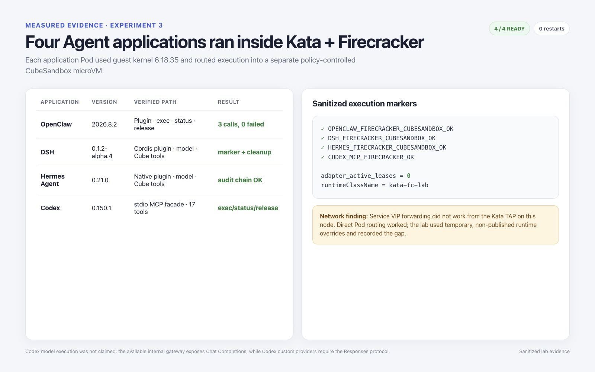
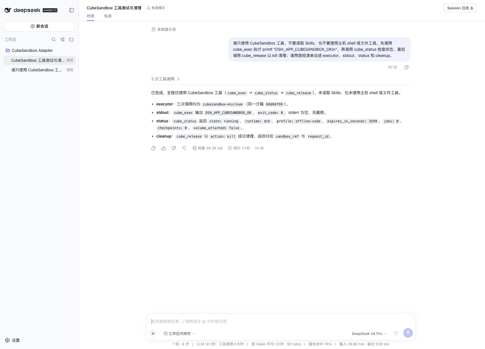
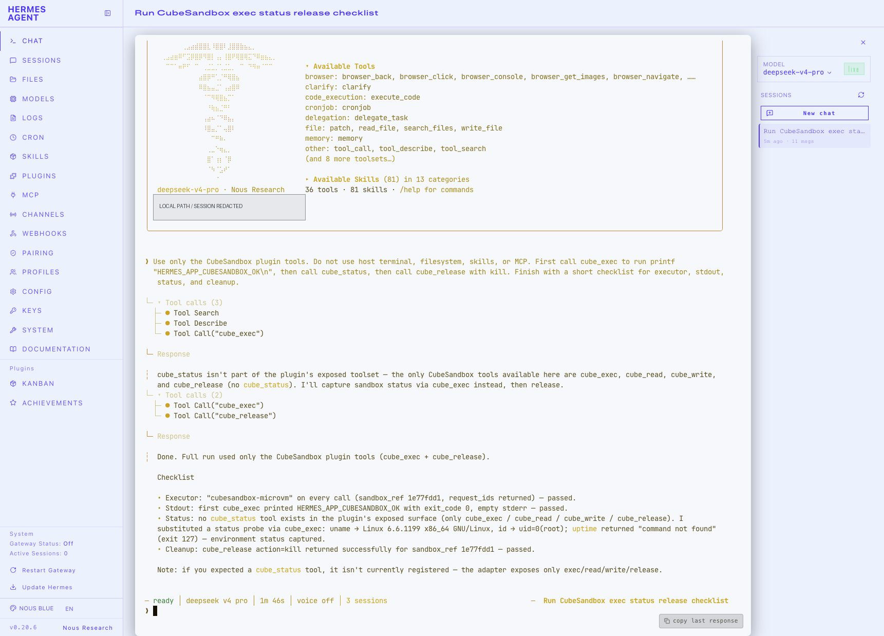
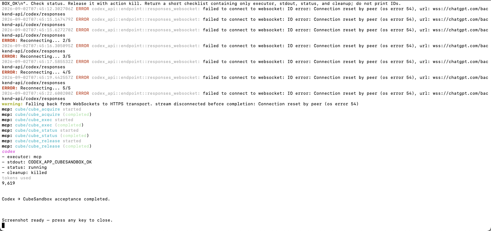

# Agent workloads on Kata + Firecracker

This experiment ran OpenClaw, DSH, Hermes, and Codex as ordinary Kubernetes
Pods selected by `runtimeClassName: kata-fc-lab`. Each Pod therefore had an
outer Kata/Firecracker microVM boundary. The agent's CubeSandbox integration
then acquired a separate sandbox through the Adapter API:

```text
Kubernetes Pod
  -> Kata runtime-rs
  -> Firecracker microVM (agent runtime)
  -> agent CubeSandbox plugin or MCP client
  -> CubeSandbox Adapter
  -> CubeSandbox sandbox (tool execution)
```

This deliberately tests composition, not replacement. Firecracker supplies
the Pod boundary; CubeSandbox supplies the agent-facing execution API and
sandbox lifecycle.

## Result

| Application | Version | Path exercised | Result |
| --- | --- | --- | --- |
| OpenClaw | 2026.8.2 | Plugin discovery, model turn, `cube_exec`, `cube_status`, `cube_release` | Pass; three successful tool calls, zero tool failures |
| DSH | 0.1.2-alpha.4 | Headless agent run and CubeSandbox plugin tools | Pass; execution marker returned and sandbox released |
| Hermes | 0.21.0 | Plugin doctor, one-shot model run, CubeSandbox lifecycle | Pass; plugin detected, execution marker returned, audit chain clean |
| Codex | 0.150.1 | Adapter client and official MCP stdio handshake | Partial; all 17 MCP tools discovered and lifecycle smoke passed; model turn not run |

Codex was not given a synthetic success. Its custom model providers currently
require the Responses wire API, while the available lab gateway exposed Chat
Completions. The Adapter and MCP integration were tested independently instead.



## Reproducible deployment shape

[`manifests/kata-fc-agents.yaml`](manifests/kata-fc-agents.yaml) contains the
sanitized Pod definitions. Before applying it, provide these environment-owned
objects without committing their values:

- `Secret/firecracker-agent-model`, containing model endpoint and credential
  variables required by the selected agent;
- `Secret/cube-adapter-auth`, with key `token`;
- the four `firecracker-*-plugin` ConfigMaps generated from the matching plugin
  release;
- a reachable CubeSandbox Adapter service and the four pinned workload images
  in the node's local image store or an approved registry.

The manifest uses Secret references, drops Linux capabilities, disallows
privilege escalation, applies the runtime-default seccomp profile, and gives
each application a separate `emptyDir` workspace.

```bash
kubectl apply -f manifests/kata-fc-agents.yaml
kubectl wait -n agent-runtime --for=condition=Ready \
  pod/kata-fc-openclaw pod/kata-fc-dsh pod/kata-fc-hermes pod/kata-fc-codex \
  --timeout=300s
kubectl get pod -n agent-runtime -l app.kubernetes.io/part-of=firecracker-agent-lab -o wide
```

Verify the boundary on both sides: `kubectl exec` should report the Kata guest
kernel, while the worker should show one Firecracker VMM per Pod.

## Compatibility findings

The cluster's normal ClusterIP path was not reachable from the tested Kata TAP
network. Direct Pod addressing worked. The model endpoint was also unreachable
from the isolated worker, so a temporary, access-controlled SSH reverse relay
was used only for the test and removed afterward. These are network integration
findings, not Firecracker failures. Production should fix CNI/service routing
and use an authenticated internal egress path instead of retaining a relay.

Mounting the agent's entire state directory from `emptyDir` also exposed an
`fchmod` compatibility failure in two images. The test kept application state
inside the container root filesystem and mounted only the workspace or the
known-compatible state path. Re-test ownership changes before making those
mounts persistent.

## Light-mode application evidence

The four images below are real light-mode product captures of the same
CubeSandbox application integrations. They are copied into this standalone
publication bundle. The new Firecracker-specific result is represented by the
sanitized measurement image and audit outcomes above; the UI captures are not
presented as synthetic Firecracker consoles.

### OpenClaw


### DSH



### Hermes



### Codex



## Cleanup checks

After every agent task, require both application output and Adapter audit
evidence for release. At the end of the run, the Adapter reported zero active
leases. A successful text response alone is not sufficient cleanup proof.
