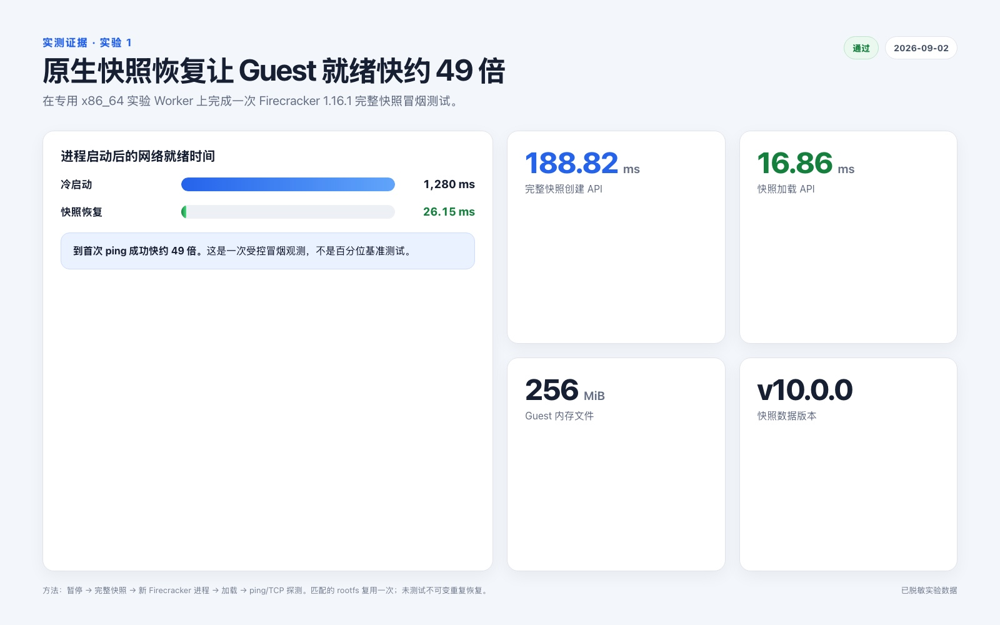
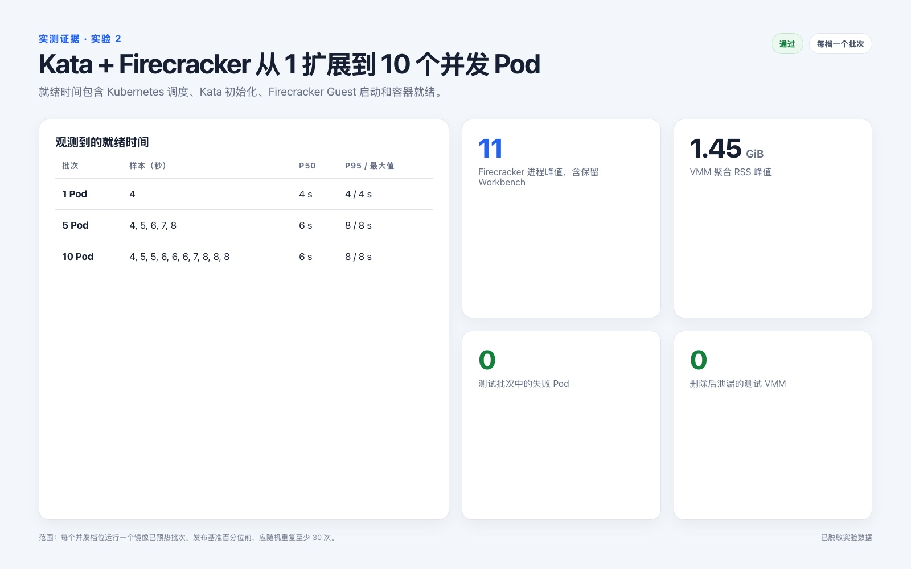

# Firecracker 实验结果与操作手册

指定的实验子集，也就是实验 1、2、3、5 和 7，已在专用 Worker 上执行。除非明确说明为重复
测量，以下结果均属于冒烟测试和兼容性观察。

## 已执行的实验

| 编号 | 实验 | 结果 | 证据 |
| --- | --- | --- | --- |
| 1 | 原生快照与恢复 | 通过 | 完整快照可由新进程恢复；Guest 网络和 TCP/22 恢复 |
| 2 | Kata 并发 | 通过 | 1、5、10 Pod 三档；失败 Pod、VMM 泄漏和快照泄漏均为 0 |
| 3 | Agent 应用 | 通过，但 Codex 模型受协议限制 | OpenClaw、DSH、Hermes 的模型/工具运行通过；Codex Adapter 和 MCP 链路通过 |
| 5 | 可观测性 | 通过 | 已采集 Payload、VMM、宿主机、devmapper 和 Adapter 信号 |
| 7 | Jailer/安全基线 | 通过 | 已检查 chroot、命名空间、cgroup、Capabilities、`NoNewPrivs` 和 seccomp |

## 1. 原生快照与恢复

暂停 Guest 后，通过 Firecracker API 创建完整快照。VM 状态、内存、指标和配套根文件系统
被保留为同一个实验包。

| 测量项 | 观测值 |
| --- | --- |
| 创建快照 | 188.82 ms |
| 快照内存文件 | 256 MiB |
| VM 状态文件 | 23 KiB |
| 恢复 API | 16.86 ms |
| 恢复后 Guest ping Ready | 26.15 ms |
| Guest 冷启动 ping 基线 | 1.280 s |
| 观测到的 Ready 时间比值 | 恢复比单次冷启动基线快约 49 倍 |
| 恢复的服务 | ICMP 和 TCP/22 通过；VM 状态为 `Running` |

这还不是可重复的快照基准测试。本轮只使用了一个恢复实例，也没有为重复恢复不可变克隆根文件
系统。Firecracker 快照不包含后端磁盘，因此生产工具必须将 VM 状态、内存和所有磁盘一起进行
版本管理与完整性验证。

## 2. Kata 并发

[`manifests/kata-fc-concurrency.yaml`](manifests/kata-fc-concurrency.yaml)
通过 `kata-fc-lab` 创建有明确规模上限的测试批次。

| 批次 | Ready 时间观测值 | 汇总 |
| --- | --- | --- |
| 1 Pod | 4 s | 1/1 通过 |
| 5 Pods | 4、5、6、7、8 s | P50 6 s，最大 8 s，5/5 通过 |
| 10 Pods | 4、5、5、6、6、6、7、8、8、8 s | P50 6 s，P95 8 s，最大 8 s，10/10 通过 |

宿主机峰值状态为 11 个 Firecracker 进程，其中包含保留的 Workbench，VMM 聚合 RSS 约为
1.45 GiB。删除每个批次后，只剩保留的 Workbench VMM 及其预期存在的 devmapper 活跃快照。

这是有界冒烟测试，不是饱和度基准测试。生产研究至少应随机重复 30 次，并覆盖 50/100 Pod、
P99、API 限流、CPU 争用和删除延迟。

## 3. Agent 应用

OpenClaw、DSH、Hermes 和 Codex 均以 Kata/Firecracker Pod 形式部署，并通过 CubeSandbox
Adapter 完成测试。版本、凭据策略、产品截图、网络发现和 Codex 协议限制参见
[完整 Agent 指南](agent-workloads.md)。

## 5. 可观测性

测量时特意将 Payload 内存与宿主机侧 VMM RSS 分开。在采样时刻，四个 Agent Payload 合计
约 1.07 GiB；包含保留 Workbench 在内的五个 Firecracker 进程合计约 2.68 GiB RSS。
任务结束后，Adapter 报告的活跃租约数为 0。

采集和解读细节参见[可观测性与资源核算](observability.md)。

## 7. Jailer 与安全基线

使用非特权身份，由 jailer 1.16.1 启动一个原生 2 vCPU、256 MiB Guest。启动后 VMM 的
有效 Capabilities 为 0，`NoNewPrivs=1`，观测到的四个线程均处于 seccomp 过滤模式 2。
同时还检查了 chroot、PID/挂载命名空间、cgroup shares、rlimit 和显式创建的设备节点。

限制条件和生产要求参见 [Jailer 与安全基线](security-hardening.md)。

## 延后实验

本轮有意未执行以下项目：

- MMDS 与 vsock 控制通道；
- 网络与块设备限速、内存 Balloon，以及资源压力/OOM 行为；
- PVC 与 NetworkPolicy 组合矩阵；
- 注入 shim/VMM 被杀、CNI 中断、Thin Pool 耗尽和节点重启故障；
- 持续 50/100 Pod 并发，以及与 CubeSandbox 进行统计受控对比。

## 主要参考资料

- [Firecracker 快照支持](https://github.com/firecracker-microvm/firecracker/blob/main/docs/snapshotting/snapshot-support.md)
- [快照版本与 CPU 兼容性](https://github.com/firecracker-microvm/firecracker/blob/main/docs/snapshotting/versioning.md)
- [Firecracker 指标](https://github.com/firecracker-microvm/firecracker/blob/main/docs/metrics.md)
- [Firecracker jailer](https://github.com/firecracker-microvm/firecracker/blob/main/docs/jailer.md)
