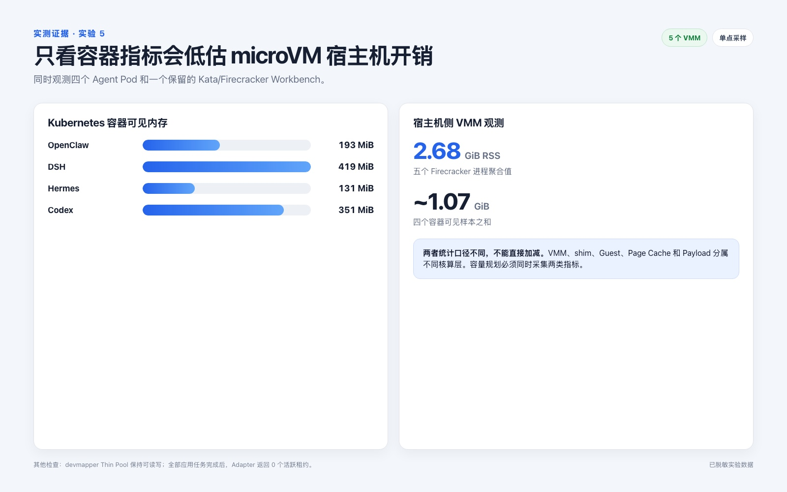

# 可观测性与资源核算

Kubernetes 容器指标无法覆盖 Kata/Firecracker 沙箱的完整成本。容量决策至少需要
对齐以下三层数据：

```text
业务容器指标（kubectl/cAdvisor）
        + 宿主机上的 Kata shim 和 Firecracker VMM 进程
        + devmapper、网络与沙箱控制面状态
```

## 单点采样结果

采样时共有四个 Agent Pod 和一个保留的 Workbench 正在运行。

| 信号 | 观测结果 |
| --- | --- |
| `kubectl top` 中的业务容器内存 | OpenClaw 193 MiB、DSH 419 MiB、Hermes 131 MiB、Codex 351 MiB |
| 业务容器小计 | 1,094 MiB，约 1.07 GiB |
| 宿主机 VMM 数量 | 5 个 Firecracker 进程 |
| VMM RSS 合计 | 2,812,964 KiB，约 2.68 GiB |
| 采样时宿主机内存 | 已用 12,128 MiB，可用 227,135 MiB |
| 宿主机平均负载 | 1.75 / 1.07 / 1.05 |
| Devmapper | Pool 可写，利用率较低 |
| Adapter 生命周期 | 任务结束后 `cube_adapter_active_leases` 为 0 |

这些只是某个时间点的冒烟观测，不是容量基准。关键发现是核算缺口：仅累加四个业务
容器的读数，会遗漏 Firecracker VMM 工作集和其他宿主机侧运行时成本。



## 采集清单

使用时间戳或运行 ID 关联以下数据源：

```bash
kubectl top pod -n agent-runtime
kubectl get pod -n agent-runtime -o wide

# 在专用 Worker 上执行：
ps -eo pid,ppid,rss,etimes,args | grep '[f]irecracker'
dmsetup status fc-devpool
ctr -n k8s.io snapshots --snapshotter devmapper ls
```

还应保留：

- Kata shim 的 CPU/RSS 及其 cgroup 路径；
- VMM 的 CPU/RSS 和线程数；
- CNI/TAP 计数器和丢包数；
- devmapper 数据与元数据利用率；
- Firecracker API、块设备、网络、延迟和 seccomp 指标；
- Adapter 请求延迟、错误数、活跃租约和释放结果。

Firecracker 指标需要在启动前配置，而且不会随快照状态自动恢复。恢复流程必须先重新
创建 metrics 和 logger 端点，再加载快照。
