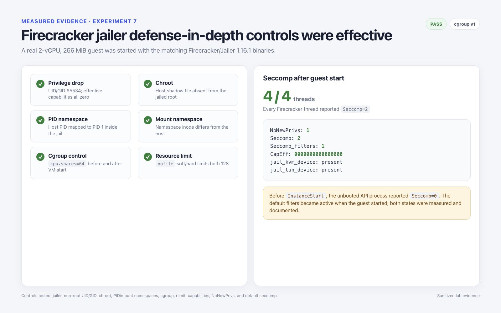

# Jailer and security baseline

The launcher Pod is useful for qualification but is privileged host-management
code. The security experiment therefore also launched a native microVM through
the matching Firecracker `jailer` binary and inspected the host process after
`InstanceStart`.

## Verified baseline

| Control | Observed result |
| --- | --- |
| Version pairing | Firecracker 1.16.1 and jailer 1.16.1 |
| Identity | Dedicated UID/GID 65534 |
| Filesystem | Per-instance chroot; host `/etc/shadow` absent |
| PID namespace | Host VMM PID mapped to PID 1 inside its namespace |
| Mount namespace | Distinct from the host namespace |
| Devices | Only deliberate `/dev/kvm` and `/dev/net/tun` device nodes in the jail |
| Capabilities | Effective capability mask zero |
| Privilege escalation | `NoNewPrivs=1` after VM start |
| Seccomp | All four VMM threads reported filter mode 2 after VM start |
| Cgroup v1 | CPU shares remained 64 across startup |
| File descriptors | Soft and hard `nofile` limit 128 |
| Guest | Running with 2 vCPU and 256 MiB |

Before `InstanceStart`, the API process showed seccomp mode 0. After startup,
all four VMM threads showed seccomp mode 2 with one installed filter. Security
checks must therefore inspect the post-start VMM, not infer the final posture
from the preboot API process.

## Deployment requirements

- Pin and verify a matching Firecracker/jailer pair.
- Use one unprivileged identity and one non-reused chroot per instance.
- Make kernel, rootfs, and configuration inputs immutable to the jail UID.
- Create only the device nodes required by the selected VM configuration.
- Set explicit cgroup, rlimit, NUMA, CPU, memory, network, and cleanup policy.
- Authenticate and restrict access to the Firecracker API socket.
- Treat TAP creation, image staging, jail construction, and cleanup as
  privileged control-plane operations with an audit trail.
- Verify the effective process after start: namespaces, capabilities,
  `NoNewPrivs`, seccomp mode, cgroup membership, open descriptors, and mounts.

The test instance is intentionally retained on the dedicated lab node for
follow-up work. That is acceptable for an isolated experiment, but production
controllers must guarantee teardown after normal exit, API failure, VMM crash,
node reboot, and interrupted creation.

## Limits of this result

This smoke test confirms that the documented isolation controls became active;
it is not a penetration test or proof of multi-tenant safety. Guest escape,
malicious block images, device emulation, kernel attack surface, host service
access, and cleanup races require separate adversarial testing.

## Primary references

- [Firecracker jailer](https://github.com/firecracker-microvm/firecracker/blob/main/docs/jailer.md)
- [Firecracker seccomp filters](https://github.com/firecracker-microvm/firecracker/blob/main/docs/seccomp.md)
- [Firecracker design](https://github.com/firecracker-microvm/firecracker/blob/main/docs/design.md)
