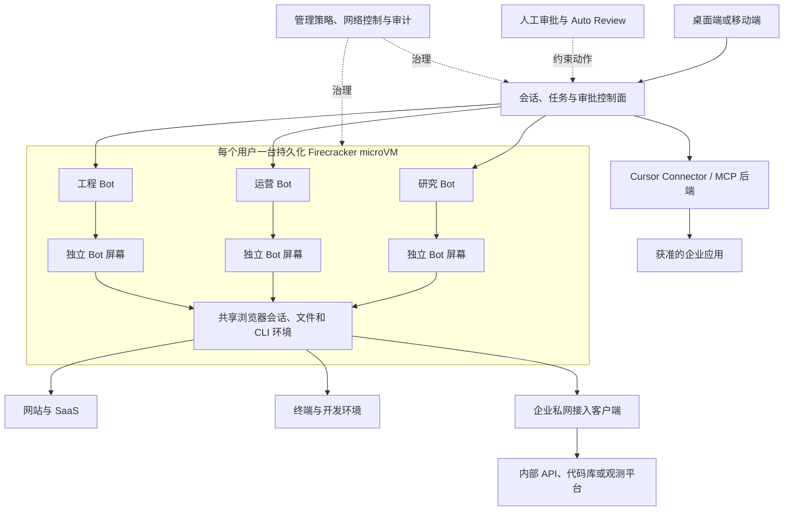
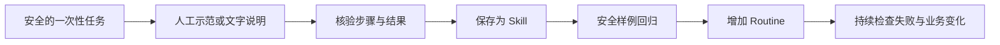
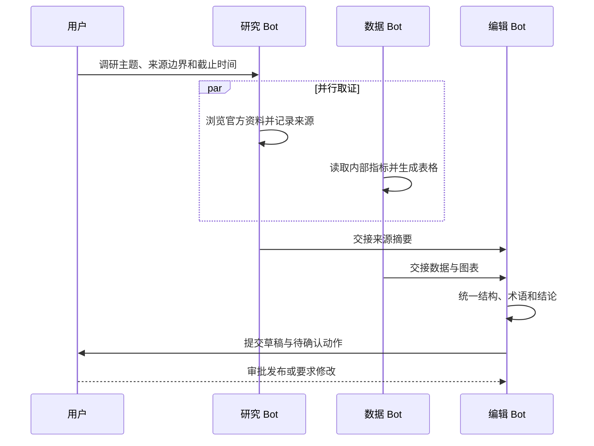
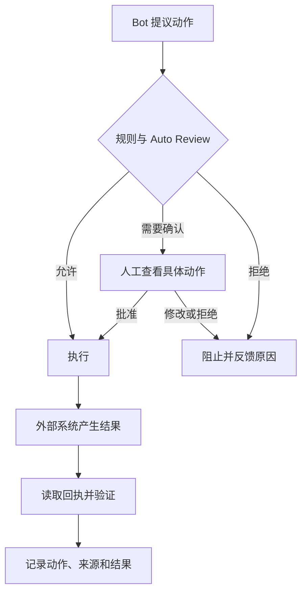
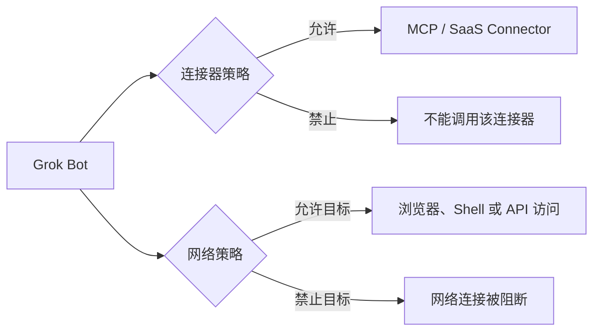
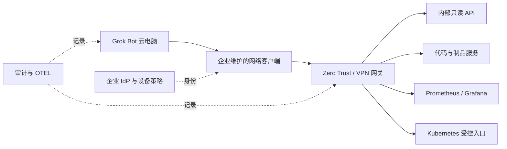
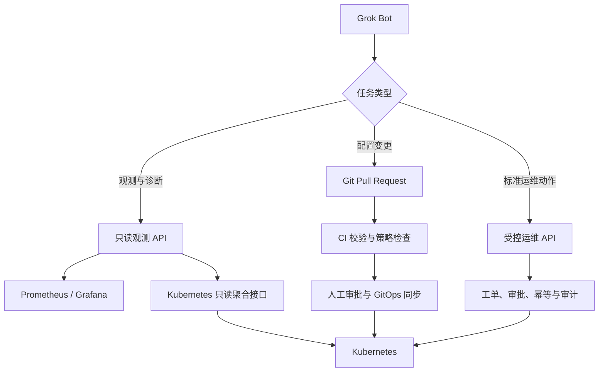

# Grok Bot 技术综述：持久化云电脑、多智能体协作与企业治理

2026 年 8 月，xAI 发布 Grok Bot。它不是在 Grok 聊天界面旁边多放了一个“自动执行”按钮，而是一种有名字、岗位、记忆和持续工作环境的托管智能体：用户通过消息交代任务，Bot 在云端浏览器、文件系统和终端中继续工作，需要确认时再回来请求审批。

如果把普通聊天助手看成一次电话咨询，Grok Bot 更像一名配有长期工位和公司电脑的远程同事。电脑不会在每轮对话后销毁，浏览器登录、文件和命令行环境可以持续保留；同时，长期工位也意味着账号、网络、审批、审计和数据清理都必须按企业系统来治理。

本文依据截至 2026 年 9 月 14 日的官方资料，讨论 Grok Bot 的产品边界、实现结构、适用任务和生产接入方式。产品仍在快速更新，套餐和管理能力应以官方当前页面为准。

## 一页结论

1. **Grok Bot 是托管的 Computer-use Agent，不是一个可下载部署的 Grok 模型。** 工作实际运行在 Cursor 云中的持久化计算机上，本地桌面和移动应用主要负责聊天、查看过程和审批。
2. **“持久化”是它与普通聊天助手最明显的区别。** Bot 能保留岗位上下文、历史摘要和偏好，云电脑能保留文件、浏览器会话与命令行环境，用户关闭笔记本后任务仍可继续。
3. **隔离边界位于用户之间，不在同一用户的 Bot 之间。** 官方架构为每个用户提供一台独立 Firecracker microVM；同一用户创建的所有 Bot 共享这台计算机及其中的登录、文件和 CLI 凭据。
4. **Skill 与 Routine 把一次成功操作变成可复用自动化。** Skill 描述怎样做，Routine 描述何时做；安全路径是先完成一次低风险任务，再稳定步骤、固化 Skill，最后增加定时或事件触发。
5. **多 Bot 协作更像共享办公室中的角色分工。** Bot 可以并行处理任务、在群聊中交换信息和交接工作，但共享计算资源和凭据，增加 Bot 数量并不等于获得更多安全域。
6. **审批是控制面，不是撤销机制。** “Stop”或拒绝后续动作不会自动回滚已经发送的邮件、修改的文件或外部系统状态。不可逆动作仍需由业务系统提供幂等、审批与补偿。
7. **Auto Review 有价值，但不能代替最小权限和网络隔离。** 它并不覆盖所有副作用；连接器策略与浏览器网络访问也是两套边界，禁用某个插件不代表 Bot 无法打开对应网站。
8. **企业版提供的关键能力集中在网络与审计。** Network Controls、Team Setup、Action Recording、组织级开关、审计日志和 OpenTelemetry 导出等能力并非都包含在自助 Teams 套餐中。
9. **Grok Bot 可以参与 Kubernetes 运维，但不应直接持有集群管理员凭据。** 更稳妥的路径是只读 API、GitOps Pull Request、受控运维网关和短期身份，并把变更放到独立审批链中。
10. **选择它的核心理由是快速获得“云电脑 + Agent + 日常应用”的完整体验。** 如果企业必须在自有集群运行、需要自定义镜像、严格数据驻留或完全掌控执行 Runtime，则应评估自建 Agent Harness 与 Sandbox。

## 1. 先分清四个名字相近的产品

“Grok Bot”很容易和 Grok、X 上的 `@grok` 以及 xAI API 混在一起。它们共享品牌和部分模型能力，但交付形态完全不同。

| 名称 | 主要入口 | 状态是否持久 | 能否操作电脑与应用 | 谁负责执行环境 | 典型用途 |
| --- | --- | --- | --- | --- | --- |
| Grok 聊天助手 | grok.com、移动应用 | 以会话和产品记忆为主 | 以聊天、搜索、文件、图像和语音能力为主 | xAI 产品 | 问答、研究、内容生成 |
| X 上的 `@grok` | X 帖子与回复 | 围绕社交上下文 | 不提供用户专属持久化电脑 | X / xAI | 解释帖子、回答公开问题 |
| xAI API 模型 | HTTP API / SDK | 请求本身通常无状态 | 需要开发者自行接工具、状态和沙箱 | 调用方 | 构建自有应用和 Agent |
| Grok Bot | 桌面端、移动端 | Bot 和记忆长期存在，云电脑持久化 | 浏览器、文件系统、终端、连接器 | Cursor 云托管 | 跨应用、多步骤、定时与协作任务 |

xAI 公开了 Grok 聊天助手和 X 上 `@grok` 的部分系统提示词，但这不等于 Grok Bot 产品开源。官方 [`grok-prompts`](https://github.com/xai-org/grok-prompts) 仓库适合研究聊天产品的行为边界，不能用来在本地还原 Grok Bot 的云电脑、审批、连接器和组织管理能力。

Grok Bot 的官方发布页把它描述为“always-on agents”。更准确的工程表达是：**由托管 Agent Harness 驱动、具备持久化执行环境和人机审批界面的 Computer-use Agent 产品**。[Introducing Grok Bot](https://x.ai/news/introducing-grok-bot)

## 2. Grok Bot 的逻辑架构

官方文档没有公开完整服务端实现，但披露了足以判断安全边界的架构：桌面和移动应用是轻客户端；每个用户在 Cursor 云中拥有一台独立 Firecracker microVM；Bot 在其中使用 Shell、浏览器和图形界面，也可通过 Cursor 的连接器策略调用 MCP 工具。



这套结构有三层不同的状态：

| 状态层 | 保存内容 | 共享范围 | 主要风险 |
| --- | --- | --- | --- |
| Bot 状态 | 名称、岗位、对话、摘要、偏好和学习到的上下文 | 单个 Bot | 过期记忆、错误经验、角色漂移 |
| 云电脑状态 | 文件、浏览器 Cookie、已登录会话、CLI 凭据 | 同一用户的所有 Bot | 横向读取、凭据混用、临时文件残留 |
| 企业连接器状态 | OAuth 授权和 MCP 工具访问 | 受成员与团队策略约束 | 授权范围过宽、工具副作用、第三方风险 |

官方说明 OAuth Token 保存在 Cursor 的连接器后端，Bot 调用工具时不会直接获得 Token。浏览器中人工登录形成的 Cookie、下载文件和放入终端的 CLI 凭据则存在用户的共享云电脑里，需要采用不同的清理和隔离策略。[团队与企业架构](https://docs.x.ai/grok-bot/teams-and-enterprises)

## 3. 为什么持久化云电脑很关键

传统浏览器 Agent 常把每次任务放进新环境：安全边界清楚，但用户必须反复登录、上传文件和解释背景。Grok Bot 选择了另一条路，让环境随用户长期存在，从而减少重复准备。

### 3.1 它带来的能力

- 浏览器登录和应用会话可跨任务复用；
- 文件可以由一个 Bot 生成，再由另一个 Bot 继续处理；
- 已安装的命令行工具与工作目录无需每次重建；
- 用户关闭本地设备后，后台 Turn 和 Routine 仍可运行；
- 每个 Bot 有自己的屏幕，可并行推理、使用连接器和处理文件；
- 单个 Bot 的一个屏幕同一时刻只执行一项 Computer-use 任务。

### 3.2 它改变了威胁模型

同一用户的多个 Bot 在角色和会话上分开，在计算机和凭据上并不隔离。一个“日报 Bot”下载到本地的文件，另一个“工程 Bot”在技术上也处于可访问该文件的环境中。把 Bot 取成不同名字，不能形成安全边界。

因此，企业应按 **一台长期存在的员工电脑** 来管理它：

- 一个 Cursor 用户对应一个凭据域；需要严格隔离的工作负载使用不同用户；
- 浏览器只登录完成任务所需的低权限账号，完成后及时退出；
- 临时导出的客户数据、报表和密钥文件必须有清理周期；
- 不把不同安全级别的生产运维、财务支付和市场调研放在同一用户环境；
- 删除 Bot 后继续检查共享电脑，因为 Bot 删除并不等于共享文件和登录会话都被清除。

[Grok Bot 概览](https://docs.x.ai/grok-bot/overview)明确说明：用户之间采用严格隔离，而同一用户的所有 Bot 共用一台计算机。这个细节比“每个 Bot 都有自己的屏幕”更值得安全评审关注。

## 4. Bot、Skill 与 Routine 怎样组成自动化

Grok Bot 把自动化拆成三个容易理解的对象：

| 对象 | 回答的问题 | 适合保存的内容 | 不适合保存的内容 |
| --- | --- | --- | --- |
| Bot | 谁来做 | 稳定职责、工具范围、工作风格、审批边界 | 某一次任务的临时要求 |
| Skill | 怎样做 | 输入、步骤、验证、交付格式、异常处理 | 调度时间和一次性上下文 |
| Routine | 什么时候做 | 时间或事件触发、运行频率、调用的 Skill | 大段操作细节 |

例如，“每周服务稳定性检查”可以这样拆分：

```text
Bot：平台稳定性助手
岗位：读取观测平台和 Kubernetes 只读接口，整理风险，不修改生产环境。

Skill：生成服务稳定性周报
输入：服务清单、SLO、变更记录、Prometheus/Grafana 链接
步骤：检查错误率、延迟、容量、告警和近期变更
验证：每个判断必须附查询时间、来源链接和原始指标
输出：Markdown 周报和待确认事项
审批：发送群消息、创建工单或修改配置前必须确认

Routine：每周一 09:00 执行上述 Skill，完成后把草稿交给负责人审阅
```

官方还支持通过示范教授流程：用户带 Bot 完成一次多步骤操作，再把稳定路径保存为 Skill。示范会提高起步速度，却不能省略验证。网页结构、字段语义和权限可能变化，正确顺序应是：



[Skills and routines](https://docs.x.ai/grok-bot/skills-routines-and-automations)建议 Skill 明确触发条件、输入与权限、步骤、验证、输出和审批点。这和生产 Runbook 的结构接近：能重复执行只是起点，知道如何确认成功以及何时停止才是可靠自动化。

## 5. 多 Bot 协作解决什么问题

Grok Bot 支持多个 Bot 并行工作、相互发消息、在群聊中共享上下文和交接任务。群聊可容纳 2 到 6 个 Bot，适合把复杂任务拆成清晰角色：



这类编排的收益来自 **角色、来源和验收条件分开**，而不是 Bot 越多越好。交接链过长会重复读取、放大错误并消耗更多额度；共享电脑还可能形成浏览器焦点、文件名和账号状态冲突。

适合拆分的情况包括：

- 不同子任务可以并行，且各自有独立交付物；
- 不同角色需要不同的上下文和长期记忆；
- 需要让一个 Bot 审阅另一个 Bot 的证据与格式；
- 最终有一个明确的汇总负责人。

一件短任务如果只涉及一个应用，直接交给单个 Bot 通常更清楚。官方协作文档也提醒，过多交接可能造成重复和噪声。[Message and collaborate](https://docs.x.ai/grok-bot/chat-and-collaboration)

## 6. 审批与 Auto Review 的真实边界

Grok Bot 可以在发送消息、发布内容、支付、删除、权限修改、生产操作或接受法律条款前请求审批。用户可对动作选择本次允许、拒绝，也可在一定范围内保存长期规则；如果允许规则和强制审批规则冲突，Require Approval 优先。

一次完整的动作链更接近下面的结构：



需要特别理解四个限制：

1. **批准的是一个具体动作。** 它不是对后续所有相似动作的无限授权。
2. **审批不会撤销先前副作用。** 用户中途发送“Stop now”，已发出的邮件或已完成的外部修改仍然存在。
3. **Auto Review 不覆盖每一种副作用。** 官方文档明确举例，记忆写入和多数设置变化不都经过相同审查。
4. **用户侧开关仍是边界。** 官方安全 FAQ 表示，组织当前不能把 Auto Review 锁定为成员不可关闭，因此不能把它当作唯一的强制控制。

生产系统仍应在目标系统一侧落实：

- 只读和写入使用不同身份；
- 写操作使用结构化 API，明确资源、版本和幂等键；
- 生产变更走 Pull Request、工单或发布平台审批；
- 财务与法务动作由业务系统执行二次确认；
- 每次执行读取回执，并保存可审计的资源 ID。

参考：[Approvals, security, and privacy](https://docs.x.ai/grok-bot/approvals-security-and-privacy)、[Security FAQ](https://docs.x.ai/grok-bot/security-faq)。

## 7. 连接器策略不等于网络策略

Grok Bot 可以使用 Cursor 允许的 MCP 连接器，也可以直接在浏览器中访问网站。这两条访问路径相互独立：



因此，管理员禁用某个 Slack、GitHub 或数据库插件后，Bot 仍可能通过浏览器访问对应网站，只要网络策略和网站登录允许。若要关闭目标服务的所有路径，需要同时处理连接器、浏览器身份和网络出口。

官方当前的关键套餐边界如下：

| 管理能力 | Teams | Enterprise | 生产意义 |
| --- | --- | --- | --- |
| Team Rules | 有 | 有 | 向所有 Bot 注入团队规则 |
| Cloud Agent delegation 开关 | 有 | 有 | 控制是否委派独立编码 Agent |
| Public template sharing | 有 | 有 | 控制 Bot 模板是否可公开分享 |
| Connector policy | 有 | 有 | 允许或禁止连接器；MCP allowlist 为企业版能力 |
| Network Controls | 无 | 有 | 限制云电脑可访问的域名、IP 和端口 |
| Team Setup | 无 | 有 | 在云电脑启动时安装企业工具或网络客户端 |
| Action Recording | 无 | 有 | 记录 Bot 动作，默认关闭 |
| Audit logs / OpenTelemetry Export | 无 | 有 | 输出管理、安全与动作证据 |
| SCIM | 无 | 有 | 自动开通和回收成员身份 |

自助 Teams 如果没有网络策略，目标访问默认是 allow-all；Network Controls 是 Enterprise 能力。企业评估时不能只确认“购买了团队版”，还要逐项核对所需控制是否实际包含。[Grok Bot for teams and enterprises](https://docs.x.ai/grok-bot/teams-and-enterprises)

另外，官方提供的是多客户共享的静态出口地址，并不提供每个客户独享的出口 IP。如果内网白名单、安全域或审计制度依赖专属源地址，需要在接入设计阶段解决，而不是上线后再补。

## 8. 企业私网怎样接入

Grok Bot 的云电脑运行在 Cursor 云中，不支持部署到企业自己的 Kubernetes、私有云或本地机房，也不支持自带 VM 镜像。Enterprise 的 Team Setup 可以在每个云电脑中安装客户维护的 Linux 网络客户端，官方列举了 Tailscale 和 Cloudflare Tunnel，也允许使用其他 VPN、Zero Trust 或 Mesh 客户端。



Team Setup 脚本在云电脑上以高权限运行，可在启动时执行并周期刷新。企业负责网络客户端和连接状态，Cursor 负责运行安装、检查脚本。脚本本身不应嵌入长期密钥，密钥应通过企业身份与 Secret 交付机制获得。[Connect to private networks](https://docs.x.ai/grok-bot/private-networks)

引入私网之前应回答：

- Bot 需要访问哪些 API、域名、IP 和端口；
- 访问身份属于员工、服务账号，还是临时任务身份；
- 账号被禁用后，浏览器会话、VPN 会话和服务 Token 如何一起撤销；
- 是否允许下载数据到持久化云电脑；
- 哪些日志进入 SIEM，能否串联用户、Bot、动作、目标和结果；
- 数据驻留是否满足要求。官方 FAQ 表示云电脑当前运行在美国，如需书面驻留承诺应与账户团队确认。

## 9. 与 Kubernetes 结合的推荐方式

Grok Bot 适合读取监控、整理事件、生成变更建议和发起 GitOps 流程。它不应成为一个携带 `cluster-admin` kubeconfig 的通用跳板机。

### 9.1 推荐访问路径



这三条路径分别处理不同风险：

| 任务 | 建议接口 | Bot 权限 | 变更如何生效 |
| --- | --- | --- | --- |
| 查询 Pod、Event 和工作负载状态 | 只读聚合 API 或受限 Kubernetes API | `get/list/watch`，不读取 Secret | 不产生变更 |
| 查询 SLO、延迟和资源利用率 | 只读 Prometheus/Grafana API | 限定数据源和组织 | 不产生变更 |
| 修改 Deployment、HPA 或策略 | Git 仓库 | 创建分支和 PR | CI、评审、GitOps Controller |
| 重启标准服务、扩缩容 | 运维平台的窄 API | 只能调用允许动作 | 工单审批后由平台执行 |
| 紧急生产操作 | 人工 Runbook | Bot 提供证据和建议 | 值班人员执行并复核 |

若必须直接访问 Kubernetes API，可先从最小只读 Role 开始，并避免读取 Secret、执行远程命令和访问节点代理：

```yaml
apiVersion: rbac.authorization.k8s.io/v1
kind: ClusterRole
metadata:
  name: agent-observer
rules:
  - apiGroups: [""]
    resources: ["pods", "events", "nodes", "namespaces"]
    verbs: ["get", "list", "watch"]
  - apiGroups: ["apps"]
    resources: ["deployments", "statefulsets", "daemonsets", "replicasets"]
    verbs: ["get", "list", "watch"]
  - apiGroups: ["batch"]
    resources: ["jobs", "cronjobs"]
    verbs: ["get", "list", "watch"]
```

这个 Role 只是权限上限示例。实际接入还应增加集群、Namespace、Label 和查询时间范围限制，并使用短期身份或身份代理，避免把长期 ServiceAccount Token 写到共享云电脑。

### 9.2 一个可直接交给 Bot 的任务模板

官方建议任务至少包含 Outcome、Sources、Constraints、Deliverable 和 Review point。一个 Kubernetes 稳定性任务可以这样写：

```text
目标：分析 payment 服务过去 6 小时错误率上升的原因，给出按证据排序的判断。

来源：
1. 只读 Grafana 与 Prometheus；
2. production/payment Namespace 的 Pod、Event、Deployment 和 HPA；
3. 最近 24 小时的 Git 变更记录。

约束：
- 不修改集群、告警、Dashboard 或代码；
- 不读取 Secret，不进入容器执行命令；
- 每个结论写明时间范围、PromQL 或资源名称；
- 数据不足时标记“无法确认”，不要补全原因。

交付：
- 一页 Markdown 报告；
- 时间线、影响范围、三个最可能原因及反证；
- 建议的验证步骤；
- 如需改动，生成 Git Diff 草案，不创建 PR。

复核点：
完成报告后停止，等待我确认；创建工单、PR、发送消息或修改任何外部系统前再次审批。
```

这类任务把 Bot 放在“证据收集与建议”位置，让 Kubernetes、GitOps 和发布平台继续承担授权与执行职责。

## 10. 与其他 Agent 路线怎样选择

Grok Bot 的优势不是允许开发者自由组合每一个 Runtime 组件，而是把电脑操作、消息入口、持久状态、协作与审批组合成可直接使用的产品。

| 路线 | 上线速度 | 可编程性 | 执行环境控制 | 适合任务 | 主要代价 |
| --- | --- | --- | --- | --- | --- |
| Grok Bot | 快 | 中 | 低，运行在 Cursor 云 | 日常跨应用工作、浏览器流程、个人与团队自动化 | 托管边界、套餐能力、共享电脑治理 |
| 普通聊天助手 | 最快 | 低到中 | 低 | 研究、问答、内容草拟 | 难以持续操作真实系统 |
| API + Agent Framework | 中 | 高 | 由开发者决定 | 产品内 Agent、结构化业务流程 | 需要自行开发状态、工具、权限和评测 |
| RPA / 工作流平台 | 中 | 中 | 中到高 | 步骤稳定、规则明确的界面流程 | 页面变化脆弱，开放任务适应性弱 |
| 自建 Harness + Sandbox | 慢 | 最高 | 最高 | 强隔离、私有部署、定制 Runtime、大规模多租户 | 建设和长期运维成本最高 |

选择 Grok Bot 前可以用四个问题快速判断：

1. 工作是否主要发生在浏览器、终端和现有 SaaS 中？
2. 是否接受执行环境位于 Cursor 云，并按其套餐获得网络和审计控制？
3. 同一用户的多个 Bot 共享登录、文件和 CLI 凭据是否符合安全模型？
4. 业务能否把高风险动作留在现有审批、GitOps 和交易系统中？

前三个答案为“是”，且企业希望尽快让知识工作者使用持久化 Agent，Grok Bot 很有吸引力。如果硬性要求在自有 Kubernetes 中运行、使用自定义基础镜像、独享出口、特定地区数据驻留或独立机器身份，自建方案更匹配。

## 11. 企业落地的分阶段方法

### 阶段一：只读试点

- 选择研究、报告、数据整理和知识检索任务；
- 使用低敏感度数据和最小权限账号；
- 禁止外发、发布、支付、删除和生产变更；
- 保存输入、工具轨迹、输出和人工修订；
- 评估完成率、人工节省时间、错误类型和审批负担。

### 阶段二：草稿与交接

- 允许生成邮件、PR、工单和配置 Diff，但不直接提交；
- 固化已验证 Skill，给每一步增加来源和完成条件；
- 分离研究、执行和审阅 Bot，限制群聊交接数量；
- 定期清理共享云电脑中的文件、会话和无用工具。

### 阶段三：有限写入

- 仅开放幂等、可追踪、可补偿的业务 API；
- 在目标系统实施审批和资源级权限；
- 为 Routine 设置最大运行时间、频率、费用和失败通知；
- 监控身份异常、网络出口、连接器调用和审批结果。

### 阶段四：规模化治理

- 接入 SSO、SCIM、网络策略、动作记录和 SIEM；
- 按用户和凭据域规划云电脑，避免角色名称被误当作隔离；
- 建立 Skill 版本、负责人、测试样例和下线机制；
- 统计任务成功率、回滚率、越权阻止率、人工接管率和单位任务成本；
- 将模型、Harness 和外部系统升级纳入回归测试。

## 12. 评估时容易忽略的问题

| 问题 | 为什么重要 | 验证方法 |
| --- | --- | --- |
| Bot 记忆是否引用最新来源 | 记忆可能过期，不是事实库 | 修改源数据后重复任务，检查是否重新读取 |
| 删除 Bot 后还剩什么 | 共享文件和登录可能继续存在 | 删除测试 Bot，检查电脑、Cookie、下载和 CLI 会话 |
| 禁用插件后能否经网页访问 | 连接器和网络是独立通道 | 禁用测试连接器，再验证网页与 Shell 路径 |
| 多 Bot 并行是否互相干扰 | 同一用户共享电脑和凭据 | 并发处理不同账号、文件和下载任务 |
| 审批被拒绝后是否停止完整动作链 | 前序动作可能已经产生副作用 | 使用沙箱系统模拟多步骤写入和拒绝 |
| Routine 遇到页面变化会怎样 | UI 自动化可能静默偏离 | 改变测试页面字段，观察停止、告警和证据 |
| 用户离职后会话是否都失效 | IdP、浏览器和网络会话生命周期不同 | 执行完整离职演练并检查残留访问 |
| 能否还原一次生产建议的依据 | 没有输入、工具结果和版本就无法审计 | 从日志重建任务时间线与来源 |

不要只做“它能不能完成一次”的 Demo。持久化 Agent 的主要风险常出现在第二次运行、长时间后台运行、权限变化、多 Bot 并发和人员离职之后。

## 13. Grok Bot 代表了怎样的产品方向

Grok Bot 把 Agent 从“需要时打开的聊天窗口”推进到“长期存在的工作角色”：有名字、有岗位、有记忆、有电脑，能观察流程、沉淀 Skill、按 Routine 运行，并与其他 Bot 交接。这种形态降低了普通用户搭建自动化的门槛，也把过去由平台工程团队处理的问题带到了每个知识工作者面前。

它最值得借鉴的产品设计有三点：

- **让用户用岗位和交付物描述自动化，而不是先画工作流；**
- **让一次成功任务逐步升级为 Skill 和 Routine，而不是直接定时运行未知流程；**
- **把审批放回对话，使人能在具体动作和上下文中判断。**

它最需要认真评估的也有三点：

- **同一用户的所有 Bot 共用一台持久化电脑；**
- **连接器、网页网络、浏览器登录和私网客户端形成多条访问路径；**
- **组织治理能力与套餐绑定，且 Auto Review、日志和网络策略各有覆盖边界。**

Grok Bot 适合作为现有业务系统之上的智能工作层。权限、交易、发布和生产变更仍应由目标系统掌握最终控制。这样才能同时得到持久化 Agent 的效率，以及企业基础设施原有的确定性与可审计性。

## 参考资料

- [Introducing Grok Bot](https://x.ai/news/introducing-grok-bot)
- [Grok Bot overview](https://docs.x.ai/grok-bot/overview)
- [Get started with Grok Bot](https://docs.x.ai/grok-bot/get-started)
- [Create and manage Bots](https://docs.x.ai/grok-bot/bots)
- [Message and collaborate](https://docs.x.ai/grok-bot/chat-and-collaboration)
- [Use the computer and apps](https://docs.x.ai/grok-bot/computer-and-apps)
- [Skills and routines](https://docs.x.ai/grok-bot/skills-routines-and-automations)
- [Approvals, security, and privacy](https://docs.x.ai/grok-bot/approvals-security-and-privacy)
- [Grok Bot for teams and enterprises](https://docs.x.ai/grok-bot/teams-and-enterprises)
- [Grok Bot security](https://docs.x.ai/grok-bot/security)
- [Grok Bot security FAQ](https://docs.x.ai/grok-bot/security-faq)
- [Connect to private networks](https://docs.x.ai/grok-bot/private-networks)
- [Grok Bot and X](https://x.ai/news/grok-bot-and-x)
- [xAI grok-prompts](https://github.com/xai-org/grok-prompts)
