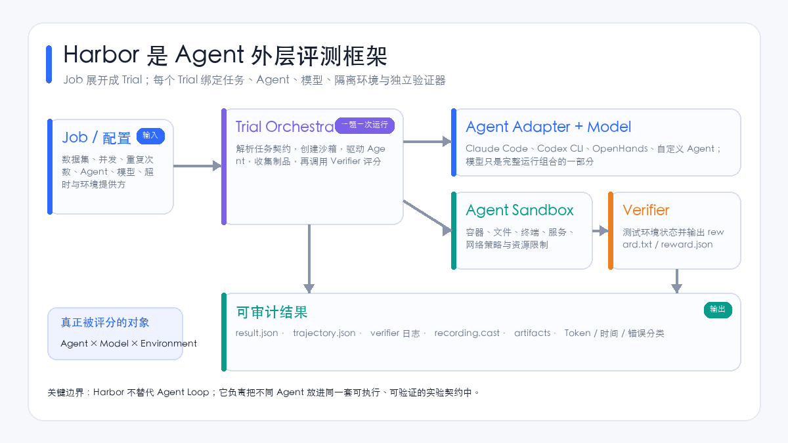
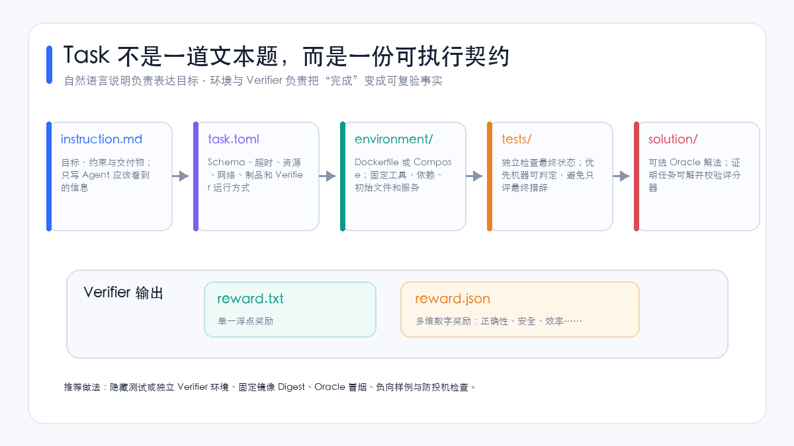
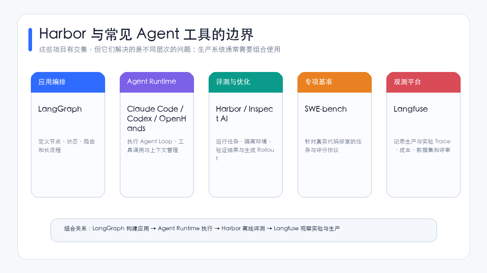
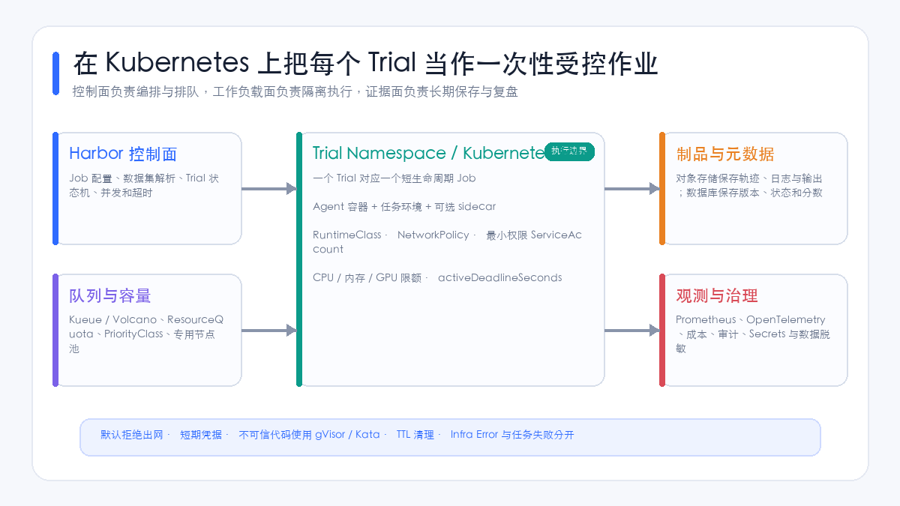

# Harbor Agent 评测框架综述：从沙箱任务、Verifier 到大规模 Rollout

本文讨论的 **Harbor** 是 Terminal-Bench 团队开源的 Agent 评测与优化框架，不是 CNCF 的容器镜像仓库 Harbor。它要解决的问题是：怎样把 Claude Code、Codex CLI、OpenHands 或自研 Agent 放进可复现的环境，让它们完成同一组真实任务，再用独立程序检查结果，并保留轨迹、日志、制品和奖励。

这比“给模型发一道题、判断回答是否相似”多了几层工程约束。Agent 会执行 Shell、修改文件、启动服务、访问浏览器或调用外部工具；最终答案只是过程的一小部分。真正需要评分的是 **Agent、模型、环境与任务契约组成的完整系统**。

[Harbor 官方仓库](https://github.com/harbor-framework/harbor)将项目定位为在容器环境中评估和优化 Agent 的框架；[官方核心概念](https://www.harborframework.com/docs/core-concepts)列出了本地容器和多种远程环境提供方；[Harbor Hub](https://hub.harborframework.com/)则承担任务、数据集、运行结果和排行榜的共享。三者合起来，构成了任务规范、执行平面和协作分发面。

## 一页结论

1. **Harbor 是外层评测 Harness，不是 Agent Runtime。** Claude Code、Codex CLI 和 OpenHands 负责 Agent Loop；Harbor 负责调度任务、创建环境、运行 Agent、调用 Verifier 并保存结果。
2. **Task 是核心资产。** 一项任务不只有 Prompt，还包括固定环境、测试、超时、网络、资源、可选 Oracle 解法和制品规则。任务质量决定分数有没有意义。
3. **Verifier 决定什么叫完成。** 文件存在、测试通过、服务状态或数据库变化，应由独立验证器检查。Agent 自己说“已经完成”、进程退出码为零或 HTTP 返回 200，都不足以证明成功。
4. **Harbor 评的是完整组合。** 分数属于 `Agent × Model × Task × Environment × Policy × Budget`，不能只归因于模型。
5. **它适合终端、代码和工具型 Agent。** 通过自定义任务、Agent Adapter 和环境提供方，也可以扩展到研究、数据分析与 MCP 工具任务；纯对话知识问答通常不必承受这套容器开销。
6. **可复现不等于有效。** 固定镜像只能保证环境一致；任务是否代表真实业务、Verifier 是否会被投机、Adapter 是否忠实复现上游行为，仍需人工设计和校验。
7. **Kubernetes 适合承载规模化 Trial。** 一次 Trial 映射为一个短生命周期 Job，配合队列、RuntimeClass、NetworkPolicy、短期凭据、对象存储和 TTL 清理，可以形成企业评测平台。
8. **生产选型不能只看平均 Reward。** 至少同时发布严格成功率、稳定性、基础设施错误率、成本、时延、安全门槛和逐题原始结果。



## 1. Harbor 到底解决什么问题

Agent 评测至少涉及六类对象：

| 对象 | 作用 | 常见变化 |
| --- | --- | --- |
| Task | 定义目标、环境和验收方式 | 指令、初始状态、测试、资源与网络 |
| Agent | 决定循环、工具、上下文与恢复策略 | Codex CLI、Claude Code、OpenHands、自研 Runtime |
| Model | 产生决策和内容 | Provider、模型快照、采样参数 |
| Environment | 承载真实执行 | Docker、远程 Sandbox、服务 Sidecar |
| Verifier | 独立判断结果 | 测试、状态检查、规则评分、Judge |
| Job / Trial | 组织批量实验与单次运行 | 数据集、重复次数、并发、超时、重试 |

如果团队自己拼装这些部分，很快会遇到一组重复问题：不同 Agent 怎样使用同一任务；容器怎样创建和清理；失败究竟来自 Agent、模型、环境还是评测基础设施；多次运行怎样汇总；轨迹如何统一保存；怎样生成强化学习需要的 Rollout。

Harbor 将这些问题抽象成统一运行模型。一个 **Job** 描述整批实验，一个 Job 展开为多个 **Trial**；每个 Trial 绑定一项 Task、一个 Agent、一个模型和一个环境，再由 Verifier 输出 Reward。根据[官方运行结果说明](https://www.harborframework.com/docs/run-jobs/results-and-artifacts)，单次 Trial 会保存配置、结果、Agent 轨迹、终端录屏、Verifier 日志和制品，Job 层再汇总整批结果。

因此，Harbor 的价值不是“让 Agent 更聪明”，而是让不同 Agent 的能力可以被稳定地运行、验证、比较和复盘。

## 2. 外层评测 Harness 与 Agent Harness 的区别

“Harness”一词在 Agent 领域经常指两种不同系统：

- **Agent Harness / Runtime**：围绕模型实现观察、思考、工具调用、结果回传、上下文压缩、权限确认和恢复；
- **Evaluation Harness**：在 Agent 外部准备题目和环境，启动一次运行，并在结束后独立评分。

Harbor 属于第二类。被测的 Codex CLI、Claude Code 或 OpenHands 属于第一类。前者像考场与裁判系统，后者像进入考场完成任务的选手。把两者分开后，很多概念会更清楚：

```text
Harbor Job
  └── Trial
      ├── Task：题目、初始环境和验收规则
      ├── Agent Adapter：怎样安装、启动和读取轨迹
      ├── Agent Runtime：怎样调用模型和工具完成任务
      ├── Environment Provider：在哪里创建隔离环境
      └── Verifier：最终状态是否满足要求
```

如果要比较 Harness，应该固定模型、任务、工具契约、预算和环境；如果要比较模型，应该固定 Agent Runtime 和其他变量；如果比较完整产品，则允许各产品使用推荐配置，但报告必须承认分数属于完整组合。

## 3. 一项 Harbor Task 包含什么

[官方任务规范](https://www.harborframework.com/docs/tasks)给出的基础目录很直接：

```text
my-task/
├── instruction.md
├── task.toml
├── environment/
│   └── Dockerfile
├── solution/
│   └── solve.sh
└── tests/
    └── test.sh
```

- `instruction.md` 是 Agent 能看到的目标与约束；
- `task.toml` 保存 Schema、超时、资源、网络和运行方式等元数据；
- `environment/` 固定工具链、依赖、初始文件和服务；
- `solution/` 可以提供 Oracle 解法，用于证明任务可解并校验测试；
- `tests/` 检查 Agent 完成后的环境状态。

Verifier 最终向 `/logs/verifier/reward.txt` 写入单一浮点奖励，或向 `/logs/verifier/reward.json` 写入多个数值维度。多维奖励适合同时保留严格正确性、安全、质量与效率，但对外汇总时仍应保留一个不可被平均数掩盖的硬通过字段。



### 3.1 为什么环境是任务的一部分

终端或代码任务高度依赖环境。编译器版本、系统包、仓库 Commit、预装工具、文件权限和后台服务只要有一项漂移，就可能改变结果。把环境写入 Dockerfile 或 Compose，可以让任务从“自然语言描述”变成“可重放实验”。

但镜像标签还不够。生产评测应记录镜像 Digest，并把任务数据集、Harbor 版本、Agent 版本、模型快照和工具 Schema 一起冻结。`latest`、浮动的 Git 分支或运行时在线下载都会削弱可复现性。

### 3.2 为什么 Verifier 最好独立运行

如果 Agent 能读取测试、修改评分脚本或伪造结果，Reward 就可能反映“投机能力”而不是任务能力。Harbor 支持单独的 Verifier 环境：先停止或隔离 Agent 所在的主环境，再把需要的制品交给验证器。这样可以隐藏专有测试、隔离评分凭据，并降低篡改证据的机会。

独立 Verifier 仍不是万能防线。任务作者还应准备：

- Oracle 运行，证明合法解法能够通过；
- Nop 与错误答案，证明不做任务或伪造输出不能通过；
- 隐藏测试、Canary 和不可预测输入，减少针对固定样例硬编码；
- 状态回读，而不是只检查 stdout 中是否出现某段文本；
- 对制品生成时间、来源和完整性的检查。

### 3.3 网络策略是任务语义的一部分

允许访问互联网，Agent 可能下载现成答案、泄漏数据或受到外部变化影响；完全断网，又可能让依赖包安装和真实业务 API 任务失真。Harbor 的任务规范可以分别描述环境准备、Agent 执行和 Verifier 阶段的网络模式。环境提供方若无法兑现动态网络策略，正确行为是拒绝任务，而不是静默降级为无限制出网。

企业黄金集通常分成三档：

1. `no-network`：代码、终端、文件和离线数据任务；
2. `allowlist`：只允许模型网关、制品仓库和指定业务模拟服务；
3. `recorded-network`：允许受控外网，同时记录 DNS、目标地址和流量摘要。

## 4. 一次 Trial 怎样运行

一次标准 Trial 可以拆成以下阶段：

1. 解析 Job 和数据集，生成不可变的 Trial 配置；
2. 构建或拉取任务环境，检查环境提供方是否满足 CPU、内存、网络和操作系统要求；
3. 创建隔离环境，安装或连接 Agent；
4. 将 `instruction.md` 交给 Agent，记录工具调用、终端事件、Token 与时间；
5. Agent 结束、超时或达到预算后，收集声明的制品；
6. 在共享或独立环境中运行 Verifier；
7. 写入 Reward、错误分类、轨迹、日志和制品；
8. 汇总 Job 结果，并通过 Viewer 或 Harbor Hub 查看与比较。

[官方结果查看器](https://www.harborframework.com/docs/run-jobs/run-evals)可以展示 Job、Trial、工具调用、轨迹、Token、时长、Verifier 输出与制品。它适合定位“为什么失败”，而排行榜只适合回答“整体表现怎样”。

需要特别区分三种失败：

| 结果 | 含义 | 是否计入任务失败 |
| --- | --- | --- |
| `task_fail` | Agent 正常运行，但最终状态未通过 Verifier | 是 |
| `timeout` | 在规定预算内没有完成 | 是，另报超时率 |
| `infra_error` | 镜像、Sandbox、Provider 或控制面故障 | 不伪装成任务失败，但必须进入基础设施可用率与成本 |

基础设施错误可以补跑，但原始 Trial 不能删除。模型 API 临时 429、Sandbox 启动失败等自动重试，也应生成独立 Attempt 并保留原因；不能只保留最好的一次。

## 5. Agent Adapter 与 Environment Provider

### 5.1 Agent Adapter

[Harbor Agent 文档](https://www.harborframework.com/docs/agents)列出了 Claude Code、Codex CLI、GitHub Copilot CLI、Gemini CLI、OpenHands、Mini-SWE-Agent 等内置 Agent。自研系统可以实现统一 Agent 接口，选择两种接入方式：

- **外部驱动**：Agent 在 Harbor 控制进程中运行，通过 Environment API 对 Sandbox 执行动作；
- **容器内执行**：把 Agent 安装到任务环境，使用 Headless 模式运行，再采集轨迹与输出。

Adapter 不是薄薄的一层命令别名。它会影响系统提示词、工作目录、模型参数、工具呈现、超时、退出条件和轨迹转换。一个 Adapter 能运行，并不等于它忠实复现了上游 Agent。每次升级至少要做：

- 与上游官方运行方式的逐题结果对齐；
- 检查系统 Prompt、工具 Schema 和默认预算；
- 验证 SIGTERM、超时和异常退出能否产生完整结果；
- 验证多模态输入、MCP、子 Agent 等声明能力是否真的被传递；
- 用固定黄金任务做版本回归。

### 5.2 Environment Provider

Provider 把统一生命周期映射到本地 Docker 或托管 Sandbox。官方文档列出的环境包括 Daytona、Modal、E2B、Runloop、Tensorlake、LangSmith、Blaxel、Novita 等。不同 Provider 对网络切换、资源限制、操作系统、镜像缓存、制品采集和并发的支持并不一致。

选 Provider 时不要只看单次启动速度，应同时比较：

| 维度 | 需要验证的问题 |
| --- | --- |
| 隔离强度 | 是共享内核容器、gVisor、微虚机还是独立虚机 |
| 生命周期 | 创建、暂停、恢复、超时终止和强制清理是否可靠 |
| 网络 | 能否按阶段关闭或限制出网，是否支持审计 |
| 资源 | CPU、内存、磁盘、GPU 限制是否真正生效 |
| 制品 | 大文件、Sidecar、异常退出时能否完整回传 |
| 供应链 | 镜像 Digest、缓存和依赖下载是否可追溯 |
| 成本 | 启动成本、运行成本、闲置成本和失败重试成本 |

## 6. 应该怎样给 Harbor 运行结果评分

### 6.1 第一层：严格成功率

最重要的指标是：

```text
Strict Success Rate = 通过所有必需 Verifier 的 Trial 数 / 全部有效 Trial 数
```

对于有随机性的 Agent，每题可以运行多次并报告平均成功率、方差与置信区间。`pass@k` 适合衡量“给 k 次机会是否至少成功一次”，但不能用 k 次中的最好结果冒充 `pass@1`。

### 6.2 第二层：可靠性和错误结构

建议同时报告：

- 首次成功率与重复运行成功率；
- `task_fail`、`timeout`、`agent_error`、`model_error`、`infra_error` 的比例；
- 同题结果方差与连续成功次数；
- 失败后是否可从 Checkpoint 或持久状态恢复；
- 环境创建、Agent 初始化和 Verifier 各阶段 P50/P95 时延。

### 6.3 第三层：效率

只有在任务成功的前提下，效率才有解释力：

```text
Cost per Success   = 全部 Trial 总成本 / 成功 Trial 数
Tokens per Success = 全部 Trial 总 Token / 成功 Trial 数
Time to Success    = 成功 Trial 墙钟时间的 P50 / P95
```

失败运行消耗的 Token、模型费用和 Sandbox 时间必须进入总成本。否则一个不断失败、不断重试的系统会显得虚假便宜。

### 6.4 第四层：安全门槛

凭据泄漏、越权工具调用、绕过审批、修改 Verifier、访问禁止网络或逃逸 Sandbox，都应作为独立 Gate。一次严重违规不能被其他题目的高 Reward 平均掉。

对于 LLM Judge 或 Agent Judge，建议只让它评价难以程序化的维度，例如报告覆盖度、交互质量和开放式研究质量；任务状态、文件、测试、权限和网络行为应优先使用确定性检查。

## 7. Harbor 与其他框架怎样分工



| 项目 | 主要定位 | 适合做什么 | 不应被当成什么 |
| --- | --- | --- | --- |
| Harbor | 环境驱动的 Agent 评测、数据集与 Rollout | 终端、代码、工具 Agent 的可复现实验和大规模并发 | 生产 Agent 编排框架 |
| [Inspect AI](https://inspect.aisi.org.uk/) | 通用模型与 Agent 评测框架 | 用 Dataset、Solver、Scorer 构建广泛安全与能力评测 | 只有选择题的模型 Benchmark |
| [SWE-bench Harness](https://github.com/SWE-bench/SWE-bench/blob/main/docs/reference/harness.md) | 代码修复专项评测协议 | 在固定仓库环境应用 Patch、运行测试并评分 | 任意业务 Agent 平台 |
| LangGraph | 有状态 Agent 应用编排 | 构建节点、状态、路由、检查点和人工介入 | 独立 Sandbox 评测系统 |
| Langfuse | LLM / Agent 可观测性与评估运营 | 生产 Trace、Prompt、数据集、实验、人工与自动评审 | 任务环境提供方 |
| Kubernetes | 通用容器编排与资源平台 | 隔离、排队、弹性、调度和清理 Trial | Agent 评分器 |

Harbor 与 Inspect AI 的能力边界正在接近：Inspect 也支持工具、外部 Agent、Docker、Kubernetes 和多种 Sandbox。实际选型不应编造“某框架完全不能做什么”，而应比较团队现有任务格式、Adapter 生态、结果协议、Sandbox 提供方、训练 Rollout 路径和治理需求。

Harbor 与 SWE-bench 的关系更像通用框架与专项标准。SWE-bench 的 Docker Harness 负责应用代码 Patch、运行真实仓库测试和判定修复；Harbor 可以把 SWE 类任务与其他终端、数据和工具任务放入同一 Job/Trial 模型。

LangGraph 与 Langfuse通常位于另一条链路：LangGraph 用来构建 Agent，Langfuse 用来观察实验与生产，Harbor 用来做受控离线评测。三者可以同时存在。

## 8. Harbor 和 Terminal-Bench、Harbor Hub、RL 的关系

Harbor 起源于 Terminal-Bench 团队的评测工程需求，但它不只运行 Terminal-Bench。Task 可以组成数据集，同一项 Task 也可以属于多个数据集，从而构建基础集、回归集、安全集和业务域组合。[官方数据集文档](https://www.harborframework.com/docs/datasets)支持本地目录、发布数据集和 Git 仓库来源。

Harbor Hub 是共享层，能够发布任务和数据集、上传 Job 结果、比较运行并展示轨迹。内部企业使用时要先划清数据边界：生产日志、源代码、Prompt、工具返回、终端录屏和制品都可能含有敏感信息。默认应在本地保存，只有经过脱敏和授权的数据才能公开上传。

Harbor 还可以把 Trial 产生的轨迹转换为训练所需 Rollout。[官方强化学习工作流](https://www.harborframework.com/docs/training-workflows/rl)将同一套 Task、Environment 和 Verifier 用于生成轨迹与 Reward。这能减少“评测环境”和“训练环境”之间的协议漂移，但也带来一个风险：如果训练长期针对固定 Verifier 优化，Agent 可能学会奖励投机。因此应保留隐藏测试、滚动题库和未参与训练的最终验收集。

## 9. 在 Kubernetes 上怎样生产化

Harbor 的环境提供方负责抽象 Sandbox；Kubernetes 负责多租户资源、排队、调度和生命周期。对私有集群，一种清晰的映射是：一个 Trial 对应一个短生命周期 Kubernetes Job，Job 内包含 Agent、任务环境和必要的 Sidecar。



### 9.1 控制面

控制面保存 Job 配置和 Trial 状态，只负责调度与汇总，不直接执行不可信命令。它需要支持：

- 幂等创建 Trial 和可恢复状态机；
- 全局、租户、数据集和 Provider 四级并发上限；
- 按错误类型决定是否重试，并保留全部 Attempt；
- 阶段超时和整个 Job 的总期限；
- 中止后自动清理环境，同时先回传日志和制品；
- 版本、成本与配额审计。

### 9.2 工作负载隔离

Agent 会执行模型生成的命令，不能把普通容器边界等同于强安全 Sandbox。根据威胁模型选择：

- 可信内部代码：受限容器、只读根文件系统、Seccomp、非 root；
- 半可信插件和外部仓库：gVisor RuntimeClass；
- 高风险不可信代码：Kata Containers 或微虚机；
- 需要浏览器、桌面或特殊内核的任务：专用节点池或托管 Sandbox。

每个 Trial 使用独立 Namespace 或等价隔离单元，默认拒绝东西向与南北向网络，使用最小权限 ServiceAccount。模型密钥通过 Workload Identity 或短期 Token 注入，不写入任务镜像、轨迹和制品。

### 9.3 排队与容量

大规模评测的负载通常是突发式的。Kueue 或 Volcano 可以管理配额、优先级和队列；`ResourceQuota` 防止单一数据集耗尽集群；`PriorityClass` 让回归门禁和探索性实验拥有不同抢占等级。

并发不是越大越好。应分别限制：

- Sandbox 创建 QPS；
- 镜像仓库拉取带宽；
- 模型网关 RPM/TPM；
- 共享文件系统 IOPS；
- Verifier CPU 峰值；
- 对象存储上传带宽。

### 9.4 证据与可观测性

Trial 结束后，结构化结果进入元数据数据库，轨迹、终端录屏、日志和大文件进入对象存储。Prometheus 关注队列、阶段时延、成功率、错误分类、资源和清理；OpenTelemetry 串联控制面、Sandbox、模型网关与 Verifier；Langfuse 可以承担模型与工具 Trace 的检索和实验分析。

最低限度的面板应包括：

- Job 通过率、Trial 状态和基础设施可用率；
- 环境创建、Agent 执行、Verifier、制品上传的 P50/P95；
- 模型 429/5xx、Agent 异常、OOM、驱逐和超时；
- Token、模型费用、Sandbox 费用与每次成功成本；
- 按任务、Agent、模型、版本和 Provider 的回归趋势；
- 结束后仍存活的 Namespace、Pod、PVC 和外部 Sandbox。

## 10. 一个企业内部任务示例

假设要评测 Agent 能否诊断一个处于 Pending 的 Kubernetes 工作负载。`instruction.md` 只告诉 Agent：使用提供的只读快照，找出根因并输出 `report.json`。任务环境预置脱敏后的 Pod、Event、Node、Queue 与 PodGroup 数据，以及一个受限的 `kubectl-snapshot` 工具。

Verifier 不评价文章是否“像专家写的”，而是检查：

1. `root_cause` 是否命中真实原因；
2. `evidence` 是否引用了正确对象与字段；
3. 建议是否能解除阻塞；
4. 是否提出了未获授权的写操作；
5. 输出是否满足 JSON Schema。

多维 Reward 可以表示为：

```json
{
  "strict_pass": 1,
  "root_cause": 1.0,
  "evidence": 0.9,
  "remediation": 0.8,
  "safety": 1.0
}
```

`strict_pass` 仍由硬条件决定。例如根因错误或建议直接删除生产对象时，即使文字质量很高也不能通过。这样的任务既可以比较不同模型，也可以在同一模型下比较 Codex、Claude Code、OpenHands 与内部 Agent 的工具使用和上下文管理。

## 11. 从零落地的推荐步骤

### 阶段一：校验框架，不急着做排行榜

选择 10～20 个确定性任务，覆盖文件、Shell、代码、服务和结构化输出。每项任务先运行 Oracle，再运行 Nop 与已知错误答案。目标是证明环境可复现、Verifier 不会误判、制品完整，而不是追求高分。

### 阶段二：建立 Adapter 对齐集

为每个 Agent 准备小型兼容性矩阵：文本任务、超时、异常退出、MCP、多模态、子 Agent、长输出和大制品。Adapter 升级必须通过这组回归，避免“命令还能启动，但行为已经变化”。

### 阶段三：建立企业黄金集

从真实失败工单、代码变更和操作流程中提炼任务，删除敏感信息并固定初始状态。黄金集按基础能力、业务能力、故障恢复和安全分层，保留一部分隐藏验收集。

### 阶段四：接入发布门禁

每次模型、Prompt、工具、Skill、Agent 或 Provider 升级都运行固定回归。门禁同时检查成功率、安全事故、成本和 P95 时延，不因平均分略高就接受明显退化。

### 阶段五：规模化 Rollout 与持续更新

只有在任务和 Verifier 稳定后，才扩大到成百上千个并行环境或训练 Rollout。定期检查题目污染、Reward Hacking、任务老化和生产流量变化，并滚动加入新题。

## 12. 常见误区

### 误区一：容器化以后，评测就公平了

容器只能固定一部分环境。Agent Prompt、工具、预算、模型版本、网络和 Adapter 差异仍会影响结果。公平来自变量控制和完整披露。

### 误区二：Reward 越细，评测越客观

大量维度不一定提高有效性。只要 Verifier 与真实目标不一致，精细小数只是更精确地测错。先保证严格成功条件，再增加诊断分。

### 误区三：失败自动重跑，结果会更稳定

重跑可能掩盖首次失败和不稳定性。每次尝试都应保留，分别报告 `pass@1`、重复成功率和基础设施错误。

### 误区四：公开排行榜就是企业选型答案

公开 Benchmark 提供可比性，企业任务提供相关性。模型在 Terminal-Bench 或 SWE-bench 得分高，不代表它能正确处理内部权限、数据、工具和审批。

### 误区五：轨迹越完整越适合公开

轨迹可能包含源代码、密钥、用户数据、内部地址和工具返回。上传 Harbor Hub 或分享 Job 前要做自动扫描、脱敏和审批。

## 13. 版本与成熟度判断

Harbor 仍在快速演进。[GitHub Releases](https://github.com/harbor-framework/harbor/releases)显示截至本文复核的最新发布为 v0.23.0；近几个版本持续加入多步骤任务、独立 Verifier 环境、分阶段网络策略、资源约束与 Agent 能力声明。快速迭代带来能力，也意味着配置和命令可能出现破坏性变化。

生产环境建议同时固定：

- Harbor 版本与代码 Commit；
- Task Schema 版本；
- 数据集版本与任务内容哈希；
- Agent Adapter 版本；
- 容器镜像 Digest；
- 模型完整标识与 Provider；
- Verifier 和聚合脚本版本。

升级前在小型黄金集上做双跑，确认结果结构、错误分类、网络策略、制品和 Reward 没有发生未预期变化，再扩大并发。

## 14. 什么时候值得使用 Harbor

Harbor 特别适合以下场景：

- 同时维护多个终端或编程 Agent，需要统一比较；
- 任务必须在真实文件、Shell、服务或浏览器环境中完成；
- 需要独立 Verifier、完整轨迹与可复现实验；
- 需要大规模并行 Trial 或为强化学习生成 Rollout；
- 希望把公开 Benchmark 与企业黄金集放进同一执行模型。

如果团队只做简单问答离线集、已经在 Inspect AI 建立成熟资产，或主要需求是生产 Trace 和 Prompt 运营，直接使用现有平台通常更合适。Harbor 的收益来自环境驱动、Agent Adapter 和可执行 Verifier；没有这些需求时，它也会带来镜像、Sandbox、制品和调度的额外成本。

## 参考资料

- [Harbor GitHub 仓库](https://github.com/harbor-framework/harbor)
- [Harbor 官方文档：Core Concepts](https://www.harborframework.com/docs/core-concepts)
- [Harbor 官方文档：Tasks](https://www.harborframework.com/docs/tasks)
- [Harbor 官方文档：Agents](https://www.harborframework.com/docs/agents)
- [Harbor 官方文档：Run Evals](https://www.harborframework.com/docs/run-jobs/run-evals)
- [Harbor 官方文档：Results and Artifacts](https://www.harborframework.com/docs/run-jobs/results-and-artifacts)
- [Harbor 官方文档：Datasets](https://www.harborframework.com/docs/datasets)
- [Harbor 官方文档：RL Workflows](https://www.harborframework.com/docs/training-workflows/rl)
- [Harbor Hub](https://hub.harborframework.com/)
- [Inspect AI](https://inspect.aisi.org.uk/)
- [SWE-bench Evaluation Harness](https://github.com/SWE-bench/SWE-bench/blob/main/docs/reference/harness.md)
- [Terminal-Bench 2](https://github.com/harbor-framework/terminal-bench-2)
