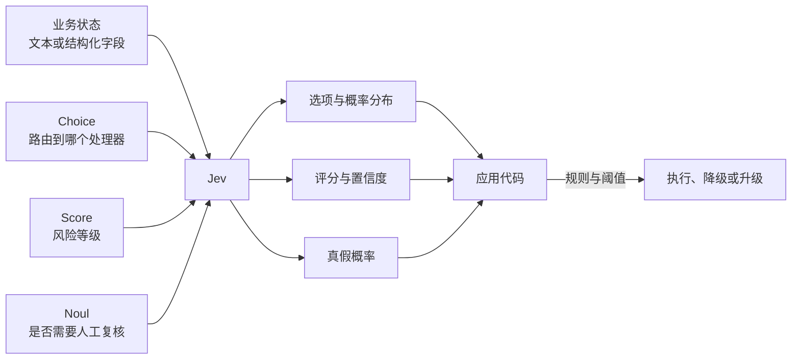
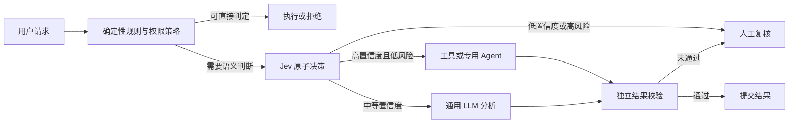
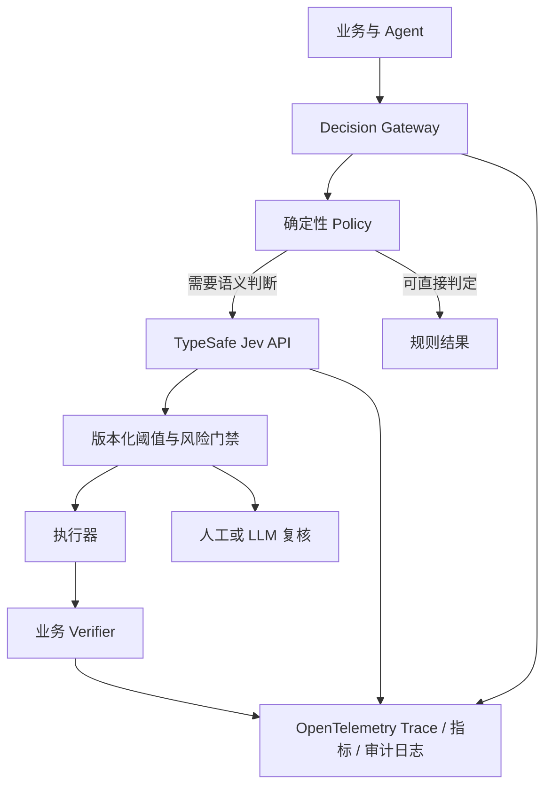

# Jev 技术综述：不生成文本的 System One 决策模型

2026 年 9 月 15 日，TypeSafe AI 发布了 Jev，并把它称为首个 **System One Model**。它不写文章、不生成代码，也不和用户聊天。应用提供一段状态和一组带类型的问题，Jev 只返回选项、评分、真假概率以及置信度，让程序直接据此分支。

这个定位解释了它为什么突然受到关注：很多线上系统调用大语言模型（Large Language Model，LLM），并不是为了生成内容，而只是想回答“交给哪个 Agent”“这次操作风险多大”“结果是否需要人工复核”。通用 LLM 会先生成 Token，再把文本约束成 JSON；Jev 则把**决策**做成原生接口。

这也是一个刚发布、尚未经过长期独立验证的产品。截至 2026 年 9 月 21 日，Jev 仍是闭源托管 API，权重、参数量、模型架构、训练数据和 Reinforcement Learning for Calibrated Decisions（RLCD，面向校准决策的强化学习）的论文尚未公开。本文因此把已公开事实、厂商评测和社区观察分开讨论。

## 一页结论

1. **Jev 更像“具备通用语言理解能力的概率决策器”，不是小号聊天模型。** 它最适合路由、分类、评分、验证和风险分流，不负责解释、创作与多步推理。
2. **类型安全解决的是输出空间，不是事实正确性。** Jev 不会返回定义之外的选项，也不会输出损坏的 JSON；它仍可能以很高的概率选择错误选项。
3. **概率是否可信，要用自己的数据验证。** 不能看到 `confidence=0.9` 就直接理解为“十次有九次正确”。需要用 Brier Score、负对数似然、可靠性图和分桶准确率检查校准。
4. **最合适的生产位置是规则系统与生成式 LLM 之间。** 确定性规则先处理可计算条件，Jev 处理窄而清晰的语义判断，低置信度或高风险请求再交给人工或更强模型。
5. **它不是自托管模型。** TypeSafe 公开了 Python/JavaScript SDK、Agent Skill 和一个用普通 LLM 模拟相同接口的适配器，但这不等于公开 Jev 权重。
6. **中文可用性仍需单独评估。** 官方说明英语是主要训练语言，中文、日文和韩文等 CJK 文本虽然支持，但效果并不等同于英语。

## 1. Jev 实际提供了什么

[TypeSafe 官方文档](https://docs.typesafe.ai/introduction)把输入称为 `state`，把输出约束为三类问题：

| 原语 | 适合的问题 | 主要返回值 | 例子 |
| --- | --- | --- | --- |
| `Choice` | 从预先定义的集合选择一个选项 | 选中项、各项概率、置信度 | 该工单应路由给账务、技术还是销售 |
| `Score` | 按有序 Rubric 评分 | 加权分数、各等级概率、置信度 | 用户不满程度为低、中还是高 |
| `Noul` | 判断一个命题为真的可能性 | 0 到 1 的 `noul` 值 | 这段内容是否包含紧急请求 |

`Noul` 是 TypeSafe 使用的名字，可以把它理解为带概率的“是/否”判断。它直接给出“是”的概率，所以没有单独的 `confidence` 字段。`Choice` 和 `Score` 会返回完整概率分布，并从分布集中程度计算一个置信度。

同一个请求可以携带多个问题。官方称这些问题会独立、并行地对同一份状态求值。因此，一个请求可以同时判断意图、风险、是否需要人工复核，而不必让后一问依赖前一问的自然语言输出。



截至本文复核时，[官方模型页](https://docs.typesafe.ai/models)列出的稳定版本是 `jev-1.13.0`，`jev-latest` 指向该版本。公开规格为：

| 项目 | Jev 1.13 公开规格 |
| --- | --- |
| API | `POST https://api.typesafe.ai/v1/systemone` |
| 输入 | 纯文本；可以用字符串、JSON 对象或文本数组组织 |
| 上下文 | 每请求 64K Token；`state` 加最长问题不超过 32K |
| 价格 | 输入每百万 Token 0.042 美元；输出免费 |
| 公布限额 | 250,000 Token/s、1,200 请求/min，官方说明会动态调整 |
| 模型版本 | `jev-1.13.0`；生产建议固定版本而不是长期依赖浮动别名 |
| 多模态 | 不接收图片、音频或视频，需要先转成文本或结构化字段 |
| 部署形态 | TypeSafe 托管 API；没有公开权重或自托管镜像 |

价格、限额和别名都可能变化，生产系统应从 API 回包记录真实模型版本，并把计费信息纳入周期性复核。

## 2. 一次调用长什么样

[官方 Quick Start](https://docs.typesafe.ai/introduction/quickstart)给出的 HTTP 接口很直接。下面把它改成一个 Agent 执行前的风险门禁：

```bash
curl -X POST https://api.typesafe.ai/v1/systemone \
  -H "Authorization: Bearer $TYPESAFE_API_KEY" \
  -H "Content-Type: application/json" \
  -d @- <<'EOF'
{
  "model": "jev-1.13.0",
  "state": {
    "user_request": "把生产命名空间中所有失败的 Job 清理掉",
    "planned_tool": "kubectl delete job --field-selector status.successful=0",
    "environment": "production"
  },
  "questions": {
    "action_type": {
      "type": "choice",
      "instructions": "判断计划动作的类别",
      "criteria": {
        "read_only": "不会改变外部状态",
        "reversible_write": "会改变状态但可可靠恢复",
        "destructive": "删除、覆盖或造成难以恢复的状态变化"
      }
    },
    "needs_human": {
      "type": "noul",
      "instructions": "该动作是否应在执行前由人类明确批准？"
    }
  }
}
EOF
```

真正的安全边界仍由代码持有。例如，删除生产资源属于硬规则，不能因为模型给出低风险分就绕过审批：

```python
if deterministic_policy.requires_approval(action):
    return request_human_approval(action)

decision = jev.evaluate(state, questions)

if decision.needs_human >= calibrated_threshold:
    return request_human_approval(action)
return execute_with_policy(action)
```

这段结构有两个关键点：模型不直接掌握副作用工具；阈值也不是照抄示例，而是从企业自己的验证集和风险预算中得到。

## 3. 它和现有方案是什么关系

Jev 最容易被误解成“用新名字包装的分类器”或“完全取代 LLM 的新模型”。两种说法都太绝对。

| 方案 | 强项 | 主要限制 | 适合放在哪里 |
| --- | --- | --- | --- |
| 确定性规则 | 快、便宜、可审计、结果稳定 | 难处理模糊语义，规则数量会膨胀 | 金额、日期、权限、配额、强合规条件 |
| 传统监督分类器 | 延迟低、可自托管、固定任务上成本低 | 每个领域需要标注、训练和维护，任务变化后要重训 | 高流量且标签长期稳定的分类任务 |
| Embedding + 近邻/线性模型 | 部署简单，易解释相似性 | 复杂上下文和组合条件能力有限 | 语义路由、去重、粗筛 |
| 通用 LLM + JSON Schema | 能解释、生成、多步推理，生态成熟 | 延迟和成本更高，仍需处理格式、重试与概率不可比 | 复杂分析、计划、生成和少量高价值判断 |
| Jev | 零样本自然语言判断、固定输出空间、概率分布、低延迟 | 闭源 API、不能生成、数学和多步推理弱、独立证据少 | 高频路由、评分、验证、置信度分流 |

如果任务标签稳定、样本充足且调用量很大，一个训练良好的小型分类器可能更便宜、更可控。Jev 的价值在于减少“每出现一个新判断就训练一套模型”的摩擦：业务人员可以先用自然语言定义选项和 Rubric，再通过线上数据判断是否值得蒸馏成专用模型。

## 4. 为什么 Agent 圈首先关注它

Agent 的循环里充满了短判断：下一步调用哪个工具、结果是否完整、失败能否重试、是否需要昂贵模型、是否越过权限边界。这些判断如果全部交给主模型，会拉长每轮延迟，也会消耗大量输出 Token。



近期讨论主要集中在以下方向：

- **Agent、工具和模型路由。** 根据任务语义和复杂度选择子 Agent、工具或不同价位的模型，是最容易接入、也最容易量化收益的用法。
- **执行前的第二双眼睛。** 在工具调用之前判断意图是否匹配、参数是否可疑、是否需要审批。它适合增加一个信号，不适合取代现有的鉴权和策略引擎。
- **生成结果验证。** 先由 LLM 生成，再让 Jev 按多个原子 Rubric 判断完整性、风险和是否需要重做。
- **实时交互。** 游戏、浏览器、机器人和家庭自动化需要高频短决策，社区对低延迟很感兴趣；但 Jev 只接收文本，视觉与传感器仍需其他模型先编码。
- **是否只是零样本分类器。** 技术社区认可其“任意自然语言 Rubric + 统一接口”的产品价值，同时质疑 System One 是否构成新的模型类别，以及公开信息是否足以验证架构和训练创新。
- **“不会幻觉”的边界。** 固定输出空间确实消除了格式漂移和未定义选项，却没有消除错误分类。这个措辞是目前争议最大的部分。
- **概率校准能否复现。** 置信度是产品核心，但目前缺少覆盖不同语言、领域、分布漂移和对抗输入的第三方大规模复测。
- **闭源 API 与数据边界。** SDK 开源不等于模型开放。隐私、数据驻留、供应商故障和版本漂移都需要额外设计。

### 微信公众号里最近在讨论什么

2026 年 9 月 21 日用“Jev TypeSafe”检索微信公众号公开索引时，搜索页给出约 808 条结果。这个数字包含转载、近似标题和聚合内容，不能理解为 808 篇独立研究。首页样本已经能看出三种叙事：

| 讨论方式 | 首页样本 | 值得保留的判断 |
| --- | --- | --- |
| 产品介绍 | “Jev 与 TypeSafe AI System One Models 研究报告”“深入解读 Jev” | 帮助读者理解“不生成，只决策”，但性能数字大多来自厂商材料 |
| 速度与成本传播 | “凭什么快 200 倍、便宜 400 倍”“Jev 模型的价值” | 说明 Agent 开发者确实在寻找廉价决策层；倍数不能脱离任务、模型和计费口径复用 |
| 质疑与实测 | “多方核实能不能信”“Jev 模型实测” | 开始关注准确率、中文效果、边界输入和是否只是分类器，这是更接近落地的问题 |

公众号传播中最容易遗漏的是**覆盖率**：当系统只让高置信度样本自动通过时，准确率通常会上升，但转人工比例也会上升。生产选型不能只写“准确率 95%”，还要回答这个准确率覆盖了多少流量、剩余流量由谁处理、错误动作的代价是什么。

[一篇第三方中文小样本对照](https://www.jxxy.net/ai/articles/yibie-2101553680889598094/)用 40 条客服消息测试 Jev 和开源 Laya，报告 Jev 为 31/40、平均端到端延迟 588 ms，Laya 为 23/40、7.6 ms，并尝试用级联保留准确率、减少云端调用。这个结果适合用来设计自己的实验，不足以构成通用排行：样本只有 40 条，类别定义、标注一致性、硬件和预热条件也会显著影响结果。

[LangChain 的 Jev-as-a-Judge 实验](https://www.langchain.com/blog/jev-agent-evals-langsmith)提供了另一种落地方式：对五条固定 Agent 轨迹各重复判断 100 次。在这组很窄的二元评估中，Jev 的 500 次判断都与人工标签一致，平均每次 0.44 秒、0.00035 美元，连续评分方差也低于几个生成模型。作者同时明确说明实验很早期。五个固定案例适合验证重复性，不足以证明跨任务准确率；生产评估仍应扩大样本和错误类型。

[Vercel 的发布后统计](https://vercel.com/blog/ai-gateway-jev-model-launch)显示，Jev 在接入 AI Gateway 后 24 小时内触达近 13% 的付费团队；[其公开榜单](https://vercel.com/ai-gateway/leaderboards/models)在 9 月 20 日显示 Jev 的请求占比和团队触达率快速上升。这说明开发者正在大量试验，但首周请求数不能证明长期留存、准确率或生产价值。大量低成本短请求也会天然推高请求份额，因此不能直接拿它和生成模型的 Token 份额比较。

## 5. “不能幻觉”究竟成立到哪一层

假设选项只有 `billing`、`technical` 和 `sales`，Jev 不会返回 `legal`，也不会插入解释段落破坏 JSON。这个保证很有用，因为代码不再需要处理 Markdown 围栏、字段丢失、枚举拼写变化和多余自然语言。

但以下输出依然完全合法：

```json
{
  "choice": "sales",
  "probabilities": {
    "billing": 0.02,
    "technical": 0.03,
    "sales": 0.95
  },
  "confidence": 0.91
}
```

如果原始请求明明是支付故障，这就是**高置信度的错误分类**。它没有发生 Schema 幻觉，却仍然做出了错误决定。生产设计需要分别看三层保证：

| 层次 | Jev 能否从结构上保证 | 仍需怎样验证 |
| --- | --- | --- |
| 输出类型与枚举合法 | 可以 | API Contract Test |
| 概率分布满足接口约束 | 可以由接口校验 | 数值范围、和为 1、缺失字段 |
| 语义判断正确 | 不可以 | 标注集、错误分析、漂移监控 |
| 置信度与真实正确率一致 | 不可以预先假定 | 校准曲线、Brier Score、ECE |
| 业务动作安全 | 不可以 | 权限、策略、审批、幂等与回滚 |

## 6. 官方自己承认的能力锯齿

[Jev 1.13 Jaggedness](https://docs.typesafe.ai/model-jaggedness/jev-1.13)列出了比发布文案更重要的限制：

| 薄弱点 | 工程处理方式 |
| --- | --- |
| 按字面理解，难补全隐含意图 | 把边界条件写进 `instructions` 和 `criteria` |
| 计数和精确数学不可靠 | 用普通代码计算，只把语义判断交给模型 |
| 日期顺序和时间间隔不可靠 | 先抽取字段，再用时间库比较 |
| 多层间接关系、双重否定变差 | 减少跳转，拆成原子问题 |
| 大量无关上下文降低准确率 | 先检索、过滤，只发送相关字段 |
| 对抗内容和 Prompt Injection | 精确限定问题，做红队测试，模型不直接持有权限 |
| 指令与评分标准互相矛盾 | 发布前对 Question Schema 做检查 |
| 多个概率之间不会自动满足业务恒等式 | 每个决策只问一种方式，结构约束由代码执行 |
| 不会生成文本 | 需要文字时调用生成模型 |

这份清单也给出了合适的职责边界：**语言中的含义交给模型，能够确定计算的部分留给代码。**

## 7. 置信度不能直接拿来当自动化开关

校准良好的模型应满足：在所有声称置信度约为 0.8 的样本中，长期看约有 80% 正确。这是统计性质，不是单次请求的事实保证。

上线前至少要计算：

- 每类 Precision、Recall、F1 和混淆矩阵；
- Brier Score 与 Negative Log-Likelihood（NLL，负对数似然）；
- Expected Calibration Error（ECE，期望校准误差）和可靠性图；
- 不同置信度阈值下的覆盖率、准确率、人工量与业务损失；
- 中文、英语、短文本、长文本及不同业务域的分层结果；
- 分布外（Out-of-Distribution，OOD）、无关上下文、否定、矛盾和 Prompt Injection 样本；
- P50、P95、P99 延迟、429 比例、超时率和单次有效决策成本。

一个实用的门禁表可能是：

| 条件 | 系统动作 |
| --- | --- |
| 硬规则命中高风险 | 直接要求审批，不调用模型覆盖规则 |
| Jev 高置信度，且该分桶在验证集中达到目标准确率 | 自动执行低风险动作 |
| Jev 中置信度 | 补充信息、调用更强 LLM 或进入抽检 |
| Jev 低置信度 | 人工复核或安全降级 |
| API 超时、429、版本改变 | 有界重试后走备用路径，不能默认放行 |

阈值必须按动作成本分别设置。推荐文章的错误路由可以容忍更多误差；删除数据、转账和对外发布不能使用同一阈值。

## 8. 推荐的生产接入方式

### 8.1 把 Jev 放进决策服务，而不是散落在业务代码里

可以建立一个独立 Decision Gateway，统一完成模型版本固定、问题模板版本化、超时、限流、缓存、审计、阈值与降级：



建议记录以下字段：Question 模板版本、固定模型 ID、输入哈希与脱敏摘要、完整概率分布、阈值版本、最终动作、人工覆写、真实结果标签、延迟、错误码和成本。不要把敏感原文直接打入普通应用日志。

### 8.2 在 Kubernetes 中怎样运行

Jev 本身是外部 API，Kubernetes 侧通常部署的是 Decision Gateway：

- API Key 放在 Secret 或外部 Secret Manager 中，并限制到专用 ServiceAccount；
- NetworkPolicy 或 Egress Gateway 只允许访问批准的 TypeSafe/Vercel 端点；
- 用 PodDisruptionBudget、多个副本和拓扑分散保证网关可用性；
- 对 429、5xx 和网络超时做指数退避与抖动，但设置严格的重试上限；
- 使用 Circuit Breaker 防止上游故障拖垮业务线程池；
- 给高风险动作设计 fail-closed 路径，低风险推荐类请求可以 fail-open 或退回规则；
- 用 OpenTelemetry 串联业务请求、Jev 调用、人工复核和最终执行结果；
- 把模型版本、模板版本和阈值作为部署制品管理，升级先跑 Shadow 和 Canary。

不要把概率响应直接当成 Kubernetes 准入结果。准入控制仍应以可解释、确定性的策略为主；Jev 可以提供风险信号或把模糊样本送去复核。

## 9. 一套可复现的 PoC 评估

Jev 是否值得引入，不应由几个 Demo 决定。建议准备三条基线：现有规则、一个代表性的通用 LLM 结构化输出、Jev 固定版本；有历史标签时再加一个专用分类器。

### 数据集

1. 从真实流量抽取并脱敏，按时间切分训练/调参与最终测试集；
2. 保留正常样本、边界样本、少数类、中文表达、错别字和长上下文；
3. 建立独立的 OOD、矛盾、Prompt Injection 和缺失信息集合；
4. 高风险标签由至少两名领域人员复核，记录分歧而不是强行制造伪精确真值。

### 运行矩阵

| 维度 | 至少包含 |
| --- | --- |
| 方法 | 规则、通用 LLM、Jev、可选专用分类器 |
| 语言 | 中文、英文、混合文本 |
| 上下文 | 短、典型、长及掺入无关信息 |
| 版本 | 固定 `jev-1.13.0`，另测 `jev-latest` 只用于发现版本变化 |
| 并发 | 1、目标常态、目标峰值 |
| 故障 | 429、超时、5xx、返回版本改变、网络断开 |

### 一个可以直接运行的 Decision Gateway Demo

仓库中的 [`examples/jev-decision-gateway`](https://github.com/runzhliu/aik8s/tree/main/examples/jev-decision-gateway) 提供了一套最小实现。它用 20 条中英文合成客服工单，同时判断处理团队和是否紧急，并保留每个选项的完整概率。执行器再根据阈值选择自动路由或人工复核。

同一套评测接口目前支持四个后端：关键词规则、TypeSafe 官方 `jev-1.13.0`、`pngwn/system-one-qwen3.5-4b-scorer` 和 Apache-2.0 的 Laya。官方后端必须从环境变量读取 API Key；社区模型的结果不会标成 Jev。

2026 年 9 月 21 日的公开模型实测结果如下：

| 路径 | 完成样本 | 路由准确率 | 紧急判断准确率 | 路由 Brier | 路由 ECE | 模型侧 P50 / P95 |
| --- | ---: | ---: | ---: | ---: | ---: | ---: |
| 关键词规则 | 20 / 20 | 95% | 100% | 0.110 | 0.100 | 小于 0.1 ms |
| Laya 公开 CPU Space | 20 / 20 | 60% | 90% | 0.521 | 0.222 | 227 / 438 ms |
| Qwen3.5-4B Scorer Space | 2 / 20 | 不统计 | 不统计 | 不统计 | 不统计 | 仅完成 Smoke Test |
| 官方 Jev 1.13.0 | 未执行 | — | — | — | — | 等待独立 API 凭据 |

Laya 的公网端到端 P50 为 3.82 秒、P95 为 6.50 秒，明显高于模型回包中的 227/438 ms。两者并不矛盾：前者包含免费 Space 排队、容器调度和网络，后者是应用报告的模型计算时间。生产测试必须同时保留这两个口径。

Laya 的路由结果还展示了置信度门禁的代价：以最高选项概率 0.5 为自动处理阈值时，只覆盖 20% 样本，这部分四条都正确；阈值提高到 0.7 后只剩 10% 覆盖。样本太少，100% 不能外推为真实准确率，但它清楚地说明“提高阈值”会把大量请求送去人工或备用模型。

Qwen3.5-4B Scorer 在匿名 Hugging Face ZeroGPU 配额耗尽前完成了两条真实请求，其中一条将重复扣款路由到 `billing`，最高概率 0.819；另一条退款请求的最高概率为 0.945。两条结果只证明调用链可用。脚本会保留失败样本和原始分母，不用两条成功结果计算正式成绩。

规则基线的高分也不能当成模型胜负：合成样本故意保留了清晰关键词，主要用于检查数据和指标管道。下一步应换成脱敏真实工单，隐藏显式关键词，增加多意图、未知类别、错别字、拒绝回答和跨语言表达，再把官方 Jev、Laya 与现有业务规则放在同一份冻结测试集上。

### 发布门槛

不要只比较平均准确率。每个业务场景都应明确：关键少数类 Recall 下限、可接受的误执行率、低置信度人工比例、P95/P99 延迟、故障时行为和每千次正确决策成本。达标后先 Shadow，只记录建议而不驱动动作；再 Canary 到低风险流量，最后才扩大自动化范围。

## 10. Hugging Face 上有 Jev 模型吗

截至 2026 年 9 月 21 日，Hugging Face 上没有 TypeSafe AI 官方发布的 Jev 权重。搜索结果中已经出现多个带 `jev` 或 `system-one` 标签的模型、Space 和数据集，但它们属于社区复现、接口适配或调用官方 API 的应用，不能写成“开源 Jev”。

| 项目 | 实际内容 | 使用时要注意什么 |
| --- | --- | --- |
| [`pngwn/system-one-qwen3.5-4b-scorer`](https://huggingface.co/pngwn/system-one-qwen3.5-4b-scorer) | Qwen3.5-4B-Base、LoRA、标量评分头和温度校准；对每个候选项打分 | Jev-style 社区模型，许可证为 CC BY-NC 4.0，不是 TypeSafe 权重 |
| [`convaiinnovations/laya`](https://huggingface.co/convaiinnovations/laya) | 421M 参数的非自回归决策模型，支持 Choice、Score 和 Noul，权重使用 Apache-2.0 | 模型卡给出 RLCD、校准和多语言版本信息；发布很新，模型卡结果仍需独立复测 |
| [`jasonkneen/open-jev`](https://huggingface.co/spaces/jasonkneen/open-jev) | 展示状态前缀复用、候选分支并行评分，并与生成 JSON 的 Qwen Instruct 对比 | Space 使用上面的社区 Scorer；适合研究推理路径，不代表复现了 Jev 训练方法 |
| [`C-Tianyu/NanoJev`](https://huggingface.co/C-Tianyu/NanoJev) | 基于 Qwen3-0.6B 的动作决策实验 | 训练目标集中在迷宫、Snake、ViZDoom 等窄任务，不能外推为通用决策能力 |
| [`cua-ai/cua-s1-forms`](https://huggingface.co/cua-ai/cua-s1-forms) | 面向 GUI 表单操作的单次选项评分器 | 场景专用模型；接口与 Jev 相似，任务覆盖不同 |
| [`Drenel/plek-1`](https://huggingface.co/Drenel/plek-1) | 声称实现 Jev-style 非自回归选项评分 | 含自定义代码，部署前需要代码审计并独立复测模型卡中的性能与校准结论 |

这些项目证明“给状态、问题和候选项打分”并不依赖某一家 API，也为自托管实验提供了起点。它们目前无法回答官方 Jev 的参数规模、RLCD 训练方法和性能结果能否复现。选型时应把三类对象分开：官方 Jev 托管 API、TypeSafe 的 LLM Adapter、社区 Jev-style 权重。

## 11. 目前最需要等待的证据

Jev 的产品形态很有启发性，但下面这些问题仍没有足够公开材料回答：

- RLCD 的目标函数、训练流程和校准方法具体是什么；
- 参数量、模型架构、硬件和端到端延迟的可比测试环境；
- 官方 Workflow Evals 的完整数据集、抽样方式和第三方复现；
- 置信度在不同领域、语言、类别不平衡和分布漂移下是否稳定；
- 70–500 ms、40–200 倍加速及数百倍成本优势在公平基线下能否复现；
- 托管服务的可用性目标、区域、数据驻留和企业灾备选择；
- 版本升级对概率分布与既有阈值的影响。

官方 GitHub 目前公开的是 [SDK、Agent Skill 和 System One Adapter](https://github.com/typesafe-ai)。其中 Adapter 用传统 LLM 模拟相同的客户端接口，适合验证编程模型或做备用路径，但它不是 Jev 的开源实现。看到“可替换 Client”时，不能据此推断 Jev 权重已经开放。

## 12. 怎样判断是否该用

适合优先试验 Jev 的任务通常同时具备这些特征：输入是文本或可文本化状态，输出集合有限，判断频率高，等待生成文本的延迟不可接受，错误可以被阈值、复核和独立 Verifier 控制。

以下任务应继续交给代码或其他模型：精确计算、日期比较、数据库约束和权限判断用代码；写作、代码生成、解释和计划用生成式 LLM；图像、音频和视频需要先由多模态模型处理；会直接造成重大损失的动作需要确定性策略与人工审批。

Jev 真正值得关注的地方，不在于给分类器起了一个新名字，而在于它把 AI 应用中长期被通用 LLM 顺带完成的“决策层”单独抽了出来：固定输出空间、概率优先、应用代码组合、生成模型只处理需要生成的部分。即使最终不选择 Jev，这种分层方式也能让 Agent 系统更快、更便宜，也更容易测试。

## 参考资料

- [TypeSafe AI：Introducing System One Models & Jev](https://typesafe.ai/blog/introducing-system-one-models-and-jev)
- [TypeSafe AI：Introduction](https://docs.typesafe.ai/introduction)
- [TypeSafe AI：Quick Start](https://docs.typesafe.ai/introduction/quickstart)
- [TypeSafe AI：API Reference](https://docs.typesafe.ai/api)
- [TypeSafe AI：Models](https://docs.typesafe.ai/models)
- [TypeSafe AI：Confidence](https://docs.typesafe.ai/confidence)
- [TypeSafe AI：Patterns](https://docs.typesafe.ai/patterns)
- [TypeSafe AI：Jev 1.13 Jaggedness](https://docs.typesafe.ai/model-jaggedness/jev-1.13)
- [TypeSafe AI GitHub Organization](https://github.com/typesafe-ai)
- [Vercel：Jev is the fastest-adopted model in AI Gateway history](https://vercel.com/blog/ai-gateway-jev-model-launch)
- [Vercel AI Gateway Model Leaderboard](https://vercel.com/ai-gateway/leaderboards/models)
- [Hacker News：Introducing System One Models and Jev](https://news.ycombinator.com/item?id=49717558)
- [Hugging Face：System One Qwen3.5 4B Scorer](https://huggingface.co/pngwn/system-one-qwen3.5-4b-scorer)
- [Hugging Face：Laya System One Decision Model](https://huggingface.co/convaiinnovations/laya)
- [Hugging Face Space：Open Jev](https://huggingface.co/spaces/jasonkneen/open-jev)
- [Hugging Face：NanoJev](https://huggingface.co/C-Tianyu/NanoJev)
- [LangChain：Jev-as-a-Judge for Agent Evals](https://www.langchain.com/blog/jev-agent-evals-langsmith)
- [搜狗微信公开索引：Jev TypeSafe](https://weixin.sogou.com/weixin?type=2&query=Jev%20TypeSafe)
- [Guo et al.：On Calibration of Modern Neural Networks](https://arxiv.org/abs/1706.04599)
- [Silva Filho et al.：Classifier Calibration Survey](https://arxiv.org/abs/2112.10327)
