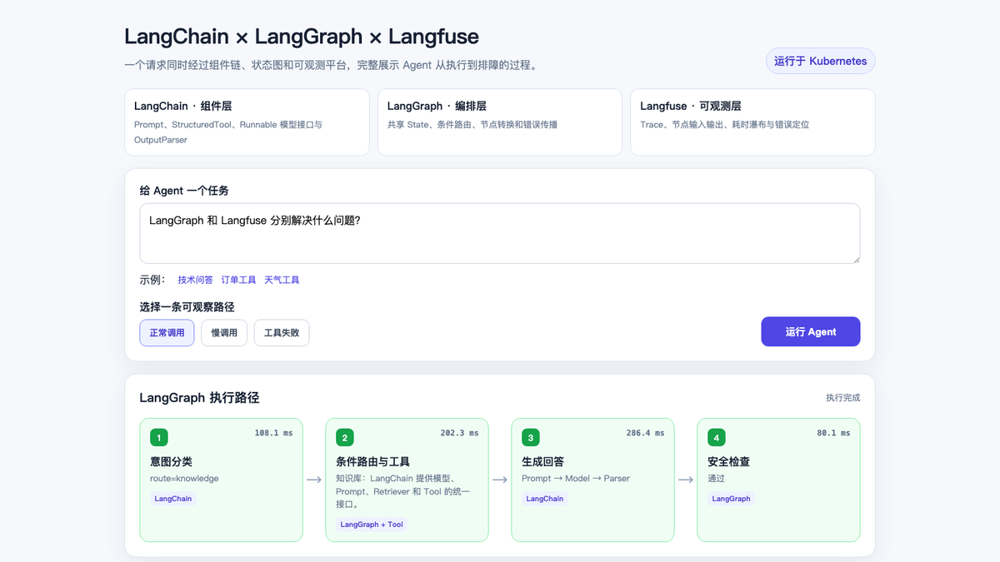
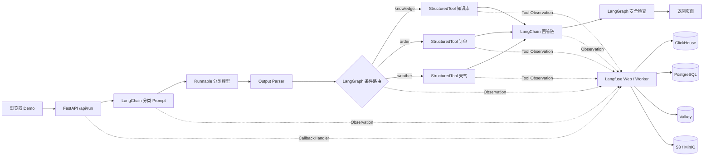
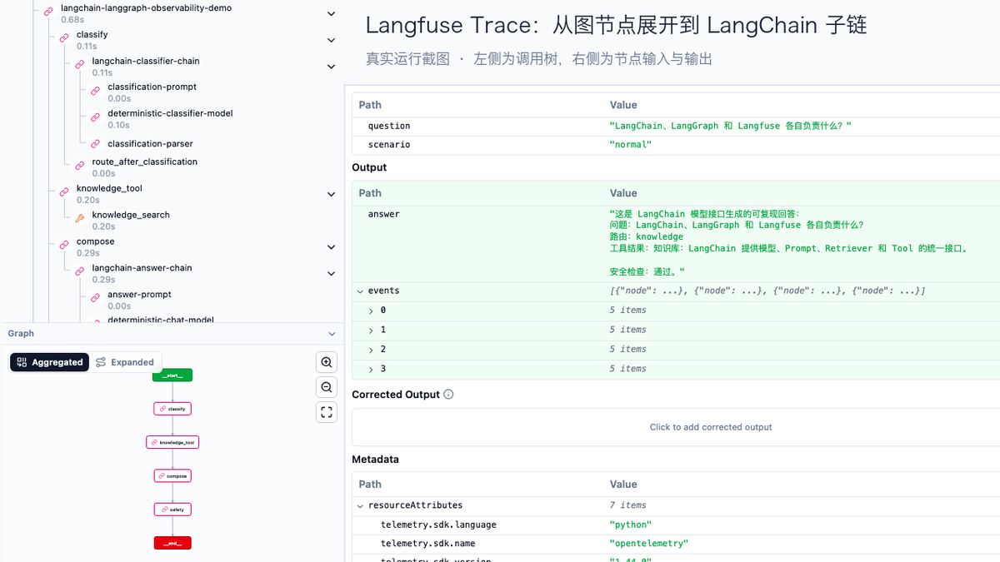

# LangChain、LangGraph 与 Langfuse Kubernetes 实战：从组件、编排到 Trace

LangChain、LangGraph 和 Langfuse 经常一起出现，但它们解决的不是同一个问题。只看定义很容易记成“三个 Lang 开头的 Agent 工具”，真正把一个请求跑通后，边界会清楚很多：

- **LangChain 提供组成应用的零件**：模型接口、Prompt、Tool、Retriever、Output Parser 和 Runnable；
- **LangGraph 把这些零件组织成可控的状态图**：State、Node、Edge、分支、循环和持久化；
- **Langfuse 记录实际发生了什么**：Trace、Observation、输入输出、耗时、错误、版本和后续评分。

本文实现并部署了一个完整 Demo。用户问题先经过 LangChain 分类链，再由 LangGraph 选择知识库、订单或天气工具，随后进入 LangChain 回答链和安全检查；整条路径通过 Langfuse Callback 写入 Trace。页面还可以主动制造慢工具和工具故障，用同一套界面对比成功、延迟和错误三种情况。



完整可复现代码位于 [`examples/langchain-langgraph-langfuse-demo`](https://github.com/runzhliu/aik8s/tree/main/examples/langchain-langgraph-langfuse-demo)。示例使用确定性 Runnable 模拟模型响应，不依赖外部 API，因此验证的是组件、编排和可观测链路，不评价任何模型的回答质量。

## 1. 先用一个生活例子理解三者

把一次 Agent 请求想成医院门诊：

- LangChain 像挂号表、检查设备、处方模板和各科室接口。它把“能做什么”包装成统一组件；
- LangGraph 像分诊流程。它决定患者先去哪个科室、什么情况复查、何时结束；
- Langfuse 像电子病历和质控系统。它记录每一步由谁处理、花了多久、输入输出是什么、哪里发生异常。

只有 LangChain 时，可以顺序拼出一条 Chain，也可以直接创建 Agent；流程出现复杂分支、循环、暂停恢复和人工审批后，显式状态图通常更容易审查。只有 LangGraph 时，模型和工具仍然需要自己接入，LangChain 正好提供这些组件。两者都能运行应用，但不会自动提供 Langfuse 那样的跨请求检索、瀑布图、错误聚合和评测数据。

[LangChain 官方概览](https://docs.langchain.com/oss/python/langchain/overview)把它定位为可组合模型、工具、Prompt 和中间件的 Agent Framework；[LangGraph 官方概览](https://docs.langchain.com/oss/python/langgraph/overview)则强调低层编排、持久执行和有状态 Agent。LangGraph 可以不依赖 LangChain，但两者组合最常见。

| 维度 | LangChain | LangGraph | Langfuse |
| --- | --- | --- | --- |
| 核心职责 | 模型、Prompt、Tool、Retriever 等组件与调用接口 | 有状态控制流和执行 Runtime | LLM 应用可观测、评测与 Prompt 管理 |
| 主要抽象 | Runnable、Prompt、Tool、Model、Parser | State、Node、Edge、Checkpoint | Trace、Observation、Session、Score |
| 是否执行应用逻辑 | 是 | 是 | 否，接收并分析遥测数据 |
| 是否决定下一步 | 简单 Chain 或 Agent 可以 | 显式图、条件边、循环和命令 | 不决定业务路径 |
| 是否用于业务恢复 | 不负责 | Checkpointer 可保存 Graph State | Trace 用于分析，不是业务状态 |
| 适合回答的问题 | “怎样调用模型和工具？” | “接下来执行哪个节点？” | “这次运行哪里慢、哪里错？” |

## 2. 本次 Demo 的完整链路



一次正常调用最终产生 15 个 Observation。Langfuse 左侧调用树可以同时看到 Graph 节点、LangChain 子链、Prompt、Runnable 和 StructuredTool；右侧保留所选节点的输入与输出。



[Langfuse 数据模型](https://langfuse.com/docs/observability/data-model)将一次请求组织为 Trace，将模型、工具、检索等步骤记录为可嵌套的 Observation，并可用 Session 聚合多轮交互。这个层级结构正好能表达 Graph → Node → Chain → Prompt/Model/Tool。

## 3. LangChain：组件层怎样实现

分类器不是一个藏在函数里的 `if`。它仍然使用 LangChain 的 Prompt、Runnable 模型接口和 Parser，因此替换为真实模型时不需要改 Graph：

```python
classification_prompt = ChatPromptTemplate.from_messages([
    ("system", "把用户问题分类为 knowledge、order 或 weather，只输出分类名。"),
    ("human", "{question}"),
])

classifier_chain = (
    classification_prompt
    | RunnableLambda(rule_based_classifier)
    | StrOutputParser()
).with_config(run_name="langchain-classifier-chain")
```

三个业务能力使用 `StructuredTool`，让工具名、描述和参数 Schema 成为显式契约：

```python
knowledge_tool = StructuredTool.from_function(
    knowledge_search,
    name="knowledge_search",
)
```

这样做的价值不只在于少写适配代码。LangChain Callback 能识别 Chain、Prompt、Parser 和 Tool 的嵌套关系，Langfuse 收到的不再是一条扁平日志。

## 4. LangGraph：为什么需要显式状态图

Demo 的共享 State 保存问题、场景、分类、工具上下文、最终回答和页面事件。分类节点完成后，Conditional Edge 根据 `category` 选择一个工具节点：

```python
builder = StateGraph(AgentState)
builder.add_node("classify", classify)
builder.add_node("knowledge_tool", knowledge_node)
builder.add_node("order_tool", order_node)
builder.add_node("weather_tool", weather_node)
builder.add_node("compose", compose)
builder.add_node("safety", safety_check)

builder.add_edge(START, "classify")
builder.add_conditional_edges(
    "classify",
    route_after_classification,
    {
        "knowledge": "knowledge_tool",
        "order": "order_tool",
        "weather": "weather_tool",
    },
)
```

在[官方 Graph API](https://docs.langchain.com/oss/python/langgraph/graph-api)中，State 是共享数据快照，Node 执行计算并返回更新，Edge 决定下一个节点。这个模型的好处是路由、终止条件和错误边界可以被测试和画出来；将来增加人工审批、重试节点或 Checkpointer 时，也不必把控制流重新塞回一段越来越长的 Agent 循环。

当前示例没有启用 Checkpointer，因为每个请求都在一个 HTTP 生命周期内完成。长任务、多轮对话或人工审批需要为 Graph 配置持久 Checkpointer，并使用稳定的 `thread_id`。LangGraph Checkpoint 保存的是可恢复业务状态，Langfuse Trace 保存的是观测证据，两者不能互相代替。

## 5. Langfuse：一次请求怎样变成可排查证据

应用先创建根 Observation，再把 `CallbackHandler` 传给 `graph.invoke()`：

```python
langfuse = get_client()
callback = CallbackHandler()

with langfuse.start_as_current_observation(
    name="agent-demo-request",
    as_type="agent",
    input={"question": question, "scenario": scenario},
) as root_span:
    result = graph.invoke(
        initial_state,
        config={
            "callbacks": [callback],
            "run_name": "langchain-langgraph-observability-demo",
            "tags": [scenario, "three-layer-stack"],
        },
    )
    root_span.update(output={"answer": result["answer"]})
```

这是 Langfuse Python SDK v3 的写法。[Langfuse 的 LangChain 集成文档](https://langfuse.com/integrations/frameworks/langchain)说明了 `CallbackHandler`、根 Observation、`user_id`、`session_id` 和 tags 的传递方式。短生命周期脚本退出前还应调用 `flush()`；常驻 Web 服务也要在优雅关闭阶段完成队列刷新。

本次 Trace 中可以直接回答这些问题：

- 分类链是否执行，最终走了哪个业务路由；
- 工具调用收到什么参数、返回什么结果；
- 慢请求主要耗在工具还是回答链；
- 工具抛错后，回答链和安全检查是否仍被执行；
- 同一发布版本、用户或 Session 下是否出现同类问题。

## 6. 三条验证路径

下面是三次独立请求的实测记录。延迟由 Demo 中固定的 `sleep` 主动控制，用于验证 Trace 层级、错误传播和耗时归因。每个场景只运行一次，**这些数字不能作为框架性能基准**。

| 场景 | 总耗时 | 分类 | 工具 | 回答链 | 安全检查 | 结果 |
| --- | ---: | ---: | ---: | ---: | ---: | --- |
| 正常调用 | 724.0 ms | 107.0 ms | 202.1 ms | 286.3 ms | 80.1 ms | 全链路完成 |
| 慢调用 | 3,123.0 ms | 106.0 ms | 1,802.3 ms | 1,106.3 ms | 80.1 ms | 全链路完成，瓶颈清楚 |
| 工具失败 | 332.2 ms | 106.2 ms | 201.9 ms | 未执行 | 未执行 | 根 Trace 与 Tool 标记 ERROR |

慢调用里，工具和回答链合计占总时间约 93%。如果只看 API 总耗时，只能知道“请求慢”；展开 Trace 后，可以确认需要先检查工具服务，再检查模型链。失败调用则证明异常没有被页面吞掉：Graph 在 Tool 节点终止，后续节点不执行，根 Trace 和工具 Observation 都保留错误。

## 7. Kubernetes 部署形态

本次实验在一个独立 Namespace 中部署：

| 组件 | 副本 | 作用 |
| --- | ---: | --- |
| Demo Web | 1 | FastAPI、LangChain 和 LangGraph Runtime |
| Langfuse Web | 1 | 查询和管理界面 |
| Langfuse Worker | 1 | 异步处理与后台任务 |
| PostgreSQL | 1 | 元数据与事务数据 |
| ClickHouse | 1 | Trace 与分析数据 |
| Valkey | 1 | 队列、缓存和协作状态 |
| MinIO | 1 | S3 兼容对象存储 |

实验固定使用 Helm Chart `1.5.41` 和 Langfuse `3.224.1`，原因是实验集群没有安装 ClickHouse Operator 和 cert-manager 的相关 CRD。这是复现实验的版本说明，不是生产版本推荐。当前官方 Chart 2.x 在启用内置 ClickHouse 时会创建 `ClickHouseCluster` 和 `KeeperCluster`，安装前需要准备 cert-manager 与 ClickHouse Operator；新部署应按[官方 Kubernetes Helm 文档](https://langfuse.com/self-hosting/deployment/kubernetes-helm)评估当前版本、外部数据服务和升级路径。

示例仓库提供 Dockerfile、固定依赖、Demo Deployment、Service 以及不含真实凭据的 values 模板。最短部署步骤如下：

```bash
docker build -t REGISTRY/langgraph-langfuse-demo:v1 \
  examples/langchain-langgraph-langfuse-demo
docker push REGISTRY/langgraph-langfuse-demo:v1

# 替换镜像和 Secret 占位符
kubectl apply -f examples/langchain-langgraph-langfuse-demo/k8s/deployment.yaml
kubectl -n langgraph-observability rollout status deploy/langgraph-demo

kubectl -n langgraph-observability port-forward svc/langgraph-demo 18080:8080
kubectl -n langgraph-observability port-forward svc/langfuse-web 13000:3000
```

浏览器访问 `http://127.0.0.1:18080` 运行场景，再从页面打开对应 Trace。公开示例中的 Secret 只有占位符；真实 Key、数据库密码、加密 Key 和登录凭据必须由 Secret 管理系统生成和注入。

## 8. 换成真实模型

要接入企业内部的 OpenAI 兼容网关，只需把确定性 Runnable 换成 `ChatOpenAI`，Prompt、Parser、Graph 和 Langfuse Callback 可以保持不变：

```python
import os
from langchain_openai import ChatOpenAI

model = ChatOpenAI(
    model=os.environ["MODEL_NAME"],
    base_url=os.environ["OPENAI_BASE_URL"],
    api_key=os.environ["OPENAI_API_KEY"],
    timeout=60,
    max_retries=2,
)

answer_chain = answer_prompt | model | StrOutputParser()
```

Kubernetes 中应通过 Secret 引用 API Key，并把模型名、Base URL、Prompt 版本、Release 和 Graph 版本一同写入 Trace。这样模型、Prompt 或 Graph 改动后，才能按版本比较错误率、延迟和质量分数。

## 9. 从 Demo 走向生产要补什么

这个 Demo 证明三层可以协同工作，但生产系统还需要补齐以下部分：

1. **Graph 持久化**：为需要恢复的流程配置 PostgreSQL 等持久 Checkpointer，节点外部副作用使用幂等键；
2. **模型真实指标**：记录 Token、首 Token 延迟、输出速率、模型端排队和费用，避免只有端到端总耗时；
3. **Trace 与业务关联**：统一 `trace_id`、`request_id`、`thread_id`、用户、租户和业务结果；
4. **隐私治理**：在 SDK 前完成 PII 脱敏，限制 Trace 访问，定义数据保留和删除策略；
5. **评测闭环**：把线上失败样例沉淀为 Dataset，增加规则评分、人工评分和 Judge，并在发布前回归；
6. **高可用数据层**：根据规模使用外部 PostgreSQL、ClickHouse、Redis/Valkey 和对象存储，分别设计备份、恢复和升级；
7. **应用与平台监控**：Langfuse 解释 Agent 语义链路，Prometheus/Grafana 继续监控 Pod、队列、数据库、CPU、内存和网络；
8. **版本兼容矩阵**：固定 LangChain、LangGraph 和 Langfuse SDK 版本，升级前验证 Callback、Trace 层级和输入输出脱敏。

## 10. 怎么判断三者是否都用对了

可以用三组问题做验收：

**LangChain**

- 模型、Prompt、Tool 和 Parser 是否是清楚的可替换组件？
- 工具参数是否有 Schema，模型提供商是否可以在不重写业务逻辑的情况下更换？

**LangGraph**

- State 是否只保存流程需要的数据？
- 分支、循环、失败和终止条件是否显式？
- 需要恢复的任务是否有 Checkpointer、稳定 Thread ID 和幂等副作用？

**Langfuse**

- 一次用户请求能否展开到 Graph Node、Chain、Prompt、Model 和 Tool？
- Trace 是否能按环境、版本、用户、Session 和场景过滤？
- 线上失败能否回到 Dataset 和发布回归，而不只是留在日志里？

三者组合后的关键成果，不是页面上多了一棵调用树，而是把“组件怎样调用、流程怎样运行、结果怎样验证”连接成可重复检查的工程闭环。

## 参考资料

- [LangChain Overview](https://docs.langchain.com/oss/python/langchain/overview)
- [LangGraph Overview](https://docs.langchain.com/oss/python/langgraph/overview)
- [LangGraph Graph API](https://docs.langchain.com/oss/python/langgraph/graph-api)
- [Langfuse LangChain Integration](https://langfuse.com/integrations/frameworks/langchain)
- [Langfuse Observability Data Model](https://langfuse.com/docs/observability/data-model)
- [Langfuse Kubernetes Helm Deployment](https://langfuse.com/self-hosting/deployment/kubernetes-helm)
