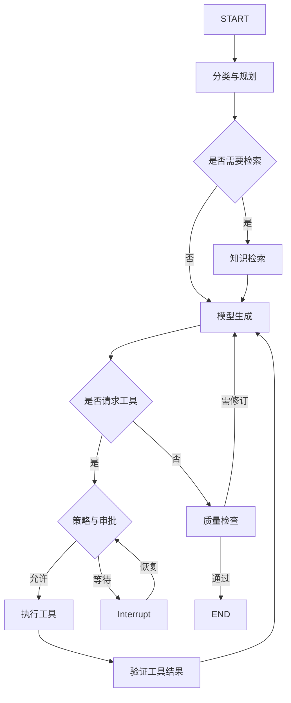
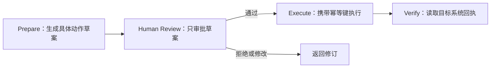
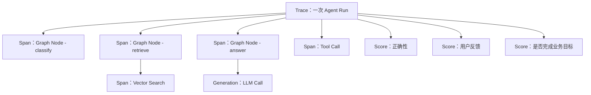
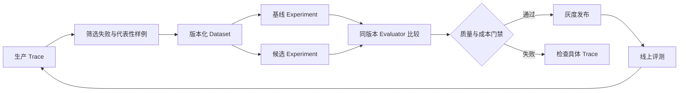
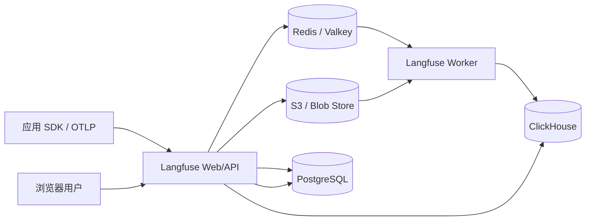
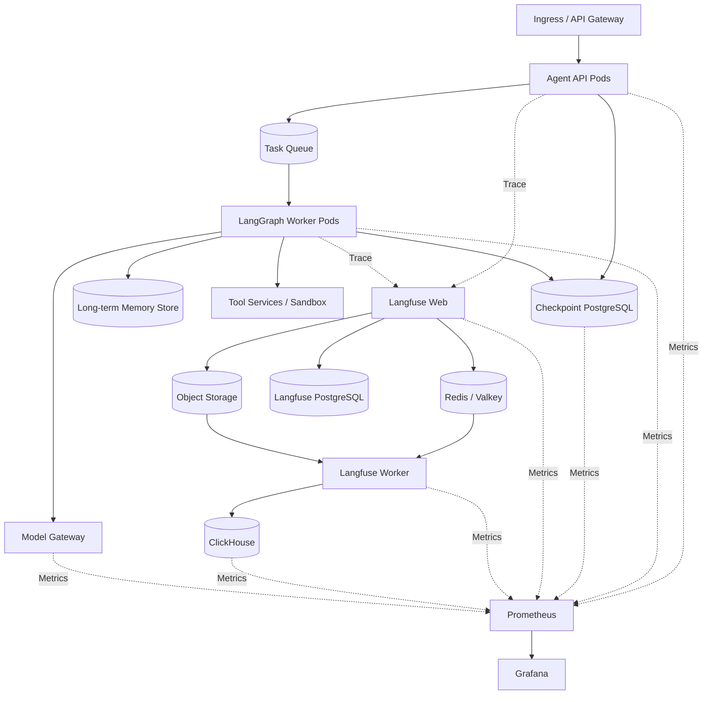

# Langfuse 与 LangGraph 技术综述：Agent 编排、可观测性与评测闭环

LangGraph 和 Langfuse 经常同时出现在 Agent 技术栈中，也经常因为名字相似而被放在同一类产品里。实际上，两者位于不同层：**LangGraph 负责让 Agent 按状态和控制流运行，Langfuse 负责记录、分析和评估这段运行。**

一个简单类比是：LangGraph 像生产线的控制器，决定工件先经过哪个工位、失败后从哪里重来、何时等待人工签字；Langfuse 像质量与追溯系统，记录每个工位耗时、输入输出、成本、错误和评分，并把线上缺陷沉淀成下一轮测试样例。

二者可以独立使用。LangGraph 可以接 LangSmith、OpenTelemetry 或自建观测；Langfuse 也可以追踪任意 Python、JavaScript、OpenTelemetry 或其他 Agent Framework。把它们组合起来的价值，是形成“执行—观测—评测—改进”的完整闭环。

## 一页结论

1. **LangGraph 是低层 Agent 编排框架与 Runtime。** 核心抽象是 State、Node 和 Edge，重点能力是循环、分支、并行、Streaming、Checkpoint、Durable Execution 和 Human-in-the-loop。
2. **Langfuse 是开源 LLM Engineering Platform。** 它覆盖 Trace、Prompt Management、Token 与成本、用户反馈、Dataset、Experiment、人工标注和自动评测。
3. **LangGraph Checkpoint 不是 Langfuse Trace。** Checkpoint 保存可以继续执行的业务状态；Trace 保存用于观察和分析的执行证据。删掉 Trace 不应让任务无法恢复，重放 Trace 也不等于恢复业务事务。
4. **LangGraph 不要求使用 LangChain。** 官方定位是低层 Orchestration Runtime；可以使用 LangChain 模型和工具集成，也可以直接调用自己的模型网关与业务 API。
5. **Langfuse 不负责运行 Agent。** 它不会替 LangGraph 调度节点、恢复线程、执行工具或回滚外部副作用。
6. **生产 LangGraph 必须使用持久 Checkpointer。** 内存 Checkpointer 只适合本地开发；Thread State 和跨 Thread 长期记忆也应分开设计。
7. **Interrupt 会保存状态并等待恢复，但节点代码可能重新执行。** 审批前后的副作用应幂等，外部写入需要幂等键、状态查询和业务回执。
8. **Langfuse 自托管不只是一个 Web Pod。** 当前架构包含 Web、Worker、PostgreSQL、ClickHouse、Redis/Valkey 和 S3 兼容对象存储；生产环境要分别考虑扩缩容、备份和升级。
9. **Agent 观测不能停在“调用了几次模型”。** 还要记录 Graph Version、Thread/Run、节点路径、工具参数摘要、审批等待、模型与 Prompt 版本、Token、成本、最终业务结果。
10. **Kubernetes 适合承载这套组合，但需要划开三类平面。** LangGraph 属于执行控制面，Langfuse 属于 LLM 观测评测面，Prometheus/Grafana 属于基础设施与服务健康面。

## 1. 两者分别解决什么问题

| 维度 | LangGraph | Langfuse |
| --- | --- | --- |
| 产品定位 | 长时、有状态 Agent 的低层编排框架与 Runtime | LLM 应用的观测、Prompt、评测与实验平台 |
| 核心对象 | State、Node、Edge、Thread、Checkpoint、Store、Interrupt | Trace、Observation、Generation、Score、Prompt、Dataset、Experiment |
| 是否执行模型和工具 | 是，由应用节点调用 | 否，记录调用及其结果 |
| 是否保存可恢复业务状态 | Checkpointer 保存 Thread 状态 | Trace 用于分析，不应承担业务恢复 |
| 是否支持人工介入 | `interrupt()` 暂停并由 `Command` 恢复 | 可记录审批 Span、反馈和人工 Score |
| 是否管理 Prompt | Prompt 写在应用或其他系统中 | 提供 Prompt 版本、标签与拉取能力 |
| 是否做评测 | 需自行编写或接外部平台 | Dataset、Experiment、Score、Judge、标注队列 |
| 自托管形态 | Python/JS 应用或 Agent Server | Web + Worker + 多种数据存储 |
| 主要替代对象 | 手写 while-loop、隐式 Agent 状态、脆弱工作流 | 散落日志、手工 Prompt 文件、零散评测脚本 |

[LangGraph 官方概览](https://docs.langchain.com/oss/python/langgraph/overview)将其定义为用于构建、管理和部署长时间运行、有状态 Agent 的低层编排框架和 Runtime。[Langfuse](https://langfuse.com/docs)则把自身定位为开源 LLM Engineering Platform。判断技术边界时应以职责为准，而不是名称中的 “Lang”。

## 2. LangGraph：把 Agent 写成显式状态图

最简单的 Agent 往往是一个循环：调用模型、解析 Tool Call、执行工具、把结果追加到消息，再调用模型。这种写法在 Demo 中很短，进入生产后会遇到状态不可见、失败难恢复、审批难插入、分支难测试等问题。

LangGraph 将它改写为显式图：



图中每个 Node 是读取 State 并返回 State Update 的函数，Edge 决定下一个 Node；Conditional Edge、`Command` 或 `Send` 可以实现条件路由、状态更新与并行 Map-Reduce。

### 2.1 State

State 是节点之间共享的显式数据结构。它不应只是无限增长的消息列表，还可以包含：

- 当前目标、计划和完成条件；
- 用户、租户、Thread 与请求身份；
- 检索结果和来源；
- 工具调用、外部资源 ID 与业务回执；
- 审批状态、风险等级和等待原因；
- 重试次数、预算和截止时间；
- 最终结果及验证证据。

LangGraph State 可使用 `TypedDict`、Dataclass 或 Pydantic Model 描述。每个字段还可以定义 Reducer，决定并行或多次更新时采用覆盖、追加还是自定义合并。节点应返回 Update，而不是任意原地修改共享对象。[Graph API](https://docs.langchain.com/oss/python/langgraph/use-graph-api)

### 2.2 Node

Node 可以是确定性代码，也可以调用模型、检索、工具或子图。好的节点通常满足：

- 职责单一，输入输出 Schema 清楚；
- 外部调用有超时、重试与错误分类；
- 返回原始事实和资源 ID，而不是只返回一段总结；
- 可独立测试；
- 失败后能判断是否安全重放；
- 不把长期 Secret 写入 State。

### 2.3 Edge 与控制流

LangGraph 支持序列、条件分支、循环、并行节点、Map-Reduce 和子图。复杂 Agent 不一定要把所有决策交给模型：

| 决策 | 推荐实现 |
| --- | --- |
| 固定合规流程 | 普通 Edge 与确定性代码 |
| 根据明确字段分流 | Conditional Edge |
| 模型决定下一工具 | Tool Call + 受控路由 |
| 批量独立子任务 | `Send` / Map-Reduce |
| 复用一个完整能力 | Subgraph |
| 高风险动作 | Interrupt + 外部审批 |

越接近财务、权限、生产发布和删除，越应让代码和策略决定路径；模型适合处理意图、非结构化信息和开放分析。

## 3. Checkpoint、Thread 与长期记忆

LangGraph 持久化包含两个不同系统：

| 机制 | 范围 | 保存什么 | 典型用途 |
| --- | --- | --- | --- |
| Checkpointer | 单个 Thread | 每个执行步骤的 Graph State Snapshot | 续聊、暂停恢复、故障恢复、Time Travel |
| Store | 跨 Thread | 应用定义的 Key-Value 数据 | 用户偏好、事实、跨会话长期记忆 |

Thread 由 `thread_id` 标识。Graph 使用 Checkpointer 编译后，每个步骤都可以产生 Checkpoint；后续调用使用相同 `thread_id`，Runtime 才知道从哪个状态继续。

```python
from langgraph.checkpoint.memory import InMemorySaver
from langgraph.graph import MessagesState, StateGraph, START, END

def answer(state: MessagesState):
    return {"messages": [{"role": "assistant", "content": "已收到"}]}

builder = StateGraph(MessagesState)
builder.add_node("answer", answer)
builder.add_edge(START, "answer")
builder.add_edge("answer", END)

graph = builder.compile(checkpointer=InMemorySaver())
config = {"configurable": {"thread_id": "demo-thread-001"}}
graph.invoke(
    {"messages": [{"role": "user", "content": "继续处理昨天的任务"}]},
    config=config,
)
```

`InMemorySaver` 在进程重启后会丢失，只适合开发。生产应使用 PostgreSQL 等持久实现，并定义备份、保留、删除和租户隔离。官方持久化文档也区分了 Checkpointer 与 Store：[LangGraph Persistence](https://docs.langchain.com/oss/python/langgraph/persistence)。

### 3.1 Checkpoint 不等于任务调度器

Checkpoint 能保存“任务停在哪里”，但自建应用仍要解决“谁在什么时候把它重新唤醒”：

- HTTP 请求中断后由哪个 Worker 继续；
- Pod 重启后未完成 Run 如何重新入队；
- Interrupt 等待几天时谁接收审批事件；
- 定时器、Webhook 和外部回调如何关联 Thread；
- 同一 Thread 的并发写如何避免冲突；
- 任务取消后怎样阻止旧消息再次唤醒。

使用 LangGraph Agent Server 时，一部分持久化基础设施由 Server 管理；完全自建时仍需要 API、Queue、Worker、Scheduler 与幂等控制。数据库中“有一条 Checkpoint”本身不会自动产生执行。

### 3.2 状态保留不能无限增长

长对话会积累消息、工具结果和多个 Checkpoint。需要分别定义：

- Context 中保留哪些信息；
- Checkpoint 保留多少历史版本；
- 原始工具输出放数据库还是对象存储；
- 长期记忆何时更新、过期和删除；
- 用户删除请求如何覆盖派生摘要和评测数据。

参考：[Agent Memory 技术综述](agent-memory-technology-overview.md)。

## 4. Interrupt 与人工审批

`interrupt()` 可以在节点内部暂停 Graph，把 JSON 可序列化信息交给调用方，并通过相同 Thread 的 `Command(resume=...)` 恢复：

```python
from langgraph.types import Command, interrupt

def approval_node(state):
    decision = interrupt({
        "action": "create_pull_request",
        "repository": state["repository"],
        "diff_summary": state["diff_summary"],
    })
    return {"approval": decision}

# 第一次执行会在 interrupt 处暂停并保存状态
paused = graph.invoke(input_state, config=config)

# 审批完成后使用同一个 thread_id 恢复
resumed = graph.invoke(Command(resume={"approved": True}), config=config)
```

Interrupt 的重要语义是：恢复时节点可能从开头重新执行。因此放在 `interrupt()` 前面的数据库写入、付款、发消息或创建资源必须幂等，或者移动到审批后的独立节点。[Interrupts](https://docs.langchain.com/oss/python/langgraph/interrupts)明确要求，Interrupt 前的副作用应可安全重放。

推荐把审批拆成三步：



这样即使审批等待数小时或 Worker 更换，执行节点仍能根据动作 ID 查询是否已经完成。

## 5. LangGraph 的能力边界

LangGraph 提供编排原语，但不会自动完成一整套企业 Agent 平台：

| 能力 | LangGraph 是否直接解决 | 仍需补充什么 |
| --- | --- | --- |
| 状态图与循环 | 是 | 业务 State Schema 与停止条件 |
| Checkpoint 与恢复 | 是 | 生产数据库、调度、并发与保留策略 |
| Human-in-the-loop | 是 | 身份、审批 UI、授权与审计 |
| 模型和工具调用 | 可集成 | 模型网关、凭据、Schema、限流 |
| 代码或浏览器隔离 | 否 | Container、VM 或 Agent Sandbox |
| 工具权限 | 否 | Policy Engine、最小权限身份、目标系统校验 |
| 外部事务回滚 | 否 | 幂等、补偿、业务工作流 |
| 全链路观测评测 | 可发事件 | Langfuse、LangSmith、Phoenix、OTel 等 |
| 多租户产品 UI | 否 | API、前端、配额、计费与运营系统 |

它适合做 Harness 的编排 Runtime，而不是把 Harness 的全部组件塞进一个库。参考：[Agent Harness 技术综述](agent-harness-technology-overview.md)。

## 6. Langfuse：从 Trace 到持续评测

普通日志适合记录“某个接口报错了”，LLM 应用还需要回答：

- 用户输入经过了哪些检索、节点和工具；
- 最终答案由哪个模型、Prompt 和配置产生；
- 每个步骤消耗多少 Token、时间和费用；
- 工具为什么被调用，返回结果是否被正确使用；
- 哪类用户或输入质量下降；
- 新版本是否在相同测试集上优于基线；
- 线上坏样例是否进入后续回归。

Langfuse 用 Trace 和 Observation 表达这条执行链。一次 Agent Run 通常对应一个 Trace，内部模型调用可记录为 Generation，检索、工具和节点可记录为 Span 或其他 Observation，再关联 Score、Prompt Version、Session 和 User。



### 6.1 Observability

Langfuse 可以记录输入、输出、模型、Token Usage、成本、延迟、错误、Metadata 和层级关系。它回答的是 LLM 应用语义问题，不替代 Prometheus 对 Pod、CPU、GPU、队列和数据库的监控。

两套系统应通过共同 ID 关联：

```text
trace_id
run_id
thread_id
request_id
tenant_id
graph_version
prompt_version
model_revision
deployment_id
```

其中 `thread_id` 代表 LangGraph 的状态连续性，`trace_id` 代表一次可观测执行。一个 Thread 可以产生多次 Trace；不要强行把两个 ID 设成同一个语义。

### 6.2 Prompt Management

Langfuse Prompt Management 支持 Prompt 版本、标签、变量和从 SDK 获取。生产使用时仍应记录：

- Prompt 名称、不可变版本与部署标签；
- 变量填充后的摘要或安全哈希；
- Chat Template、Tool Schema 与 System Policy 版本；
- 应用代码 Commit 和模型版本；
- 缓存命中以及无法拉取时的回退版本。

Prompt 不是应用的全部版本。只切换 Prompt 标签却不记录 Graph、工具和检索版本，仍无法复现实验。[Prompt Management](https://langfuse.com/docs/prompt-management/overview)

### 6.3 Dataset 与 Experiment

Langfuse Dataset 保存输入、可选期望输出和 Metadata；Experiment 将某个应用版本运行在 Dataset 上，形成结果和 Score。评测方法可以是：

- 确定性代码规则；
- 外部评测脚本或业务系统回执；
- 人工评分与 Annotation Queue；
- LLM-as-a-Judge；
- 整个 Run 的聚合指标。



可比实验需要固定 Dataset Version 和 Evaluator Version，并记录应用 Commit、模型和 Prompt。数据集版本固定不代表模型输出确定；应重复运行或报告置信区间，不要把一次随机生成当成稳定结论。[Compare experiments](https://langfuse.com/docs/evaluation/experiments/compare-experiments)

### 6.4 Langfuse 不做什么

- 不保存 LangGraph 可以直接恢复的业务 Checkpoint；
- 不调度 Graph Node 或执行 Tool；
- 不自动证明 LLM 输出正确；
- 不替代模型网关的鉴权、配额和路由；
- 不替代 Prometheus/Grafana 的基础设施监控；
- 不替代业务数据库的事务和审计；
- 不因有 Trace 就自动满足隐私与合规要求。

## 7. Langfuse 自托管架构

截至本文更新时，Langfuse v4 自托管由两类应用容器和四类存储组成：



| 组件 | 主要职责 | 生产关注点 |
| --- | --- | --- |
| Langfuse Web | UI、API、接收 Trace、查询数据 | 横向扩容、Ingress、认证、限流 |
| Langfuse Worker | 异步消费与处理事件 | Queue Lag、CPU 扩容、失败重试 |
| PostgreSQL | 事务和控制面数据 | HA、备份、连接池、迁移 |
| ClickHouse | Trace、Observation 和 Score 的分析查询 | 分片/副本、磁盘、Merge、TTL |
| Redis/Valkey | Queue 与 Cache | 可用性、内存、持久策略、淘汰 |
| S3/Blob Store | 原始事件、多模态输入、大型导出 | 生命周期、加密、版本与容量 |

官方当前采用排队式摄取：Web 批量接收 Trace 后先将事件写入对象存储，把引用放入 Redis；Worker 再读取并写入 ClickHouse。这使入口能吸收突发流量，也意味着监控不能只看 API 2xx，还要看对象存储写入、Redis 队列积压和 Worker 到 ClickHouse 的最终入库。[Self-host Langfuse](https://langfuse.com/self-hosting)

### 7.1 为什么需要这么多存储

LLM Trace 往往同时具备三种特征：

- 写入量大、字段多，适合列式分析；
- 项目、成员、Prompt 等控制数据需要事务；
- 原始事件和多模态制品体积大，适合对象存储。

强行把全部数据放入一个 PostgreSQL 会让早期部署简单，却很难同时满足高吞吐 Trace、复杂分析和大对象成本。Langfuse 的架构把这些负载拆给 ClickHouse、PostgreSQL 和对象存储，代价是运维面扩大。

### 7.2 Helm 部署需要注意什么

当前官方 Helm Chart 可以部署应用与数据存储，也能连接外部 PostgreSQL、ClickHouse、Redis 和对象存储。新 Chart 使用 ClickHouse Operator；如果全部存储都由外部服务提供，则无需为内置 ClickHouse 安装对应 Operator。[Kubernetes Helm 部署](https://langfuse.com/self-hosting/deployment/kubernetes-helm)

生产环境推荐：

- Web 与 Worker 使用独立 Deployment 和 HPA；
- 数据库采用独立故障域、持久卷和经过验证的备份恢复；
- 大规模场景优先评估托管 PostgreSQL、Redis 和对象存储；
- ClickHouse 根据摄取与查询负载规划 Keeper、分片和副本；
- Helm 升级前在副本环境验证 Schema Migration 和存储兼容；
- Secret 使用外部 Secret Manager，不提交 Values；
- 为 SDK 摄取和 UI 查询配置不同的限流与 SLO；
- 通过 NetworkPolicy 限制 Web、Worker 和各存储之间的访问；
- 给 Trace、对象和 Checkpoint 分别定义保留期。

## 8. LangGraph 与 Langfuse 怎样接起来

Langfuse 的 LangChain 集成使用 Callback Handler 监听 LangChain/LangGraph 事件。一个基本接法是：

```python
from langfuse.langchain import CallbackHandler

langfuse_handler = CallbackHandler()

result = graph.invoke(
    {"messages": [{"role": "user", "content": "分析订单失败原因"}]},
    config={
        "configurable": {"thread_id": "thread-20260914-001"},
        "callbacks": [langfuse_handler],
        "metadata": {
            "tenant_id": "team-a",
            "graph_version": "orders-agent@8f4c2ab",
            "environment": "staging",
        },
    },
)
```

实际安装方式和 SDK 初始化参数应以当前 [Langfuse LangChain/LangGraph Integration](https://langfuse.com/integrations/frameworks/langchain) 为准。对需要跨框架统一语义的组织，也可以通过 OpenTelemetry 接入，但要先定义自己的属性版本和脱敏规范。

### 8.1 自动 Trace 之后还要补什么

Callback 能自动采集模型和 Chain 事件，但以下业务字段通常需要应用显式补充：

- Thread、Run、用户和租户；
- Graph 与 Node 版本；
- Tool 的业务动作 ID；
- 审批请求、审批人、等待时长和决定；
- 重试原因、恢复来源 Checkpoint；
- 最终业务完成条件；
- 用户反馈和下游系统回执。

自动采集的函数名不等于稳定的业务语义。建议为关键 Span 使用长期稳定的名称，例如 `retrieve_policy`、`prepare_refund`、`approve_refund`、`execute_refund`，避免重构函数后看板完全断层。

### 8.2 避免重复 Trace

如果 LangChain Callback、OpenTelemetry 自动插桩和模型 SDK 插桩同时开启，可能为同一次调用生成多条重复 Observation。接入时应先画清层级：

```text
Trace: agent_run
  Span: graph_node
    Span: retrieval_or_tool
    Generation: model_call
```

选择一个地方创建根 Trace，其他集成只追加子 Span，并在压测前核对一次请求对应的层级、Token 和成本是否只计一次。

## 9. 一套生产观测模型

### 9.1 Langfuse 中看语义与质量

| 维度 | 指标或字段 |
| --- | --- |
| 质量 | Correctness、Groundedness、Tool Success、Task Completion、人工反馈 |
| 模型 | Model、Prompt Version、Temperature、Token、Cost、Finish Reason |
| Agent | Node Path、Loop Count、Tool Call、Retry、Interrupt、Handoff |
| 用户 | Tenant、User、Session、Use Case、Feature Flag |
| 版本 | App Commit、Graph Version、Retriever、Tool Schema、Evaluator Version |

### 9.2 Prometheus/Grafana 中看系统健康

| 组件 | 指标 |
| --- | --- |
| LangGraph API | QPS、P95/P99、5xx、Active Run、Queue Depth |
| Worker | 消费速率、重试、超时、任务年龄、Pod 重启 |
| Checkpointer | 连接池、写延迟、锁等待、数据库容量 |
| Langfuse Web | 摄取 QPS、响应延迟、错误率 |
| Langfuse Worker | Queue Lag、处理速率、失败批次 |
| ClickHouse | Insert、Query、Merge、Replica、Disk、Keeper |
| Redis/Valkey | Memory、Queue Length、Eviction、连接数 |
| Object Storage | 写入失败、延迟、容量、生命周期 |
| Model Serving | TTFT、TPOT、Token/s、KV Cache、Queue、GPU |

### 9.3 为什么两者不能合并成一套看板

Prometheus 擅长低基数时间序列和告警，不适合把完整 Prompt、Tool 参数和每次节点轨迹都变成 Label。Langfuse 擅长按 Trace 深入单次执行，也不适合代替节点、磁盘和数据库的基础设施告警。

值班排障的典型路径是：

1. Grafana 发现某版本 P95 或错误率异常；
2. 通过 `deployment_id`、时间窗和 `trace_id` 跳到 Langfuse；
3. 在 Trace 中定位是检索、模型、工具还是审批等待；
4. 将代表性失败加入 Dataset；
5. 修复后跑 Experiment，达标再发布。

## 10. Kubernetes 参考架构



### 10.1 执行面

Agent API 处理提交、查询、取消和审批回调；Worker 执行 Graph。长任务不要绑定在一个客户端 HTTP 连接上。Queue 中保存 Run 引用，Checkpoint 数据库保存状态，两者共同完成恢复。

### 10.2 数据面

建议把 LangGraph Checkpoint PostgreSQL 与 Langfuse 元数据 PostgreSQL 分成独立数据库或实例。两者有不同的 Schema、升级、保留和故障影响范围；为了省一个数据库而共用高权限账号，会把观测平台故障扩散到任务恢复。

### 10.3 观测面

Langfuse 摄取不应阻塞主业务。SDK 使用批量与异步发送，设置合理超时；当 Langfuse 暂时不可用时，Agent 应按策略降级或落本地缓冲，不能因为观测失败就重复执行有副作用的业务节点。

### 10.4 网络与权限

- Agent Worker 只访问模型网关、允许的工具和 Checkpointer；
- Langfuse Web/Worker 只访问自己的存储；
- ClickHouse、PostgreSQL 与 Redis 不直接暴露公网；
- 摄取 Key、数据库凭据与模型密钥分别管理；
- Namespace、ServiceAccount、NetworkPolicy 和 Secret 按职责拆分；
- Trace 中默认遮蔽密码、Token、Cookie、身份证明和敏感业务字段。

## 11. 容量与扩缩容

### 11.1 LangGraph Worker

Worker 的瓶颈不一定是 CPU。一个 Run 可能大量时间在等待模型、工具或审批。建议监控：

- 可运行任务数与最老任务年龄；
- 活跃模型调用和工具调用；
- Node 执行时长分布；
- 每个 Run 的循环与重试次数；
- Checkpoint 写入延迟；
- 中断等待任务数；
- 单租户并发与预算。

扩缩容以 Queue、任务年龄和活跃调用为主，CPU/内存为保护指标。审批等待不应长期占用 Worker 进程，应保存 Checkpoint 后释放执行槽。

### 11.2 Langfuse Web 与 Worker

Web 侧按摄取 QPS、响应延迟和 CPU 横向扩容；Worker 侧按 Redis Queue Lag、处理速率和 CPU 扩容。只扩 Web 会让入口看似健康，后台积压却不断增长。

### 11.3 存储

- PostgreSQL 关注连接、IOPS、WAL、备份和表增长；
- ClickHouse 关注 Insert Batch、Part、Merge、查询并发和磁盘；
- Redis 关注队列积压、内存和 Eviction；
- 对象存储关注写失败、Lifecycle 和大对象费用。

[Langfuse Scaling](https://langfuse.com/self-hosting/configuration/scaling)给出了起步资源建议，但真实容量取决于每个 Trace 的 Observation 数、Prompt/Output 体积、采样比例、保留时间和查询方式，不能只按请求数推算。

## 12. 数据安全与隐私

LLM Trace 经常比普通访问日志更敏感，因为它可能同时包含用户原文、检索文档、模型答案、工具参数和业务回执。建议把采集策略分成四层：

| 数据 | 默认策略 | 原因 |
| --- | --- | --- |
| 密码、API Key、Cookie、认证头 | 永不采集 | 泄露后可直接获得访问权 |
| 身份证件、支付、医疗等敏感字段 | 采集前脱敏或不采集 | 隐私与合规风险高 |
| Prompt 与 Output 正文 | 按环境、租户和用途采样 | 调试价值高，但数据量与风险大 |
| Token、延迟、模型、版本和错误码 | 默认采集 | 适合容量、回归和成本分析 |

还应定义：

- 项目与租户访问隔离；
- SDK 端和 Server 端双重脱敏；
- Trace、Dataset、Score 和对象存储的保留期；
- 从生产 Trace 加入 Dataset 时的重新审查；
- 用户删除如何传播到 ClickHouse、PostgreSQL、对象存储和备份；
- LLM-as-a-Judge 是否会把敏感内容发送给另一模型提供商；
- 导出、分享和公共链接的审批。

## 13. 评测闭环怎样做得可靠

### 13.1 从业务失败开始

不要先创建几十个抽象分数。先收集真实失败：答错政策、调用错工具、遗漏审批、引用过期、循环过长、成本异常。为每类失败定义可观察、可复现的完成标准。

### 13.2 分层评分

| 层级 | 示例 | 推荐 Evaluator |
| --- | --- | --- |
| Schema | JSON 字段齐全、类型正确 | 确定性代码 |
| 检索 | 命中目标文档、引用存在 | Gold ID / Recall / 人工 |
| 工具 | 动作正确、参数正确、回执成功 | 业务规则与工具 Mock |
| 内容 | 准确、忠实、有帮助 | 人工 + 校准后的 Judge |
| 流程 | 没越权、审批位置正确、能停止 | Graph Path 断言 |
| 业务 | 工单解决、退款正确、用户满意 | 下游系统结果 |

LLM-as-a-Judge 适合语义评价，但应使用人工样本校准，保存 Judge 模型和 Prompt 版本，并与确定性规则组合。一个流畅答案可能引用错误；一个措辞不同的正确答案也可能被字符串匹配误判。

### 13.3 版本必须可复现

每次 Experiment 至少固定：

```text
dataset_version
application_commit
graph_version
prompt_version
model_and_parameters
retriever_and_index_version
tool_schema_version
evaluator_version
dependency_lock
```

候选版本和基线使用同一 Dataset 与 Evaluator，再比较聚合分数、关键样例、新增失败、Token、成本和延迟。平均分上升不能覆盖一个高风险样例从通过变成失败。

## 14. 常见误区

### 误区一：有了 LangGraph 就有可靠任务系统

Graph 和 Checkpoint 提供关键原语，但生产还需要 Queue、Worker 生命周期、并发控制、幂等、取消、补偿和发布系统。

### 误区二：有了 Langfuse 就知道模型是否正确

Langfuse 能保存证据并运行 Evaluator，正确性仍取决于 Dataset、Ground Truth、评分定义和人工校准。

### 误区三：Trace 可以代替 Checkpoint

Trace 面向观测，可能采样、脱敏、延迟写入或按保留期删除；Checkpoint 面向恢复，需要一致的 State 和并发语义。二者应通过 ID 关联，不能互相替代。

### 误区四：节点成功等于业务成功

HTTP 200 可能只表示请求被接收。Graph 应读取业务回执或最终资源状态，Langfuse 也应记录结果而非只记录请求状态。

### 误区五：收集全部 Prompt 才能排障

全量采集会增加泄露面和存储成本。可以按错误、版本、租户、风险和采样策略保留正文，其余请求只保存结构化指标与安全摘要。

### 误区六：Langfuse Dashboard 可以替代 Grafana

Langfuse 适合查看 Trace、Token、成本和质量；Grafana 适合节点、Pod、队列、数据库与 SLO。两套证据通过 Trace ID 和 Deployment ID 互相跳转更有效。

## 15. 何时使用，何时不使用

### LangGraph 适合

- 任务包含循环、分支、并行、人工等待或失败恢复；
- 需要显式控制 State 和 Node；
- 需要自定义模型、工具和持久化；
- 高层 Agent Framework 难以表达业务控制流。

如果只是单次 Prompt、固定三步 ETL 或完全确定性的业务事务，普通函数、队列或工作流引擎可能更简单。

### Langfuse 适合

- 需要跨模型和框架统一 Trace；
- 需要 Prompt 版本、Dataset、Experiment 和 Score；
- 希望把生产坏样例变成回归数据；
- 有自托管和数据控制需求。

如果只有少量内部调用、普通 OpenTelemetry Trace 已经足够，或团队暂时没有评测流程，先完善结构化日志与基础指标可能更划算。

### 组合使用适合

- Agent 已进入生产，既要恢复任务，也要解释质量；
- 需要把 Node Path、Tool Call 和模型 Generation 放在同一 Trace；
- 需要用生产失败驱动 LangGraph 版本回归；
- 需要将业务完成、模型质量、Token 成本和基础设施 SLO 联合分析。

## 16. 落地检查清单

### LangGraph

- [ ] State Schema 区分事实、派生结果和敏感数据；
- [ ] 生产使用持久 Checkpointer，不用内存实现；
- [ ] Thread、Run、用户和租户 ID 明确；
- [ ] Interrupt 前无不可重放副作用；
- [ ] 外部写入有幂等键、查询与回执；
- [ ] 循环、Token、成本和墙钟时间有上限；
- [ ] Pod 重启、重复消息、并发恢复和取消经过演练；
- [ ] Checkpoint 与长期 Store 有保留和删除策略。

### Langfuse

- [ ] Trace 层级与命名稳定，避免重复插桩；
- [ ] 记录模型、Prompt、Graph、Tool 和数据版本；
- [ ] 敏感字段在发送前脱敏；
- [ ] Web 2xx 之外监控 Queue Lag 与最终入库；
- [ ] Dataset 来自代表性生产样例并经过隐私审查；
- [ ] Evaluator 有版本并经过人工校准；
- [ ] PostgreSQL、ClickHouse、Redis 和对象存储完成备份恢复演练；
- [ ] Trace、Score、Dataset 和大对象分别设置保留期。

### Kubernetes

- [ ] Agent API、Worker、Langfuse Web 和 Worker 独立扩缩；
- [ ] Checkpoint DB 与观测 DB 隔离故障域和凭据；
- [ ] NetworkPolicy 只开放必需路径；
- [ ] PDB、滚动升级和迁移顺序经过验证；
- [ ] Prometheus/Grafana 与 Langfuse 使用共同关联 ID；
- [ ] 观测平台失败不会触发业务动作重放；
- [ ] 长时间 Interrupt 不占用 Worker 执行槽；
- [ ] 按租户限制并发、Token、任务时长和 Trace 摄取量。

## 17. 结语

LangGraph 让 Agent 的状态和控制流变得显式，Langfuse 让模型调用、工具轨迹、成本和质量变得可观察。前者解决“任务怎样可靠地继续”，后者解决“这次运行发生了什么、结果是否值得发布”。

在 Kubernetes 上组合二者时，最重要的不是把 Helm Chart 安装成功，而是保持职责清楚：Checkpoint 是可恢复状态，Trace 是分析证据；Agent Worker 执行业务，Langfuse Worker 处理观测；Prometheus 发现系统异常，Dataset 与 Experiment 防止质量回归。围绕这些边界建立版本、权限、保留和验收流程，才能把 Agent Demo 变成可持续运行的工程系统。

## 参考资料

- [LangGraph overview](https://docs.langchain.com/oss/python/langgraph/overview)
- [LangGraph Graph API](https://docs.langchain.com/oss/python/langgraph/use-graph-api)
- [LangGraph Persistence](https://docs.langchain.com/oss/python/langgraph/persistence)
- [LangGraph Interrupts](https://docs.langchain.com/oss/python/langgraph/interrupts)
- [Langfuse documentation](https://langfuse.com/docs)
- [Langfuse Observability](https://langfuse.com/docs/observability/overview)
- [Langfuse Prompt Management](https://langfuse.com/docs/prompt-management/overview)
- [Langfuse Datasets](https://langfuse.com/docs/evaluation/experiments/datasets)
- [Langfuse Evaluation Concepts](https://langfuse.com/docs/evaluation/core-concepts)
- [Langfuse Compare Experiments](https://langfuse.com/docs/evaluation/experiments/compare-experiments)
- [Langfuse LangChain/LangGraph Integration](https://langfuse.com/integrations/frameworks/langchain)
- [Self-host Langfuse](https://langfuse.com/self-hosting)
- [Langfuse Kubernetes Helm](https://langfuse.com/self-hosting/deployment/kubernetes-helm)
- [Langfuse Scaling](https://langfuse.com/self-hosting/configuration/scaling)
- [Agent Harness 技术综述](agent-harness-technology-overview.md)
- [Agent Memory 技术综述](agent-memory-technology-overview.md)
