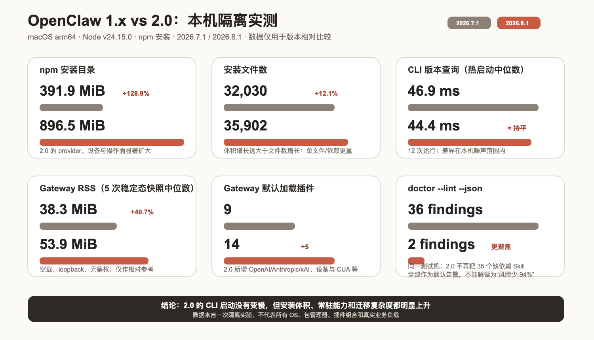
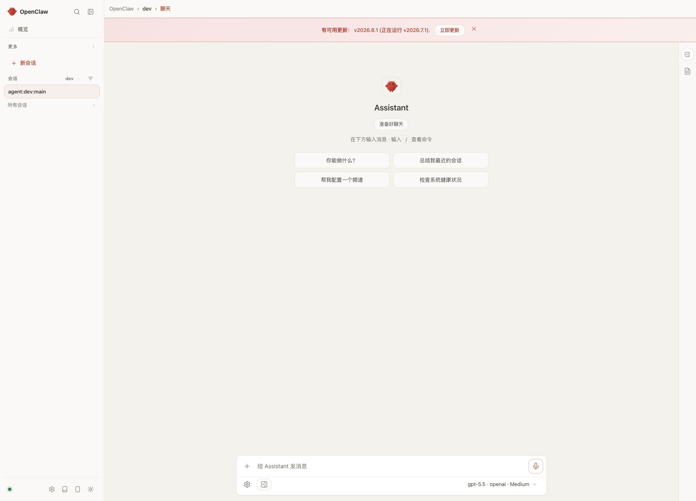
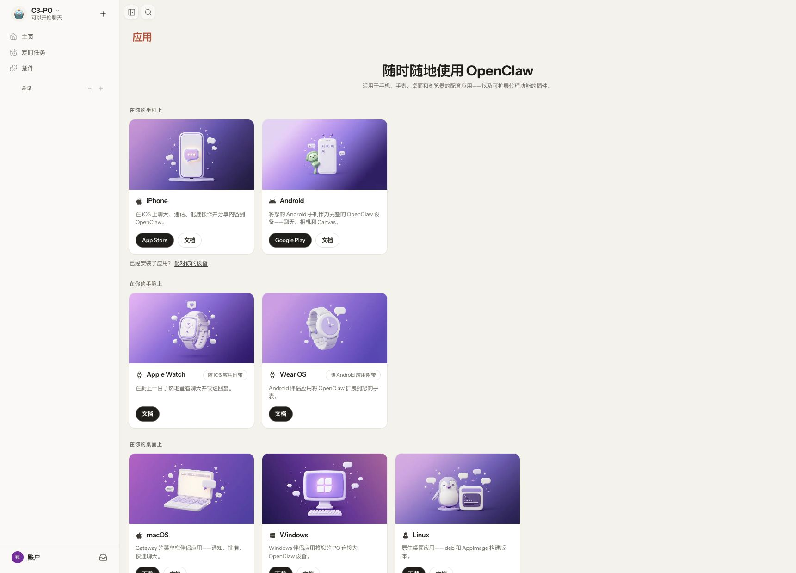
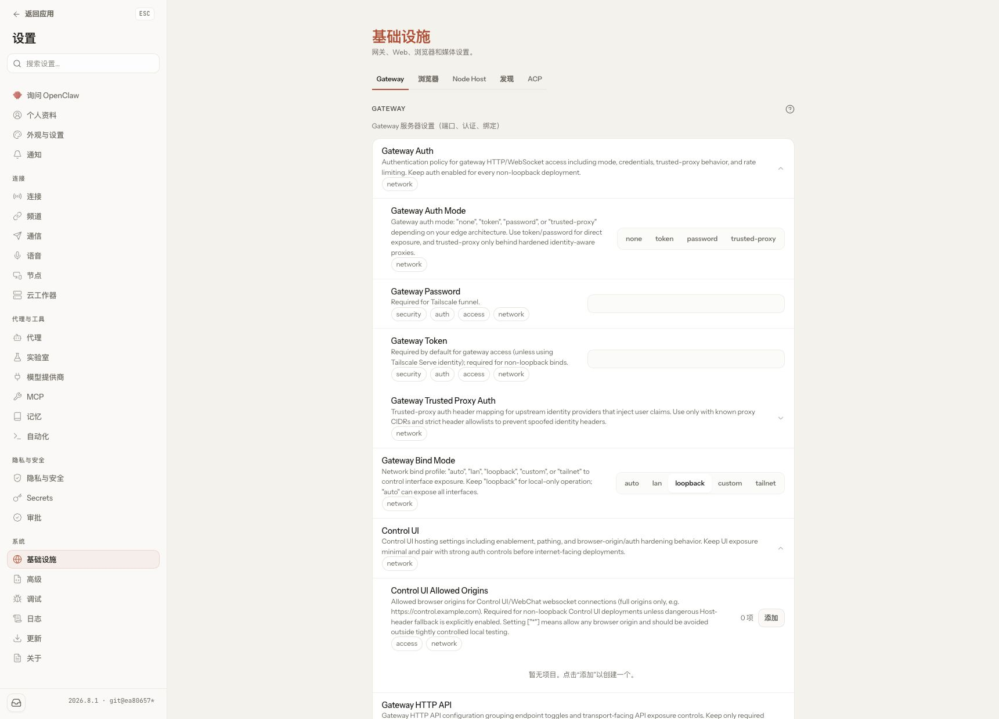
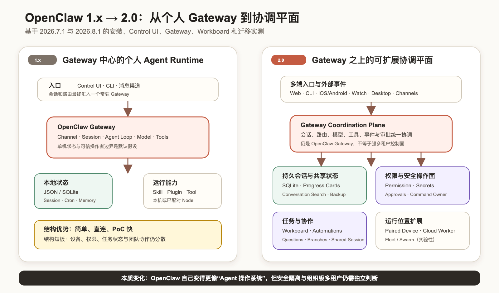
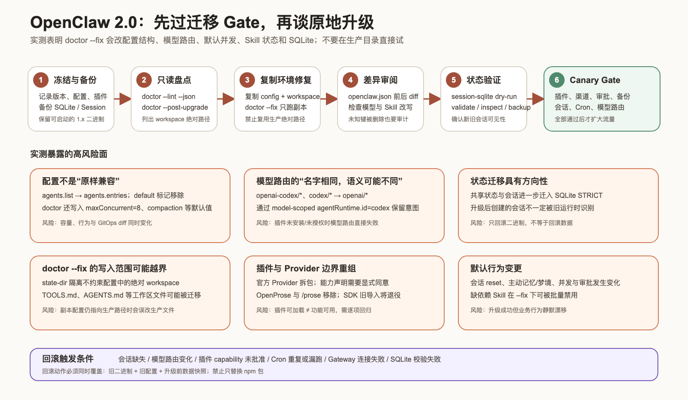

# OpenClaw 2.0 实测：与 1.x 的架构、功能、性能和迁移风险对比

OpenClaw 在 2026 年 8 月 31 日发布了 [2026.8.1](https://github.com/openclaw/openclaw/releases/tag/v2026.8.1)。官方把这一代产品称为 **OpenClaw 2.0**，但 npm 包版本仍采用日期版本号，而不是语义化版本 2.0.0。

这不是一次普通的 Control UI 改版。实测后更准确的判断是：OpenClaw 正在从“一个常驻 Gateway 加若干 Agent 工具”，演进成包含持久会话、工作板、审批、Secret、设备、云工作器和多端应用的 **Agent 协调平面**。

先给结论：

- **新部署优先选择 2026.8.1**：Control UI、持久会话、设备与 Worker、权限、审批、Workboard 和无头运行入口都比 1.x 完整。
- **现有 1.x 不应在生产目录原地执行 doctor --fix**：配置结构、模型路由、Skill 状态、默认并发和 SQLite 都可能被改写。
- **2.0 的 CLI 没有明显变慢，但分发和常驻成本上升**：本次 npm 安装目录从 391.9 MiB 增至 896.5 MiB，空载 Gateway RSS 中位数从 38.3 MiB 增至 53.9 MiB。
- **首日版本仍有集成摩擦**：隔离安装中，默认 openai/gpt-5.6-sol 路由在 Codex 插件未注册或未批准 capability 时会失败；本地 OpenAI 兼容模型链路可以正常跑通。
- **2.0 仍不等于 hostile multi-tenant 平台**：它的团队、角色和共享会话更完整了，但不能因此把一个 Gateway 当作互不信任租户之间的安全边界。

## 1. 实测范围与口径

为了避免旧配置、凭据和插件污染结果，我把两个版本分别安装到临时目录，并使用不同状态目录和端口启动：

| 项目 | 1.x 基线 | 2.0 |
| --- | --- | --- |
| OpenClaw | 2026.7.1 | 2026.8.1 |
| Node.js | v24.15.0 | v24.15.0 |
| 平台 | macOS arm64 | macOS arm64 |
| Gateway | loopback、临时状态目录 | loopback、临时状态目录 |
| Control UI | 强制 Light 模式 | 强制 Light 模式 |
| Agent 成功链路 | 1.x 无 agent exec | 本机 OpenAI 兼容 mock，避免真实模型和凭据影响 |

测试覆盖：

1. npm 安装体积、文件数和 CLI 启动；
2. Gateway 启动、/healthz、/readyz、RSS 和默认插件；
3. 两版 Control UI 的信息架构；
4. 2.0 Workboard 启用、创建卡片和持久化；
5. 2.0 openclaw agent exec 的成功 JSON 契约；
6. doctor --lint --json 与 doctor --json；
7. 从一份有效的 2026.7.1 合成配置迁移到 2026.8.1；
8. 配置、模型路由、SQLite、插件和回滚风险。

本次测试**不评价模型回答质量**。无头 Agent 使用确定性的本机 mock，只验证 OpenClaw 的配置解析、Provider 适配、HTTP 流式传输、Agent Loop 和 JSON 输出。

## 2. 安装与运行数据

| 指标 | 2026.7.1 | 2026.8.1 | 观察 |
| --- | ---: | ---: | --- |
| npm 安装目录 | 391.9 MiB | 896.5 MiB | +128.8% |
| 安装文件数 | 32,030 | 35,902 | +12.1% |
| --version 热启动中位数 | 46.9 ms | 44.4 ms | 基本持平 |
| Gateway RSS 中位数 | 38.3 MiB | 53.9 MiB | +40.7% |
| 默认加载插件 | 9 | 14 | +5 |
| doctor --lint --json findings | 36 | 2 | 2.0 默认输出更聚焦 |

这里有三个容易误读的地方：

- 安装体积是 npm 完整目录，不是容器镜像大小；不同包管理器的去重结果会不同。
- RSS 来自 5 次空载快照，只说明本机相对变化，不代表真实消息、浏览器、语音和多 Agent 负载。
- doctor 从 36 个 findings 降到 2 个，不代表风险减少 94%。1.x 把 35 个缺少二进制或环境变量的内置 Skill 都报成 warning；2.0 的默认检查更聚焦。

doctor 的退出码也有一个 CI 陷阱：

- openclaw doctor --lint --json 在存在 warning 时退出码为 1；
- 2.0 新增的裸 openclaw doctor --json 输出同样的 ok: false，但本次退出码为 0。

自动化不能只判断进程退出码，还要解析 JSON 的 ok 和 findings。

## 3. Control UI：不是换皮，而是信息架构重做

### 3.1 1.x：会话与 Gateway 优先

2026.7.1 的主导航围绕“概览、更多、会话、设置”展开。它能完成聊天、会话和 Gateway 管理，但设备、插件、自动化、安全和工作状态分散在不同入口。截图中的升级横幅也准确识别到了 2026.8.1。

### 3.2 2.0：应用、任务、权限和运行位置成为一等对象

2.0 的默认侧边栏变成“主页、定时任务、插件”，命令面板还能直接进入会话、Skills、应用、设置、智能体和 Custodian。消息输入区新增了会话权限模式；设置页则明确拆出：

- 节点与云工作器；
- Agent、模型 Provider、MCP、记忆和自动化；
- 隐私与安全、Secrets 和审批；
- Gateway、Browser、Node Host、Discovery 和 ACP。

这意味着“Agent 在哪里运行、能访问什么、谁来批准、状态如何持久化”已经进入产品主路径。

### 3.3 多端应用成为架构的一部分

2.0 的应用页把 iPhone、Android、Apple Watch、Wear OS、macOS、Windows、Linux 和浏览器扩展放在同一个发现与配对入口里。它不只是列下载链接：设备可以承载聊天、审批、通知、相机、Canvas 和 Worker 能力，Gateway 开始承担跨设备协调职责。

### 3.4 Gateway 配置更像正式操作面

基础设施页可以直接看到 Gateway 的认证模式、Bind、Trusted Proxy、Control UI Origin、HTTP API、Node Skills 和远程 Gateway。页面会明确提示：

- 非 loopback 部署要保持认证；
- trusted-proxy 只能放在经过加固的身份代理后；
- auto Bind 可能暴露所有接口；
- Allowed Origins = ["*"] 不适合普通生产部署。

配置项更多不等于自动安全，但至少安全边界已经从隐藏 JSON 变成可见操作面。

## 4. Workboard 实操：任务状态进入 Gateway

Workboard 在 2026.8.1 中是一个 bundled、默认关闭的插件。启用并批准其 capability 后，Gateway 从 14 个加载插件增至 15 个，Control UI 自动出现“工作板”入口。

我在临时状态目录中创建了一张“验证 OpenClaw 2.0 升级 Gate”卡片，填写迁移、SQLite 和回滚验收条件。创建后卡片立即出现在“待办”列，搜索、优先级、Agent、会话、标签和状态都可以结构化管理。

Workboard 的价值不只是一个 Kanban UI。它把任务与 Agent、Session、运行尝试、Proof、Attachment、Heartbeat、Block/Unblock 和调度器连接起来，使长任务不必只靠聊天记录表达状态。

但它是默认关闭插件，不能把“代码随包存在”当成“升级后立即可用”。生产上线至少要验证 capability consent、SQLite、调度器、会话关联和备份恢复。

## 5. 无头 Agent：2.0 新增可复现执行入口

1.x 的 openclaw agent 没有 exec 子命令。2.0 新增：

    openclaw agent exec \
      --config ./openclaw.json \
      --state-dir ./state \
      --model local-review/mock-model \
      --timeout 10 \
      --json \
      "Return exactly: OPENCLAW_HEADLESS_OK"

在显式 OPENCLAW_STATE_DIR、OPENCLAW_CONFIG_PATH 和本机 OpenAI 兼容 mock 下，实测得到：

    {
      "ok": true,
      "status": "ok",
      "final": "OPENCLAW_HEADLESS_OK",
      "payloads": [
        {
          "text": "OPENCLAW_HEADLESS_OK",
          "mediaUrl": null
        }
      ],
      "codeModeEngaged": false,
      "assistantTurns": 1,
      "model": "mock-model",
      "provider": "local-review"
    }

这为 CI、定时任务、批处理和外部编排器提供了比“启动 Gateway 后再发 WebSocket 请求”更干净的入口。--cwd、--config、--isolated、--state-dir、--model、多级 --fallback、--code-mode、--thinking 和稳定 JSON envelope 也有利于复现。

首日版本的摩擦同样明显：在全新隔离状态中直接选择 openai/gpt-5.6-sol，运行会在 Codex runtime 插件未注册时失败。迁移演练还显示，Codex 插件声明了工具和迁移能力，需要 capability consent。建议把“默认模型成功响应”列为升级 Gate，不能只看 Gateway Ready。

## 6. 架构变化：从 Gateway Runtime 到协调平面

### 6.1 1.x 的核心模型

1.x 的结构可以概括为：

    Control UI / CLI / Channels
                ↓
         OpenClaw Gateway
                ↓
    Session / Model / Agent Loop / Skill / Plugin / Tool / Node

它的优势是路径短、部署简单、个人和同一信任域的小团队很快就能落地。限制也很明显：状态、设备、审批、任务管理和团队协作更像 Gateway 周边能力。

### 6.2 2.0 新增的四个平面

2.0 没有抛弃 Gateway，而是在 Gateway 周围补了四个平面：

1. **持久状态平面**：会话搜索、跨重载 Progress Cards、SQLite、恢复与备份。
2. **权限与安全操作面**：会话权限、Secret 请求、审批、Command Owner、插件信任与来源提示。
3. **任务与协作平面**：Workboard、conversation-bound automation、结构化问题、分支与共享会话。
4. **运行位置平面**：配对设备、云工作器、外部 supervisor、设备托管，以及实验性的 Fleet/Swarm。

因此，2.0 更接近“Agent 操作系统”。但它仍然不能自动解决：

- 互不信任用户之间的强隔离；
- 组织级 SSO、租户、RBAC/ABAC 和预算；
- 任意规模的 Active-Active Gateway；
- 插件供应链审查和运行时强制策略；
- 所有设备与 Worker 的统一零信任身份。

## 7. 1.x 与 2.0 能力矩阵

| 能力 | 1.x | 2.0 | 评价 |
| --- | --- | --- | --- |
| Control UI | 会话/Gateway 中心 | 应用、任务、设备、安全和基础设施重组 | 显著升级 |
| 会话 | 本地会话与历史 | 搜索、Progress Cards、分支、共享参与、Incognito | 更适合长任务 |
| 任务管理 | Cron、Heartbeat、聊天内状态 | Workboard、conversation-bound automation、/loop | 从“消息”走向“工作” |
| 运行位置 | Gateway 与配对 Node | 设备、云 Worker、外部 supervisor、Fleet/Swarm | 扩展明显，部分实验性 |
| 安全操作 | Gateway Token、工具策略、审批 | Permission Modes、Secrets、Recurring Approval、Command Owner | 更可见，但配置责任仍在用户 |
| 模型与 Provider | 内置路由为主 | Provider 插件拆包、模型 allowlist、runtime policy | 更模块化，迁移更复杂 |
| 自动化接入 | CLI/Gateway 调用 | agent exec 稳定 JSON、A2A 1.0、邮件触发 | 更易接 CI 和外部系统 |
| 恢复 | 配置和部分状态备份 | SQLite 维护、恢复、可恢复备份、状态审计 | 运维面更完整 |
| 团队能力 | 多 Agent、共享渠道 | operator 角色、共享 profile、共享会话 | 仍不是对抗型多租户 |

## 8. 迁移实测：doctor --fix 实际改了什么

我先创建了一份能被 2026.7.1 config validate --json 验证通过的合成配置，再把整个状态和 workspace 放在 /private/tmp，最后用 2026.8.1 执行：

    openclaw doctor --fix --non-interactive --yes

迁移成功，迁移后配置也通过了 2026.8.1 校验。但前后 diff 远不止版本号：

- agents.list 改成 keyed agents.entries；
- agents.entries.*.default 被移除；
- openai-codex/gpt-5.5 改成 openai/gpt-5.5；
- codex/gpt-5.4 改成 openai/gpt-5.4；
- 为两个模型写入 agentRuntime.id = "codex" 以保留原路由意图；
- 写入 maxConcurrent = 8、subagents.maxConcurrent = 8 和 compaction.mode = "safeguard"；
- 35 个当前环境缺依赖的 Skill 被写成 enabled: false；
- lastTouchedAt 迁入共享 SQLite；
- 共享状态表继续迁移到 SQLite STRICT，并清理退休表和索引；
- 自动生成配置备份。

这说明 2.0 迁移不是“旧 JSON 原样读取”，而是一次**配置、运行时策略和状态模型同时演进**的升级。

## 9. 必须列入变更单的迁移风险

### 9.1 配置结构重写

agents.list → agents.entries 本身不难，但 doctor --fix 还会补默认并发、Compaction、Skill 开关和 Wizard 元数据。对 GitOps 环境而言，这会形成大面积 diff；对容量环境而言，默认并发提升也可能改变 CPU、内存和模型请求峰值。

**建议**：在副本上修复后审阅完整 diff，把自动补写的默认值重新纳入容量评估。

### 9.2 Codex/OpenAI 模型路由迁移

旧 codex/* 与 openai-codex/* 会改成 openai/*，再用 model-scoped agentRuntime.id = "codex" 保留原生 Codex 语义。模型名字看起来更统一，但运行依赖从“前缀”转移到了插件与 runtime policy。

**风险**：Codex 插件未安装、未启用或 capability 未批准时，默认模型会在 Gateway Ready 后才暴露失败。

### 9.3 SQLite 迁移和回滚方向性

2.0 继续把共享状态、会话、Cron、审计和设备身份迁入 SQLite。官方文档明确提示：升级后只存在于 SQLite 的新会话，回滚到旧运行时时不会自动出现在旧存储中。

**风险**：只回滚 npm 包或容器镜像，无法回滚状态。

### 9.4 绝对 workspace 路径可能越出 state-dir

这次演练捕获到一个很实际的风险：1.x --dev 配置中的 workspace 是绝对路径。即使 OPENCLAW_STATE_DIR 指向临时目录，doctor --fix 仍会按配置访问并迁移那个 workspace 中的 TOOLS.md/AGENTS.md。

**建议**：

- 复制配置时同时重写所有 workspace、session、plugin 和 credential 绝对路径；
- 用专门测试账号运行迁移；
- 在修复前对目标目录做文件清单和只读挂载演练；
- 不要把“状态目录已隔离”误认为“所有写入都已隔离”。

### 9.5 Provider 拆包、Plugin SDK 与 capability consent

多个官方 Provider 移到独立包；插件会显示来源、能力和 provenance；旧 Plugin SDK 导入路径进入退役窗口。OpenProse 和 /prose 已移除，需要迁移为 Agent Skill。

**风险**：插件能被发现，不代表已完成安装、授权和运行时注册。

### 9.6 默认行为漂移

2.0 调整了会话 reset、主动记忆/grounded dreaming、前台并发、模型 allowlist、审批和共享 profile 等默认行为。

**风险**：升级可能“启动成功、请求成功”，但记忆、成本、并发、会话边界和审批体验已经变化。

### 9.7 doctor --fix 会批量禁用当前不可用 Skill

在合成迁移中，35 个缺少二进制、环境变量或配置的 Skill 被写入 enabled: false。

**风险**：构建机、Canary 和生产机的依赖不同，迁移结果也可能不同；在精简构建机运行 --fix，会把生产原本可用的 Skill 关掉。

## 10. 推荐升级 Runbook

### 10.1 升级前

    openclaw backup create
    openclaw doctor --lint --json
    openclaw doctor --post-upgrade --json
    openclaw config validate --json

同时记录：

- OpenClaw、Node、插件和 Provider 版本；
- openclaw.json、SQLite、Session、Cron、Workspace 和凭据存储位置；
- 所有绝对路径；
- 默认模型、Fallback、Agent Runtime 和认证 Profile；
- 插件 capability、渠道连接和审批策略；
- 升级前健康检查与一组固定回归请求。

### 10.2 在复制环境迁移

1. 复制配置、SQLite、Session、Cron 和 Workspace；
2. 把所有绝对路径改到副本；
3. 先运行 doctor --lint --json；
4. 再在副本运行 doctor --fix --non-interactive；
5. 审阅配置 diff 和自动备份；
6. 运行 config validate、SQLite dry-run/validate、插件 post-upgrade；
7. 启动 Gateway，验证 /healthz、/readyz 和真实模型响应；
8. 验证会话、Cron、渠道、Workboard、审批、备份和恢复。

### 10.3 Canary Gate

至少满足以下条件才扩大流量：

- 默认模型与所有显式覆盖模型都能响应；
- 旧会话、Cron 和自动化没有缺失或重复；
- Plugin/Provider 均已完成 capability consent；
- SQLite 校验和备份恢复通过；
- 关键 Skill 没有被意外禁用；
- Gateway、Node、设备和 Worker 的连接方式符合预期；
- 并发、成本、记忆和会话 reset 行为与变更单一致。

### 10.4 回滚

回滚包必须同时包含：

    旧 OpenClaw 二进制/镜像
    + 升级前 openclaw.json
    + 升级前 SQLite 与 legacy state
    + 升级前 Workspace / Plugin 状态

出现会话缺失、模型路由变化、插件未授权、Cron 重复或漏跑、Gateway 连接失败、SQLite 校验失败时立即停止扩大流量。禁止只替换 npm 包后继续复用已迁移状态。

## 11. 是否值得升级

### 适合直接采用 2.0

- 新建个人或同一信任域的小团队 Agent；
- 需要跨设备、云 Worker、Workboard 或无头 Agent；
- 希望把审批、Secret、权限和 Gateway 设置放到统一 UI；
- 可以接受首日版本的插件授权与配置调整。

### 应先做完整 Canary

- 已经有大量 Session、Cron、Channel、Skill 和自定义插件；
- 使用 codex/* 或 openai-codex/* 模型路由；
- 配置中存在绝对 workspace 或外部状态目录；
- 依赖 GitOps、严格回滚和固定成本/并发；
- Gateway 承载生产通知、运维或业务自动化。

### 建议等待后续补丁版本

- 无法复制生产状态做演练；
- 没有 SQLite 级备份恢复能力；
- 自定义插件还未完成 SDK 迁移；
- 默认模型插件尚未在目标环境完成安装与 capability consent；
- 对会话或 Cron 的一次丢失、重复执行都不可接受。

## 12. 最终评价

OpenClaw 2.0 是一次有实质内容的大版本：它把“聊天 Agent 的 Gateway”推向了“可被人、设备、Worker 和自动化共同操作的协调平面”。Control UI、Workboard、无头执行、权限、Secrets、审批和恢复能力都不只是发布说明里的名词，本次隔离实测能够实际打开、配置和跑通。

代价同样真实：包更大、常驻能力更多、插件边界更复杂，迁移会改写配置和状态。对已有 1.x 用户，最重要的升级动作不是 npm install，而是先建立**可复制、可 diff、可验证、可完整回滚**的迁移链路。

如果只用一句话总结：

> 2.0 值得用于新部署，也值得已有用户升级；但它应该被当成一次状态与运行时架构迁移，而不是一次普通版本更新。

## 参考资料

- OpenClaw 2026.8.1 Release：https://github.com/openclaw/openclaw/releases/tag/v2026.8.1
- OpenClaw Releases：https://docs.openclaw.ai/releases/2026.8.1
- Doctor CLI：https://docs.openclaw.ai/cli/doctor
- Agent Exec：https://docs.openclaw.ai/cli/agent#agent-exec
- Model Providers：https://docs.openclaw.ai/concepts/model-providers
- Plugin SDK Migration：https://docs.openclaw.ai/plugins/sdk-migration
- Gateway Security：https://docs.openclaw.ai/gateway/security/
- Backup CLI：https://docs.openclaw.ai/cli/backup
