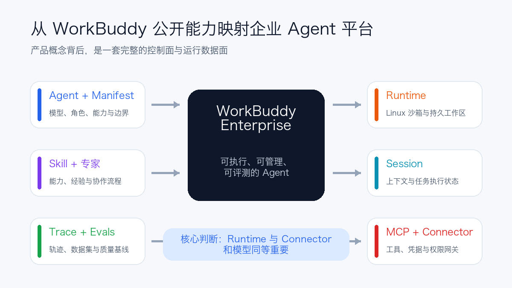
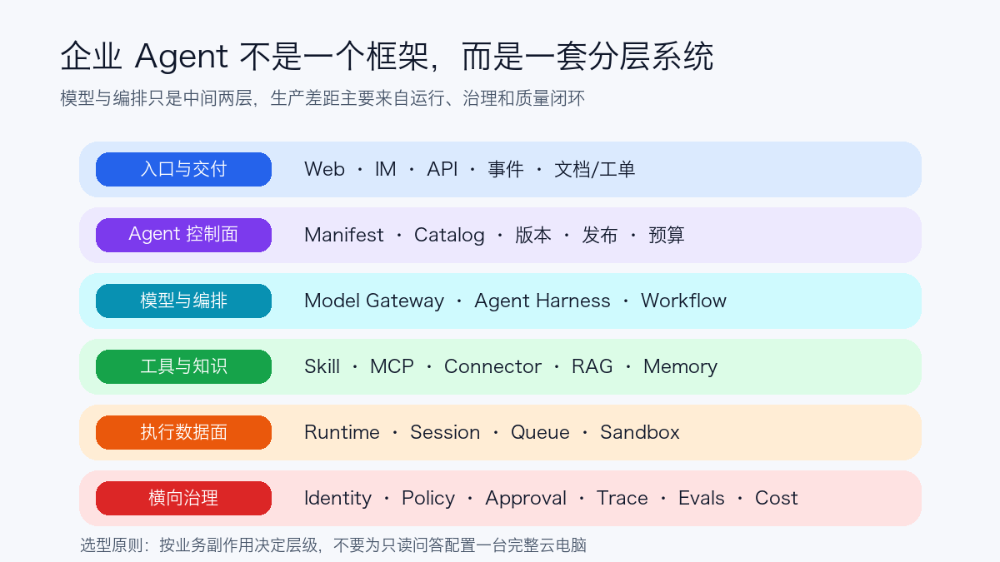
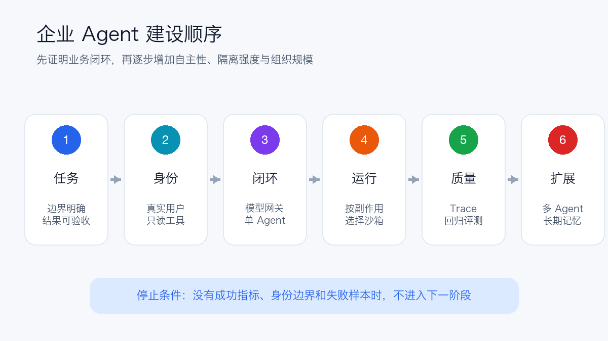

# 从 WorkBuddy 看企业 Agent 技术栈：真正难的不是选模型

> 调研时间：2026-08-13。本文讨论的是腾讯 WorkBuddy 与 WorkBuddy Enterprise。商业产品没有公开完整源码，文中对 WorkBuddy 的描述只采用官方公开资料；后续“企业自建技术栈”是基于公开能力做的架构映射，不代表腾讯内部具体实现。

很多企业第一次做 Agent，讨论通常从三个问题开始：用哪个模型、选 LangGraph 还是其他框架、要不要做多 Agent。

真正进入生产后，问题很快会变成另外一组：Agent 以谁的身份访问业务系统？代码在哪里执行？长任务中断后能不能恢复？模型升级后效果是否回退？一个连接器能否只开放三个只读工具？费用应该算到哪个部门？出了问题怎样还原每一步调用？

WorkBuddy 值得研究，不只是因为它能生成文档、表格和代码，而是它公开的企业产品概念已经覆盖了 **Agent、Runtime、Session、Manifest、Skill、MCP、连接器、凭据、Trace 和评测**。这些概念拼起来，正好是一套企业 Agent 平台应该具备的骨架。



## 1. WorkBuddy 到底是什么

WorkBuddy 的个人端更像一台面向知识工作的 Agent 桌面：用户用自然语言交代目标，Agent 自主拆解步骤，读取授权的本地文件，调用工具并交付文档、表格、演示文稿、图表或代码等可验收产物。它同时提供工作模式和开发模式，也可以通过消息渠道远程触发任务。

企业版进一步把个人能力拆成可管理对象：

| 公开概念 | 解决的问题 | 企业平台中的位置 |
| --- | --- | --- |
| Agent | 使用哪个模型、扮演什么角色、拥有哪些能力 | 可版本化的 Agent 定义 |
| Manifest | 声明身份、能力、工作空间与运行配置 | Agent 的声明式交付物 |
| Runtime | Agent 真正运行的 Linux 文件系统、终端和沙箱 | 隔离的执行环境 |
| Session | 独立维护一次用户任务的历史与上下文 | 会话状态与执行状态 |
| Skill | 把方法、脚本和领域经验封装成能力 | 可复用、可评测的能力包 |
| 专家/专家团 | 把能力与经验组合，并让多个角色协同 | 角色模板与多 Agent 工作流 |
| MCP/连接器 | 安全访问 GitHub、文档、邮箱等外部系统 | Tool Gateway 与授权代理 |
| Trace/评测 | 还原执行链路，按数据集衡量效果 | 可观测性与质量工程 |

WorkBuddy 官方对 Skill、专家和专家团的划分也很有启发：Skill 是“能力”，专家是“能力加经验”，专家团则是“多个专家加协作流程”。这比把所有东西都叫 Agent 更容易治理，因为平台可以分别管理工具能力、角色方法和协作拓扑。

WorkBuddy Managed Agents 的公开文档还把运行面定义得比较具体：一个 Runtime 包含云端沙箱、Manifest 和一个或多个 Session，并提供数据持久化、跨节点恢复、快速复制、端口转发、预热池、自动休眠和恢复能力。这里最值得注意的不是某个产品名，而是一个事实：**只要 Agent 能操作文件、终端和外部系统，Runtime 就会成为与模型同等重要的基础设施。**

官方资料：[WorkBuddy 产品简介](https://cloud.tencent.com/product/workbuddy)、[WorkBuddy Enterprise 快速开始](https://cloud.tencent.com/document/product/1831/134527)、[WorkBuddy Managed Agents](https://cloud.tencent.com/document/product/1831/134407)。

## 2. 从公开能力能看出什么，不能看出什么

能够确认的，是 WorkBuddy 对外提供了以下产品能力：

- 多模型选择和 Agent System Prompt；
- Skill、专家、MCP 与连接器装配；
- 本地文件和云端沙箱中的任务执行；
- Runtime 与 Session 生命周期；
- 企业渠道接入、凭据管理和连接器网关；
- 全链路 Trace、测试运行和数据集评测；
- 默认权限与完全访问两种交互模式，高风险动作可要求确认；
- 企业专享 VPC、租户隔离和企业插件等交付选项。

不能据此断言的，是它内部一定使用了哪个开源编排框架、数据库、向量库、容器运行时或工作流引擎。商业产品的概念与某个开源项目相似，并不能证明底层就是那个项目。

因此，下面不会尝试“还原 WorkBuddy 源码”，而是用它暴露出的产品对象回答一个更实用的问题：如果企业自己建设类似能力，技术栈应怎样分层？

## 3. 企业 Agent 的十层技术栈



### 3.1 入口与交付层

Agent 不应只存在于一个聊天网页。企业通常需要同时接入 Web、桌面端、企业微信、飞书、钉钉、Slack、API、事件触发器和定时任务。

这一层还要管理最终产物：文档、表格、代码仓库、工单、审批记录和对象存储文件。企业用户最终验收的是结果，不是模型说了多少句话。

可选技术包括自研 Web/IM Bot、Dify/Coze Studio 一类应用工作台，以及企业现有的门户和 API Gateway。

### 3.2 Agent 定义与控制面

生产 Agent 需要一个类似 Manifest 的声明式定义，至少包括：

```yaml
name: contract-reviewer
version: 1.4.2
model_policy: legal-balanced
system_prompt_ref: prompts/contract-reviewer@sha256:...
skills:
  - contract-clause-check@2.1.0
tools:
  - contract.read
  - policy.search
workspace: persistent
approval_policy: external_write_requires_human
budgets:
  max_tokens: 200000
  max_runtime: 30m
```

这里管理的是 Agent Catalog、版本、所有者、适用人群、模型策略、Skill、工具、预算、发布、灰度和回滚。Prompt 只是其中一个字段，不应成为散落在代码和数据库里的不可追踪字符串。

### 3.3 模型服务与网关

企业通常不会让每个 Agent 直接保存一个模型厂商 API Key。更合理的路径是统一经过 Model Gateway：

```text
Agent → Model Gateway → 云端模型 / 私有模型 / 多模态模型
```

网关负责统一鉴权、模型别名、路由、限流、重试、降级、Token 统计、语义缓存和费用归属。私有模型可以由 vLLM、SGLang 或 TensorRT-LLM 承载；多提供商入口可以评估 LiteLLM、Higress AI Gateway、Envoy AI Gateway 或云厂商网关。

模型选择应该围绕任务路由，而不是全公司只选一个模型：快速分类、长文档理解、复杂推理、视觉、代码和低成本批处理往往适合不同模型。模型也必须可回退，否则上游限流会直接变成 Agent 全站不可用。

### 3.4 Agent Harness 与编排

Harness 才是“让模型持续做事”的循环，负责：

- 组织上下文和系统约束；
- 让模型选择工具并读取结果；
- 维护计划、步骤、停止条件和错误恢复；
- 暂停等待人工审批；
- 把子任务交给其他 Agent 或确定性服务。

常见选择包括 LangGraph、OpenAI Agents SDK、Google ADK、Microsoft Agent Framework、CrewAI，以及企业自研的状态机。框架选型主要看四件事：状态是否显式、能否暂停恢复、工具与模型是否可替换、执行轨迹是否容易观测。

生产上更稳的组合通常是：

```text
模型负责理解、选择和异常处理
+ 状态图负责允许的路径
+ 普通代码负责交易和不可逆动作
```

多 Agent 不是默认层。只有任务可以明确分工、并行后能独立验收，或确实需要隔离上下文时，才值得承担额外 Token、延迟和错误传播成本。

### 3.5 Tool、Skill 与连接器网关

Skill 解决“怎样做”，Tool 解决“能做什么”，连接器解决“以什么身份连接哪个系统”。三者不应混在一个 Prompt 中。

MCP 可以标准化工具发现和调用，但 **MCP 本身不等于企业授权系统**。生产连接器还需要：

- OAuth 2.1、用户委托身份或工作负载身份；
- 工具级和参数级 allowlist；
- 短期凭据与 Secret 轮换；
- 超时、重试、熔断、速率和费用限制；
- 读写分级与高风险操作审批；
- 调用人、Agent、工具、参数摘要和结果状态审计。

WorkBuddy 的连接器公开设计已经包含认证凭据、MCP Server、工具过滤、超时和请求头，并通过统一网关代理访问。这正是企业 Tool Gateway 应承担的职责。[WorkBuddy 连接器文档](https://cloud.tencent.com/document/product/1831/134453)也明确强调独立授权、最小权限和工具过滤。

对于远程 MCP，授权应遵循 MCP 的 OAuth 规范和受众绑定，不能把收到的 Token 原样透传给下游服务。参考：[MCP Authorization](https://modelcontextprotocol.io/specification/2025-06-18/basic/authorization)。

### 3.6 知识、上下文与记忆

企业经常把“买一个向量数据库”当成完成 RAG 和记忆。实际需要拆成四类状态：

| 状态 | 典型内容 | 推荐载体 |
| --- | --- | --- |
| 会话上下文 | 当前对话和近期工具结果 | PostgreSQL/Redis/Checkpoint Store |
| 任务工作区 | 上传文件、中间文件和最终产物 | 对象存储、PVC、云盘或沙箱文件系统 |
| 企业知识 | 制度、合同、代码和业务记录 | 搜索引擎、向量库、数据仓库、知识服务 |
| 长期记忆 | 用户偏好、已确认事实和历史经验 | 结构化 Memory Store，加写入策略和过期机制 |

向量库可选 pgvector、Milvus、OpenSearch/Elasticsearch 等，但检索质量还依赖权限过滤、文档解析、分块、混合检索、重排、引用和更新时效。长期记忆必须允许查看、纠正、删除和过期，不能把每次模型输出都自动写成“事实”。

### 3.7 Runtime 与执行沙箱

只做只读知识问答时，共享应用进程通常已经足够。一旦 Agent 要运行代码、安装依赖、操作浏览器或处理不可信文件，就需要独立 Runtime。

一套可用 Runtime 至少包含：

- 隔离的文件系统、进程、网络和身份；
- CPU、内存、磁盘、GPU、时长和进程数配额；
- 临时工作区与需要时才挂载的持久工作区；
- 默认拒绝网络，按域名或服务开放出口；
- 镜像/模板版本、预热池和快速创建；
- 暂停、恢复、销毁和产物导出；
- 恶意文件、依赖和输出扫描。

常见实现是 Kubernetes Pod 加 NetworkPolicy、Seccomp 和只读根文件系统；隔离要求更高时使用 gVisor、Kata Containers、Firecracker 或独立 VM。必须注意：**Pod 是调度和资源边界，不自动等于 hostile multi-tenant 安全边界。**

### 3.8 Session、持久执行与队列

Agent 的 Session 不能只是一段聊天历史。长任务应把“对话状态”和“执行状态”分开保存：当前步骤、工具调用幂等键、等待中的审批、重试次数、预算消耗和已经产出的制品都要能恢复。

LangGraph Checkpoint 适合保存状态图执行点；Temporal 一类耐久执行引擎适合跨小时、跨天、包含定时器和外部回调的流程；Kafka、Redis Streams、RabbitMQ 或云队列负责削峰和解耦。选择重点不是流行度，而是任务是否需要跨进程恢复、Exactly-once 业务语义和人工等待。

### 3.9 可观测性与评测

传统 APM 只能回答请求是否报错，Agent 还需要回答：

- 模型为什么选择这个工具；
- 哪一步开始偏离目标；
- 工具失败后是否错误重试；
- 哪个模型、Prompt、Skill 和知识版本产生了结果；
- 总延迟、首 Token、Token、工具时间和成本分别是多少；
- 业务任务究竟是否完成，而不只是 HTTP 200。

建议用 OpenTelemetry 贯通入口、模型、检索、工具、工作流和沙箱，使用 Langfuse、LangSmith、Phoenix 或自建平台展示 Agent Trace。OpenTelemetry 已提供 GenAI 相关语义属性，但这些约定仍在演进，企业应保留自己的版本字段和数据脱敏策略。

评测至少分三层：

1. **组件评测**：检索召回、工具参数、模型格式和安全分类；
2. **轨迹评测**：步骤是否合理、有没有多余调用、是否遵守权限；
3. **业务评测**：工单是否正确关闭、合同风险是否召回、报告是否被用户采用。

发布前离线回归，发布后在线抽样与人工反馈，生产失败轨迹再沉淀回数据集，才构成持续优化闭环。

### 3.10 身份、安全与成本治理

企业 Agent 最关键的问题不是“它叫什么”，而是：

```text
谁发起任务
→ 哪个 Agent 代表谁
→ 使用哪个 Runtime 身份
→ 允许调用哪些工具和数据
→ 哪些动作需要谁审批
→ 最终由谁承担费用和责任
```

需要把员工身份、Agent 身份、Runtime 工作负载身份和第三方委托凭据分开。常用基础设施包括企业 IdP/OIDC、Kubernetes ServiceAccount、SPIFFE/SPIRE、Vault/KMS、OPA/Cedar 和 API Gateway。共享管理员账号虽然最容易跑通 Demo，却几乎一定会成为生产治理债务。

成本也要按用户、部门、Agent、模型、任务和工具归集，并设置单任务 Token、执行时间、并发、日/月预算及异常熔断。没有预算边界的自主循环，本质上是一个可以自动扩大成本的程序。

## 4. 一套可落地的开源参考栈

下面不是唯一答案，而是一组层次相对清晰、方便替换的组合：

| 层 | 起步选择 | 规模化时补充 |
| --- | --- | --- |
| 应用入口 | 自研 Web/IM Bot、Dify 或 Coze Studio | API Gateway、应用目录、渠道中心 |
| Agent 编排 | LangGraph、OpenAI Agents SDK 或 Google ADK | 独立 Control Plane、版本与发布系统 |
| 持久工作流 | LangGraph Checkpoint + PostgreSQL | Temporal、事件总线、任务队列 |
| 模型入口 | 云模型 API 或单个推理端点 | LiteLLM/Higress/Envoy AI Gateway，多模型路由 |
| 私有推理 | vLLM 或 SGLang | AIBrix/KServe、弹性、P/D 与 KV Cache |
| 工具连接 | Function Calling、小量 MCP | MCP/Tool Gateway、OAuth、参数级策略 |
| 知识与记忆 | PostgreSQL + pgvector + 对象存储 | OpenSearch/Milvus、权限感知检索、Memory Service |
| 执行环境 | 受限 Kubernetes Pod | gVisor/Kata/VM、预热池、快照和恢复 |
| 观测评测 | OpenTelemetry + Langfuse/Phoenix | 在线评测、红队、质量门禁与成本归因 |
| 身份凭据 | OIDC + Secret Manager | SPIFFE、Vault/KMS、OPA/Cedar、短期凭据 |
| 平台交付 | Docker + Kubernetes + GitOps | 多租户 Control Plane、配额、审计与灾备 |

框架不必一次选满。只读知识助手可能根本不需要独立 Runtime；需要跑代码的开发 Agent 则应优先建设沙箱，而不是先做复杂 RAG；跨系统审批流程可能更需要 Temporal 和身份代理，而不是多 Agent。

## 5. WorkBuddy 与自建平台怎样选

| 场景 | 更适合先用 WorkBuddy/企业产品 | 更适合自建或组合开源栈 |
| --- | --- | --- |
| 办公文档、表格、PPT、研究和文件处理 | 是，产品交付完整，试点快 | 只有存在特殊合规或深度流程时 |
| 已大量使用腾讯文档、企微、QQ 邮箱等生态 | 连接路径更短 | 需自行补连接器和身份集成 |
| 希望业务人员配置 Skill、专家和流程 | 企业工作台更易采用 | 自建需要额外做低代码产品层 |
| 核心交易、生产运维和强确定性流程 | 可作为入口，但关键动作仍需业务服务承载 | 更容易深度接入现有审批、事务与审计系统 |
| 特殊模型、私有推理和底层 Runtime 定制 | 取决于企业版本开放边界 | 自建控制力更高，但运维成本更大 |
| 对外多租户 Agent SaaS | 需单独核对租户、数据和运行边界 | 通常需要自己的控制面和隔离数据面 |

采购与自建也不是二选一。常见路线是先用成熟产品验证办公场景和组织采用，再把高价值、强集成、强治理的流程沉淀到企业自己的 Agent Control Plane；底层模型、MCP Server 和业务 API 可以同时被两边复用。

## 6. 企业落地时，建议按这个顺序建设



### 第一步：选一个边界明确、可验收的任务

优先选择只读或低风险任务，例如内部制度问答、周报整理、故障信息汇总或合同条款提取。先定义成功率、人工耗时、最大延迟和错误后果，再讨论模型。

### 第二步：先接身份和只读工具

让 Agent 以真实用户或独立工作负载身份访问数据，避免共享高权限账号。第一批工具尽量只读，并记录完整审计。

### 第三步：建立模型网关和最小 Agent Harness

统一模型凭据、路由、限额和成本；用一个 Agent 加少量工具跑通闭环。除非任务天然需要角色分工，否则暂时不要上多 Agent。

### 第四步：按副作用选择 Runtime

只问答就运行在共享服务；处理文件可使用短生命周期工作区；运行代码和浏览器则进入隔离沙箱。不要让所有 Agent 都获得 Shell，也不要为了一个 FAQ Agent 创建完整虚机。

### 第五步：先建 Trace 和回归集，再扩大用户

上线前准备真实脱敏样本、越权样本和工具故障样本。每次修改模型、Prompt、Skill、知识或连接器都自动回归；生产 Trace 中只保存经过脱敏且确实需要的数据。

### 第六步：最后再做多 Agent、长期记忆和完全自动化

这些能力会明显增加系统复杂度。只有单 Agent 已经达到稳定基线，并能说明拆分后改善哪个指标，才进入下一阶段。

## 7. 最容易踩的八个坑

1. **把 Agent 当成 Prompt 工程。** Prompt 无法替代执行状态、权限、沙箱和评测。
2. **每个应用直接调用模型厂商。** 凭据、路由、限流、成本和故障切换会迅速失控。
3. **把 MCP 当成授权层。** MCP 标准化连接，不自动理解企业数据权限和审批责任。
4. **用共享管理员账号执行工具。** 用户身份和数据边界会消失，审计也无法归因。
5. **把 Kubernetes Pod 当成完整沙箱。** 高风险代码需要更强隔离、出口策略和资源限制。
6. **把聊天记录当成 Trace。** 它无法还原检索、模型、工具、重试、审批和版本链路。
7. **一开始就做多 Agent。** 角色越多不代表质量越好，通常先增加延迟、成本和调试难度。
8. **只看 Demo 成功，不维护失败集。** 企业真正的壁垒不是一次演示，而是持续积累的评测集、失败轨迹、权限模型和业务闭环。

## 8. 最后的判断

从 WorkBuddy 公开的产品形态可以看到，成熟 Agent 平台已经不再围绕“一个模型加几个插件”组织，而是围绕下面四个对象组织：

```text
Agent：声明目标、模型、能力与边界
Runtime：提供可隔离、可恢复的执行环境
Session：保存一次任务的上下文与执行状态
Connector：以受控身份连接真实业务系统
```

在这四个对象之外，再加上模型网关、知识与记忆、Trace、评测、审批和成本治理，才是一套完整的企业 Agent 技术栈。

所以企业选型时，第一个问题不应该是“LangGraph 还是某个多 Agent 框架”，而应该是：我们准备让 Agent 对哪个业务结果负责，它需要代表谁采取什么动作，失败后怎样停止、恢复、审计和回滚。

这些问题回答清楚以后，框架通常只是可替换的一层；回答不清楚，再强的模型也只会把 Demo 做得更像生产，而不会真的变成生产。

