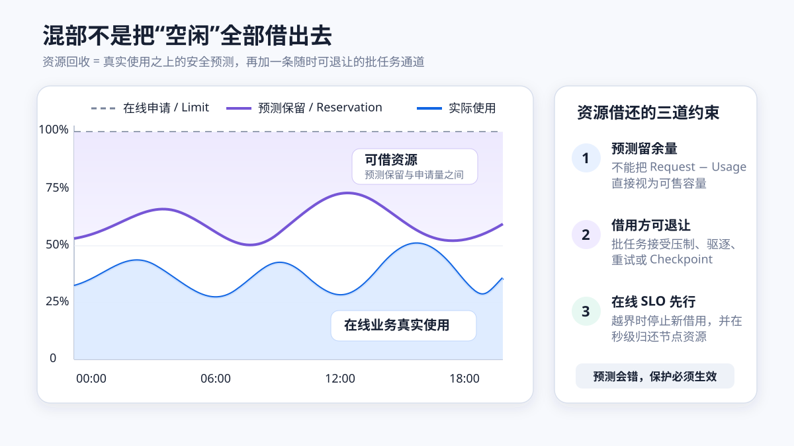
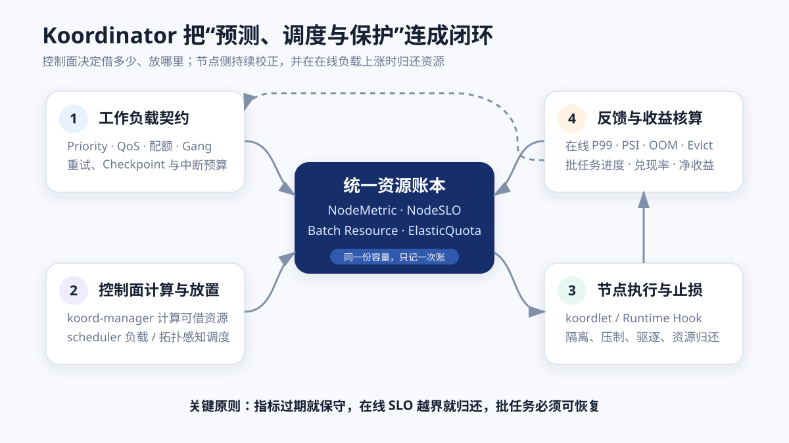
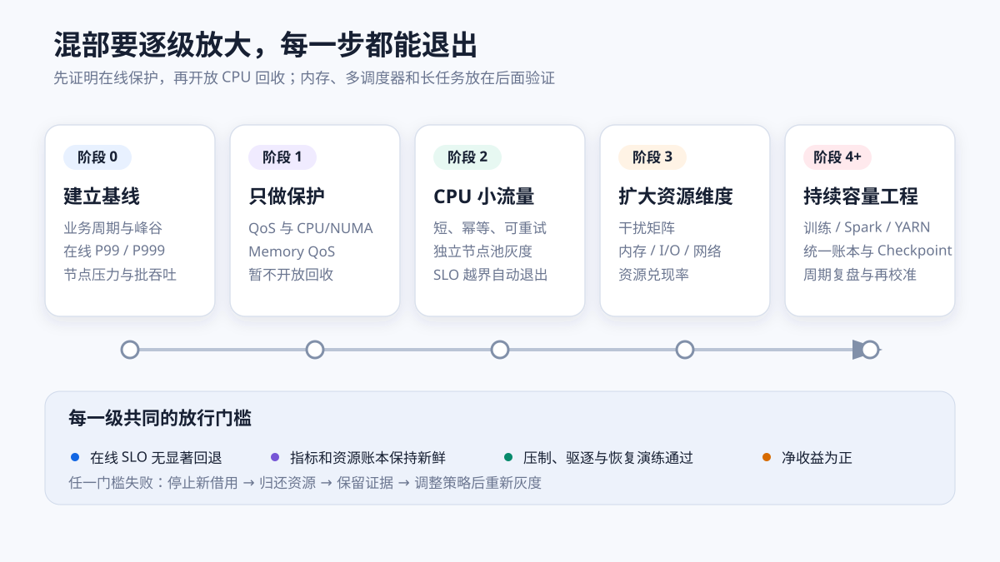

# Koordinator 与在线离线混部：从资源回收到生产落地

在线业务按峰值申请资源，离线任务可以容忍排队、降速和重试。把两类负载放进同一批机器，可以把在线业务没有实际使用的资源转换成批处理吞吐，但也会把 CPU、内存、缓存、磁盘和网络争用带进同一个故障域。

因此，混部不是“多塞一些 Pod”，也不是简单提高 Kubernetes 的资源超卖比例。一个可用的混部系统至少要同时回答三个问题：

1. **还有多少资源可以借？** 资源账本必须区分申请量、实际使用量、安全余量和已经借出的容量。
2. **把任务放到哪里？** 调度器既要理解资源请求，也要看到节点当前负载、NUMA（Non-Uniform Memory Access，非统一内存访问）拓扑和配额。
3. **预测错了怎么办？** 节点侧必须能在秒级压制或驱逐低优先级任务，把资源还给在线业务。

Koordinator 的价值，正是把这三个问题连成一个控制闭环。它在 Kubernetes 之上增加资源画像、负载感知调度、差异化 QoS（Quality of Service，服务质量）、精细化 CPU 编排、弹性配额和安全重调度等能力。本文以社区稳定文档 v1.8 为基线；开发中的 `next` 文档只用于观察方向，不作为生产配置依据。



## 1. 为什么集群“分配满了”，机器却没有跑满

Kubernetes 调度器主要根据 Pod 的 `requests` 做准入和放置。在线服务为了扛住流量峰值、发布抖动和单机故障，通常会把 request 配到高于大多数时段的实际使用量。这个做法保障了容量，但也形成三条不同的资源曲线：

- **Limit / Request**：业务声明的上限或调度预留；
- **Usage**：当前真实消耗，随流量变化；
- **Reservation**：基于历史使用、近期趋势和安全系数得到的预测保留量。

`Request - Usage` 不能全部借出去。启动中的 Pod、突发流量、指标延迟、系统进程和预测误差都需要安全余量。更合理的可回收资源近似为：

```text
可回收资源 = 节点可分配资源
           - 在线业务预测保留
           - 系统与故障余量
           - 已借给低优先级负载的资源
```

这个值随时间变化。CPU 可以被节流，错误预测的恢复通常较快；内存不可压缩，预测过于激进可能触发整机 OOM（Out of Memory，内存不足）。磁盘 I/O、网络带宽、末级缓存和内存带宽也会形成“CPU 看起来没满，在线延迟却恶化”的隐性瓶颈。

Google 的 Borg 论文给出了一个很有代表性的生产信号：在其中位数 Cell 中，约 20% 的工作负载运行在回收资源上；当预测失准时，系统压制或终止非生产任务，而不是牺牲生产任务。这说明回收容量的前提不是预测永远正确，而是**错误必须可快速回滚，借用方必须能够让步**。

## 2. 混部的对象不是“在线与离线”两个标签

生产环境至少要把工作负载拆成四个维度：

| 维度 | 要回答的问题 | 常见例子 |
| --- | --- | --- |
| 业务优先级 | 资源不足时，谁先获得资源？ | 核心交易、普通在线、训练、批处理、测试 |
| 运行时 QoS | 同机竞争时，CPU、内存和 I/O 如何分配？ | 独占核、共享核、可压制、可驱逐 |
| 可恢复性 | 被中断后能否继续？恢复成本多大？ | 无状态重试、分片重跑、Checkpoint、不可中断 |
| 干扰特征 | 它主要竞争什么资源？ | CPU、内存带宽、LLC、磁盘、网络、GPU |

Kubernetes 原生 QoS 根据 CPU、内存的 request/limit 将 Pod 分为 `Guaranteed`、`Burstable` 和 `BestEffort`，主要影响节点压力下的驱逐顺序。它不能完整表达“在线业务可以共享 CPU，但需要保护长尾延迟”或“批任务可以占用空闲核，却必须随时退让”这类混部语义。

Koordinator 因而把 **Priority（优先级）** 与 **QoS（运行质量）** 分成两个维度：优先级决定排队、抢占和资源保障顺序；QoS 决定 Pod 落到节点后如何使用 CPU、内存、缓存和带宽。

### Koordinator QoS

| QoS 类别 | 典型对象 | 核心语义 |
| --- | --- | --- |
| `SYSTEM` | 节点系统服务、关键 DaemonSet | 保证延迟，同时限制系统进程无界占用 |
| `LSE` | 极敏感中间件 | 独占资源，强调隔离 |
| `LSR` | 需要确定性的核心在线服务 | 预留并绑定 CPU，允许更明确的保障 |
| `LS` | 一般微服务 | 共享资源，并保留突发弹性 |
| `BE` | 可重试批任务 | 使用空闲资源，允许压制和驱逐 |

### Koordinator Priority

| PriorityClass | 定位 | 是否适合借用资源 |
| --- | --- | --- |
| `koord-prod` | 生产在线，配额内需要保障 | 否 |
| `koord-mid` | 有预算的中优先级计算 | 可使用相对稳定的长期余量 |
| `koord-batch` | 常规批处理 | 可借用并在需要时归还 |
| `koord-free` | 测试或机会型任务 | 不保证配额，随空闲资源变化 |

一个低优先级任务如果没有重试、Checkpoint 或幂等性，仅给它打上 `BE` 标签并不会自动变得适合混部。分类必须来自业务契约，而不是平台团队单方面猜测。

## 3. Koordinator 如何形成控制闭环



Koordinator 的核心组件各自处理不同时间尺度的问题：

| 组件 | 运行位置 | 主要职责 |
| --- | --- | --- |
| `koord-manager` | 集群控制面 | 计算可回收资源、生成 `NodeSLO`、管理弹性配额、Reservation 和准入策略 |
| `koord-scheduler` | 集群控制面 | 负载感知放置、NUMA/CPU 拓扑、Gang、弹性配额、Reservation 与抢占 |
| `koordlet` | 每个节点 | 采集 `NodeMetric`，配置 cgroup，执行 CPU 压制、内存驱逐和 QoS 策略 |
| `koord-descheduler` | 集群控制面 | 在负载或资源分布失衡后安全迁移 Pod |
| Runtime Hook / NRI | 节点运行时路径 | 在容器创建和更新时及时写入 cgroup、CPUSet、resctrl 等参数 |

闭环的顺序可以概括为：

1. `koordlet` 采集节点和 Pod 的真实用量，形成 `NodeMetric`；
2. `koord-manager` 根据使用量、安全阈值和配置计算 `batch-cpu`、`batch-memory` 等可借资源，并下发 `NodeSLO`；
3. `koord-scheduler` 使用资源账本、实时负载和拓扑信息选择节点；
4. `koordlet` 与 Runtime Hook 在节点上实施 CPU、内存、缓存、I/O 等隔离；
5. 当在线负载上涨或节点压力越界时，先压制、再驱逐低优先级负载；
6. 新的用量和干扰指标再次进入下一轮决策。

这也解释了为什么只安装 `koord-scheduler` 不能称为完整混部：调度器只决定初始位置，运行数小时后的负载变化必须由节点侧反馈控制。

节点侧如何把策略落实到 cgroup、`resctrl` 和容器运行时，可继续阅读[《Koordlet 与 Runtime Hook：节点资源隔离原理》](koordinator-node-qos-runtime-hooks.md)。

## 4. 四个关键机制

### 4.1 动态资源账本

Koordinator 把在线 Pod 已申请但预测不会使用的部分转换成批资源。批任务使用独立的扩展资源，而不是继续消耗普通 `cpu` 和 `memory` 账本。这样可以避免两个调度路径对同一份容量重复记账。

资源画像要保守处理：

- 近期使用峰值和较长窗口分位数；
- 指标采样延迟和 Pod 启动期估算；
- kubelet、内核、运行时和 DaemonSet 的系统开销；
- 单机故障、在线扩容和滚动发布的容量余量；
- CPU 与内存不同的可压缩性。

官方资源模型区分短期与长期 Reservation：生命周期短、易重试的任务可以使用更激进的短期余量；训练、流计算等恢复成本高的任务应使用更稳定的长期余量或明确配额。

### 4.2 负载感知和拓扑感知调度

原生调度器看到的是 request 已分配量，Koordinator 的 LoadAwareScheduling 还可以读取 `NodeMetric`，按节点当前或历史分位数负载过滤和打分。新 Pod 尚未产生指标时，调度器会用 request、limit 和估算系数避免把启动中的低负载误判为空闲。

对于 CPU 敏感、GPU、RDMA（Remote Direct Memory Access，远程直接内存访问）或高吞吐任务，还要同时处理：

- CPU 物理核与超线程兄弟关系；
- NUMA 内的 CPU、内存和设备对齐；
- PCIe、GPU、网卡和网络拓扑；
- 资源碎片与后续大规格任务的可调度性。

负载均衡和 Binpack（装箱）并不矛盾：集群层面可以尽量压紧低负载节点以释放整机，但必须给热点过滤、安全阈值和拓扑约束更高优先级。

### 4.3 节点侧隔离和“最后一道闸门”

调度成功只代表当时可以放下。生产混部更依赖节点侧持续保护：

- **CPU**：CPUSet、CPU Burst、共享池、动态压制、Core Scheduling 或 Group Identity；
- **内存**：Memory QoS、异步回收、按优先级回收和阈值驱逐；
- **缓存/带宽**：Linux `resctrl`、LLC（Last Level Cache，末级缓存）和 MBA（Memory Bandwidth Allocation，内存带宽分配）；
- **磁盘与网络**：按 QoS 分级限速或保障，避免批任务耗尽队列与带宽；
- **异常恢复**：低优先级任务降速仍无法释放压力时，执行受控驱逐。

内存保护尤其不能照搬 CPU 策略。CPU 高估时可以节流，内存高估可能先触发同步回收、抖动，最终让内核 OOM Killer 选择进程。官方文档因此建议生产混部把 MemoryEvict 作为防止节点 OOM 的最后防线，并在使用批资源账本时考虑 `MemoryAllocatableEvict`。

### 4.4 配额、作业和重调度

混部容量不是“谁先提交谁用完”。多团队环境还需要：

- `ElasticQuota` 表达组织层级、最小保障、最大额度和借还关系；
- Gang Scheduling 保证分布式任务成组准入；
- `Reservation` 为扩容、迁移、定时作业或设备任务预留资源；
- Descheduler 在热点、拓扑变化和长期碎片出现后迁移负载；
- PodMigrationJob、PDB（Pod Disruption Budget，Pod 中断预算）和迁移限速共同限制扰动。

没有配额治理时，低优先级任务仍可能在资源充足时形成“批任务内部的饥饿”；没有作业语义时，分布式任务可能只启动一部分 Worker，占着资源却无法工作。

## 5. 大规模企业实践告诉了我们什么

公开案例的环境、硬件、业务和指标口径不同，不能把某家的利用率直接当成自己的承诺值。更有价值的是抽取共同的工程约束。

| 公开实践 | 已公开的事实 | 对混部设计的启示 |
| --- | --- | --- |
| Google Borg | 论文称中位数 Cell 约 20% 的工作负载运行在回收资源上；预测错误时优先压制或终止非生产任务 | 回收系统必须把“可让步”设计成运行时契约；保护机制比预测精度更重要 |
| Alibaba Sigma + Fuxi | 公开的 2017 Trace 覆盖约 1,300 台机器，2018 Trace 约 4,000 台；在线与批任务由不同调度器协同 | 两个调度器必须共享容量与已分配账本，否则会双重分配；微架构干扰也需要观测 |
| ByteDance Gödel Scheduler | 官方 CNCF 文章披露单分片超过 2,000 Pod/s、多分片超过 5,000 Pod/s，最大生产集群超过 20,000 节点和 100 万 Pod | 集群变大后，Job 级语义、调度吞吐、分片和抢占风暴会成为独立问题 |
| Xiaohongshu + Koordinator YARN Copilot | Koordinator 官方设计文档称该方案已在生产广泛使用，YARN NodeManager 与 Kubernetes Pod 共用 batch 资源与 QoS | 老的 YARN 生态不必一次性迁移成 Pod，但双方必须同步可借资源和分配结果 |
| Koordinator Adopters | 社区采用者表由用户自报，小红书、爱奇艺、360、小米、得物等将生产成熟度标记为 Stable | 生产需求集中在在线/离线混部、细粒度 CPU/GPU 调度、Flink/YARN 和负载感知迁移 |

这里还应看到方案边界：Gödel 是字节针对统一调度和超大规模 Job 语义构建的调度器，不是 Koordinator 的生产数据；Koordinator Adopters 是社区自报清单，也不是独立审计。引用这些资料应说明证据类型，避免把“使用过”写成“已经证明适合所有环境”。

### 共同规律一：先定义谁可以被牺牲

Borg、Alibaba 的双调度器和 Koordinator 的 BE 类别都建立在同一前提上：批任务接受更长启动时间、资源波动或重试。平台需要把这件事落实到作业模板、重试预算、Checkpoint 周期和业务 SLO，而不是停留在优先级数字上。

### 共同规律二：资源账本要统一，执行可以分层

Kubernetes、YARN 或独立批调度器可以各自保留提交入口，但可用容量、已分配量、归还动作必须收敛到同一个事实源。YARN Copilot 的重点不是“把 NodeManager 放进容器”，而是让 YARN 使用 Koordinator 计算的 batch 资源，并让两边都知道资源已经被谁占用。

### 共同规律三：利用率不是唯一结果

真正的收益要同时观察：

- 在线业务 P99/P999 延迟、错误率和吞吐；
- 批任务完成时间、排队时间、重试和驱逐率；
- 节点 CPU、内存、PSI（Pressure Stall Information，压力停顿信息）、LLC、磁盘和网络；
- 可回收资源的预测值、实际使用值和兑现率；
- 节省的机器成本、额外平台成本和故障成本。

一张“平均 CPU 从 20% 升到 55%”的图不能证明混部成功。如果在线 P99 恶化、批任务每天重跑，或运维团队频繁人工干预，账面利用率越高，实际成本可能越大。

## 6. 一条更稳妥的生产落地路线



### 阶段 0：建立不混部时的基线

先连续观察至少一个完整业务周期，记录：

- 在线服务 request、usage、P50/P90/P99/P999 和峰谷规律；
- 节点 CPU、内存、PSI、磁盘、网络、OOM 和 Eviction；
- 批任务队列、运行时长、失败率和重试成本；
- 发布、扩缩容、故障切换和大促等特殊窗口。

如果连基线都没有，混部后无法判断延迟波动来自新策略还是业务本身。

### 阶段 1：只做在线保护，不开放资源回收

先验证 QoS 分类、CPU/NUMA 编排、Memory QoS、指标和告警。选择少量节点，确认 Koordinator 的 Runtime Hook、cgroup 与现有 kubelet 策略兼容。这个阶段可以发现内核、cgroup v1/v2、CPU Manager、容器运行时和操作系统差异。

### 阶段 2：让最容易恢复的批任务进入试点

从无状态、幂等、运行时间短的 CPU 批任务开始：

- 限定独立节点池和业务白名单；
- 给试点设置最大批资源比例；
- 只开放 CPU 回收，内存保持保守；
- 明确压制、驱逐、重试和退出条件；
- 在线 SLO 越界时自动停止新批任务，并回收已借容量。

### 阶段 3：建立资源兑现率和干扰矩阵

逐类验证 CPU 密集、内存密集、磁盘密集和网络密集任务。把在线服务与批任务组合成干扰矩阵，记录同机前后的 P99、PSI、缓存命中、内存带宽和任务完成时间。只有经过验证的组合才能扩大范围。

### 阶段 4：扩展到有状态计算和多调度器

训练、Spark、Flink、YARN 等任务需要补充 Checkpoint、Gang、弹性配额和统一账本。此时再引入 YARN Copilot、Reservation 或更复杂的重调度策略，避免第一阶段同时改变过多控制环。

### 阶段 5：把混部变成持续容量工程

按业务周期重新校准阈值；把节点硬件、内核版本和工作负载画像纳入分组；对每次策略变化做灰度、回滚和收益复盘。混部不是一次性开关，而是一套长期反馈控制系统。

## 7. 生产验收应该看哪些指标

### 在线业务红线

| 指标 | 用途 |
| --- | --- |
| P99/P999 延迟与错误率 | 混部的首要停止条件 |
| CPU throttling、Run Queue、上下文切换 | 判断 CPU 竞争和配额限制 |
| CPU/Memory/IO PSI | 发现平均利用率看不到的等待 |
| OOM、直接内存回收、Major Page Fault | 判断内存回收是否伤害在线服务 |
| 磁盘队列、吞吐、延迟和网络丢包 | 定位非 CPU 干扰 |

### 批任务体验

| 指标 | 用途 |
| --- | --- |
| 排队时间和完成时间分位数 | 判断借用资源是否可用、是否频繁抖动 |
| 压制秒数、驱逐率、重试率 | 计算混部给批任务带来的成本 |
| Checkpoint 成功率和恢复时间 | 验证长任务是否真正可抢占 |
| 资源满足度 | 区分“Pod Running”和“任务有有效进展” |

### 平台控制面

| 指标 | 用途 |
| --- | --- |
| NodeMetric 新鲜度 | 过期数据不应继续指导负载感知调度 |
| Scheduler 队列、调度吞吐、P99 延迟 | 观察插件和大规模 Job 对调度器的影响 |
| Webhook 延迟、错误与拒绝 | 防止准入路径放大控制面故障 |
| 可回收资源、已分配批资源和实际批用量 | 校验账本是否闭合 |
| Suppress/Evict 触发次数和原因 | 判断阈值是否过激或保护是否真正生效 |

一个简单但实用的收益公式是：

```text
净收益 = 节省的机器与能耗成本
       - 在线性能回退成本
       - 批任务重试与 Checkpoint 成本
       - 混部平台和运维成本
```

## 8. 常见失败方式

### 只看平均利用率

平均值会掩盖瞬时热点和长尾延迟。混部阈值至少要结合高分位使用量、PSI 和在线业务 SLO。

### CPU 和内存使用同一超卖比例

CPU 可以被压制，内存压力则可能引起同步回收和 OOM。内存策略应更保守，并准备可验证的驱逐路径。

### 把 Running 当成有效吞吐

BE Pod 可能处于 Running，但被压制在极少 CPU 上。应同时看任务进度、资源满足度和完成时间。

### 全集群一次开启

节点硬件、内核、cgroup、业务画像不同。应使用节点标签和分层 SLO 配置灰度，保留未混部对照组。

### 两套调度器各算一份空闲资源

Kubernetes 与 YARN、在线与批调度器如果没有统一账本，会把同一份余量分配两次。同步必须覆盖总量、已分配量、Pod/Container 退出和异常恢复。

### 只限制 CPU，不观察缓存、内存带宽和 I/O

在线延迟可能在 CPU 使用率不高时恶化。CPU 密集型试点通过，并不代表磁盘或网络密集任务也安全。

### 让不可恢复任务承担让步语义

没有幂等、重试或 Checkpoint 的长任务，被驱逐一次就可能损失数小时计算。它更适合有保障的 `mid` 容量，而不是机会型 `free` 容量。

## 9. 什么时候适合使用 Koordinator

| 场景 | 适配度 | 原因 |
| --- | --- | --- |
| 在线服务长期预留明显、同时存在可重试批任务 | 高 | 有稳定可回收空间，也有明确让步方 |
| 大数据、训练和微服务共享物理资源 | 高 | 需要资源账本、作业调度和节点 QoS 同时协作 |
| 只需要队列准入和部门配额 | 中 | Kueue 等更轻量方案可能已经足够 |
| 只需要普通 Pod 的 Binpack | 中 | 原生 Scheduler Plugin 或 Descheduler 可能更简单 |
| 工作负载都不可中断，且延迟极敏感 | 低 | 缺少可让步负载，混部收益很小 |
| 内核、运行时和节点配置高度不可控 | 低 | 节点侧 QoS 与 Hook 很难形成可靠闭环 |
| 集群缺少在线 SLO、节点 PSI 和任务进度指标 | 低 | 无法证明安全，也无法自动止损 |

Koordinator 不是 Kueue、Volcano 或 Cluster Autoscaler 的简单替代：Kueue 解决工作负载准入和配额，Volcano 强在批调度与 Gang，Cluster Autoscaler/Karpenter 负责增加或回收节点。Koordinator 更聚焦同一批资源上的精细调度、超卖、QoS 和干扰治理，生产中可以按边界组合使用。

## 10. 最小可行试点清单

- [ ] 在线服务已有明确 P99/P999、错误率和容量基线；
- [ ] 批任务具备幂等、重试或 Checkpoint；
- [ ] Priority 与 QoS 由业务负责人确认；
- [ ] 试点节点池、最大借用比例和回滚方式明确；
- [ ] NodeMetric 过期时采用保守策略；
- [ ] CPU Suppress、Memory Evict 和节点 OOM 路径做过故障演练；
- [ ] Prometheus 同时采集控制面和试点节点关键指标；
- [ ] 在线 SLO 越界能够自动停止准入并释放批容量；
- [ ] 至少保留一组未启用混部的对照节点；
- [ ] 每次扩大范围前都重新计算净收益，而不只看利用率。

## 11. 结语

混部的本质是把闲置容量变成一种可借、可还、可审计的资源。Koordinator 提供了从资源画像、调度到账本、QoS 和驱逐的完整构件，但工具本身不会替团队定义业务优先级，也不会替批任务补上恢复能力。

大规模实践反复验证了同一件事：成功的混部系统并不要求预测永不出错，而要求在线业务有硬保护、低优先级任务能让步、资源账本能闭合、每次策略变化都能被观测和回滚。先把这四件事做实，再谈利用率提升，混部才会从一次成本实验变成可长期运行的容量能力。

## 参考资料

- [Koordinator：架构总览](https://koordinator.sh/docs/architecture/overview)
- [Koordinator：资源模型](https://koordinator.sh/docs/architecture/resource-model)
- [Koordinator：QoS](https://koordinator.sh/docs/architecture/qos)
- [Koordinator：Batch 混部快速入门](https://koordinator.sh/docs/best-practices/batch-colocation-quick-start)
- [Koordinator：负载感知调度](https://koordinator.sh/docs/user-manuals/load-aware-scheduling)
- [Koordinator：内存资源驱逐](https://koordinator.sh/docs/user-manuals/memory-evict)
- [Koordinator：精细化 CPU 编排实践](https://koordinator.sh/docs/best-practices/fine-grained-cpu-orchestration)
- [Koordinator YARN Copilot 设计](https://koordinator.sh/docs/designs/koordinator-yarn)
- [Koordinator Adopters](https://github.com/koordinator-sh/koordinator/blob/main/ADOPTERS.md)
- [Kubernetes：Pod QoS Classes](https://kubernetes.io/docs/concepts/workloads/pods/pod-qos/)
- [Google：Large-scale cluster management at Google with Borg](https://research.google/pubs/large-scale-cluster-management-at-google-with-borg/)
- [Alibaba Cluster Trace Program](https://github.com/alibaba/clusterdata)
- [CNCF：Gödel Scheduler open-sourced](https://www.cncf.io/blog/2024/04/02/godel-scheduler-open-sourced-a-unified-scheduler-for-online-and-offline-workloads/)
