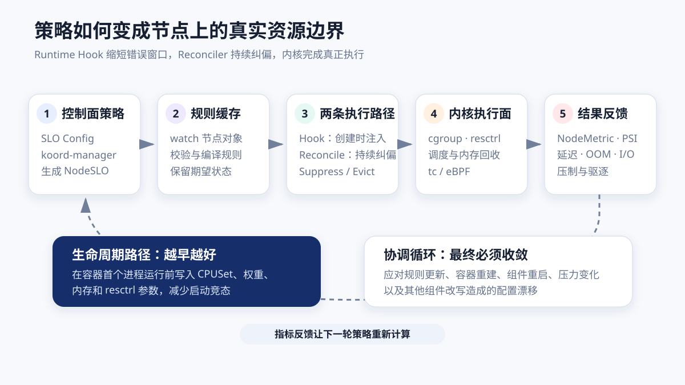
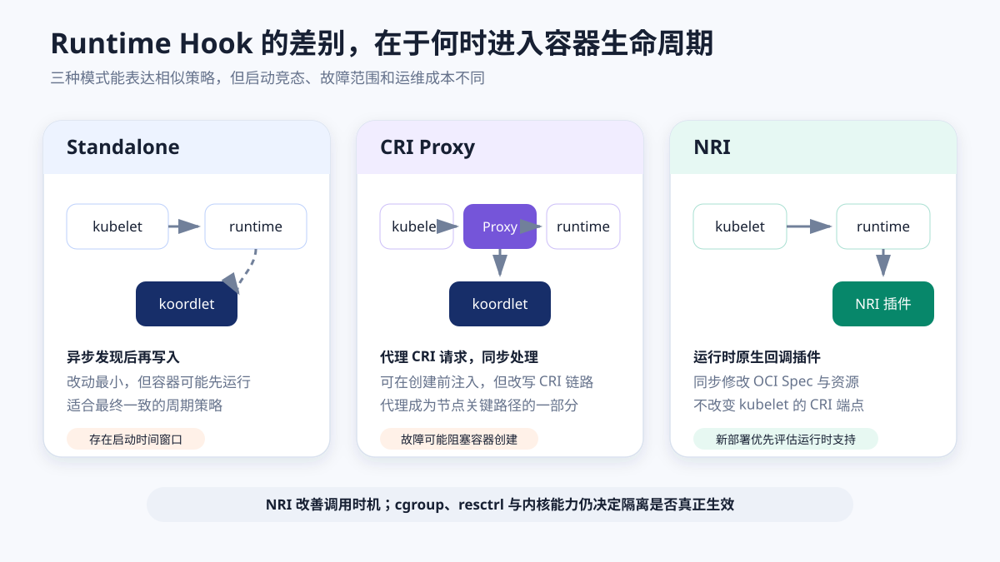
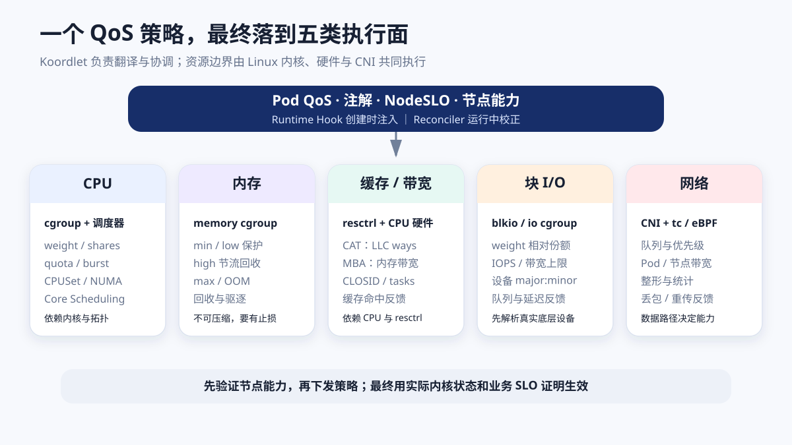

# Koordlet 与 Runtime Hook：CPU、内存、缓存和 I/O 隔离原理

调度器决定 Pod 去哪台机器，真正限制它能用多少 CPU、能否挤占在线业务的内存、可以占多少末级缓存和磁盘带宽的，却是节点内核。Koordinator 在节点上使用 `koordlet` 持续观察和调节资源，并通过 Runtime Hook 在容器生命周期的关键时刻注入资源参数。

这两个机制解决的是不同时间尺度的问题：

- **Runtime Hook 负责“容器出生时就正确”**：在容器创建或更新路径上，根据 Pod 的 QoS、注解与 `NodeSLO`，把 CPUSet、CPU/内存 QoS、`resctrl` 等参数带入运行时或立即写入控制组；
- **Reconciler（协调器）负责“运行中仍然正确”**：周期性扫描 Pod、容器和节点状态，修复配置漂移，并在负载变化时执行动态压制、回收或驱逐；
- **内核负责真正执行**：cgroup、调度器、内存回收、`resctrl`、块 I/O 控制器以及 `tc`/eBPF 才是资源隔离的执行面。

本文以 Koordinator 稳定文档 v1.8 为基线。部分能力依赖特定内核、cgroup 版本、CPU 厂商扩展、容器运行时或 CNI（Container Network Interface，容器网络接口），不能只凭一份 YAML 假定所有节点都具备相同效果。

如果想先理解为什么要做在线离线混部，可先阅读[《Koordinator 与在线离线混部：从资源回收到生产落地》](koordinator-colocation.md)。本文继续向节点内部拆解。



## 1. Koordlet 不是一个简单的 cgroup 写入脚本

`koordlet` 以 DaemonSet 运行在每个节点。它既采集状态，也执行策略，内部可以按职责理解为五个部分：

| 模块 | 主要输入 | 主要输出 |
| --- | --- | --- |
| States Informer | kubelet、容器运行时、cgroup、Pod 元数据 | 节点、Pod、容器和资源拓扑的本地视图 |
| Collectors / Metric Cache | CPU、内存、PSI、设备和性能计数器 | 短周期指标与聚合窗口，供控制算法使用 |
| NodeMetric Reporter | 本地指标缓存 | 上报 `NodeMetric`，供控制面计算与调度使用 |
| QoS Manager / Reconciler | `NodeSLO`、QoS、指标和节点状态 | 周期性写入 cgroup，执行压制、回收与驱逐 |
| Runtime Hooks | 容器生命周期事件、规则缓存 | 在创建或更新时修改 OCI（Open Container Initiative）资源配置 |

控制面上的 `koord-manager` 根据集群配置生成每台节点的 `NodeSLO`。`koordlet` watch 到新规则后写入本地规则缓存，Runtime Hook 与各个 Reconciler 读取同一份期望状态。这样，容器刚创建时有低延迟注入，运行中还有持续校正。

一个典型闭环是：

```text
slo-controller-config
        ↓
koord-manager 校验并生成 NodeSLO
        ↓
koordlet Rule Cache
        ├── Runtime Hook：生命周期内同步或近实时注入
        └── Reconciler：周期扫描、纠偏和动态调节
                    ↓
      cgroup / resctrl / tc / 内核调度器
                    ↓
       指标、PSI、延迟、压制与驱逐反馈
```

这套设计有一个容易忽略的含义：**期望状态、注入时机和内核能力是三件事**。`NodeSLO` 正确，不代表节点内核支持目标参数；Hook 成功返回，也不代表后续没有别的组件改写 cgroup；周期协调最终一致，也不保证容器启动后的第一个采样周期没有干扰在线业务。

## 2. 为什么既需要 Runtime Hook，也需要 Reconciler

假设一个 `BE`（Best Effort，可让步）容器启动后应被限制在共享 CPU 池，并设置较低的 CPU 权重。

如果只用周期 Reconciler，流程可能是：

1. kubelet 创建容器；
2. 容器先按运行时默认参数开始执行；
3. koordlet 下一轮扫描才发现它；
4. koordlet 再修改 CPUSet 和权重。

第 2 到第 4 步之间存在一个窗口。扫描周期很短也无法消除竞态，尤其是启动即满负载的批任务。

Runtime Hook 把动作前移到容器生命周期路径，使容器第一次运行时就携带期望配置。Reconciler 仍然不可少，因为它要处理：

- koordlet 或容器运行时重启后的状态恢复；
- `NodeSLO`、Pod 注解或 QoS 策略的在线变化；
- 容器重建、临时容器和 cgroup 层级变化；
- kubelet、其他节点 Agent 或人工操作造成的配置漂移；
- 随节点压力变化的 CPU Suppress、内存回收和驱逐。

因此，更准确的关系是：**Hook 缩短错误配置窗口，Reconciler 收敛长期状态，二者共同依赖内核执行。**

## 3. Runtime Hook 的三种接入模式



Koordinator 的设计资料中出现过三种接入路径。它们的差异主要是 Hook 位于容器生命周期的什么位置。

| 模式 | 调用路径 | 时序保证 | 主要代价 | 适用判断 |
| --- | --- | --- | --- | --- |
| Standalone | kubelet 直接调用运行时；koordlet 异步发现容器 | 最终一致，存在启动窗口 | 改动小，无法保证首个进程运行前完成注入 | 适合只需周期协调或兼容性优先的场景 |
| CRI Proxy | kubelet → Hook Proxy → containerd/CRI-O | 可在 CRI 请求前后同步处理 | 改写节点 CRI 链路，代理故障会影响容器创建 | 旧环境可用，但要把代理纳入节点关键路径治理 |
| NRI | kubelet → 运行时；运行时通过 NRI 回调插件 | 生命周期内同步调整 OCI Spec/资源 | 依赖运行时版本、NRI 配置和插件连接可靠性 | 新部署优先评估，Koordinator v1.8 安装支持默认启用 |

NRI（Node Resource Interface，节点资源接口）由容器运行时提供插件接口。koordlet 注册 NRI 插件后，containerd 或 CRI-O 在 Pod Sandbox、Container 创建与更新等阶段发送事件。Hook 根据 Pod、容器与规则生成响应，运行时把资源修改合并进 OCI 配置，再启动容器进程。

稳定安装文档给出的基础条件是 containerd 1.7 及以上、Koordinator 1.3 及以上并启用 NRI；设计文档也把 CRI-O 1.25 及以上列为目标运行时。实际生产还要核对发行版是否编译并启用了 NRI、插件目录与 socket 是否一致，以及运行时升级是否改变默认配置。

### 一次 NRI 创建流程里发生了什么

```text
1. kubelet 请求运行时创建容器
2. runtime 把生命周期事件交给 koordlet NRI 插件
3. koordlet 将 Pod/Container 元数据构造成上下文
4. Hook 读取 NodeSLO、QoS、注解和节点能力
5. Hook 计算 LinuxResources、CPUSet 或 resctrl 等增量
6. runtime 合并响应并创建 OCI 容器
7. Reconciler 后续复核实际 cgroup 与期望状态
```

NRI 解决的是可靠的调用时机，不会凭空增加内核能力。节点不支持 `resctrl`，即使 NRI 调用成功也无法提供 LLC 隔离；cgroup 控制器没有启用，写入相应参数同样不会得到预期效果。

Runtime Hook 进入容器创建关键路径后，还必须明确失败策略。Fail-open 可以让 Hook 异常时继续创建容器，但可能让容器以错误 QoS 运行；Fail-closed 能守住强隔离要求，却会把 Hook 故障放大为 Pod 启动失败。平台应按策略的重要性划分：安全边界可选择拒绝，性能优化通常更适合告警并降级，同时让 Reconciler 补偿。

## 4. CPU：份额、上限、绑核和同核干扰是四个问题



CPU QoS 不能只看“限制了几个核”。Linux 至少有四类不同机制：

### 4.1 CPU 权重：竞争发生时谁多拿时间片

- cgroup v1 常见参数是 `cpu.shares`；
- cgroup v2 使用 `cpu.weight`；
- 权重只在同一层级存在 CPU 竞争时发挥作用，不是固定配额。

在线 Pod 使用较高权重、BE Pod 使用较低权重，可以在 CPU 忙时让在线业务优先，但在节点空闲时仍允许批任务使用闲置算力。

### 4.2 CPU 带宽：一个周期内最多运行多久

- cgroup v1 使用 `cpu.cfs_quota_us` 与 `cpu.cfs_period_us`；
- cgroup v2 使用 `cpu.max`；
- 支持 CPU Burst 的内核还可使用对应的 burst 参数暂存未用完的配额，让短时突发少受节流。

硬 quota 容易保护邻居，也可能制造 CPU throttling，拉长在线请求尾延迟。Burst 允许短突发借用，但不能替代容量规划；持续过载最终仍受 quota 限制。

### 4.3 CPUSet：进程到底可以在哪些 CPU 上运行

`cpuset.cpus` 决定可运行 CPU 集合，配合 kubelet CPU Manager、NUMA 拓扑和 Koordinator 的精细化 CPU 编排，可以实现独占核、共享池或不同 QoS 池。这里要同时检查：

- 物理核和超线程兄弟是否被拆开；
- CPUSet 与 NUMA 内存、GPU、RDMA 网卡是否对齐；
- kubelet 与 koordlet 是否可能同时管理同一层级；
- 热插拔、容器重建后实际 CPUSet 是否重新收敛。

### 4.4 同一物理核的干扰：Core Scheduling 与 Group Identity

即使两个任务使用不同逻辑 CPU，它们仍可能共享同一物理核的执行资源。Koordinator CPU QoS 支持按环境选择：

- **Core Scheduling**：使用 Linux 内核的 Core Scheduling cookie 控制哪些任务可以同时运行在 SMT（Simultaneous Multithreading，同步多线程）兄弟线程上，并可结合 `sched_idle` 让低优先级任务退让；
- **Group Identity**：依赖 Anolis 等特定内核扩展，通过任务组身份影响调度优先级。

两者都不是所有发行版的通用能力。生产启用前必须验证内核配置、版本、开销和与现有调度策略的兼容性。

## 5. 内存：保护、节流、上限与驱逐必须分层

内存与 CPU 最大的区别是不可压缩。CPU 不够时任务可以晚一点运行，内存持续不足会触发回收、抖动、OOM（Out of Memory，内存不足）甚至节点失联。

在 cgroup v2 中，常见内存控制语义是：

| 参数 | 语义 | 使用风险 |
| --- | --- | --- |
| `memory.min` | 硬保护边界，低于该值时尽量不回收 | 总保护量配置过大，会把压力转移给其他组 |
| `memory.low` | 尽力保护，压力下按未满足部分参与回收 | 它是保护值，不是预留成功的证明 |
| `memory.high` | 超出后对分配进行节流并施加回收压力 | 设得过低会造成明显抖动和尾延迟 |
| `memory.max` | 硬上限，无法回收时触发 cgroup OOM | 需要明确容器和 Pod 的 OOM 恢复行为 |
| `memory.oom.group` | 将工作负载作为一组处理 OOM | 要与上层任务重试和 Pod 生命周期一致 |

Koordinator Memory QoS 根据 QoS 与策略把声明转换为节点可用的 memcg（memory cgroup，内存控制组）参数，并通过协调器持续维护。不同内核和 cgroup v1/v2 的字段不完全相同，使用官方示例时要先确认目标节点对应的实现。

节点侧还需要两类最后防线：

1. **回收与压制**：在压力升高时优先回收或限制低优先级工作负载；
2. **驱逐**：`MemoryEvict` 或 `MemoryAllocatableEvict` 在节点逼近危险水位时终止可让步 Pod，快速释放内存。

驱逐不是 Memory QoS 的替代品。合理顺序是先保护和回收，确认压力仍不可控后再驱逐。监控必须同时看工作集、匿名页、Page Cache、Major Fault、直接回收、PSI、OOM 和业务延迟，不能只看 `memory.usage`。

## 6. LLC 与内存带宽：使用 resctrl，而不是 cgroup

LLC（Last Level Cache，末级缓存）和内存带宽争用经常出现“CPU 使用率不高，但在线 P99 变差”。Linux `resctrl` 文件系统提供：

- **CAT（Cache Allocation Technology，缓存分配技术）**：用缓存位掩码限制一组任务可使用的 LLC ways；
- **MBA（Memory Bandwidth Allocation，内存带宽分配）**：对一组任务分配或节制内存带宽。

Koordinator 可以按 QoS 或 Pod 注解创建 `resctrl` 控制组，把容器进程的 PID 放入对应 `tasks`，并写入 `schemata`。这里实际发生的是：Pod 身份被解析成一组进程，进程被绑定到一个 CLOS（Class of Service，服务类别）标识，再由 CPU 硬件执行缓存或带宽分配。

生产上要先回答四个问题：

1. CPU 型号和微码是否支持 CAT/MBA；
2. 内核是否启用并挂载 `resctrl`；
3. CLOSID、RMID 等硬件资源数量是否足够；
4. 容器进程变化、重启和退出后，`tasks` 是否持续正确。

LLC 百分比也不是“性能百分比”。同样的缓存 ways 在不同工作集上会产生完全不同的命中率，必须用在线 P99、LLC misses、内存带宽和批任务吞吐做干扰矩阵。

## 7. 块 I/O：最终要落到具体设备

块 I/O QoS 通常由 cgroup v1 `blkio` 或 cgroup v2 `io` 控制器实施：

- 权重类参数决定竞争时的相对份额；
- `io.max` 或节流参数限制某个块设备的 IOPS/带宽；
- 部分内核提供延迟或成本模型，能力随内核与 I/O 调度器变化。

控制对象最终是设备的 `major:minor`。这带来几个常见陷阱：

- 容器看到的是 OverlayFS 路径，真实 I/O 可能落在多个底层设备；
- 数据盘、容器层和日志盘可能走不同设备；
- LVM、Device Mapper、云盘或多路径会改变设备映射；
- 新挂载卷出现后，需要 Reconciler 重新解析并写入规则；
- 本地 SSD 的吞吐限制不能代表网络存储端的真实 QoS。

因此，策略验证至少要同时观察容器 cgroup 的 I/O 统计、节点块设备延迟/队列、卷后端指标和应用尾延迟。

## 8. 网络：需要 CNI、tc 或 eBPF 配合

网络 QoS 不是只写 cgroup 文件就能完整实现。Koordinator 的 Terway QoS 集成使用 Linux `tc`（Traffic Control，流量控制）和 eBPF（extended Berkeley Packet Filter，扩展伯克利包过滤器），将工作负载映射到 L0、L1、L2 三个网络 QoS 等级，并实施节点或 Pod 带宽管理。

这类能力依赖 CNI、内核和网卡路径：

- Pod veth、宿主机网络和直通设备的流量路径不同；
- HostNetwork Pod 不一定经过相同的 qdisc（queueing discipline，排队规则）；
- RDMA、SR-IOV 或用户态网络可能绕过内核常规数据路径；
- 入站和出站的整形位置、统计口径不同；
- 只限制带宽，未必能解决短时微突发造成的排队延迟。

Koordlet 在这里承担策略和身份衔接，真正执行仍在 CNI、`tc`/eBPF 和内核网络栈。使用其他 CNI 时，需要确认是否有等价实现，不能照搬 Terway 配置。

## 9. 配置如何一路变成节点内核参数

生产配置通常不是直接逐节点修改 cgroup，而是走声明式链路：

1. 在 `slo-controller-config` 中定义默认策略和节点分组策略；
2. `koord-manager` 校验配置，并为目标节点生成或更新 `NodeSLO`；
3. koordlet watch 本节点对象，将规则编译进本地 Rule Cache；
4. Runtime Hook 在容器生命周期中计算增量资源配置；
5. Reconciler 周期性比较“期望值”和“实际值”；
6. 内核执行限制，指标反馈到下一轮控制。

下列内容只表达配置关系，不应直接作为某个版本的可执行清单：

```yaml
# 概念示例：字段以目标 Koordinator 版本的 API 为准
clusterPolicy:
  default:
    cpuQoS: <default-policy>
    memoryQoS: <default-policy>
    resourceQOS: <default-policy>
  nodeStrategies:
    - selector: <canary-node-labels>
      cpuQoS: <canary-policy>
      memoryQoS: <canary-policy>
```

之所以不提供一份“复制即用”的通用配置，是因为 cgroup v1/v2、内核发行版、containerd NRI、CPU 特性和 Koordinator 版本都会改变字段与实际效果。配置合入前，应从目标版本的 [SLO 配置文档](https://koordinator.sh/docs/user-manuals/slo-config) 生成最小差异，并在同硬件的灰度节点验证实际文件值。

## 10. 先检查能力矩阵，再谈开启功能

下面的只读命令可以帮助确认节点事实。路径和权限会随发行版变化：

```bash
# cgroup 版本与已启用控制器
stat -fc %T /sys/fs/cgroup
cat /sys/fs/cgroup/cgroup.controllers 2>/dev/null

# CPU 拓扑与 NUMA
lscpu -e=CPU,CORE,SOCKET,NODE,ONLINE

# resctrl 是否可用、已挂载
grep -w resctrl /proc/filesystems
mount | grep resctrl
ls /sys/fs/resctrl/info 2>/dev/null

# PSI 支持与当前压力
cat /proc/pressure/cpu
cat /proc/pressure/memory
cat /proc/pressure/io

# containerd 与 NRI 配置位置需按发行版核对
containerd --version
crictl info
```

建议把节点能力做成标签或机器画像，至少记录：内核版本、cgroup 模式、运行时版本、NRI 状态、CPU 型号、SMT、NUMA、`resctrl`、块设备和 CNI。策略只下发到经过验证的节点组，避免同一个 `NodeSLO` 在不同机器上产生不同含义。

## 11. 故障模型：Hook 成功不等于策略有效

| 故障 | 表面现象 | 应检查的事实 |
| --- | --- | --- |
| NRI 未注册或断连 | Pod 能启动，但创建时未注入 | runtime 日志、插件注册、Hook 调用数与错误 |
| Hook 超时 | Pod 创建变慢或失败 | Hook P95/P99、超时策略、是否进入 Fail-open |
| `NodeSLO` 过期 | 新旧节点策略不一致 | 对象更新时间、watch/relist、规则缓存版本 |
| 内核不支持参数 | API/Hook 无明显报错，隔离无效果 | 实际 cgroup/resctrl 文件和内核能力 |
| 多组件写同一 cgroup | 参数周期性跳变 | kubelet、koordlet、其他 Agent 的写入边界 |
| 容器重建后漂移 | 老容器有效，新容器失效 | Container ID、cgroup 路径与 Reconciler 收敛 |
| 设备映射变化 | I/O 限速作用在错误设备 | major:minor、挂载、OverlayFS 和卷后端 |
| 规则过于激进 | 在线业务正常，批任务几乎无进展 | 压制时间、资源满足度、完成时间与驱逐率 |

Koordinator 社区仍在持续增强 NRI Hook 可靠性，例如讨论如何声明“某个 Hook 必须成功”以及如何让运行时对必需插件失联采取明确动作。这说明生产设计不能只关注安装成功，还要把插件连通性、调用延迟和降级行为纳入 SLO。

## 12. 监控要覆盖“期望、实际和结果”

只看 koordlet Pod Running 无法证明隔离有效。建议分三层建立面板：

### 控制与注入

- `NodeSLO` 更新时间、规则版本与分发延迟；
- Runtime Hook/NRI 注册状态、调用量、错误、超时和 P95/P99；
- Reconciler 执行次数、失败数、单轮时长和配置漂移数；
- koordlet 与 containerd/CRI-O 重启、连接重建。

### 内核实际状态

- 期望与实际 `cpu.weight`、`cpu.max`、CPUSet；
- CPU throttling、Run Queue、上下文切换和 PSI；
- `memory.low/high/max`、直接回收、Major Fault、OOM 和内存 PSI；
- `resctrl` 组、任务数、LLC misses 和内存带宽；
- 每设备 IOPS、吞吐、队列、延迟与 I/O PSI；
- `tc`/eBPF 规则命中、丢包、重传和带宽。

### 业务结果

- 在线服务 P99/P999、错误率和吞吐；
- BE 任务排队、有效进度、完成时间、压制秒数、驱逐与重试；
- 可回收资源、已分配资源和实际使用的闭合关系。

同一张看板上保留未启用策略的对照节点，比只展示试点节点更容易判断变化来自策略还是业务流量。

## 13. 生产落地顺序

1. **建立能力矩阵**：按 OS、内核、cgroup、运行时、CPU 和 CNI 分组；
2. **先采集，不执行**：验证 NodeMetric、PSI、运行时事件和 cgroup 路径；
3. **只开一种机制**：例如先验证 CPU 权重，再验证 CPUSet，避免一次改变五个变量；
4. **使用节点标签灰度**：少量同型号节点，保留未启用的对照组；
5. **验证出生时和运行中两条路径**：容器快速启动、重启、Hook 断连、koordlet 重启和规则更新都要覆盖；
6. **设置止损线**：在线 P99、错误率、PSI、OOM 或 Hook 延迟越界时自动停止扩大范围；
7. **最后再开放可回收资源**：先证明隔离和回滚有效，再让 BE 任务消费在线余量。

一次可靠验收至少要回答：容器第一次运行前是否获得正确参数，运行一段时间后是否仍然正确，节点压力升高时是否按优先级退让，组件重启后是否能自动恢复，以及在线业务的尾延迟是否保持在红线内。

## 14. 结语

Koordlet 的核心价值不是“提供更多参数”，而是把控制面的资源意图持续翻译为节点可执行的内核状态。Runtime Hook 把关键配置前移到容器生命周期，Reconciler 修复运行中的漂移，Linux 内核则真正完成调度、回收和限速。

理解这三层边界后，许多问题会变得清晰：NRI 解决的是时序，不是硬件能力；cgroup 管理 CPU、内存和块 I/O，却不能替代 `resctrl` 或 CNI；节点策略写进 API，只代表期望状态，最终仍要用实际文件、内核指标和业务 SLO 证明它生效。生产隔离的可信度，来自这条证据链能够闭合。

## 参考资料

- [Koordinator：架构总览](https://koordinator.sh/docs/architecture/overview)
- [Koordinator：QoS 架构](https://koordinator.sh/docs/architecture/qos)
- [Koordinator：SLO 配置](https://koordinator.sh/docs/user-manuals/slo-config)
- [Koordinator：CPU QoS](https://koordinator.sh/docs/user-manuals/cpu-qos)
- [Koordinator：Memory QoS](https://koordinator.sh/docs/user-manuals/memory-qos)
- [Koordinator：Memory Evict](https://koordinator.sh/docs/user-manuals/memory-evict)
- [Koordinator：Terway Network QoS](https://koordinator.sh/docs/user-manuals/network-qos-with-terwayqos)
- [Koordinator：NRI 模式资源管理设计](https://koordinator.sh/docs/designs/nri-mode-resource-management)
- [Koordinator：安装与 NRI 要求](https://koordinator.sh/docs/installation)
- [Koordinator：Runtime Hook 设计归档](https://github.com/koordinator-sh/koordinator/blob/main/docs/design-archive/koordlet-runtime-hooks.md)
- [Koordinator：Resctrl QoS 增强设计](https://github.com/koordinator-sh/koordinator/blob/main/docs/proposals/koordlet/20231227-koordlet-resctrl-qos-enhance.md)
- [Koordinator Runtime API](https://github.com/koordinator-sh/koordinator/blob/main/apis/runtime/v1alpha1/api.proto)
- [Linux Kernel：Control Group v2](https://docs.kernel.org/admin-guide/cgroup-v2.html)
- [Linux Kernel：Resource Control](https://docs.kernel.org/arch/x86/resctrl.html)
