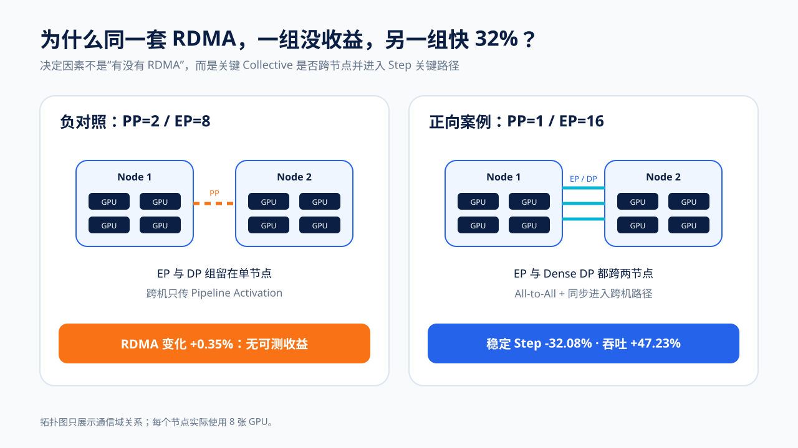
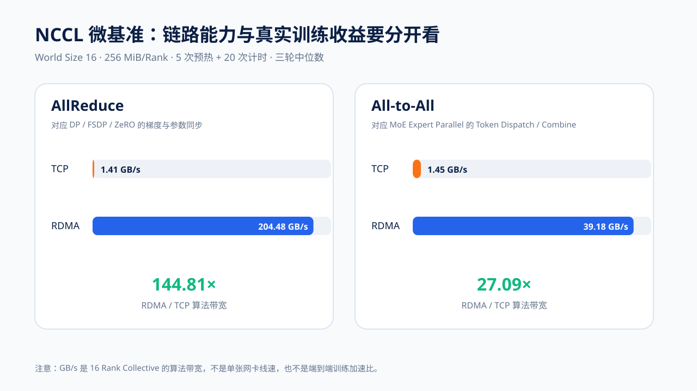
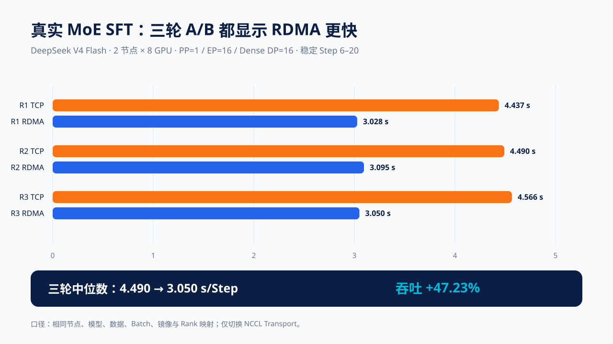
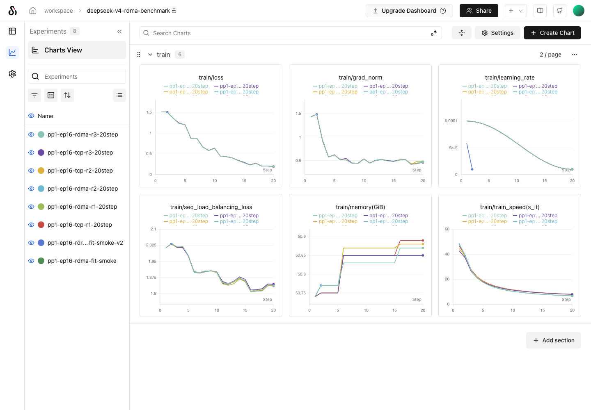

# RDMA 到底能让分布式训练快多少：DeepSeek V4 双机 16 卡实测

先给结果：同一组 `2 节点 × 8 GPU`、同一模型、数据、Batch、镜像和 Rank 映射下，把 DeepSeek V4 Flash 的 `PP=1、EP=16、Dense DP=16` 训练从 TCP Socket 切到 GPUDirect RDMA，三轮稳定 Step 均值的中位数由 `4.490` 降到 `3.050 秒/Step`，步耗时下降 **32.08%**，等价吞吐提升 **47.23%**。

但另一组 `PP=2、EP=8` 对照中，RDMA 反而比 TCP 慢 `0.35%`，属于正常噪声，没有可测收益。两组结果并不矛盾：前者把 MoE All-to-All 和 Dense DP 同步都放到了跨节点路径，后者的 EP/DP 通信组留在各自节点内，跨机主要只传 Pipeline Activation。



这次实验真正想回答的不是“RDMA 带宽有多高”，而是：**什么样的训练通信会进入 Step 的关键路径，并转化为端到端收益。**

## 1. 哪些训练更可能从 RDMA 获益

优先级最高的通常是下面几类：

| 训练形态 | 典型跨机通信 | RDMA 收益倾向 |
| --- | --- | --- |
| 大型 MoE 的 Expert Parallel | Token Dispatch/Combine，核心是 All-to-All | 高，尤其 EP 组跨节点时 |
| Dense 全参数 DDP | 每步同步大体积梯度，核心是 AllReduce | 中到高 |
| FSDP / ZeRO-3 | Reduce-Scatter、AllGather、参数与梯度分片 | 中到高，取决于计算通信重叠 |
| 跨节点 Tensor Parallel | 几乎每层都有 Collective | 高，但也最容易受延迟和拓扑影响 |
| Pipeline Parallel | Stage 间点对点传 Activation/Gradient | 取决于 Micro Batch、序列和 Activation 大小 |
| 小模型或参数量很小的 LoRA | 可训练梯度小，计算常占主导 | 往往较低 |

一个实用判断式是：

```text
RDMA 的端到端价值
≈ 跨节点通信在稳定 Step 中的占比
× RDMA 能消除的那部分通信时间
× 不能被计算重叠隐藏的比例
```

所以，NCCL 日志出现 `NET/IB` 只能证明链路被选中；只有固定其他变量后的真实训练 A/B，才能说明它对当前工作负载是否有价值。

## 2. 测试设计：先证明链路，再测真实训练

本轮采用两层证据：

1. NCCL 微基准同时测 AllReduce 与 All-to-All，回答高速网络是否真的工作；
2. DeepSeek V4 Flash MoE LoRA 做 TCP/RDMA 严格 A/B，回答网络差异能否转成真实 Step 收益。

### 2.1 固定项

| 项目 | 配置 |
| --- | --- |
| GPU | 2 节点 × 8 张 NVIDIA H20 141 GB，World Size 16 |
| 模型 | DeepSeek V4 Flash 0731，Block-FP8 基座、BF16 LoRA |
| 可训练参数 | 242.456M / 24,863.382M，约 0.9752% |
| 并行 | TP=1、PP=1、EP=16、Dense DP=16、Expert DP=1 |
| 数据 | 330 条固定训练样本，SHA-256 固定 |
| Batch | Micro Batch 1、Global Batch 16 |
| 序列 | Max Length 512 |
| 计时 | 每轮 20 Step，去掉前 5 Step，比较 Step 6～20 |
| 重复 | TCP 3 轮、RDMA 3 轮 |
| 排除项 | Eval 与 Checkpoint 关闭；模型加载、编译和 Tokenize 不进入稳定段 |

每个 A/B Pair 使用相同节点和 Rank 布局。第三轮还调换了两台节点承担 Rank 0 的方向，结果仍一致，降低了“某台机器总是更快”造成偏差的可能性。

### 2.2 Transport 验收

TCP 组显式禁用 IB，并在 NCCL INFO 中确认：

```text
NET/Socket
```

RDMA 组不仅申请 RDMA 设备，还确认跨节点 Channel 使用：

```text
NET/IB/.../GDRDMA/Shared
GPU Direct RDMA Enabled
```

如果只看到节点具备 RDMA 网卡、Pod 挂到了设备，或只把 `NCCL_IB_DISABLE` 设为 `0`，都不能算链路验收通过。

## 3. NCCL 微基准：通信能力差距很大

微基准使用 16 Rank，消息大小为 `1/16/64/256 MiB per Rank`，每个点 5 次预热、20 次正式迭代，并取所有 Rank 中最慢者的耗时。TCP 与 RDMA 各重复三轮。

在 `256 MiB/Rank` 上，三轮中位数如下：

| Collective | TCP 延迟 | RDMA 延迟 | TCP 算法带宽 | RDMA 算法带宽 | RDMA / TCP |
| --- | ---: | ---: | ---: | ---: | ---: |
| AllReduce | 190.105 ms | 1.313 ms | 1.412 GB/s | 204.482 GB/s | **144.81×** |
| All-to-All | 185.601 ms | 6.851 ms | 1.446 GB/s | 39.180 GB/s | **27.09×** |



这里的 `GB/s` 是 16 Rank Collective 的**算法带宽**，不是单张网卡线速。更不能把 `144.81×` 写成“训练加速 144 倍”：通信只是训练 Step 的一部分，计算、内存访问、Kernel、数据加载和无法并行的框架开销都仍然存在。

原始数据也暴露了有价值的抖动：RDMA All-to-All 的第三轮只有 `18.763 GB/s`，前两轮为 `39.180 / 44.458 GB/s`。因此报告采用三轮中位数，同时公开原始值；只选最快一轮会显著夸大稳定性。

## 4. 真实 SFT：稳定 Step 快约三分之一

SwanLab 上报的 `train_speed(s/it)` 是“从第 1 步到当前步的累计均值”，其中前两步包含编译与通信暖机。直接比较第 20 步的累计值，会把初始化成本继续摊进结果。这里先反推每一步的瞬时耗时：

```text
instant_n = n × cumulative_mean_n - (n - 1) × cumulative_mean_(n - 1)
```

然后仅对 Step 6～20 求均值。三轮结果为：

| 轮次 | TCP 稳定均值 | RDMA 稳定均值 | 步耗时下降 | 等价吞吐提升 |
| --- | ---: | ---: | ---: | ---: |
| R1 | 4.437 s | 3.028 s | 31.74% | 46.50% |
| R2 | 4.490 s | 3.095 s | 31.07% | 45.07% |
| R3 | 4.566 s | 3.050 s | 33.20% | 49.71% |
| **三轮中位数** | **4.490 s** | **3.050 s** | **32.08%** | **47.23%** |

固定 Global Batch 16 后，等价样本吞吐由 `3.563` 提高到 `5.246 samples/s`。这里的吞吐是由稳定 Step Time 推导的训练吞吐，不包括模型加载、Checkpoint 和实验上报收尾。



六个正式 Run 均上传到自托管 SwanLab。下面的脱敏截图保留了 Run 名称、Train Loss、Gradient Norm、Learning Rate、MoE Load Balancing Loss、显存和累计训练速度；内部访问地址、账号和集群信息均未进入公开文档。



Loss 从约 `1.506` 降到 `0.190～0.198`，六轮轨迹接近，但并非逐位相同。分布式浮点归约顺序存在非确定性，这次实验也没有做完整收敛与盲测，因此只比较性能，不把短跑 Loss 写成模型质量结论。

## 5. 负对照为什么没有收益

在前一组 `PP=2、EP=8、Dense DP=8` 的双机实验里，每个 Pipeline Stage 恰好占满一个 8 卡节点。EP 和 DP Group 都没有跨机，跨节点主要是两个 Pipeline Stage 之间的 Activation 与反向 Gradient。

同口径稳定段中：

| Transport | 稳定均值 |
| --- | ---: |
| TCP | 4.109 s/Step |
| RDMA | 4.124 s/Step |
| 变化 | RDMA 慢 0.35%，无可测收益 |

这个负对照很重要。若只发布微基准或只选择 `EP=16` 正向案例，很容易让读者误以为任何双机训练都能快 30%。实际应先画出每个 TP、PP、EP、DP 通信组的 Rank，再检查哪些边跨节点。

## 6. 怎样设计一组不容易自欺的 RDMA 训练实验

建议按下面顺序执行：

1. 用 `nvidia-smi topo -m`、RDMA 设备信息和 NCCL INFO 验证 GPU、NIC、NUMA 与 Transport；
2. 同时测 AllReduce 和 All-to-All，不要用一个 Collective 代表所有训练；
3. TCP/RDMA 使用相同节点、GPU、Rank 映射、模型、数据 Hash、Global Batch、序列长度和软件版本；
4. 预热后比较稳定 Step，不比较包含镜像拉取、权重加载、编译和 Checkpoint 的 Job 总时长；
5. 至少三轮，发布中位数、最小值、最大值和异常轮次；
6. 增加一组通信不跨机的负对照，验证测试是否真的能区分“链路快”和“业务快”；
7. SwanLab 记录 Loss、Step、超参数与 Run，Prometheus/Grafana 另行记录 GPU、NIC、RDMA Counter 和慢 Rank。

SwanLab 是实验追踪工具，不是 RDMA 网络监控系统。看到 Step Time 抖动时，应使用统一 Run ID，把 SwanLab 的 Step 时间窗与 Grafana 中的 GPU 利用率、NIC 吞吐、ECN/PFC、RDMA 重试和 NCCL 日志对齐。

## 7. 公开复现入口

仓库中的微基准脚本已经支持 AllReduce 与 All-to-All：

```bash
NCCL_BENCH_COLLECTIVES=all_reduce,all_to_all \
NCCL_BENCH_SIZES_MB=1,16,64,256 \
NCCL_BENCH_WARMUP=5 \
NCCL_BENCH_ITERATIONS=20 \
bash run-nccl-benchmark.sh
```

两台机器运行相同命令，只改变 `NODE_RANK`；TCP/RDMA 组只切换 NCCL Transport 和 RDMA 设备，其他参数保持不变。公开脚本不包含任何具体集群、节点地址、内部镜像、网络附件、存储或入口配置。

- [分布式 SFT 与 NCCL Harness](https://github.com/runzhliu/aik8s/tree/main/examples/llm-sft-lab/distributed)
- [本次机器可读完整结果](https://github.com/runzhliu/aik8s/blob/main/examples/llm-sft-lab/meaningful-sft/results/h20-deepseek-v4-rdma-tcp-20260825.json)
- [图表生成脚本](https://github.com/runzhliu/aik8s/blob/main/scripts/generate_deepseek_rdma_training_assets.py)

## 8. 结论边界

这次实测支持三个结论：

- RDMA 链路确实能把 16 Rank 的大消息 AllReduce 与 All-to-All 带宽提高一个数量级以上；
- 当 `EP=16 / Dense DP=16` 强制关键 Collective 跨节点时，DeepSeek V4 Flash LoRA 的稳定训练吞吐提升约 47%；
- 当 EP/DP 留在单节点、跨机通信不占主导时，启用 RDMA 没有可测收益。

它不支持“所有训练都能快 47%”。本轮只有 20 个 Optimizer Step、Max Length 512、合成领域数据，并且是 LoRA 而不是全参数训练。更长序列、更大 Global Batch、不同 Token 路由、FSDP/ZeRO、网络拥塞和 GPU 型号都可能改变比例。正确做法不是套用这个百分比，而是复用这套正负对照和计时口径。

参考：[NVIDIA NCCL Tests](https://github.com/NVIDIA/nccl-tests)、[Megatron Core 并行策略指南](https://docs.nvidia.com/megatron-core/developer-guide/latest/user-guide/parallelism-guide.html)、[SwanLab 实验追踪文档](https://docs.swanlab.cn/)
