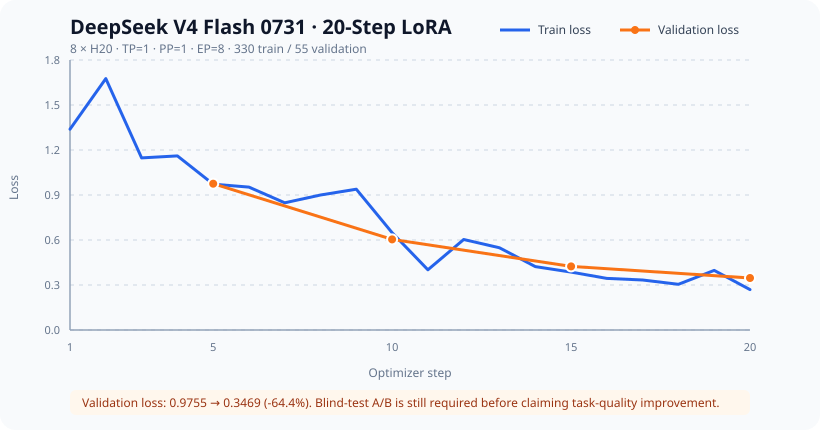
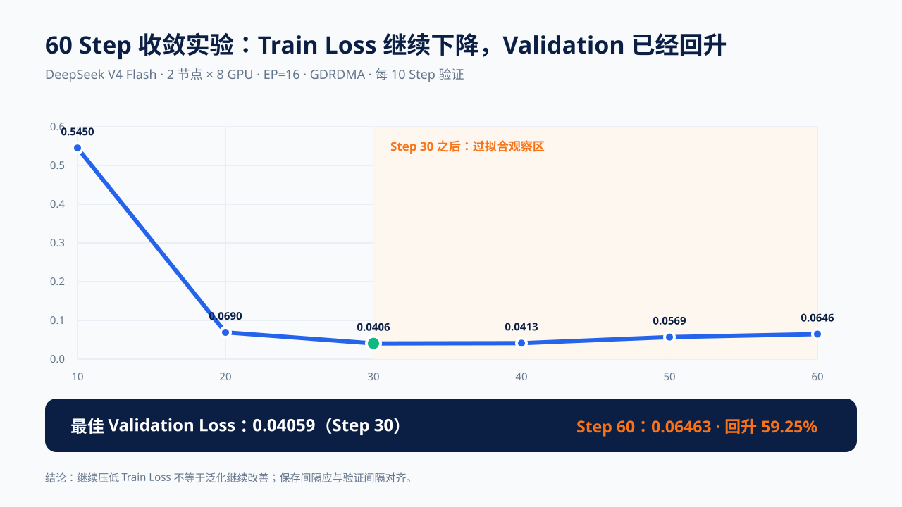

# 大模型 SFT 训练实战：从单卡 LoRA 到 DeepSeek V4

如果还不熟悉 Loss、LoRA、QLoRA、Batch、Epoch、Checkpoint、DP、TP、PP 和 EP，建议先读[大模型 SFT 入门：把常见名词一次讲明白](sft-concepts.md)，再继续本章的真实实验。

直接把第一次 SFT 放在 284B 的 DeepSeek V4 Flash 上，会把数据格式、训练参数、分布式通信、精度转换和 Checkpoint 问题同时引入。更容易成功的路线是先用相同的数据格式和训练框架，在一张 GPU 上完成一个可以验收的 LoRA 闭环；只有这个闭环稳定后，再切换到 Megatron-SWIFT 和完整 MoE 模型。

本章提供三条路径：

1. **可立即运行且能量化效果的实验**：单卡 `Qwen3.5-4B + ms-swift + LoRA`，完成 Base/Adapter 盲测；
2. **较新 MoE 的多卡实验**：单机八卡 `Qwen3.6-35B-A3B + ZeRO-3 + LoRA`，验证分片加载、训练、验证和 Checkpoint；
3. **完整 DeepSeek V4 Flash 实测**：单机 `8 × H20 + EP=8` 跑通训练，再用双机 16 卡完成 TCP/GDRDMA 对照和 60-Step 收敛实验。

配套脚本和示例数据位于 [`examples/llm-sft-lab`](https://github.com/runzhliu/aik8s/tree/main/examples/llm-sft-lab)。示例不包含集群名、内部镜像、存储地址和网络配置。

## 1. 这次实验要证明什么

第一轮不是为了得到一个可上线的领域模型，而是证明下面这条链路能够完整闭环：

```text
JSONL 对话数据
    ↓
模型 Chat Template 与 Assistant Loss Mask
    ↓
LoRA SFT
    ↓
Adapter Checkpoint
    ↓
加载 Adapter 推理
    ↓
固定问题回归与训练记录
```

最小实验的通过条件是：

- GPU、PyTorch 和 `swift` 可以正常识别；
- 数据预处理没有 Schema、Template 或 Tokenizer 错误；
- 训练 Loss 是有限数值，没有 NaN/Inf；
- 输出目录出现 `adapter_model.safetensors` 和 Adapter 配置；
- `swift infer --adapters ...` 能加载该 Checkpoint 并完成一次对话；
- 记录模型、框架、数据、参数、GPU 和结果，而不是只保存一张 Loss 截图。

20 Step 的 Smoke Test 只能验证工程链路，不能证明模型质量提升。

## 2. 预训练、SFT 和对齐到底在做什么

把大模型训练统一理解成“拿数据继续训”很容易选错方法。它们都可能使用 Next Token Prediction，但数据形态、Loss 作用位置和希望改变的能力不同。

```text
海量原始文本
    ↓ 预训练（Pretraining）
基础模型：掌握语言、模式、知识和通用能力
    ↓ 可选：继续预训练（CPT / DAPT）
领域基础模型：更熟悉行业语料、术语和分布
    ↓ 监督微调（SFT）
指令模型：学会怎样理解指令、组织答案和遵循格式
    ↓ 偏好与安全对齐（DPO / RLHF / GRPO 等）
更符合人类偏好、业务边界和安全要求的模型
    ↓ 推理时结合 RAG / Tools
获取最新或私有事实，并执行外部动作
```

| 阶段 | 典型数据 | Loss 主要作用于 | 更擅长改变什么 | 常见规模 |
| --- | --- | --- | --- | --- |
| 预训练 | 去重清洗后的网页、代码、书籍等连续 Token | 几乎所有可预测 Token | 从零形成语言、知识和通用能力 | 数十亿到数万亿 Token |
| 继续预训练 | 医疗、金融、代码或企业领域原始语料 | 连续语料 Token | 领域词汇、表达和知识分布 | 通常远大于 SFT 数据 |
| SFT | `用户问题 → 理想回答`、多轮对话、工具轨迹 | 通常只计算 Assistant 回答 Token | 指令遵循、回答结构、任务流程和风格 | 数千到数百万条高质量样本 |
| 偏好对齐 | Preferred/Rejected 对，或可计算 Reward 的 Rollout | 偏好或奖励目标 | 取舍、边界、安全和可用性 | 取决于算法与任务 |
| RAG | 文档索引和查询时检索结果 | 不修改模型参数 | 最新、私有、可溯源的事实 | 推理时动态变化 |

### 2.1 预训练不是“更大的 SFT”

预训练通常把连续文本切成 Token 序列，让模型预测下一个 Token。它不要求每条数据都有问题和标准答案，目标是从非常大的语料分布中学习表示、语言规律和世界模式。继续预训练沿用相似目标，只是从通用语料转向某个领域，因此更适合让模型熟悉大量行业术语和文体。[领域继续预训练研究](https://arxiv.org/abs/2004.10964)

这类训练会更新大量甚至全部参数，Optimizer State、Gradient、Activation 和 Checkpoint 都很大。数据并行需要同步大量梯度，模型并行和 ZeRO/FSDP 还会引入 All-Gather、Reduce-Scatter 或点对点通信，所以它通常比小型 LoRA SFT 更依赖多机高速网络。

### 2.2 SFT 主要是在教“应该怎样回答”

SFT 把 Prompt、上下文和理想回答拼成一条序列，但常见做法只对 Assistant 部分计算监督 Loss。例如：

```text
System: 你是一个谨慎的基础设施助手。      Loss Mask = 0
User: Loss 降了，可以直接上线吗？           Loss Mask = 0
Assistant: 不可以，还需要隔离评测……         Loss Mask = 1
```

模型因此学习“看到这种输入时，应该生成怎样的输出”。它很适合固定回答格式、工具调用协议、推理流程和业务语气，但几十条问答无法可靠注入一整套知识库；样本过少或重复过多时，Loss 下降更可能代表记住了训练答案。

LoRA 又是 SFT 的一种参数高效实现：冻结基座权重，只训练插入的低秩矩阵。它能显著减少可训练参数、Optimizer State 和 Checkpoint，但每张数据并行 GPU 仍需加载基座模型。[LoRA 论文](https://arxiv.org/abs/2106.09685)

### 2.3 应该选哪一种

- 希望模型掌握大量领域语言和语料分布：先评估继续预训练；
- 希望模型按指定格式回答、调用工具或遵循工作流程：使用 SFT；
- 希望模型在多个可用答案之间形成偏好和安全边界：在 SFT 后做偏好对齐；
- 知识变化快、需要权限控制或引用来源：优先使用 RAG，而不是频繁重新训练；
- 需求同时存在：可以采用“继续预训练 → SFT → 偏好对齐 → RAG”的组合，但每阶段都要保留独立评测。

本章保留的 12 条数据和 20 Step 只属于 **LoRA SFT 工程 Smoke Test**，不是预训练，也不能证明领域知识已经写入模型。当前推荐的 Qwen3.5 实验使用相互隔离的 Train、Validation 和 Blind Test，并比较 Base 与 Adapter。

## 3. 为什么先选 ms-swift 和 Qwen3.5-4B

`Qwen3.5-4B` 比仓库早期使用的 Qwen3-4B 更新，同时仍保留 4B Dense 模型适合单卡复现的规模。ms-swift 已给出 Qwen3.5 的 LoRA 最佳实践，并特别要求为非思考训练设置 `add_non_thinking_prefix` 和 `ignore_empty_think` Loss Scale；框架也支持自定义 JSONL、Adapter 保存和推理。[ms-swift Qwen3.5 Best Practice](https://github.com/modelscope/ms-swift/blob/main/docs/source/BestPractices/Qwen3_5-Best-Practice.md)

这里选择 4B 模型不是因为它的架构等价于 DeepSeek V4，而是因为以下内容可以复用：

- `messages` 对话数据格式；
- System/User/Assistant 角色和 Chat Template；
- LoRA 数据闭环和基础超参数；
- Checkpoint、Adapter 推理与训练前后评测方法；
- 镜像版本、数据版本和实验元数据记录方式。

不能直接复用的是 DeepSeek V4 的 Hybrid Attention、MoE Expert Parallel、MTP、FP4/FP8 权重转换和多机通信配置，这些在第二阶段单独验证。

## 4. 最小硬件与软件

### 4.1 单卡 Smoke Test

| 项目 | 最低建议 | 说明 |
| --- | --- | --- |
| GPU | 1 × 16 GB | 默认 4B LoRA、1K 序列；显存紧张时降到 512 Token |
| 推荐 GPU | 1 × 24 GB 或更高 | 给数据处理、显存碎片和稍长序列留余量 |
| CPU 内存 | 32 GB | 小数据 Smoke 足够，正式数据应按预处理并发调整 |
| 磁盘 | 30 GB 可用空间 | 包含基础模型、Python 环境、缓存和 Adapter |
| Python | 3.10 及以上 | ms-swift 当前官方要求 Python 3.10+ |
| CUDA/PyTorch | 与 GPU 驱动兼容 | 先使用已有的 CUDA PyTorch 环境，避免第一轮构建镜像 |

H20、H100、A100、L20 和 3090 可使用默认 BF16。T4 不支持原生 BF16，应执行：

```bash
TRAIN_TORCH_DTYPE=float16 bash train-qwen3-4b-lora.sh
```

16 GB 是本实验参数下的尝试下限，不是所有 4B LoRA 任务的通用承诺。模型版本、Attention 实现、序列长度和 Batch 都会改变显存占用。

### 4.2 完整 DeepSeek V4 Flash LoRA

DeepSeek V4 Flash 有 284B 总参数、每 Token 激活 13B 参数；LoRA 只减少可训练参数和优化器状态，不会把 284B 基座变成 13B 模型。[DeepSeek V4 官方模型卡](https://huggingface.co/deepseek-ai/DeepSeek-V4-Pro)

当前公开的 Megatron-SWIFT LoRA 示例使用：

- 单机 8 GPU；
- `TP=1`、`EP=8`；
- 4K 最大训练长度；
- Full Recompute；
- BF16 LoRA Rank 16；
- MTP 1 层。

因此本章把 `8 × 96 GB` 视为完整 V4-Flash LoRA 的合理起点，`8 × 141 GB` 会有更充足的激活值和通信缓冲余量。`8 × 80 GB` 是否能稳定运行需要以精确 Checkpoint、加载精度和实测峰值显存为准，不能只用总显存相加判断。[Megatron-SWIFT DeepSeek V4 最佳实践](https://github.com/modelscope/ms-swift/blob/main/docs/source/BestPractices/deepseek-v4.md)

## 5. 五分钟准备最小实验

进入示例目录：

```bash
cd examples/llm-sft-lab
```

在已经安装 CUDA 版 PyTorch 的 Python 环境中安装 ms-swift：

```bash
python -m pip install --upgrade ms-swift
```

也可以执行仓库脚本，它会创建当前目录下的 `.venv`：

```bash
bash install-ms-swift.sh
source .venv/bin/activate
```

如果只是想先看看训练界面，ms-swift 也提供 Gradio Web UI：

```bash
swift web-ui
```

Web UI 适合熟悉模型、数据和参数位置；本章仍以 CLI 脚本作为可复现记录，因为它更容易做版本控制、复跑和参数 Diff。不要把没有认证的训练 UI 直接暴露到公网。[ms-swift Web UI](https://github.com/modelscope/ms-swift#web-ui)

先做预检：

```bash
bash preflight.sh
```

预检必须确认 `torch.cuda.is_available()` 为 `True`。如果 PyTorch 看不到 GPU，不要开始下载模型和训练。

## 6. 看懂训练数据

ms-swift 支持 JSON、JSONL 和 CSV。最小实验使用每行一条样本的 JSONL：

```json
{"messages":[{"role":"system","content":"你是一个谨慎的 AI 基础设施助手。"},{"role":"user","content":"GPU Pod 一直 Pending，第一步查什么？"},{"role":"assistant","content":"先读取 Pod 的调度条件和 Events，再检查资源请求、节点标签、污点与队列准入状态。"}]}
```

训练时真正参与 Loss 的通常是 Assistant 回答。应人工抽查 Tokenize 后的模板和 Loss Mask，避免把 System Prompt、用户输入、Padding 或错误的推理标记作为训练目标。

仓库中的十几条数据只是为了触发完整代码路径。正式训练至少需要完成：

- 删除重复、冲突和低质量答案；
- 按业务问题而不是随机行做 Train/Validation/Test 隔离；
- 固定一批训练集中从未出现过的回归问题；
- 决定是否保留 Thinking 内容、工具调用和多轮上下文；
- 记录数据生成方式、审核状态和版本 Hash。

## 7. 跑通单卡 LoRA

若只想确认旧版最小链路，仍可运行 20-Step Smoke：

```bash
bash train-qwen3-4b-lora.sh
```

要获得可以验收的 Qwen3.5 结果，应直接运行包含 330 条训练、55 条验证和 110 条盲测的 Base/Adapter A/B：

```bash
cd meaningful-sft
TRAIN_MODEL_ID=/models/Qwen3.5-4B \
TRAIN_REPORT_TO=swanlab \
bash run-ab.sh
```

该脚本默认使用 `evaluate-swift.py` 兼容 Qwen3.5，并启用 `add_non_thinking_prefix=true` 与 `loss_scale=ignore_empty_think`。不接实验平台时将 `TRAIN_REPORT_TO=none` 即可，盲测结果仍会写入本地 JSON。

脚本支持使用环境变量覆盖关键参数：

```bash
TRAIN_MODEL_ID=/models/Qwen3-4B-Instruct-2507 \
TRAIN_MAX_LENGTH=2048 \
TRAIN_MAX_STEPS=100 \
TRAIN_OUTPUT_DIR=/workspace/output/qwen3-4b-domain-lora \
bash train-qwen3-4b-lora.sh
```

第一次只调整一个变量。如果 OOM，按下面顺序收缩：

1. `TRAIN_MAX_LENGTH=512`；
2. 保持单卡 Batch 为 1；
3. 确认 Gradient Checkpointing 已开启；
4. 再考虑 QLoRA，而不是先引入多卡和 ZeRO。

训练结束后查找最新 Adapter 并进入交互推理：

```bash
bash infer-latest-adapter.sh
```

也可以显式指定 Adapter：

```bash
ADAPTER_PATH=/workspace/output/qwen3-4b-domain-lora/v0-xxx/checkpoint-100 \
bash infer-latest-adapter.sh
```

### 7.1 早期 Qwen3-4B 工程 Smoke

2026 年 8 月 20 日使用本章的默认 20-Step 配置完成了一次真实 Smoke Test。环境为 `1 × NVIDIA L20 46 GB`、`Qwen3-4B-Instruct-2507`、`ms-swift 4.4.1`、`PyTorch 2.11.0 + CUDA 13.0` 和 `Transformers 5.12.1`；12 条示例经 `0.2` 比例切分为 10 条训练数据和 2 条验证数据。

| 指标 | 实测值 |
| --- | ---: |
| 最大训练长度 | 1024 Token |
| Micro Batch / 梯度累积 | 1 / 8 |
| LoRA Rank / Alpha | 8 / 32 |
| 训练步数 | 20 |
| 训练耗时 | 31.39 秒 |
| 平均 Step Time | 1.569 秒 |
| 框架记录的峰值显存 | 7.94 GiB |
| 最终 Train Loss | 3.412 |
| 最终 Eval Loss | 3.497 |
| Adapter 大小 | 约 63 MiB |

`memory(GiB)` 是 ms-swift 训练日志的统计口径，不等同于对 `nvidia-smi` 采样得到的整卡峰值。Adapter 重新加载后可以正常推理；对改写问题“训练集上的 Loss 明显下降后，可以直接把模型发布到生产环境吗？”生成的回答是：

> 不可以。需要先在验证集上验证泛化能力，再在测试集上验证稳定性。

这次结果证明单卡训练、保存与 Adapter 加载链路可用，但不证明 12 条 Smoke 数据具有业务效果。正式结论仍需要扩大数据集，并固定 Base/Adapter 对照评测。

## 8. 怎样判断不是“能跑但没学到”

准备至少三组固定问题：

| 组别 | 目的 | 例子 |
| --- | --- | --- |
| 域内未见题 | 看知识和回答规范是否泛化 | 给出一个训练集中没有的 GPU Pending 场景 |
| 通用保留题 | 检查灾难性遗忘 | 简单数学、摘要、常识和指令遵循 |
| 边界与拒答题 | 检查是否胡编或越权 | 信息不足时是否先指出缺失证据 |

每道题分别保存 Base 和 Adapter 的输出，固定 Prompt、Temperature、Seed 和最大输出长度。只有当域内指标改善、通用能力没有明显回退，才扩大数据和训练步数。

Loss 降低只是优化器拟合了训练 Token，不等于答案更可靠。十几条 Smoke 数据尤其容易在几步内过拟合。

### 8.1 Qwen3.5-4B：一次能量化效果的小规模 SFT

仓库的 [`meaningful-sft`](https://github.com/runzhliu/aik8s/tree/main/examples/llm-sft-lab/meaningful-sft) 实验把“是否学会”定义为可自动评分的任务：模型读取 Kubernetes 或训练故障证据，使用 11 个实验自定义故障码，并只输出固定 JSON Schema。训练、验证和盲测使用不同的描述模板族，避免随机切分近重复改写造成数据泄漏。

2026 年 8 月 21 日在单张 L20 上完成的 `Qwen3.5-4B + BF16 LoRA` A/B 使用 330 条训练、55 条验证和 110 条盲测样本。120 Step 训练耗时 612.6 秒，框架记录峰值显存 9.33 GiB；16.23M 个可训练参数约占 0.3563%。Validation Loss 在 Step 30/60/90/120 分别为 0.06195/0.05315/0.06081/0.05700，因此选择 Step 60，而不是最后一步。


| 110 条盲测指标 | Base | Step 60 Adapter | 绝对提升 |
| --- | ---: | ---: | ---: |
| JSON 合法率 | 99.1% | 100% | +0.9 pp |
| 必填字段完整率 | 99.1% | 100% | +0.9 pp |
| 自定义故障码准确率 | 0% | 77.3% | +77.3 pp |
| 故障码 Macro-F1 | 0% | 75.3% | +75.3 pp |
| 信息不足判断准确率 | 51.8% | 100% | +48.2 pp |
| 禁止动作关键字覆盖 | 5.5% | 88.2% | +82.7 pp |

Base 能理解故障并基本遵守 JSON，却会自行创造英文分类名，因此无法命中实验自定义故障码；Adapter 学会了分类映射、证据不足判断和禁止动作。它也没有在盲测上达到 100%：仍有 25 条故障码错误，并把平衡测试中只有 10 条的 `SCH-103` 输出了 25 次。这比只展示成功案例更有价值，因为它指出了分类边界和表达覆盖仍需补强。

较新的模型不会在每个小数据任务上自动胜过旧模型：同一数据生成器的早期 Qwen3-4B 单次实验达到过 90.9% 故障码准确率，而本轮 Qwen3.5-4B 为 77.3%。两次运行的 Chat Template 和推理实现并未完全锁死，因此这里只把它视为风险信号，不写成模型排行榜。机器可读记录见 [`l20-qwen35-4b-20260821.json`](https://github.com/runzhliu/aik8s/blob/main/examples/llm-sft-lab/meaningful-sft/results/l20-qwen35-4b-20260821.json)。

### 8.2 Qwen3.6-35B-A3B：8 张 L20 的 ZeRO-3 LoRA

同日使用单机 8 张 L20 对 `Qwen3.6-35B-A3B` BF16 Checkpoint 完成 120-Step LoRA。约 66.97 GiB 的权重通过 DeepSpeed ZeRO-3 分片；LoRA 只覆盖 Attention 投影层，8.1254M 个可训练参数约占 35.115B 总参数的 0.0231%。最大长度为 256、Global Batch 为 8，训练耗时 1,086.7 秒，速度为 0.110 Step/s，框架记录的每 Rank 峰值显存为 16.13 GiB。

| Validation | Loss | Token Accuracy |
| ---: | ---: | ---: |
| Step 30 | 0.34289 | 90.52% |
| Step 60 | 0.06315 | 98.27% |
| Step 90 | 0.06051 | 98.86% |
| Step 120 | **0.05915** | **98.98%** |

训练、四次验证和 Step 120 Checkpoint 均成功，说明这条多卡优化链路能够工作。不过本轮把 Adapter 和预测结果保存在临时任务目录，任务清理前没有把最终 Base/Adapter 比较导出到实验追踪系统，因而公开记录不报告盲测提升。这个失败口径同样重要：**Validation Loss 和 Token Accuracy 只能证明拟合过程，不能替代隔离盲测。** 后续即使继续采用临时存储，也应在退出前上传体积很小的 A/B 汇总指标。

完整训练参数和限制见 [`l20-qwen36-35b-a3b-20260821.json`](https://github.com/runzhliu/aik8s/blob/main/examples/llm-sft-lab/meaningful-sft/results/l20-qwen36-35b-a3b-20260821.json)。

## 9. 历史 MoE 容量记录与下一步选择

Qwen3-30B-A3B 的实验保留为容量与 LoRA 注入问题的历史记录，不再作为新的训练实战主角。若要在投入完整 V4 前验证较新的小型 MoE，应重新选择当前仍有研究价值、框架已有明确训练支持的模型，再复用下面四项验收口径：

- Expert 权重是否被 LoRA 覆盖；
- Router 是否冻结，或是否需要辅助均衡 Loss；
- Grouped GEMM 和 MoE Kernel 是否正常；
- 多卡 Expert Parallel 的 All-to-All 是否符合预期。

ms-swift 的官方 MoE LoRA 示例提醒：如果不希望训练 Router，应显式限制 `target_modules` 为 Attention 和 MLP 投影层，而不是盲目匹配所有参数。[Qwen3 MoE LoRA 示例](https://github.com/modelscope/ms-swift/blob/main/examples/train/moe/qwen3_moe.sh)

### 9.1 历史记录：Qwen3-30B-A3B 的单卡加载门槛

2026 年 8 月 20 日使用单张 L20 对 `Qwen3-30B-A3B-Instruct-2507` 做了真实加载测试。模型有 30.5B 总参数、3.3B 激活参数、128 个 Expert 且每 Token 选择 8 个 Expert；“3.3B 激活”描述主要计算路径，不等于其余权重可以不驻留。BF16 权重本身的理论下限约为 56.8 GiB，尚未计算 Activation、CUDA Workspace 和 LoRA 状态，已经超过测试卡可见的 44.4 GiB。[Qwen3-30B-A3B 模型卡](https://huggingface.co/Qwen/Qwen3-30B-A3B)

| 路径 | 实测结果 | 训练与盲测 |
| --- | --- | --- |
| 4B BF16 LoRA | 成功；120 Step 峰值 8.1 GiB | 完成，Step 60 Adapter 故障码准确率 90.9% |
| 30B-A3B BF16 + BNB NF4 | 加载到 411/531 时 OOM；进程已占 44.37 GiB | 未开始，不报告 Loss 和分数 |
| 30B-A3B GPTQ-Int4 | 加载软件兼容性通过，但测试时可用副本缺少权重分片 | 未开始，不把元数据目录算作成功 |

BNB 失败的现象与 Qwen3-MoE 的融合 Expert 表示有关：Transformers 5 会把部分专家矩阵保存为 3D `nn.Parameter`，而不是普通 `nn.Linear`。这不仅影响量化覆盖，也影响 LoRA 注入；PEFT 要求通过 `target_parameters` 显式覆盖 `mlp.experts.gate_up_proj` 和 `mlp.experts.down_proj`。[PEFT LoRA 文档](https://huggingface.co/docs/peft/package_reference/lora)

所以这次结论不是“所有 4-bit 方案都不可能”，而是：现有 BF16 + 标准 BNB NF4 组合不能在单张 L20 上完成加载。下一轮只有拿到完整的预量化 GPTQ/AWQ 权重，检查量化 Kernel 和 Expert Adapter 参数名，并完成至少一个 Forward/Backward 后，才值得继续跑相同的 60-Step 与 110 条盲测 A/B。原始失败记录保存在 [`l20-qwen3-30b-a3b-20260820.json`](https://github.com/runzhliu/aik8s/blob/main/examples/llm-sft-lab/meaningful-sft/results/l20-qwen3-30b-a3b-20260820.json)。

这个阶段的目标是验证 MoE 训练行为，不要把“小型 MoE 能用 Transformers + PEFT 训练”外推为 DeepSeek V4 的特殊 Attention 和 Checkpoint 格式已经兼容。

### 9.2 历史记录：单机 8 × L20 的 BF16 LoRA 容量验证

同日使用单机 8 张 L20 对相同 BF16 Checkpoint 完成了 60-Step LoRA。直接启动 8 个 ZeRO-3 进程会在模型加载阶段同时构造多份完整权重，主机内存先于显存耗尽；通过单进程 `device_map=balanced` 将 48 层均匀放到 8 张 GPU 后，模型、数据、Forward/Backward、验证和 Adapter 保存均通过。

| 指标 | 实测结果 |
| --- | ---: |
| 可训练参数 | 497.42M / 1.603% |
| Max Length / 梯度累积 | 512 / 8 |
| 训练运行时间 | 1,438 秒 |
| 训练速度 | 0.042 Step/s |
| 平均 Train Loss | 0.348 |
| 最后一个日志窗口 Train Loss | 0.00915 |
| Eval Loss（Step 20 / 40 / 60） | 0.16276 / 0.02949 / 0.02811 |
| Step 60 Eval Token Accuracy | 99.34% |
| 最佳 Checkpoint | Step 60，Adapter 约 1.9 GiB |

镜像中的 Transformers 5.12.1 与 PEFT 0.19.1 在训练结束后重新热加载最佳 Adapter 时存在 `WeightConverter` 参数兼容问题。由于三次验证持续改善、Step 60 本身就是最佳 Checkpoint，本轮关闭 `load_best_model_at_end`，保留 Trainer 的最佳 Checkpoint 选择和保存，最终进程以退出码 0 完成。这个绕行只跳过训练后的热加载，不跳过训练、验证或保存。

需要特别限定结论：这是一条“先证明能装下并能训练”的单进程层切分路径，不是高效的 8 卡并行基线。执行会随层跨 GPU 流动，不能把 8 卡总显存可用误读为 8 卡算力线性叠加。下一轮应对比 FSDP/ZeRO-3 的低主机内存初始化或 Megatron Expert Parallel，并补齐固定 110 条盲测的 Base/Adapter 生成 A/B；在此之前，不用很低的验证 Loss 代替业务效果结论。

## 10. 完整 DeepSeek V4 Flash：从“理论可行”到真实训练

仓库的 `train-deepseek-v4-flash-lora.sh` 是根据官方公开方案收敛出的 **Adapter-only Smoke 模板**。和官方长跑示例相比，它把 Micro Batch 降为 1、Global Batch 降为 8，并关闭自动 Merge，目的是先降低峰值显存和避免产生巨大的完整合并权重。

### 10.1 单机 8 × H20：20-Step 有验证集的 LoRA

2026 年 8 月 24 日使用 `DeepSeek-V4-Flash-0731-FP8-DSpark` 完成一次真实 LoRA SFT。基座为 Block-FP8 权重，训练计算使用 BF16；并行策略为 `TP=1、PP=1、EP=8`。Megatron 对非 Expert 参数推导出的 Dense DP 为 8，而 Expert DP 为 1；两种 DP 口径的区别见 10.3 节。数据沿用前文的 OpsRoute 合成故障分诊任务，但训练集、验证集和盲测模板族相互隔离。

| 项目 | 实测配置或结果 |
| --- | --- |
| GPU | 1 节点 × 8 张 NVIDIA H20 141 GB |
| 软件 | ms-swift 4.6.0.dev0、Megatron-Core 0.19.0、MCore-Bridge 1.7.0.dev0、PyTorch 2.11.0 + CUDA 13.0 |
| 数据 | 330 Train / 55 Validation；另准备 110 条 Blind Test |
| 最大长度 / Micro Batch / Global Batch | 512 / 1 / 8 |
| LoRA | Rank 16、Alpha 32、`all-linear` |
| 训练 / 验证 / 保存间隔 | 20 / 5 / 5 Step |
| 框架记录峰值显存 | 85.74 GiB/GPU |
| 训练循环总时长 | 4 分 30 秒，包含四次验证和四次 Checkpoint |
| Train Loss | Step 1 为 1.3384，Step 20 为 0.2692 |
| Eval Loss | 0.9755 → 0.6041 → 0.4238 → 0.3469 |
| 实验追踪 | SwanLab 上传完成，共 1797 条记录 |



从 Step 5 到 Step 20，Validation Loss 下降约 `64.4%`，且训练过程中没有 NaN、OOM 或梯度爆炸；Step 5/10/15/20 的 Megatron Checkpoint 和 Safetensors Adapter 都成功保存。这证明数据、Template、FP8 基座加载、8 路 Expert Parallel、LoRA Forward/Backward、验证、Checkpoint 和实验追踪已经形成完整工程链路。

但这仍不能写成“领域效果提升 64.4%”：下降的是 Token Loss，不是任务准确率。110 条隔离 Blind Test 已准备好，本轮却还没有完成 Base/Adapter 生成对照，因此状态只能记为 **训练与验证完成，行为效果待验收**。完整逐步曲线、数据 Hash 和限制见 [`h20-deepseek-v4-flash-0731-20260824.json`](https://github.com/runzhliu/aik8s/blob/main/examples/llm-sft-lab/meaningful-sft/results/h20-deepseek-v4-flash-0731-20260824.json)。

### 10.2 三个会直接导致失败的兼容点

第一，稳定版 `ms-swift 4.4.1 + Megatron-Core 0.18.0 + MCore-Bridge 1.6.0` 还不能识别 `dsv4_hybrid` Attention 变体。本轮使用了公开仓库主线快照；复现时应锁定三者的提交和版本，不能只写“安装最新版”。

第二，模型配置声明一层 MTP，但测试 Checkpoint 的权重索引中缺少对应的归一化和投影权重。直接设置 `mtp_num_layers=1` 会在加载阶段报告缺失键。本轮显式使用 `mtp_num_layers=0`，这是“本轮不训练辅助 MTP Head”，不是声称 DeepSeek V4 架构没有 MTP。

第三，Pipeline Layout 必须与 MTP 配置一致。`MTP=0` 的双 Stage 布局使用：

```text
Et*22|t*21L
```

这里 `E` 是 Embedding，43 个 `t` 是 Transformer Layer，`L` 是 Loss。若布局里仍保留 `m`，Megatron 会在初始化阶段拒绝执行，因为布局中的 MTP 层数与 `mtp_num_layers=0` 不一致。

### 10.3 TP、PP、EP 和 DP 到底在切什么

四种并行都在使用更多 GPU，但切分对象完全不同：

| 并行方式 | 切分对象 | 每张 GPU 主要保存什么 | 主要通信 | 首要目标 |
| --- | --- | --- | --- | --- |
| TP：Tensor Parallel | 同一层内的矩阵和计算 | 一层权重的一部分 | 每层内频繁 All-Reduce、All-Gather 或 Reduce-Scatter | 让单层大矩阵放得下 |
| PP：Pipeline Parallel | 模型深度 | 连续若干层 | 相邻 Stage 传 Activation，反向传 Gradient | 让很深的模型按层分段 |
| EP：Expert Parallel | MoE 的 Expert | 一部分 Expert；Attention 和共享模块通常仍复制 | Router 后的 Token All-to-All | 让大量 Expert 权重分散到多卡 |
| DP：Data Parallel | 输入 Batch | 一份完整模型或完整模型分片组 | 每 Step 同步 Gradient；ZeRO/FSDP 还会同步参数和优化器状态 | 提高样本吞吐 |

可以把一次训练理解成下面四种分工：

```text
TP：一个 Transformer Layer 的大矩阵
    ├─ GPU 0 保存/计算矩阵分片 0
    └─ GPU 1 保存/计算矩阵分片 1
       两张卡合起来才完成这一层

PP：Input → GPU 组 0：Layer 1～22 → GPU 组 1：Layer 23～43 → Loss
    多个 Micro Batch 像流水线一样依次通过各 Stage

EP：Token → Router → GPU 0 的 Expert 0～31
                  → GPU 1 的 Expert 32～63
                  → ...
    计算后再把 Token 送回原来的序列位置

DP：Batch A → 完整模型组 0 ┐
    Batch B → 完整模型组 1 ├─ 同步 Gradient 后更新相同参数
    Batch C → 完整模型组 2 ┘
```

它们对性能和显存的影响也不同：

- **TP** 会减少单层权重和部分 Activation 的每卡占用，但几乎每层都要通信，通常最依赖节点内 NVLink/NVSwitch，不宜首先跨普通以太网；当前 DeepSeek V4 专项训练方案也暂不支持 `TP>1`。
- **PP** 能近似按 Stage 数减少每卡持有的层数，但会产生 Pipeline Bubble。Micro Batch 太少时，后面的 Stage 经常等前面的 Stage，增加 GPU 不一定更快。
- **EP** 只分散 MoE Expert，不能把 Attention、Embedding、Router 和共享 Expert 都自动除以 EP。它的 All-to-All 会随 Token 数和路由分布增长，是 DeepSeek 这类 MoE 关注 RDMA 的重要原因。
- **DP** 让不同副本处理不同样本，最直接提升吞吐；普通 DDP 不减少模型权重显存，ZeRO/FSDP 才会进一步切分 Gradient、Optimizer State 或参数。

#### 为什么不能直接写 `GPU 数 = TP × PP × EP × DP`

在纯 Dense 模型里，忽略 Context Parallel 时，常用关系是：

```text
World Size = TP × PP × Dense DP
```

但 Megatron 的 MoE Rank 同时存在两套视角。EP 会复用 Dense DP 域中的 Rank 来切 Expert，并不是再乘一个完全独立的轴。Expert 权重使用另一条关系：

```text
World Size = Expert TP × EP × PP × Expert DP
```

所以一个 MoE Run 只写一个 `DP` 容易产生误解。以本次实测为例：

| 拓扑 | World Size | TP | PP | EP | Dense DP | Expert DP | 实际含义 |
| --- | ---: | ---: | ---: | ---: | ---: | ---: | --- |
| 单机 8 GPU | 8 | 1 | 1 | 8 | 8 | 1 | 8 个 Rank 各处理一份 Micro Batch，同时各持有约 1/8 的 Expert；Expert 没有副本 |
| 双机 16 GPU | 16 | 1 | 2 | 8 | 8 | 1 | 先分成 2 个 Pipeline Stage；每个 Stage 内再用 8 个 Rank 分 Expert，Expert 仍没有副本 |

单机配置的 `Global Batch=8、Micro Batch=1` 也可以由 Dense DP 解释：`1 × Dense DP 8 = 8`，不需要额外梯度累积。双机增加的是 PP Stage，不是第二份数据副本，因此 Global Batch 仍为 8。

最实用的选型顺序是：层本身放不下先看 TP，模型太深或整模型放不下看 PP，MoE Expert 太多看 EP，希望提高样本吞吐再增加 DP；长序列还要另外考虑 CP。四者通常组合使用，而不是互相替代。以上定义与进程组关系可对照 [Megatron Core 并行策略指南](https://docs.nvidia.com/megatron-core/developer-guide/latest/user-guide/parallelism-guide.html) 和 [Megatron Core `parallel_state.py`](https://github.com/NVIDIA/Megatron-LM/blob/main/megatron/core/parallel_state.py)。

### 10.4 单机 EP=8 与双机 PP=2 × EP=8 的 TCP 初测

为了把 Checkpoint 和验证开销排除，另用同一模型、12 条固定数据、4 个 Optimizer Step、相同 LoRA、最大长度和 Global Batch 跑了 no-save 对照。双机组显式禁用 RDMA，并从 NCCL 配置确认走以太网 Socket。

| 口径 | 单机 8 GPU | 双机 16 GPU，TCP | 变化 |
| --- | ---: | ---: | ---: |
| TP / PP / EP | 1 / 1 / 8 | 1 / 2 / 8 | 仅增加 Pipeline Stage |
| Dense DP / Expert DP | 8 / 1 | 8 / 1 | 两组都没有 Expert 副本 |
| 第 1 步累计耗时 | 63.09 s | 91.33 s | +44.8% |
| 第 4 步累计耗时 | 100.78 s | 151.50 s | +50.3% |
| 第 4 步累计均值 | 25.20 s/Step | 37.88 s/Step | +50.3% |
| Trainer 进度条总时长 | 118 s | 165 s | +39.8% |
| 峰值显存/GPU | 84.87 GiB | 43.69 GiB | -48.5% |
| 最终 Loss | 3.0563 | 3.0693 | 数值轨迹接近 |

前两步包含 TorchInductor 编译和通信暖机；从进度时间估算，第 3～4 步约为单机 `3～4 秒/步`、双机 TCP `5 秒/步`。只有 4 Step、单次运行，这组数字适合证明链路与观察量级，不适合当作吞吐承诺。

更重要的是，这不是“16 卡为什么没有比 8 卡快”的数据并行扩展实验。双机组使用 `PP=2` 把模型层分到两个 Stage，目标是把每卡显存降下来；它增加了 Pipeline Bubble 和跨节点点对点通信，短序列、小 Batch 时变慢符合预期。真正的 RDMA 收益必须比较 **相同的双机 PP=2 拓扑**：TCP 与 RDMA 只改变网络传输，其他条件全部固定。

这轮初测当时没有可用的 RDMA 资源，因此原始记录明确写成“RDMA 未测”。资源可用后又补做了同拓扑负对照：`PP=2 / EP=8` 的稳定段由 TCP `4.109` 变为 RDMA `4.124 秒/Step`，慢 `0.35%`，没有可测收益。原因是 EP 与 DP 通信组仍位于单节点内，跨机主要只有 Pipeline Activation；这也证明不能根据能力标签或理论带宽直接推算训练收益。

### 10.5 公开复现模板

安装当前公开要求的组件：

```bash
bash install-deepseek-v4-training.sh
```

再明确指定本地模型和数据目录：

```bash
V4_MODEL_PATH=/models/DeepSeek-V4-Flash \
V4_DATASET_PATH=/workspace/data/train.jsonl \
V4_OUTPUT_DIR=/workspace/output/deepseek-v4-flash-lora \
bash train-deepseek-v4-flash-lora.sh
```

开始前必须确认：

- 模型精确版本、Tokenizer 和 `config.json` 已记录；
- 8 张 GPU 在同一节点可见，GPU 之间的 P2P/NVLink 拓扑符合预期；
- Host Memory、共享内存和本地临时空间足够；
- FP4 权重加载后实际转换为 FP8 还是 BF16 已从日志确认；
- `EP=8` 下所有 Rank 都能完成初始化；
- 第一轮只跑极少数据和 Step，先检查峰值 HBM、Loss、Step Time 和 Checkpoint；
- Adapter 通过 Transformers 推理回归后，再讨论合并和 vLLM/SGLang 部署。

DeepSeek V4 当前不能直接进行 FP4 blockwise 训练，公开方案会在加载阶段转为 FP8 或 BF16；当前专项方案也暂不支持 `TP>1`。LoRA 与 FP8 组合时应只保存 Adapter，再与 BF16 基座合并，避免低精度舍入吞掉 LoRA Delta。[DeepSeek V4 训练说明](https://github.com/modelscope/ms-swift/blob/main/docs/source/BestPractices/deepseek-v4.md)

## 11. 从单机多卡测到多机 RDMA

分布式训练不能只比较一组“训练总时间”。建议先用集合通信微基准确认链路，再用相同 SFT 负载观察网络差异是否进入端到端瓶颈：

| 阶段 | 拓扑 | 主要回答的问题 |
| --- | --- | --- |
| 单卡 | 1 节点 × 1 GPU | 没有梯度同步时的计算基线是多少 |
| 单机多卡 | 1 节点 × 2/4/8 GPU | PCIe/NVLink 与 DDP 引入多少开销 |
| 多机 TCP | 2 节点 × N GPU，`NCCL_IB_DISABLE=1` | 默认以太网跨机后损失多少 |
| 多机 RDMA | 保持相同节点和 GPU 数，只启用 RDMA | RDMA 能追回多少通信时间 |

配套的 [`distributed`](https://github.com/runzhliu/aik8s/tree/main/examples/llm-sft-lab/distributed) Harness 提供：

- PyTorch/NCCL AllReduce 消息大小扫描；
- 可重复生成、带 Token 长度与 SHA-256 的本地数据；
- 固定 Global Batch 的 Qwen3-4B LoRA 强扩展测试；
- 机器可读的 `NCCL_BENCH` 和 `SFT_BENCH_RESULT` 输出。

固定 Global Batch 时：

```text
N 卡扩展效率 = N 卡 samples/s ÷（单卡 samples/s × N）
```

每个拓扑至少重复三轮，比较中位数；镜像拉取、模型加载、Tokenize 和 Checkpoint 不计入训练区间。TCP/RDMA A/B 必须固定节点、模型、数据 Hash、Batch、Step、软件版本和功耗设置，并从 NCCL INFO 日志确认实际选择的是 `NET/Socket` 还是 `NET/IB`。

还要注意训练方法本身决定通信量。本章 Rank-8 LoRA 只有约 1650 万个可训练参数，DDP 同步的梯度远小于全参数 SFT；如果 LoRA 的 TCP/RDMA 差异很小，这是有意义的业务结论，不应外推为 RDMA 对继续预训练、FSDP/ZeRO 或大型 MoE 没有收益。

### 11.1 L20 单机与多机 TCP 初测

2026 年 8 月 20 日先在可用的 L20 上完成了一轮资源占用较小的初测。软件栈与前面的单卡实验相同，NCCL 版本为 2.28.9。通信微基准使用相同的 `world_size=2`：单机组是 `1 节点 × 2 GPU`，跨机组是 `2 节点 × 1 GPU`，两组都显式关闭 IB，并从 NCCL INFO 确认跨机组使用 `NET/Socket + eth0`。这样可以避免把 GPU 数量变化误当成网络差异。

| AllReduce 消息大小 | 单机双卡延迟 | 双机单卡 TCP 延迟 | 单机双卡 BusBw | 双机单卡 TCP BusBw |
| ---: | ---: | ---: | ---: | ---: |
| 1 MiB | 0.105 ms | 0.773 ms | 10.00 GB/s | 1.36 GB/s |
| 16 MiB | 1.164 ms | 10.306 ms | 14.42 GB/s | 1.63 GB/s |
| 64 MiB | 4.608 ms | 40.910 ms | 14.56 GB/s | 1.64 GB/s |
| 256 MiB | 18.342 ms | 163.131 ms | 14.63 GB/s | 1.65 GB/s |

在 256 MiB 消息上，跨节点 TCP 延迟约为单机双卡的 `8.89×`，BusBw 只有约 `11.2%`。这说明当前普通以太网确实是大消息集合通信的明显瓶颈，但微基准不能直接等价为训练会慢 8.89 倍。

随后用相同模型、数据 Hash、555 Token 样本、20 Step、Micro Batch 1 和 Global Batch 8 做 LoRA SFT 强扩展。512 条确定性样本的 SHA-256 是 `0782c78c725ee1d6f3ac9aab3ef91c65000d5841b551f4185eca66aa74080973`。双卡组按 `2 节点 × 1 GPU` 运行，梯度累积从单卡的 8 降为 4，因此每个 Optimizer Step 看到的数据量保持不变。

| 拓扑 | World Size | Global Batch | Train Runtime | samples/s | 峰值显存/GPU | 相对单卡加速 | 扩展效率 |
| --- | ---: | ---: | ---: | ---: | ---: | ---: | ---: |
| 1 节点 × 1 L20 | 1 | 8 | 57.49 s | 2.783 | 9.05 GiB | 1.00× | 100% |
| 2 节点 × 1 L20，TCP | 2 | 8 | 33.41 s | 4.789 | 9.11 GiB | 1.72× | 86.0% |

即使 AllReduce 微基准显示 TCP 明显慢于单机互联，这个 Rank-8 LoRA 仍取得 `1.72×` 加速，训练时间减少约 `41.9%`。原因是它只有 1651 万个可训练参数，梯度同步量较小，计算仍占主要部分；这正说明必须同时看通信微基准和真实训练，不能只凭带宽推算业务收益。

以上数字只运行了一轮，适合做环境摸底，不是正式容量结论。后续 H20 双机实验已经按至少三轮取中位数的口径补齐，但使用的是更能触发跨机 MoE Collective 的拓扑，不能与这组小模型 L20 数字直接拼成扩展曲线。

### 11.2 H20 双机 MoE 的 TCP/RDMA 三轮 A/B

2026 年 8 月 25 日使用 `2 节点 × 8 张 H20` 进一步完成正式 Transport 对照。模型为 DeepSeek V4 Flash 0731，设置 `TP=1、PP=1、EP=16、Dense DP=16`，使 MoE All-to-All 和 Dense DP 同步都跨节点。固定 Global Batch 16、Max Length 512、数据 Hash 和软件栈后，TCP 与 RDMA 各运行三轮，每轮 20 Step，并排除前 5 个编译与暖机 Step。

| 口径 | TCP | RDMA | 变化 |
| --- | ---: | ---: | ---: |
| 三轮稳定均值中位数 | 4.490 s/Step | 3.050 s/Step | **-32.08%** |
| 等价样本吞吐 | 3.563 samples/s | 5.246 samples/s | **+47.23%** |
| 256 MiB/Rank AllReduce | 1.412 GB/s | 204.482 GB/s | 144.81× |
| 256 MiB/Rank All-to-All | 1.446 GB/s | 39.180 GB/s | 27.09× |

NCCL 日志分别确认 TCP 组使用 `NET/Socket`，RDMA 组使用 `NET/IB/.../GDRDMA/Shared`。微基准比例只说明链路能力，不等于训练加速比；真实 SFT 最终兑现的是约 32% 的稳定步耗时下降。完整三轮原始数据、负对照、SwanLab 截图与复现口径见[RDMA 到底能让分布式训练快多少：DeepSeek V4 双机 16 卡实测](rdma-distributed-training-benchmark.md)。

### 11.3 双机 60-Step 收敛实验：最佳点不是最后一步

前面的 20-Step TCP/RDMA A/B 用于比较性能，不能回答模型是否继续泛化。为此又在相同的双机 16 卡 `TP=1 / PP=1 / EP=16 / Dense DP=16` 拓扑上单独运行一次 60-Step LoRA，使用 330 条训练数据和 55 条隔离 Validation，固定 GDRDMA，并每 10 Step 验证一次。

| 项目 | 配置或结果 |
| --- | --- |
| 最大长度 / Micro Batch / Global Batch | 512 / 1 / 16 |
| LoRA | Rank 16、Alpha 32、`all-linear` |
| 训练 / 验证 / 保存间隔 | 60 / 10 / 20 Step |
| 近似数据轮数 | 2.91 Epoch |
| 框架记录峰值显存 | 50.87 GiB/GPU |
| Train Loss | 1.50588 → 0.00030 |
| 最佳 Validation | Step 30，0.04059 |
| 最终 Validation | Step 60，0.06463；比最佳点回升 59.25% |



这次终于观察到了短 Smoke 看不到的拐点：Train Loss 从 Step 30 的 `0.01786` 一路降到 Step 60 的 `0.00030`，Validation Loss 却在 Step 30 触底后连续回升。它说明 Adapter 已经开始记忆这批小规模合成训练数据，继续训练反而削弱了对隔离模板族的泛化。正式训练因此应该按 Validation 选择和早停，而不是默认发布最后一步。

实验也暴露了一个可复现性问题：`eval_steps=10`、`save_steps=20` 导致精确的最佳 Step 30 没有保存；现存三个 Checkpoint 中只能选择 Validation 次优的 Step 40。下一轮应让保存间隔覆盖每个验证点，或启用“最佳指标触发保存”。此外，框架每次自动只运行 3 个 Validation Iteration，本轮没有独立证明 55 条配置数据都参加了每次验证；110 条 Blind Test 也尚未执行，因此不能把 Token Loss 写成任务准确率。公开的逐点数值见 [`h20-deepseek-v4-convergence-20260825.json`](https://github.com/runzhliu/aik8s/blob/main/examples/llm-sft-lab/meaningful-sft/results/h20-deepseek-v4-convergence-20260825.json)。

## 12. 用 SwanLab 管训练实验，用 Grafana 看基础设施

TensorBoard 适合快速查看本地曲线，但多人共享训练集群后，项目、Run、超参数、标签、实验对比和访问控制会成为新的需求。此时可把 SwanLab 作为实验追踪层，把 Prometheus、DCGM Exporter 和 Grafana 保留为基础设施监控层：

```text
ms-swift -> SwanLab：Loss、Learning Rate、Gradient Norm、吞吐、配置、Run 对比
GPU / NIC / Kubernetes -> Prometheus -> Grafana：利用率、显存、功耗、慢 Rank、网络与告警
```

训练镜像中的 SwanLab SDK 应先登录到私有服务。共享主机上优先使用项目级登录，Kubernetes Job 则通过 Secret 注入 API Key：

```bash
python -m pip install 'swanlab>=0.8,<1'
swanlab login --host https://swanlab.example.com --local
```

本章最小脚本支持在 TensorBoard 和 SwanLab 间切换：

```bash
TRAIN_REPORT_TO=swanlab \
TRAIN_SWANLAB_PROJECT=llm-sft-lab \
TRAIN_SWANLAB_EXP_NAME=qwen3-4b-lora-smoke \
bash train-qwen3-4b-lora.sh
```

对应的 ms-swift 参数是 `--report_to swanlab`、`--swanlab_project` 和 `--swanlab_exp_name`。API Key 不要作为命令行参数、明文环境值或镜像层；Pod 应通过 `secretKeyRef` 引用 Secret，并限制 Secret 的读权限。

2026 年 8 月 21 日完成过一次不占 GPU 的端到端 Smoke：训练镜像自带 SwanLab SDK `0.8.4`，成功创建 6 Step 合成 Run，并上传 39 条 Loss、Learning Rate 和 Tokens/s 记录。验证也发现了 SDK 与新版文档的接口差异，因此镜像升级不能只做 `import swanlab`，至少还要跑完登录、创建 Run、连续写入、正常结束和 Web 页面打开五项检查。

同日的 Qwen3.5-4B 真实 SFT Run 又上传了 120 Step 数值指标，Train Loss、Gradient Norm、Learning Rate、Token Accuracy 和四次 Validation 都能在页面查看。集成也暴露了一项非阻断兼容问题：ms-swift 4.4.1 把 `30/120`、`3m 53s` 一类展示值作为 String Scalar 上报，SwanLab SDK 0.8.4 会拒绝这些字符串；数值型指标、训练、Checkpoint 和盲测均不受影响。升级 SDK 后仍应保留这个回归用例，而不是只检查页面能否登录。

正式训练需要同时回答两个问题：Loss 是否按预期变化，变化是否来自健康的训练过程。Loss 下降不等于模型效果提升；还应在隔离评测集上比较 Base 与 Adapter，并用统一的 Run ID 把训练 Step 对齐到 Grafana 的 GPU、网络和系统指标。完整部署边界、生产注意事项和示例 Values 见 [SwanLab 自托管：从 Kubernetes 部署到真实 SFT 指标](swanlab-self-hosted.md)。

总结公开实验时至少保留真实 Run 的训练与验证曲线，并同时记录关键超参数；如果文章讨论 GPU 或网络瓶颈，再增加同一时间窗的 Grafana 图。截图旁边仍要给出模型版本、数据 Hash、训练参数和机器可读原始结果，不能让截图成为唯一证据。公开前裁掉地址栏、内部域名、用户名、Run URL、节点名和其他组织信息，确认画面中没有 API Key、数据样本或敏感日志。合成 Smoke 只用于验证链路，不得作为 SFT 效果图。

## 13. 什么时候需要 Kubernetes

单卡 Smoke 阶段直接在已有 GPU 开发容器里运行最简单。满足下面任一条件后，再把命令封装成 Kubernetes Job、Kubeflow TrainJob 或 JobSet：

- 需要队列准入和 Gang Scheduling；
- 训练跨节点，需要稳定的 Rank、Service 和 RDMA 配置；
- 需要自动重试、抢占恢复和 Checkpoint 生命周期；
- 多人共享 GPU，必须记录镜像、配额、优先级和审计信息；
- 训练要成为可重复流水线，而不是一次性的终端命令。

Kubernetes 只负责资源和作业生命周期，不会修复错误的数据、Loss Mask、模型实现或并行策略。先在单卡容器中跑通，再做平台封装，能够明显缩短定位链路。

## 14. 实验记录模板

每次运行至少保存：

```text
run_id:
date:
git_commit:
model_id_or_path:
model_revision:
dataset_path:
dataset_hash:
swift_version:
torch_version:
cuda_version:
gpu_name_and_count:
train_dtype:
max_length:
micro_batch:
gradient_accumulation:
lora_rank_alpha:
train_steps:
peak_gpu_memory:
mean_step_time:
final_train_loss:
eval_result:
checkpoint_path:
metric_run_id:
metric_screenshot_paths:
known_limitations:
```

第一轮结果回填本章时，应同时记录失败尝试。OOM、转换错误、NCCL 初始化超时和无法被推理引擎加载，都是决定最终方案的重要证据。

## 15. 下一轮实验顺序

1. 已完成：单张 GPU 的 Qwen3-4B 20-Step Smoke，以及 Qwen3.5-4B 的 120-Step LoRA、SwanLab 曲线和 110 条 Base/Adapter 盲测；
2. 已完成训练链路、待补效果闭环：Qwen3.6-35B-A3B 在单机 8 张 L20 上完成 ZeRO-3 LoRA 的 120 Step 和四次 Validation，但临时任务清理前未导出 Adapter 盲测汇总；
3. 已完成初测：单机双卡与双机单卡的 NCCL 对照，以及双机单卡 TCP 的 SFT 强扩展；
4. 已完成：DeepSeek V4 Flash 0731 在单机 8 张 H20 上完成 20-Step LoRA、四次 Validation、四个 Checkpoint 和 SwanLab 上报；
5. 已完成：双机 `PP=2 / EP=8` TCP/RDMA 负对照无可测收益；双机 `PP=1 / EP=16 / Dense DP=16` 各完成三轮 TCP/RDMA A/B，稳定步耗时下降 32.08%，等价吞吐提升 47.23%；
6. 已完成收敛观察、待补效果闭环：双机 GDRDMA 60-Step 在 Step 30 取得最佳 Validation，Step 60 回升 59.25%；下一轮对 110 条隔离 Blind Test 运行 Base/Adapter A/B；
7. 把合成故障分诊数据换成经过人工审核的真实小数据集，运行 100～500 Step，并重新制作从未用于调参的盲测；
8. 只有正确性和评测通过后，才扩大数据、长度和训练时间，并设计多机全参数训练与 Checkpoint 基线。

这条路线把最便宜的错误留在单卡阶段，把昂贵 GPU 用在已经通过数据与训练闭环验证的问题上。

## 参考资料

- [ms-swift Quick Start](https://github.com/modelscope/ms-swift#-quick-start)
- [Don't Stop Pretraining：领域继续预训练](https://arxiv.org/abs/2004.10964)
- [LoRA：Low-Rank Adaptation of Large Language Models](https://arxiv.org/abs/2106.09685)
- [InstructGPT：SFT、Reward Model 与 RLHF](https://arxiv.org/abs/2203.02155)
- [Qwen3 使用 ms-swift 训练](https://github.com/QwenLM/Qwen3/blob/main/docs/source/training/ms_swift.md)
- [ms-swift Qwen3.5 Best Practice](https://github.com/modelscope/ms-swift/blob/main/docs/source/BestPractices/Qwen3_5-Best-Practice.md)
- [Megatron-SWIFT Quick Start](https://github.com/modelscope/ms-swift/blob/main/docs/source_en/Megatron-SWIFT/Quick-start.md)
- [Megatron-SWIFT DeepSeek V4 最佳实践](https://github.com/modelscope/ms-swift/blob/main/docs/source/BestPractices/deepseek-v4.md)
- [DeepSeek V4 官方模型卡](https://huggingface.co/deepseek-ai/DeepSeek-V4-Pro)
- [SwanLab Kubernetes 部署](https://docs.swanlab.cn/self_host/kubernetes/deploy.html)
- [SwanLab Python 登录 API](https://docs.swanlab.cn/api/py-login.html)
- [ms-swift 命令行参数](https://github.com/modelscope/ms-swift/blob/main/docs/source/Instruction/Command-line-parameters.md)
