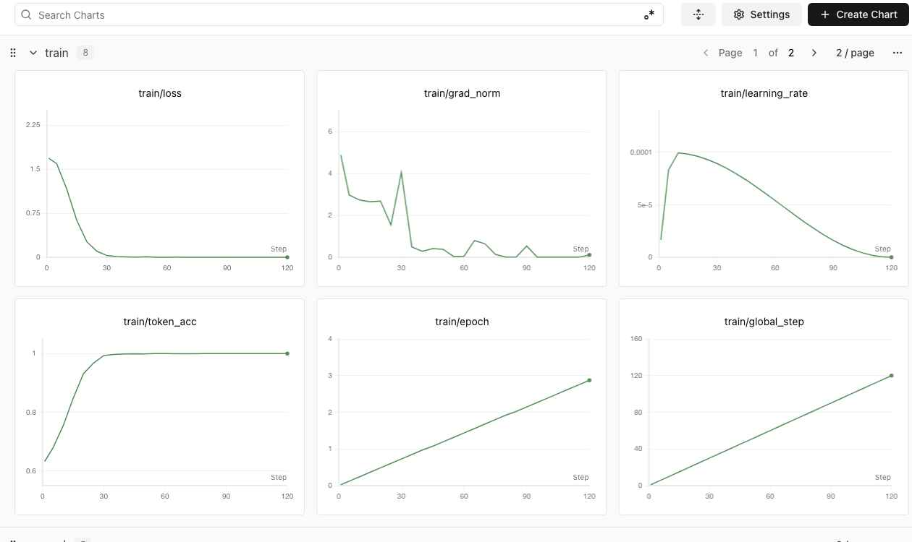
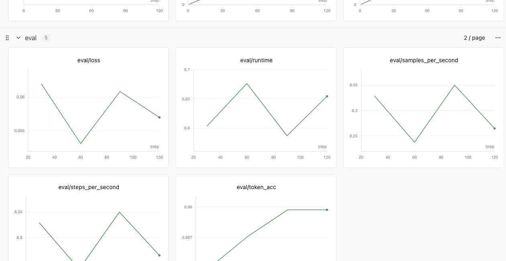

# 可量化的小规模 SFT：故障分诊

这个实验让模型学习一套自定义的故障码和固定 JSON Schema。它使用单张 GPU 完成 Base/Adapter A/B，重点验证未参与训练的语言模板，而不是只观察训练 Loss。

## 实验任务

输入是一段 Kubernetes 或训练故障证据，输出必须是单个 JSON 对象：

```json
{
  "diagnosis_code": "SCH-101",
  "conclusion": "GPU 容量不足",
  "evidence": ["调度事件显示可分配 GPU 小于请求量"],
  "next_action": "核对请求量、节点可分配量和其他工作负载已占用量。",
  "needs_more_evidence": false,
  "prohibited_action": "不要通过反复重启 Pod 解决容量不足。"
}
```

故障码是实验自定义分类。训练前的基座模型不知道映射关系，训练后的 Adapter 需要把新表达泛化到正确分类，同时遵守输出协议。

## 数据隔离

`make-dataset.py` 默认生成：

- 330 条训练样本：每类 30 条；
- 55 条验证样本：每类 5 条；
- 110 条盲测样本：每类 10 条。

三个集合使用不同的证据描述模板，随机值也使用不同 Seed。切分单位是模板族，而不是对所有改写句子做随机切分，避免同一模板的近重复样本同时进入训练集和测试集。

```bash
python make-dataset.py --output-dir ./run/data
```

## 单卡运行

默认模型是 `Qwen3.5-4B`。环境需要 PyTorch、Transformers、PEFT、ms-swift，以及 Qwen3.5 所需的 `qwen_vl_utils`、FLA 和 `causal_conv1d`：

```bash
TRAIN_MODEL_ID=/models/Qwen3.5-4B \
RUN_ROOT=./run \
bash run-ab.sh
```

默认参数是 LoRA Rank 8、最大长度 512、Global Batch 8 和 120 Step，约等于遍历训练集 2.9 次。Qwen3.5 默认使用 `add_non_thinking_prefix=true` 与 `loss_scale=ignore_empty_think`；训练脚本按验证集 Loss 选择最佳 Checkpoint，Base 与 Adapter 推理均使用 greedy decoding 和相同的最大输出长度。相关依赖与模板要求见 [ms-swift Qwen3.5 Best Practice](https://github.com/modelscope/ms-swift/blob/main/docs/source/BestPractices/Qwen3_5-Best-Practice.md)。

可以先用少量盲测样本检查环境：

```bash
EVAL_LIMIT=11 TRAIN_MAX_STEPS=10 bash run-ab.sh
```

对于普通 Dense 模型，可以在 BF16 权重上启用 bitsandbytes QLoRA：

```bash
TRAIN_QUANT_METHOD=bnb \
TRAIN_QUANT_BITS=4 \
TRAIN_BNB_4BIT_QUANT_TYPE=nf4 \
TRAIN_BNB_4BIT_USE_DOUBLE_QUANT=true \
bash run-ab.sh
```

MoE 需要额外核对 LoRA 覆盖范围。Transformers 5 中的 Qwen3-MoE 把融合专家权重保存为 3D `nn.Parameter`，`all-linear` 只能匹配普通线性层；要训练专家，应同时设置 `TRAIN_TARGET_PARAMETERS="mlp.experts.gate_up_proj mlp.experts.down_proj"`，并把 `TRAIN_LORA_DROPOUT` 设为 `0`。运行前后都应检查实际可训练参数名，不能仅凭命令行参数认定 Expert 已被覆盖。[PEFT LoRA 文档](https://huggingface.co/docs/peft/package_reference/lora)

## 自动指标

| 指标 | 含义 |
| --- | --- |
| `json_valid_rate` | 是否能解析为单个 JSON 对象 |
| `required_fields_rate` | 六个字段是否齐全且类型正确 |
| `code_accuracy` | 自定义故障码准确率 |
| `code_macro_f1` | 各故障类别等权后的 F1 |
| `needs_more_evidence_accuracy` | 信息不足时是否明确要求补证据 |
| `prohibited_action_keyword_recall` | 禁止动作是否覆盖该类的关键风险 |

结果位于 `run/results/comparison.json`，预测原文保留在 `base-predictions.jsonl` 和 `adapter-predictions.jsonl`。验收应以完整盲测集指标为主，同时人工抽查错误样本。

这个实验验证的是分类、结构化输出、排障顺序和谨慎行为，不代表模型通过几百条样本获得了完整的 Kubernetes 知识库。

## Qwen3.5-4B 单张 L20 实测

2026 年 8 月 21 日使用 `Qwen3.5-4B + ms-swift 4.4.1 + BF16 LoRA` 跑完 330/55/110 的 Train、Validation 和 Blind Test。LoRA 训练参数为 16.23M，占模型参数约 0.3563%；120 Step 耗时 612.6 秒，训练框架记录峰值显存 9.33 GiB。

| Validation | Loss | Token Accuracy |
| ---: | ---: | ---: |
| Step 30 | 0.06195 | 98.40% |
| Step 60 | **0.05315** | 98.71% |
| Step 90 | 0.06081 | 98.97% |
| Step 120 | 0.05700 | 98.97% |

验证 Loss 在 Step 60 最低，之后回升，因此 A/B 使用 Step 60 Adapter，而不是机械地选择最后一步。这也是同时记录 Validation 曲线的意义。





两张图来自真实 SFT Run，并已裁掉账号、地址、Run ID 和其他内部信息。SwanLab SDK `0.8.4` 能正常记录数值型 Loss、Accuracy、Learning Rate 和 Gradient Norm；ms-swift 4.4.1 还会上报 `30/120`、`3m 53s` 一类字符串展示值，旧 SDK 会拒绝这些 String Scalar，但不影响训练或上述数值曲线。

| 110 条盲测指标 | Base | Step 60 Adapter | 绝对提升 |
| --- | ---: | ---: | ---: |
| JSON 合法率 | 99.1% | 100% | +0.9 pp |
| 必填字段完整率 | 99.1% | 100% | +0.9 pp |
| 自定义故障码准确率 | 0% | 77.3% | +77.3 pp |
| 故障码 Macro-F1 | 0% | 75.3% | +75.3 pp |
| 信息不足判断准确率 | 51.8% | 100% | +48.2 pp |
| 禁止动作关键字覆盖 | 5.5% | 88.2% | +82.7 pp |

Base 能理解故障语义，却为几乎每种场景生成自己的英文标签；Adapter 则学会了自定义故障码、信息不足判断和禁止动作协议。它仍有 25 条故障码错误，并明显过度预测 `SCH-103`：平衡盲测中每类只有 10 条，它却输出了 25 次。这个结果证明小数据 SFT 可以改变稳定行为，也同时暴露了分类边界和语言覆盖仍需扩充。

较新的模型不保证在同一小数据任务上自动超过旧模型：本轮 Qwen3.5-4B 的故障码准确率低于下面 Qwen3-4B 历史对照的 90.9%。由于两次运行的模型 Chat Template 和推理实现不同，这还不是严格的模型排行榜；若要比较模型，应锁定框架、模板、解码参数和数据 Hash 后至少重复三次。

机器可读结果保存在 [`results/l20-qwen35-4b-20260821.json`](results/l20-qwen35-4b-20260821.json)。

## 历史对照：Qwen3-4B 单张 L20 实测

2026 年 8 月 20 日使用 `Qwen3-4B-Instruct-2507 + ms-swift 4.4.1 + BF16 LoRA` 完成了完整 A/B。训练样本平均 265 Token，120 Step 耗时 257.6 秒，框架记录峰值显存 8.1 GiB。验证集最佳 Checkpoint 出现在 Step 60，Validation Loss 为 0.0426。

| 110 条盲测指标 | Base | Step 60 Adapter | 绝对提升 |
| --- | ---: | ---: | ---: |
| JSON 合法率 | 100% | 100% | 0 |
| 必填字段完整率 | 100% | 100% | 0 |
| 自定义故障码准确率 | 0% | 90.9% | +90.9 pp |
| 故障码 Macro-F1 | 0% | 90.4% | +90.4 pp |
| 信息不足判断准确率 | 100% | 100% | 0 |
| 禁止动作关键字覆盖 | 8.2% | 90.9% | +82.7 pp |

Base 已经能理解大部分故障，也能遵守 JSON Schema，但会自行发明 `SCHED_NODEAFFINITY_FAIL`、`AUTH_IMG_FAIL` 等标签，无法命中训练任务自定义的故障码。Adapter 则学会了分类映射、标准下一步动作和禁止动作。

例如盲测输入只说明 `NodeAffinity failed`，Base 给出了语义合理但不属于目标体系的 `SCHED_NODEAFFINITY_FAIL`；Adapter 返回了约定的 `SCH-102`，并把下一步固定为对照 `nodeSelector/requiredDuringScheduling` 与节点真实标签。这正是本实验希望验证的“小数据改变稳定行为”，而不是让模型重新学习 Kubernetes 常识。

Adapter 仍有 10 条分类错误：`QUE-202` 和 `SCH-103` 两类各有一个全新的表达模板只命中 5/10，错误主要落入相邻的调度类别。这说明盲测确实发现了语言覆盖缺口。下一轮可以扩充 Gang 和 Taint 的训练表达，但必须另写一组新盲测模板，不能继续用已经看过的测试集调参后再汇报同一分数。

本次机器可读结果保存在 [`results/l20-qwen3-4b-20260820.json`](results/l20-qwen3-4b-20260820.json)。

## 历史容量记录：Qwen3-30B-A3B

这组结果只作为可复现的容量边界保留，不再作为新的训练文章主角。同一天使用同一张 L20 对 `Qwen3-30B-A3B-Instruct-2507` 做了加载门槛测试。该 MoE 有 30.5B 总参数、每 Token 激活 3.3B 参数、128 个 Expert 中激活 8 个。3.3B 决定每 Token 的主要计算量，却不表示只需保存 3.3B 权重；单卡推理或训练仍要让全部 Expert 权重可访问。[Qwen3-30B-A3B 模型卡](https://huggingface.co/Qwen/Qwen3-30B-A3B)

| 单卡路径 | 加载结果 | 是否进入训练 | 结论 |
| --- | --- | --- | --- |
| 4B BF16 LoRA | 成功，训练峰值 8.1 GiB | 是，完成 120 Step 和完整 A/B | 适合先验证数据闭环 |
| 30B-A3B BF16 | 仅权重理论下限约 56.8 GiB | 否 | 44.4 GiB 可见显存无法容纳基座权重和运行时开销 |
| 30B-A3B BF16 + BNB NF4 | 加载到 411/531 时 OOM，进程已占 44.37 GiB | 否 | 普通 BNB 转换没有得到 Dense 30B 常见的约 4 倍整体缩减 |
| 30B-A3B GPTQ-Int4 | 软件加载依赖验证通过，但测试时可用副本只有元数据、没有权重分片 | 否 | 不能把“不完整 Checkpoint”当作单卡 GPTQ 可训练证据 |

因此，本轮可以确认的是：**单张 L20 不能用现有 BF16 权重直接做 Qwen3-30B-A3B LoRA，标准 BNB NF4 路径也没有通过模型加载门槛。** 完整的预量化 GPTQ/AWQ Checkpoint 在容量上仍值得下一轮验证，但必须依次通过四个门槛：权重完整性、量化 Kernel、融合 Expert 的 `target_parameters` 覆盖，以及一次真实 Forward/Backward。未通过这些门槛前，不汇报训练 Loss 或盲测分数。

随后使用单机 8 张 L20 对同一份 BF16 权重做容量验证。为了避免 8 个进程在加载阶段同时构造完整权重而耗尽主机内存，本轮使用单进程 `device_map=balanced` 把 48 层放到 8 张卡，并以梯度累积 8 保持有效 Batch Size。60 Step LoRA 训练及三轮验证全部完成，进程正常退出：

| 指标 | 8 × L20 实测 |
| --- | ---: |
| 可训练参数 | 497.42M / 1.603% |
| 训练运行时间 | 1,438 秒 |
| 训练速度 | 0.042 Step/s |
| Eval Loss（Step 20 / 40 / 60） | 0.16276 / 0.02949 / 0.02811 |
| 最终 Eval Token Accuracy | 99.34% |
| 最佳 Checkpoint | Step 60，Adapter 约 1.9 GiB |

这证明 8 张 L20 足以完成该模型的 BF16 LoRA **容量验证**，但不等于高效的 8 卡并行训练。单进程层切分会让执行按层跨卡流动，大部分时刻只有少数 GPU 在计算；吞吐优化仍应比较带高效初始化的 FSDP/ZeRO-3，或支持 Expert Parallel 的 Megatron 路径。当前 30B 实验也尚未完成 110 条盲测生成，因此不能仅凭很低的验证 Loss 宣称业务效果已经提升。

机器可读记录保存在 [`results/l20-qwen3-30b-a3b-20260820.json`](results/l20-qwen3-30b-a3b-20260820.json)。
